# 鄂尔多斯 Renyl 模型(用于生成随机图)

> 原文:[https://www . geesforgeks . org/Erdos-renyl-model-generating-random-grapes/](https://www.geeksforgeeks.org/erdos-renyl-model-generating-random-graphs/)

在图论中，鄂尔多斯-雷尼模型是生成随机图的两个密切相关的模型之一。

鄂尔多斯-雷尼随机图模型有两个密切相关的变体。

在 G(n，M)模型中，从所有有 n 个节点和 M 条边的图的集合中随机一致地选择一个图。例如，在 G(3，2)模型中，三个顶点和两条边上的三个可能的图中的每一个都以概率 1/3 包含在内。
在 G(n，p)模型中，通过随机连接节点来构造图。每条边都包含在图中，概率 p 与其他边无关。等价地，所有具有 n 个节点和 M 条边的图都具有相等的
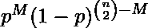概率

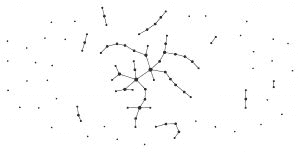
鄂尔多斯和雷尼二项式模型生成的图(p = 0.01)

这个模型中的参数 p 可以认为是一个加权函数；随着 p 从 0 增加到 1，模型越来越可能包含更多边的图，而越来越不可能包含更少边的图。特别地，p = 0.5 的情况对应于 n 个顶点上的所有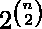图以相等的概率被选择的情况。
本文将基本处理 G (n，p)模型，其中 n 是要创建的节点数，p 定义每个节点加入另一个节点的概率。

**G(n，p)**
的性质用上面的符号表示，G(n，p)中的图平均有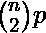条边。任何特定顶点的度数分布都是二项式的:

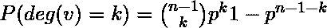

其中 n 是图中顶点的总数。因为

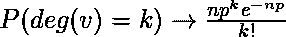为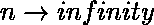，np=常数

对于大 n 和 np = const，这种分布是泊松分布。

在 1960 年的一篇论文中，鄂尔多斯和雷尼非常精确地描述了不同 p 值下 G(n，p)的行为。

*   如果 np < 1，那么 G(n，p)中的图几乎肯定没有尺寸大于 O(log(n))的连通分量。*   如果 np = 1，那么 G(n，p)中的图几乎肯定会有一个最大的分量，其大小为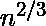级。*   如果 np 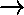 c > 1，其中 c 是常数，那么 G(n，p)中的图几乎肯定会有一个唯一的包含正分数顶点的巨型分量。任何其他组件都不会包含超过 O(log(n))个顶点。*   如果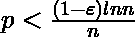，那么 G(n，p)中的图几乎肯定会包含孤立的顶点，从而被断开。*   If 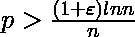, then a graph in G(n, p) will almost surely be connected.

    因此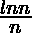是 G(n，p)连通性的一个尖锐阈值。
    当 n 趋于无穷大时，可以几乎精确地描述该图的其他性质。例如，有一个 k(n)(约等于 2log2(n))，使得 G(n，0.5)中最大的团几乎肯定具有大小 k(n)或 k(n) + 1。
    因此，即使找到图中最大团的大小是 NP 完全的，但是“典型”图中最大团的大小(根据该模型)是非常容易理解的。有趣的是，鄂尔多斯-仁义图的边对偶图是具有几乎相同度分布的图，但是具有度相关性和显著更高的聚类系数。

    接下来，我将描述用于制作 ER 图的代码。为了实现下面的代码，您需要安装 netwrokx 库，也需要安装 matplotlib 库。接下来，您将在本文中看到该图的确切代码，该代码最近被用作 networkx 库的函数。

    **鄂尔多斯 _ 仁义 _ 图(n，p，种子=无，有向=假)**

    返回一个 G(n，p)随机图，也称为 Erd？s-Rényi 图或二项式图。
    G(n，p)模型选择概率为 p 的每一条可能的边。
    函数二项式 _graph()和鄂尔多斯 _renyi_graph()是这个函数的别名。

    *参数:n(int)–节点数。
    p(浮动)–创建边的概率。
    种子(整数，可选)–随机数生成器的种子(默认=无)。
    有向(bool，可选(默认值= False))–如果为真，此函数返回有向图。*

    ```
    #importing the networkx library
    >>> import networkx as nx

    #importing the matplotlib library for plotting the graph
    >>> import matplotlib.pyplot as plt

    >>> G= nx.erdos_renyi_graph(50,0.5)
    >>> nx.draw(G, with_labels=True)
    >>> plt.show()
    ```

    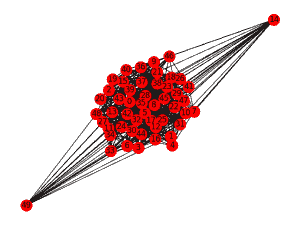

    图 1:对于 n=50，p=0.5

    上面的例子是针对 50 个节点的，因此有点不清楚。
    当考虑节点数较少的情况(例如 10 个)时，可以清楚地看到区别。
    使用各种概率的代码，我们可以很容易地看出区别:

    ```
    >>> I= nx.erdos_renyi_graph(10,0)
    >>> nx.draw(I, with_labels=True)
    >>> plt.show()
    ```

    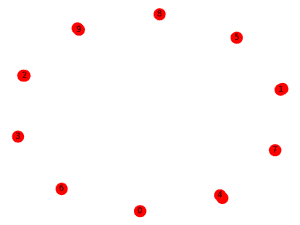

    图 2:对于 n=10，p=0

    ```
    >>> K=nx.erdos_renyi_graph(10,0.25)
    >>> nx.draw(K, with_labels=True)
    >>> plt.show()
    ```

    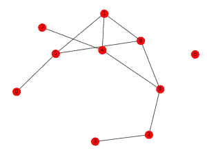

    图 3:对于 n=10，p=0.25

    ```
    >>>H= nx.erdos_renyi_graph(10,0.5)
    >>> nx.draw(H, with_labels=True)
    >>> plt.show()
    ```

    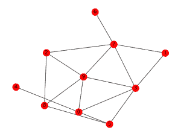

    图 4:对于 n=10，p=0.5

    该算法在 O( 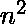)时间内运行。对于稀疏图(即 p 值小)，fast_gnp_random_graph()是一种更快的算法。
    因此，上面的例子清楚地定义了使用 erdos renyi 模型来制作随机图，以及如何使用 python 的 networkx 库来使用上述模型。
    接下来我们将使用库 networkx 讨论 python 中的 ego 图和各种其他类型的图。

    ***参考文献***
    你可以在

    *   [https://en . Wikipedia . org/wiki/Erd % C5 % 91s % E2 % 80% 93R % C3 % A9NYI _ model](https://en.wikipedia.org/wiki/Erd%C5%91s%E2%80%93R%C3%A9nyi_model)*   [http://networkx.readthedocs.io/en/networkx-1.10/index.html](http://networkx.readthedocs.io/en/networkx-1.10/index.html)

    。

    本文由 **[贾扬特](https://in.linkedin.com/in/jayant-bisht-978085114)** 供稿。如果你喜欢 GeeksforGeeks 并想投稿，你也可以使用[write.geeksforgeeks.org](http://www.write.geeksforgeeks.org)写一篇文章或者把你的文章邮寄到 review-team@geeksforgeeks.org。看到你的文章出现在极客博客主页上，帮助其他极客。

    如果你发现任何不正确的地方，或者你想分享更多关于上面讨论的话题的信息，请写评论。