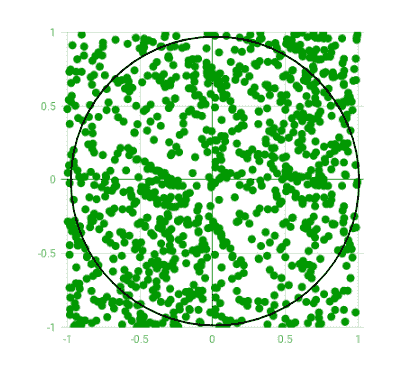
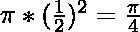
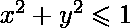

# 用蒙特卡罗方法估算圆周率的值

> 原文:[https://www . geesforgeks . org/estimating-value-pi-using-Monte-Carlo/](https://www.geeksforgeeks.org/estimating-value-pi-using-monte-carlo/)

**蒙特卡罗估计**
[蒙特卡罗方法](https://en.wikipedia.org/wiki/Monte_Carlo_method)是一类广泛的计算算法，依赖于重复的随机采样来获得数值结果。开始使用[蒙特卡罗算法](https://en.wikipedia.org/wiki/Monte_Carlo_algorithm)的一个基本例子是 Pi 的[估计。
**圆周率的估计**
其思想是以域为边 1 单位的平方，在二维平面上模拟随机(x，y)点。想象同一个域内有一个圆，直径相同，刻在正方形内。然后，我们计算位于圆内的点数与生成点总数的比率。参考下图:](http://www.eveandersson.com/pi/monte-carlo-circle) 



生成的随机点只有很少一部分位于假想圆之外

我们知道正方形的面积是 1 单位平方，而圆形的面积是。现在对于非常大量的生成点，

```

that is,

```

这种算法的妙处在于，我们不需要任何图形或模拟来显示生成的点。我们只需生成随机(x，y)对，然后检查是否。如果是，我们增加圆内出现的点数。在像蒙特卡罗这样的随机化和模拟算法中，迭代次数越多，结果越准确。因此，标题是“**估计**圆周率的值”，而不是“计算圆周率的值”。下面是该方法的算法:
**算法**
1。将圆形点、方形点和间隔初始化为 0。
2。生成随机点 x.
3。生成随机点 y.
4。计算 d = x*x + y*y.
5。如果 d < = 1，增加 circle_points。
6。增加平方点。
7。增量间隔。
8。如果增加<无迭代次数，从 2 开始重复。
9。计算 pi = 4*(圆形点/方形点)。
10。终止。
代码不等待通过 stdin 的任何输入，因为宏 INTERVAL 可以根据所需的迭代次数进行更改。迭代次数是 INTERVAL 的平方。此外，我已经用 getch()暂停了前 10 次迭代的屏幕，每次迭代的输出都以下面给出的格式显示。您可以根据需要更改或删除它们。

```
x y circle_points square_points - pi 
```

**示例:**

```
INTERVAL = 5
Output : Final Estimation of Pi = 2.56

INTERVAL = 10
Output : Final Estimation of Pi = 3.24

INTERVAL = 100
Output : Final Estimation of Pi = 3.0916
```

## C++

```
/* C++ program for estimation of Pi using Monte
   Carlo Simulation */
#include <bits/stdc++.h>

// Defines precision for x and y values. More the
// interval, more the number of significant digits
#define INTERVAL 10000
using namespace std;

int main()
{
    int interval, i;
    double rand_x, rand_y, origin_dist, pi;
    int circle_points = 0, square_points = 0;

    // Initializing rand()
    srand(time(NULL));

    // Total Random numbers generated = possible x
    // values * possible y values
    for (i = 0; i < (INTERVAL * INTERVAL); i++) {

        // Randomly generated x and y values
        rand_x = double(rand() % (INTERVAL + 1)) / INTERVAL;
        rand_y = double(rand() % (INTERVAL + 1)) / INTERVAL;

        // Distance between (x, y) from the origin
        origin_dist = rand_x * rand_x + rand_y * rand_y;

        // Checking if (x, y) lies inside the define
        // circle with R=1
        if (origin_dist <= 1)
            circle_points++;

        // Total number of points generated
        square_points++;

        // estimated pi after this iteration
        pi = double(4 * circle_points) / square_points;

        // For visual understanding (Optional)
        cout << rand_x << " " << rand_y << " " << circle_points
             << " " << square_points << " - " << pi << endl << endl;

        // Pausing estimation for first 10 values (Optional)
        if (i < 20)
            getchar();
    }

    // Final Estimated Value
    cout << "\nFinal Estimation of Pi = " << pi;

    return 0;
}
```

## 计算机编程语言

```
import random

INTERVAL= 1000

circle_points= 0
square_points= 0

# Total Random numbers generated= possible x
# values* possible y values
for i in range(INTERVAL**2):

    # Randomly generated x and y values from a
    # uniform distribution
    # Range of x and y values is -1 to 1
    rand_x= random.uniform(-1, 1)
    rand_y= random.uniform(-1, 1)

    # Distance between (x, y) from the origin
    origin_dist= rand_x**2 + rand_y**2

    # Checking if (x, y) lies inside the circle
    if origin_dist<= 1:
        circle_points+= 1

    square_points+= 1

    # Estimating value of pi,
    # pi= 4*(no. of points generated inside the 
    # circle)/ (no. of points generated inside the square)
    pi = 4* circle_points/ square_points

##    print(rand_x, rand_y, circle_points, square_points, "-", pi)
##    print("\n")

print("Final Estimation of Pi=", pi)    
```

**输出:**

```
Final Estimation of Pi = 3.16116
```

本文由**帕拉斯·莱汉纳**供稿。如果你喜欢 GeeksforGeeks 并想投稿，你也可以使用[write.geeksforgeeks.org](http://www.write.geeksforgeeks.org)写一篇文章或者把你的文章邮寄到 review-team@geeksforgeeks.org。看到你的文章出现在极客博客主页上，帮助其他极客。
如果发现有不正确的地方，或者想分享更多关于上述话题的信息，请写评论。