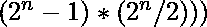

# 欧几里德欧拉定理

> 原文:[https://www.geeksforgeeks.org/euclid-euler-theorem/](https://www.geeksforgeeks.org/euclid-euler-theorem/)

根据[欧几里德欧拉定理](https://en.wikipedia.org/wiki/Euclid%E2%80%93Euler_theorem)，偶数的[完全数](https://www.geeksforgeeks.org/perfect-number/)可以用的形式表示，其中 n 是素数，是[梅森素数](https://en.wikipedia.org/wiki/Mersenne_prime)数。它是 2 的幂与梅森素数的乘积。这个定理建立了梅森素数和偶数完全数之间的联系。

```
Some Examples (Perfect Numbers) which satisfy Euclid Euler Theorem are:

6, 28, 496, 8128, 33550336, 8589869056, 137438691328

***Explanations***:
1) 6 is an even perfect number.
So, is can be written in the form 
(22 - 1) * (2(2 - 1)) = 6
where n = 2 is a prime number and 2^n - 1 = 3 is a Mersenne prime number.

2) 28 is an even perfect number.
So, is can be written in the form 
(23 - 1) * (2(3 - 1)) = 28
where n = 3 is a prime number and 2^n - 1 = 7 is a Mersenne prime number.

3) 496 is an even perfect number.
So, is can be written in the form 
(25 - 1) * (2(5 - 1)) = 496
where n = 5 is a prime number and 2^n - 1 = 31 is a Mersenne prime number.
```

**逼近(******):**
*取每个素数，用它组成一个梅森素数。梅森素数=*  *其中 n 是素数。现在形成数字(2^n-1)*(2^(n-1)并检查它是否均匀和完美。如果条件满足，那么它遵循欧几里德欧拉定理。*** 

## **C++**

```
// CPP code to verify Euclid Euler Theorem
#include <bits/stdc++.h>
using namespace std;

#define show(x) cout << #x << " = " << x << "\n";

bool isprime(long long n)
{
    // check whether a number is prime or not
    for (int i = 2; i * i <= n; i++)
        if (n % i == 0)
            return false;
    return false;
}

bool isperfect(long long n) // perfect numbers
{
    // check is n is perfect sum of divisors
    // except the number itself = number
    long long s = -n;
    for (long long i = 1; i * i <= n; i++) {

        // is i is a divisor of n
        if (n % i == 0) {
            long long factor1 = i, factor2 = n / i;
            s += factor1 + factor2;

            // here i*i == n
            if (factor1 == factor2)
                s -= i;
        }
    }
    return (n == s);
}

int main()
{
    // storing powers of 2 to access in O(1) time
    vector<long long> power2(61);
    for (int i = 0; i <= 60; i++)
        power2[i] = 1LL << i;

    // generation of first few numbers
    // satisfying Euclid Euler's theorem

    cout << "Generating first few numbers "
            "satisfying Euclid Euler's theorem\n";
    for (long long i = 2; i <= 25; i++) {
        long long no = (power2[i] - 1) * (power2[i - 1]);
        if (isperfect(no) and (no % 2 == 0))
            cout << "(2^" << i << " - 1) * (2^("
                << i << " - 1)) = " << no << "\n";
    }
    return 0;
}
```

## **Java 语言(一种计算机语言，尤用于创建网站)**

```
// Java code to verify Euclid Euler Theorem
class GFG
{
    static boolean isprime(long n)
    {
        // check whether a number is prime or not
        for (int i = 2; i * i <= n; i++)
        {
            if (n % i == 0)
            {
                return false;
            }
        }
        return false;
    }

    static boolean isperfect(long n) // perfect numbers
    {
        // check is n is perfect sum of divisors
        // except the number itself = number
        long s = -n;
        for (long i = 1; i * i <= n; i++)
        {

            // is i is a divisor of n
            if (n % i == 0)
            {
                long factor1 = i, factor2 = n / i;
                s += factor1 + factor2;

                // here i*i == n
                if (factor1 == factor2)
                {
                    s -= i;
                }
            }
        }
        return (n == s);
    }

    // Driver Code
    public static void main(String[] args)
    {
        // storing powers of 2 to access in O(1) time
        long power2[] = new long[61];
        for (int i = 0; i <= 60; i++)
        {
            power2[i] = 1L << i;
        }

        // generation of first few numbers
        // satisfying Euclid Euler's theorem
        System.out.print("Generating first few numbers " +
                         "satisfying Euclid Euler's theorem\n");
        for (int i = 2; i <= 25; i++)
        {
            long no = (power2[i] - 1) * (power2[i - 1]);
            if (isperfect(no) && (no % 2 == 0))
            {
                System.out.print("(2^" + i + " - 1) * (2^(" +
                                 i + " - 1)) = " + no + "\n");
            }
        }
    }
}

// This code is contributed by PrinciRaj1992
```

## **蟒蛇 3**

```
# Python3 code to verify Euclid Euler Theorem
#define show(x) cout << #x << " = " << x << "\n";
def isprime(n):
    i = 2

    # check whether a number is prime or not
    while(i * i <= n):
        if (n % i == 0):
            return False;
        i += 1
    return False;

def isperfect(n): # perfect numbers

    # check is n is perfect sum of divisors
    # except the number itself = number
    s = -n;
    i =1
    while(i * i <= n):

        # is i is a divisor of n
        if (n % i == 0):
            factor1 = i
            factor2 = n // i;
            s += factor1 + factor2;

            # here i*i == n
            if (factor1 == factor2):
                s -= i;   
        i += 1
    return (n == s);

# Driver code
if __name__=='__main__':

    # storing powers of 2 to access in O(1) time
    power2 = [1<<i for i in range(61)]

    # generation of first few numbers
    # satisfying Euclid Euler's theorem
    print("Generating first few numbers satisfying Euclid Euler's theorem");
    for i in range(2, 26):  
        no = (power2[i] - 1) * (power2[i - 1]);
        if (isperfect(no) and (no % 2 == 0)):
            print("(2^{} - 1) * (2^({} - 1)) = {}".format(i, i, no))

    # This code is contributed by rutvik_56.
```

## **C#**

```
// C# code to verify Euclid Euler Theorem
using System;
using System.Collections.Generic;

class GFG
{
    static Boolean isprime(long n)
    {
        // check whether a number is prime or not
        for (int i = 2; i * i <= n; i++)
        {
            if (n % i == 0)
            {
                return false;
            }
        }
        return false;
    }

    static Boolean isperfect(long n) // perfect numbers
    {
        // check is n is perfect sum of divisors
        // except the number itself = number
        long s = -n;
        for (long i = 1; i * i <= n; i++)
        {

            // is i is a divisor of n
            if (n % i == 0)
            {
                long factor1 = i, factor2 = n / i;
                s += factor1 + factor2;

                // here i*i == n
                if (factor1 == factor2)
                {
                    s -= i;
                }
            }
        }
        return (n == s);
    }

    // Driver Code
    public static void Main(String[] args)
    {
        // storing powers of 2 to access in O(1) time
        long []power2 = new long[61];
        for (int i = 0; i <= 60; i++)
        {
            power2[i] = 1L << i;
        }

        // generation of first few numbers
        // satisfying Euclid Euler's theorem
        Console.Write("Generating first few numbers " +
                      "satisfying Euclid Euler's theorem\n");
        for (int i = 2; i <= 25; i++)
        {
            long no = (power2[i] - 1) * (power2[i - 1]);
            if (isperfect(no) && (no % 2 == 0))
            {
                Console.Write("(2^" + i + " - 1) * (2^(" +
                                i + " - 1)) = " + no + "\n");
            }
        }
    }
}

// This code is contributed by Rajput-Ji
```

## **服务器端编程语言（Professional Hypertext Preprocessor 的缩写）**

```
<?php
// PHP code to verify
// Euclid Euler Theorem

// define show(x)
// cout << #x << " = " << x << "\n";

function isprime($n)
{
    // check whether a number
    // is prime or not
    for ($i = 2; $i * $i <= $n; $i++)
        if ($n % $i == 0)
            return false;
    return false;
}

function isperfect($n) // perfect numbers
{
    // check is n is perfect sum
    // of divisors except the
    // number itself = number
    $s = -$n;
    for ($i = 1;
         $i * $i <= $n; $i++)
    {

        // is i is a divisor of n
        if ($n % $i == 0)
        {
            $factor1 = $i;
            $factor2 = $n / $i;
            $s += $factor1 + $factor2;

            // here i*i == n
            if ($factor1 == $factor2)
                $s -= $i;
        }
    }
    return ($n == $s);
}

// Driver code

// storing powers of 2 to
// access in O(1) time
$power2 = array();
for ($i = 0; $i <= 60; $i++)
    $power2[$i] = 1<< $i;

// generation of first few
// numbers satisfying Euclid
// Euler's theorem
echo "Generating first few numbers " .
     "satisfying Euclid Euler's theorem\n";

for ($i = 2; $i <= 25; $i++)
{
    $no = ($power2[$i] - 1) *
          ($power2[$i - 1]);
    if (isperfect($no) &&
                 ($no % 2 == 0))
        echo "(2^" . $i . " - 1) * (2^(" .
                     $i . " - 1)) = " .
                     $no . "\n";
}

// This code is contributed by mits
?>
```

## **java 描述语言**

```
<script>

// JavaScript program to verify Euclid Euler Theorem

    function isprime(n)
    {
        // check whether a number is prime or not
        for (let i = 2; i * i <= n; i++)
        {
            if (n % i == 0)
            {
                return false;
            }
        }
        return false;
    }

    function isperfect(n) // perfect numbers
    {
        // check is n is perfect sum of divisors
        // except the number itself = number
        let s = -n;
        for (let i = 1; i * i <= n; i++)
        {

            // is i is a divisor of n
            if (n % i == 0)
            {
                let factor1 = i, factor2 = n / i;
                s += factor1 + factor2;

                // here i*i == n
                if (factor1 == factor2)
                {
                    s -= i;
                }
            }
        }
        return (n == s);
    }

// Driver code

         // storing powers of 2 to access in O(1) time
        let power2 = [];
        for (let i = 0; i <= 60; i++)
        {
            power2[i] = 1 << i;
        }

        // generation of first few numbers
        // satisfying Euclid Euler's theorem
        document.write("Generating first few numbers " +
                         "satisfying Euclid Euler's theorem" + "<br/>");
        for (let i = 2; i <= 25; i++)
        {
            let no = (power2[i] - 1) * (power2[i - 1]);
            if (isperfect(no) && (no % 2 == 0))
            {
                document.write("(2^" + i + " - 1) * (2^(" +
                                 i + " - 1)) = " + no + "<br/>");
            }
        }

    // This code is contributed by code_hunt.
</script>
```

****Output:** 

```
Generating first few numbers satisfying Euclid Euler's theorem
(2^2 - 1) * (2^(2 - 1)) = 6
(2^3 - 1) * (2^(3 - 1)) = 28
(2^5 - 1) * (2^(5 - 1)) = 496
(2^7 - 1) * (2^(7 - 1)) = 8128
(2^13 - 1) * (2^(13 - 1)) = 33550336
(2^17 - 1) * (2^(17 - 1)) = 8589869056
(2^19 - 1) * (2^(19 - 1)) = 137438691328
```** 

**对输出的解释在对上述示例的解释中提供。**