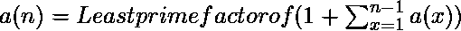

# 欧几里德–马林序列

> 原文:[https://www.geeksforgeeks.org/euclid-mullin-sequence/](https://www.geeksforgeeks.org/euclid-mullin-sequence/)

给定一个整数 **N** ，任务是打印[欧几里德-马林序列](https://en.wikipedia.org/wiki/Euclid%E2%80%93Mullin_sequence)的第一个 **N** 元素。
**欧几里德-马林序列**是一个质数序列，其中每个元素都是 1 加上所有早期元素乘积的最小质因数。
该序列以古希腊数学家**欧几里德**命名。

**示例:**

> **输入:** N = 14
> **输出:**2 3 7 43 13 53 5 6221671 38709183810571 139 2801 11 17 5471

**方法:****欧几里德–马林序列**是一个质数序列，其中第 N 个序列是:

因此，我们将运行一个从 **1** 到 **N** 的循环，并取一个变量**乘积**，该乘积最初为 **1** ，并将包含所有先前元素的乘积。然后，我们将在 O(sqrt(n))时间内找到(1 +乘积)的最小质因数，并打印该数字。**注意**由于产品变得太大，找到它的最小质因数需要很多时间，所以代码无法打印第 14 个元素之后的数字。

以下是上述方法的实现:

## Java 语言(一种计算机语言，尤用于创建网站)

```
// Java implementation of the approach
import java.math.BigInteger;
class GFG {

    // Function to return the smallest prime factor of n
    static BigInteger smallestPrimeFactor(BigInteger n)
    {

        // Initialize i = 2
        BigInteger i = BigInteger.valueOf(2);

        // While i <= sqrt(n)
        while ((i.multiply(i)).compareTo(n) <= 0) {

            // If n is divisible by i
            if (n.mod(i).compareTo(BigInteger.ZERO) == 0)
                return i;

            // Increment i
            i = i.add(BigInteger.ONE);
        }
        return n;
    }

    // Function to print the first n
    // terms of the required sequence
    static void solve(BigInteger n)
    {
        // To store the product of the previous terms
        BigInteger product = BigInteger.ONE;

        // Traverse the prime numbers
        BigInteger i = BigInteger.ZERO;
        while (i.compareTo(n) < 0) {

            // Current term will be smallest prime
            // factor of (1 + product of all previous terms)
            BigInteger num = smallestPrimeFactor(product.add(BigInteger.ONE));

            // Print the current term
            System.out.print(num + " ");

            // Update the product
            product = product.multiply(num);
            i = i.add(BigInteger.ONE);
        }
    }

    // Driver code
    public static void main(String[] args)
    {

        // Find the first 14 terms of the sequence
        BigInteger b = BigInteger.valueOf(14);
        solve(b);
    }
}
```

## 蟒蛇 3

```
# Python3 implementation of the approach 

# Function to return the smallest prime factor of n 
def smallestPrimeFactor(n): 

    # Initialize i = 2 
    i = 2

    # While i <= sqrt(n) 
    while (i * i) <= n : 

        # If n is divisible by i 
        if n % i == 0: 
            return i 

        # Increment i 
        i += 1
    return n 

# Function to print the first n 
# terms of the required sequence 
def solve(n): 

    # To store the product of the previous terms 
    product = 1

    # Traverse the prime numbers 
    i = 0
    while i < n: 

        # Current term will be smallest prime 
        # factor of (1 + product of all previous terms)
        num = smallestPrimeFactor(product + 1) 

        # Print the current term 
        print(num, end=' ') 

        # Update the product 
        product = product * num 
        i += 1

# Driver code 
# Find the first 14 terms of the sequence 
b = 14
solve(b)

# This code is contributed by divyamohan123
```

**Output:**

```
2 3 7 43 13 53 5 6221671 38709183810571 139 2801 11 17 5471

```