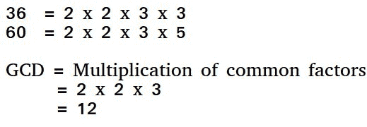

# 欧几里德算法(基本和扩展)

> 原文:[https://www . geesforgeks . org/euclidean-algorithms-basic-and-extended/](https://www.geeksforgeeks.org/euclidean-algorithms-basic-and-extended/)

两个数的 GCD 是除两个数的最大数。找到 GCD 的一个简单方法是分解两个数字并乘以公共质因数。



**GCD 的基本欧几里德算法**
该算法基于以下事实。

*   如果我们从一个较大的数中减去一个较小的数(我们减少一个较大的数)，GCD 不会改变。因此，如果我们不断重复减去两者中较大的一个，我们最终会得到 GCD。
*   现在不是减法，如果我们除以较小的数，当我们找到余数 0 时，算法停止。

下面是一个递归函数，使用欧几里德算法计算 gcd。

## 卡片打印处理机（Card Print Processor 的缩写）

```
// C++ program to demonstrate
// Basic Euclidean Algorithm
#include <bits/stdc++.h>
using namespace std;

// Function to return 
// gcd of a and b
int gcd(int a, int b)
{
    if (a == 0)
        return b;
    return gcd(b % a, a);
}

// Driver Code
int main()
{
    int a = 10, b = 15;
    cout << "GCD(" << a << ", " 
         << b << ") = " << gcd(a, b) 
                        << endl;
    a = 35, b = 10;
    cout << "GCD(" << a << ", " 
         << b << ") = " << gcd(a, b) 
                        << endl;
    a = 31, b = 2;
    cout << "GCD(" << a << ", " 
         << b << ") = " << gcd(a, b) 
                        << endl;
    return 0;
}

// This code is contributed 
// by Nimit Garg
```

## C

```
// C program to demonstrate Basic Euclidean Algorithm
#include <stdio.h>

// Function to return gcd of a and b
int gcd(int a, int b)
{
    if (a == 0)
        return b;
    return gcd(b%a, a);
}

// Driver program to test above function
int main()
{
    int a = 10, b = 15;
    printf("GCD(%d, %d) = %dn", a, b, gcd(a, b));
    a = 35, b = 10;
    printf("GCD(%d, %d) = %dn", a, b, gcd(a, b));
    a = 31, b = 2;
    printf("GCD(%d, %d) = %dn", a, b, gcd(a, b));
    return 0;
}
```

## Java 语言(一种计算机语言，尤用于创建网站)

```
// Java program to demonstrate working of extended
// Euclidean Algorithm

import java.util.*;
import java.lang.*;

class GFG
{
    // extended Euclidean Algorithm
    public static int gcd(int a, int b)
    {
        if (a == 0)
            return b;

        return gcd(b%a, a);
    }

// Driver Program
    public static void main(String[] args)
    {
        int a = 10, b = 15, g;
        g = gcd(a, b);
        System.out.println("GCD(" + a +  " , " + b+ ") = " + g);

        a = 35; b = 10;
        g = gcd(a, b);
        System.out.println("GCD(" + a +  " , " + b+ ") = " + g);

        a = 31; b = 2;
        g = gcd(a, b);
        System.out.println("GCD(" + a +  " , " + b+ ") = " + g);

    }
}
// Code Contributed by Mohit Gupta_OMG <(0_o)>
```

## 蟒蛇 3

```
# Python program to demonstrate Basic Euclidean Algorithm

# Function to return gcd of a and b
def gcd(a, b): 
    if a == 0 :
        return b 

    return gcd(b%a, a)

a = 10
b = 15
print("gcd(", a , "," , b, ") = ", gcd(a, b))

a = 35
b = 10
print("gcd(", a , "," , b, ") = ", gcd(a, b))

a = 31
b = 2
print("gcd(", a , "," , b, ") = ", gcd(a, b))

# Code Contributed By Mohit Gupta_OMG <(0_o)>
```

## C#

```
using System;

class GFG
{
    public static int gcd(int a, int b)
    {
        if (a == 0)
            return b;

        return gcd(b % a, a);
    }

    // Driver Code
    static public void Main ()
    {
        int a = 10, b = 15, g;
        g = gcd(a, b);
        Console.WriteLine("GCD(" + a + 
              " , " + b + ") = " + g);

        a = 35; b = 10;
        g = gcd(a, b);
        Console.WriteLine("GCD(" + a + 
              " , " + b + ") = " + g);

        a = 31; b = 2;
        g = gcd(a, b);
        Console.WriteLine("GCD(" + a + 
              " , " + b + ") = " + g);
    }
}

// This code is contributed by ajit
```

## 服务器端编程语言（Professional Hypertext Preprocessor 的缩写）

```
<?php
// PHP program to demonstrate
// Basic Euclidean Algorithm

// Function to return
// gcd of a and b
function gcd($a, $b)
{
    if ($a == 0)
        return $b;
    return gcd($b % $a, $a);
}

// Driver Code
$a = 10; $b = 15;
echo "GCD(",$a,"," , $b,") = ", 
                   gcd($a, $b);
echo "\n";
$a = 35; $b = 10;
echo "GCD(",$a ,",",$b,") = ", 
                  gcd($a, $b);
echo "\n";
$a = 31; $b = 2;
echo "GCD(",$a ,",", $b,") = ", 
                   gcd($a, $b);

// This code is contributed by m_kit
?>
```

## java 描述语言

```
<script>

// JavaScript program to demonstrate
// Basic Euclidean Algorithm

// Function to return 
// gcd of a and b
function gcd( a,  b)
{
    if (a == 0)
        return b;
    return gcd(b % a, a);
}

// Driver Code

    let a = 10, b = 15;
   document.write( "GCD(" + a + ", " 
         + b + ") = " + gcd(a, b) +"<br/>");

    a = 35, b = 10;
   document.write( "GCD(" + a + ", " 
         + b + ") = " + gcd(a, b) +"<br/>");

    a = 31, b = 2;
    document.write( "GCD(" + a + ", " 
         + b + ") = " + gcd(a, b) +"<br/>");

// This code contributed by aashish1995 

</script>
```

**输出:**

```
GCD(10, 15) = 5
GCD(35, 10) = 5
GCD(31, 2) = 1
```

**时间复杂度:** O(Log min(a，b))
**扩展欧几里得算法:**
扩展欧几里得算法还找到整数系数 x 和 y，从而:

```
  ax + by = gcd(a, b) 
```

**示例:**

```
Input: a = 30, b = 20
Output: gcd = 10
        x = 1, y = -1
(Note that 30*1 + 20*(-1) = 10)

Input: a = 35, b = 15
Output: gcd = 5
        x = 1, y = -2
(Note that 35*1 + 15*(-2) = 5)
```

扩展欧氏算法使用递归调用 gcd(b%a，a)计算的结果更新 gcd(a，b)的结果。让递归调用计算的 x 和 y 的值为 x <sub>1</sub> 和 y <sub>1</sub> 。使用以下表达式更新 x 和 y。

```
x = y1 - ⌊b/a⌋ * x1
y = x1
```

下面是基于上述公式的实现。

## C++

```
// C++ program to demonstrate working of 
// extended Euclidean Algorithm 
#include <bits/stdc++.h> 
using namespace std;

// Function for extended Euclidean Algorithm 
int gcdExtended(int a, int b, int *x, int *y) 
{ 
    // Base Case 
    if (a == 0) 
    { 
        *x = 0; 
        *y = 1; 
        return b; 
    } 

    int x1, y1; // To store results of recursive call 
    int gcd = gcdExtended(b%a, a, &x1, &y1); 

    // Update x and y using results of 
    // recursive call 
    *x = y1 - (b/a) * x1; 
    *y = x1; 

    return gcd; 
} 

// Driver Code
int main() 
{ 
    int x, y, a = 35, b = 15; 
    int g = gcdExtended(a, b, &x, &y); 
    cout << "GCD(" << a << ", " << b 
         << ") = " << g << endl;
    return 0; 
} 

// This code is contributed by TusharSabhani
```

## C

```
// C program to demonstrate working of extended
// Euclidean Algorithm
#include <stdio.h>

// C function for extended Euclidean Algorithm
int gcdExtended(int a, int b, int *x, int *y)
{
    // Base Case
    if (a == 0)
    {
        *x = 0;
        *y = 1;
        return b;
    }

    int x1, y1; // To store results of recursive call
    int gcd = gcdExtended(b%a, a, &x1, &y1);

    // Update x and y using results of recursive
    // call
    *x = y1 - (b/a) * x1;
    *y = x1;

    return gcd;
}

// Driver Program
int main()
{
    int x, y;
    int a = 35, b = 15;
    int g = gcdExtended(a, b, &x, &y);
    printf("gcd(%d, %d) = %d", a, b, g);
    return 0;
}
```

## Java 语言(一种计算机语言，尤用于创建网站)

```
// Java program to demonstrate working of extended
// Euclidean Algorithm

import java.util.*;
import java.lang.*;

class GFG
{
    // extended Euclidean Algorithm
    public static int gcdExtended(int a, int b, int x, int y)
    {
        // Base Case
        if (a == 0)
        {
            x = 0;
            y = 1;
            return b;
        }

        int x1=1, y1=1; // To store results of recursive call
        int gcd = gcdExtended(b%a, a, x1, y1);

        // Update x and y using results of recursive
        // call
        x = y1 - (b/a) * x1;
        y = x1;

        return gcd;
    }

// Driver Program
    public static void main(String[] args)
    {
        int x=1, y=1;
        int a = 35, b = 15;
        int g = gcdExtended(a, b, x, y);
        System.out.print("gcd(" + a +  " , " + b+ ") = " + g);

    }
}
// Code Contributed by Mohit Gupta_OMG <(0-o)>
```

## 蟒蛇 3

```
# Python program to demonstrate working of extended 
# Euclidean Algorithm 

# function for extended Euclidean Algorithm 
def gcdExtended(a, b): 

    # Base Case 
    if a == 0 :  
        return b, 0, 1

    gcd, x1, y1 = gcdExtended(b%a, a) 

    # Update x and y using results of recursive 
    # call 
    x = y1 - (b//a) * x1 
    y = x1 

    return gcd, x, y

# Driver code
a, b = 35,15
g, x, y = gcdExtended(a, b) 
print("gcd(", a , "," , b, ") = ", g) 
```

## C#

```
// C# program to demonstrate working 
// of extended Euclidean Algorithm
using System;

class GFG
{

    // extended Euclidean Algorithm
    public static int gcdExtended(int a, int b, 
                                  int x, int y)
    {
        // Base Case
        if (a == 0)
        {
            x = 0;
            y = 1;
            return b;
        }

        // To store results of
        // recursive call
        int x1 = 1, y1 = 1; 
        int gcd = gcdExtended(b % a, a, x1, y1);

        // Update x and y using 
        // results of recursive call
        x = y1 - (b / a) * x1;
        y = x1;

        return gcd;
    }

    // Driver Code
    static public void Main ()
    {
        int x = 1, y = 1;
        int a = 35, b = 15;
        int g = gcdExtended(a, b, x, y);
        Console.WriteLine("gcd(" + a + " , " + 
                              b + ") = " + g);
    }
}

// This code is contributed by m_kit
```

## 服务器端编程语言（Professional Hypertext Preprocessor 的缩写）

```
<?php
// PHP program to demonstrate 
// working of extended 
// Euclidean Algorithm

// PHP function for 
// extended Euclidean 
// Algorithm
function gcdExtended($a, $b,    
                     $x, $y)
{
    // Base Case
    if ($a == 0)
    {
        $x = 0;
        $y = 1;
        return $b;
    }

    // To store results 
    // of recursive call
    $gcd = gcdExtended($b % $a, 
                       $a, $x, $y);

    // Update x and y using
    // results of recursive
    // call
    $x = $y - floor($b / $a) * $x;
    $y = $x;

    return $gcd;
}

// Driver Code
$x = 0;
$y = 0;
$a = 35; $b = 15;
$g = gcdExtended($a, $b, $x, $y);
echo "gcd(",$a;
echo ", " , $b, ")";
echo " = " , $g;

// This code is contributed by ajit
?>
```

## java 描述语言

```
<script>

// Javascript program to demonstrate 
// working of extended 
// Euclidean Algorithm

// Javascript function for 
// extended Euclidean 
// Algorithm
function gcdExtended(a, b,    
                     x, y)
{
    // Base Case
    if (a == 0)
    {
        x = 0;
        y = 1;
        return b;
    }

    // To store results 
    // of recursive call
    let gcd = gcdExtended(b % a, 
                       a, x, y);

    // Update x and y using
    // results of recursive
    // call
    x = y - (b / a) * x;
    y = x;

    return gcd;
}

// Driver Code
let x = 0;
let y = 0;
let a = 35; 
let b = 15;
let g = gcdExtended(a, b, x, y);
document.write("gcd(" + a);
document.write(", " + b + ")");
document.write(" = " + g);

// This code is contributed by _saurabh_jaiswal

</script>
```

**输出:**

```
gcd(35, 15) = 5
```

**扩展算法是如何工作的？**

```
As seen above, x and y are results for inputs a and b,
   a.x + b.y = gcd                      ----(1)  

And x1 and y1 are results for inputs b%a and a
   (b%a).x1 + a.y1 = gcd   

When we put b%a = (b - (⌊b/a⌋).a) in above, 
we get following. Note that ⌊b/a⌋ is floor(b/a)

   (b - (⌊b/a⌋).a).x1 + a.y1  = gcd

Above equation can also be written as below
   b.x1 + a.(y1 - (⌊b/a⌋).x1) = gcd      ---(2)

After comparing coefficients of 'a' and 'b' in (1) and 
(2), we get following
   x = y1 - ⌊b/a⌋ * x1
   y = x1
```

**扩展算法如何有用？**
当 a 和 b 是互质(或者 gcd 是 1)时，扩展的欧几里德算法特别有用。因为 x 是“a 模 b”的模乘逆，y 是“b 模 a”的模乘逆。特别是模乘逆的计算是 RSA 公钥加密方法中必不可少的一步。
**参考文献:**
[http://e-maxx.ru/algo/extended_euclid_algorithm](http://e-maxx.ru/algo/extended_euclid_algorithm)
[http://en.wikipedia.org/wiki/Euclidean_algorithm](http://en.wikipedia.org/wiki/Euclidean_algorithm)
[http://en.wikipedia.org/wiki/Extended_Euclidean_algorithm](http://en.wikipedia.org/wiki/Extended_Euclidean_algorithm)
本文由**安库尔**供稿。如果您发现任何不正确的地方，或者您想分享更多关于上面讨论的主题的信息，请写评论