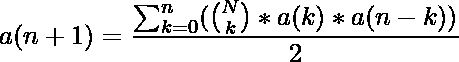

# 欧拉之字形数(交替排列)

> 原文:[https://www . geesforgeks . org/Euler-zigzag-numbers-alternating-arrangement/](https://www.geeksforgeeks.org/euler-zigzag-numbers-alternating-permutation/)

[欧拉之字形数](https://en.wikipedia.org/wiki/Alternating_permutation)是一个整数序列，它是这些数的排列数，使得每个条目交替大于或小于前一个条目。
c1、c2、c3、c4 是交替排列的，其中
C1<C2
C3<C2
C3<C4……
**之字形数字**如下:1、1、1、2、5、16、61、272、1385、7936、50521 ……
对于给定的整数 N，任务是打印最多 N 个术语的序列。
**举例:**

> **输入:** N = 10
> **输出:**1 1 2 5 16 61 272 1385 7936
> **输入:** N = 14
> **输出:**1 1 2 5 16 61 272 1385 7936 50521 353792 2702765 22368256

**方法:**
第(n+1)个锯齿形数是:

我们将找到阶乘 up n 并将其存储在一个数组中，还将创建第二个数组来存储第 I 个锯齿形数，并应用上述公式来找到所有 n 个锯齿形数。
以下是上述方法的实现:

## C++

```
// CPP program to find zigzag sequence
#include <bits/stdc++.h>
using namespace std;

// Function to print first n zigzag numbers
void ZigZag(int n)
{
    // To store factorial and n'th zig zag number
    long long fact[n + 1], zig[n + 1] = { 0 };

    // Initialize factorial upto n
    fact[0] = 1;
    for (int i = 1; i <= n; i++)
        fact[i] = fact[i - 1] * i;

    // Set first two zig zag numbers
    zig[0] = 1;
    zig[1] = 1;

    cout << "zig zag numbers: ";

    // Print first two zig zag number
    cout << zig[0] << " " << zig[1] << " ";

    // Print the rest zig zag numbers
    for (int i = 2; i < n; i++)
    {
        long long sum = 0;

        for (int k = 0; k <= i - 1; k++)
        {
            // Binomial(n, k)*a(k)*a(n-k)
            sum += (fact[i - 1]/(fact[i - 1 - k]*fact[k]))
                                 *zig[k] * zig[i - 1 - k];
        }

        // Store the value
        zig[i] = sum / 2;

        // Print the number
        cout << sum / 2 << " ";
    }
}

// Driver code
int main()
{
    int n = 10;

    // Function call
    ZigZag(n);

    return 0;
}
```

## Java 语言(一种计算机语言，尤用于创建网站)

```
// Java program to find zigzag sequence
import java.util.*;
import java.lang.*;
import java.io.*;

class GFG
{

// Function to print first n zigzag numbers
static void ZigZag(int n)
{
    // To store factorial and n'th zig zag number
    long[] fact= new long[n + 1];
    long[] zig = new long[n + 1];
    for (int i = 0; i < n + 1; i++)
        zig[i] = 0;

    // Initialize factorial upto n
    fact[0] = 1;
    for (int i = 1; i <= n; i++)
        fact[i] = fact[i - 1] * i;

    // Set first two zig zag numbers
    zig[0] = 1;
    zig[1] = 1;

    System.out.print("zig zag numbers: ");

    // Print first two zig zag number
    System.out.print(zig[0] + " " + zig[1] + " ");

    // Print the rest zig zag numbers
    for (int i = 2; i < n; i++)
    {
        long sum = 0;

        for (int k = 0; k <= i - 1; k++)
        {
            // Binomial(n, k)*a(k)*a(n-k)
            sum += (fact[i - 1] / (fact[i - 1 - k] *
                    fact[k])) * zig[k] * zig[i - 1 - k];
        }

        // Store the value
        zig[i] = sum / 2;

        // Print the number
        System.out.print(sum / 2 + " " );

    }
}

// Driver code
public static void main (String[] args)
              throws java.lang.Exception
{
    int n = 10;

    // Function call
    ZigZag(n);
}
}

// This code is contributed by nidhiva
```

## 蟒蛇 3

```
# Python3 program to find zigzag sequence

# Function to prfirst n zigzag numbers
def ZigZag(n):

    # To store factorial and
    # n'th zig zag number
    fact = [0 for i in range(n + 1)]
    zig = [0 for i in range(n + 1)]

    # Initialize factorial upto n
    fact[0] = 1
    for i in range(1, n + 1):
        fact[i] = fact[i - 1] * i

    # Set first two zig zag numbers
    zig[0] = 1
    zig[1] = 1

    print("zig zag numbers: ", end = " ")

    # Print first two zig zag number
    print(zig[0], zig[1], end = " ")

    # Print the rest zig zag numbers
    for i in range(2, n):
        sum = 0

        for k in range(0, i):

            # Binomial(n, k)*a(k)*a(n-k)
            sum += ((fact[i - 1] //
                    (fact[i - 1 - k] * fact[k])) *
                     zig[k] * zig[i - 1 - k])

        # Store the value
        zig[i] = sum // 2

        # Print the number
        print(sum // 2, end = " ")

# Driver code
n = 10

# Function call
ZigZag(n)

# This code is contributed by Mohit Kumar
```

## C#

```
// C# program to find zigzag sequence
using System;

class GFG
{

// Function to print first n zigzag numbers
static void ZigZag(int n)
{
    // To store factorial and n'th zig zag number
    long[] fact= new long[n + 1];
    long[] zig = new long[n + 1];
    for (int i = 0; i < n + 1; i++)
        zig[i] = 0;

    // Initialize factorial upto n
    fact[0] = 1;
    for (int i = 1; i <= n; i++)
        fact[i] = fact[i - 1] * i;

    // Set first two zig zag numbers
    zig[0] = 1;
    zig[1] = 1;

    Console.Write("zig zag numbers: ");

    // Print first two zig zag number
    Console.Write(zig[0] + " " + zig[1] + " ");

    // Print the rest zig zag numbers
    for (int i = 2; i < n; i++)
    {
        long sum = 0;

        for (int k = 0; k <= i - 1; k++)
        {
            // Binomial(n, k)*a(k)*a(n-k)
            sum += (fact[i - 1] / (fact[i - 1 - k] *
                    fact[k])) * zig[k] * zig[i - 1 - k];
        }

        // Store the value
        zig[i] = sum / 2;

        // Print the number
        Console.Write(sum / 2 + " " );

    }
}

// Driver code
public static void Main (String[] args)
{
    int n = 10;

    // Function call
    ZigZag(n);
}
}

// This code is contributed by 29AjayKumar
```

## java 描述语言

```
<script>

// Javascript program to find zigzag sequence

// Function to print first n zigzag numbers
function ZigZag(n)
{
    // To store factorial and n'th zig zag number
    var fact = Array(n+1).fill(0);
    var zig = Array(n+1).fill(0);

    // Initialize factorial upto n
    fact[0] = 1;
    for (var i = 1; i <= n; i++)
        fact[i] = fact[i - 1] * i;

    // Set first two zig zag numbers
    zig[0] = 1;
    zig[1] = 1;

    document.write( "zig zag numbers: ");

    // Print first two zig zag number
    document.write( zig[0] + " " + zig[1] + " ");

    // Print the rest zig zag numbers
    for (var i = 2; i < n; i++)
    {
        var sum = 0;

        for (var k = 0; k <= i - 1; k++)
        {
            // Binomial(n, k)*a(k)*a(n-k)
            sum += parseInt(fact[i - 1]/(fact[i - 1 - k]*fact[k]))
                                 *zig[k] * zig[i - 1 - k];
        }

        // Store the value
        zig[i] = parseInt(sum / 2);

        // Print the number
        document.write( parseInt(sum / 2) + " ");
    }
}

// Driver code
var n = 10;

// Function call
ZigZag(n);

// This code is contributed by rutvik_56.
</script>
```

**输出:**

```
zig zag numbers: 1 1 1 2 5 16 61 272 1385 7936
```

**参考**T2[https://en.wikipedia.org/wiki/Alternating_permutation](https://en.wikipedia.org/wiki/Alternating_permutation)T5[https://oeis.org/A000111](https://oeis.org/A000111)T8】