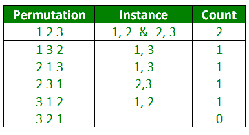
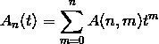
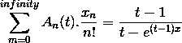
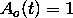
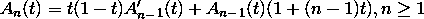
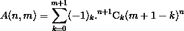
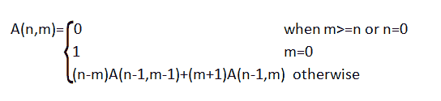

# 欧拉数

> 原文:[https://www.geeksforgeeks.org/eulerian-number/](https://www.geeksforgeeks.org/eulerian-number/)

在组合学中， [**欧拉数**](https://en.wikipedia.org/wiki/Eulerian_number) A(n，m)，是数字 1 到 n 的排列数，其中恰好 m 个元素大于前一个元素。

例如，数字 1 到 3 有 4 种排列，其中恰好有 1 个元素比前面的元素大。



**示例:**

```
Input : n = 3, m = 1
Output : 4
Please see above diagram (There
are 4 permutations where 1 no. is
greater.

Input : n = 4, m = 1
Output : 11
```

欧拉数是下述欧拉多项式的系数。



欧拉多项式由指数生成函数定义



欧拉多项式可以通过递推来计算





(n，m)的显式公式是



我们可以通过递推关系计算出 A(n，m):



例:
假设，n = 3，m = 1。
因此，
A(3，1)
=(3–1)* A(2，0) + (1 + 1) * A(2，1)
= 2 * A(2，0) + 2 * A(2，1)
= 2 * 1+2 *(2–1)* A(1，0) + (1 + 1) * A(1，1))
= 2+2 *(1 * 1+2 *(1–1)* A(0，0) 1))
= 2+2 *(1+2 *(0 * 1+2 * 0)
= 2+2 *(1+2 * 0)
= 2+2 * 1
= 2+2
= 4
我们可以用上面显示的例子来验证这一点。

以下是发现 A(n，m)的实现:

## C++

```
// CPP Program to find Eulerian number A(n, m)
#include <bits/stdc++.h>
using namespace std;

// Return euleriannumber A(n, m)
int eulerian(int n, int m)
{
    if (m >= n || n == 0)
        return 0;

    if (m == 0)
        return 1;

    return (n - m) * eulerian(n - 1, m - 1) +
           (m + 1) * eulerian(n - 1, m);
}

// Driven Program
int main()
{
    int n = 3, m = 1;
    cout << eulerian(n, m) << endl;
    return 0;
}
```

## Java 语言(一种计算机语言，尤用于创建网站)

```
// Java program to find Eulerian number A(n, m)
import java.util.*;

class Eulerian
{
    // Return eulerian number A(n, m)
    public static int eulerian(int n, int m)
    {
        if (m >= n || n == 0)
            return 0;

        if (m == 0)
            return 1;

        return (n - m) * eulerian(n - 1, m - 1) +
            (m + 1) * eulerian(n - 1, m);
    }

    // driver code   
    public static void main(String[] args)
    {
        int n = 3, m = 1;
        System.out.print( eulerian(n, m) );
    }
}

// This code is contributed by rishabh_jain
```

## 蟒蛇 3

```
# Python3 Program to find Eulerian number A(n, m)

# Return euleriannumber A(n, m)
def eulerian(n, m):
    if (m >= n or n == 0):
        return 0;

    if (m == 0):
        return 1;

    return ((n - m) * eulerian(n - 1, m - 1) +
            (m + 1) * eulerian(n - 1, m))

# Driver code
n = 3
m = 1
print( eulerian(n, m) )

# This code is contributed by rishabh_jain
```

## C#

```
// C# program to find Eulerian number A(n, m)
using System;

class Eulerian {

    // Return eulerian number A(n, m)
    public static int eulerian(int n, int m)
    {
        if (m >= n || n == 0)
            return 0;

        if (m == 0)
            return 1;

        return (n - m) * eulerian(n - 1, m - 1) +
                    (m + 1) * eulerian(n - 1, m);
    }

    // driver code
    public static void Main()
    {
        int n = 3, m = 1;
        Console.WriteLine(eulerian(n, m));
    }
}

// This code is contributed by vt_m
```

## 服务器端编程语言（Professional Hypertext Preprocessor 的缩写）

```
<?php
// PHP Program to find
// Eulerian number A(n, m)

// Return euleriannumber A(n, m)
function eulerian($n, $m)
{
    if ($m >= $n || $n == 0)
        return 0;

    if ($m == 0)
        return 1;

    return ($n - $m) * eulerian($n - 1, $m - 1) +
                 ($m + 1) * eulerian($n - 1, $m);
}

// Driven Code
$n = 3; $m = 1;
echo eulerian($n, $m);

// This code is contributed by anuj_67.
?>
```

## java 描述语言

```
<script>

// JavaScript Program to find Eulerian number A(n, m)

    // Return eulerian number A(n, m)
    function eulerian(n, m)
    {
        if (m >= n || n == 0)
            return 0;

        if (m == 0)
            return 1;

        return (n - m) * eulerian(n - 1, m - 1) +
            (m + 1) * eulerian(n - 1, m);
    }

// Driver code

        let n = 3, m = 1;
        document.write( eulerian(n, m) );

</script>
```

**输出:**

```
4
```

下面是使用动态规划寻找 A(n，m)的实现:

## C++

```
// CPP Program to find Eulerian number A(n, m)
#include <bits/stdc++.h>
using namespace std;

// Return euleriannumber A(n, m)
int eulerian(int n, int m)
{
    int dp[n + 1][m + 1];

    memset(dp, 0, sizeof(dp));

    // For each row from 1 to n
    for (int i = 1; i <= n; i++) {

        // For each column from 0 to m
        for (int j = 0; j <= m; j++) {

            // If i is greater than j
            if (i > j) {

                // If j is 0, then make that
                // state as 1.
                if (j == 0)
                    dp[i][j] = 1;

                // basic recurrence relation.
                else
                    dp[i][j] = ((i - j) *
                     dp[i - 1][j - 1]) +
                    ((j + 1) * dp[i - 1][j]);
            }
        }
    }

    return dp[n][m];
}

// Driven Program
int main()
{
    int n = 3, m = 1;
    cout << eulerian(n, m) << endl;
    return 0;
}
```

## Java 语言(一种计算机语言，尤用于创建网站)

```
// Java program to find Eulerian number A(n, m)
import java.util.*;

class Eulerian
{
    // Return euleriannumber A(n, m)
    public static int eulerian(int n, int m)
    {
        int[][] dp = new int[n+1][m+1];

        // For each row from 1 to n
        for (int i = 1; i <= n; i++) {

            // For each column from 0 to m
            for (int j = 0; j <= m; j++) {

                // If i is greater than j
                if (i > j) {

                    // If j is 0, then make
                    // that state as 1.
                    if (j == 0)
                        dp[i][j] = 1;

                    // basic recurrence relation.
                    else
                        dp[i][j] = ((i - j) *
                            dp[i - 1][j - 1]) +
                        ((j + 1) * dp[i - 1][j]);
                }
            }
        }

        return dp[n][m];
    }

    // driver code
    public static void main(String[] args)
    {
        int n = 3, m = 1;
        System.out.print( eulerian(n, m) );
    }
}

// This code is contributed by rishabh_jain
```

## 蟒蛇 3

```
# Python3 Program to find Eulerian
# number A(n, m)

# Return euleriannumber A(n, m)
def eulerian(n, m):
    dp = [[0 for x in range(m+1)]
             for y in range(n+1)]

    # For each row from 1 to n
    for i in range(1, n+1):

        # For each column from 0 to m
        for j in range(0, m+1):

            # If i is greater than j
            if (i > j):
                # If j is 0, then make that
                # state as 1.

                if (j == 0):
                    dp[i][j] = 1

                # basic recurrence relation.
                else :
                    dp[i][j] = (((i - j) *
                       dp[i - 1][j - 1]) +
                       ((j + 1) * dp[i - 1][j]))

    return dp[n][m]

# Driven Program
n = 3
m = 1
print(eulerian(n, m))

# This code is contributed by Prasad Kshirsagar
```

## C#

```
// C# program to find Eulerian number A(n, m)
using System;

class Eulerian {

    // Return euleriannumber A(n, m)
    public static int eulerian(int n, int m)
    {
        int[, ] dp = new int[n + 1, m + 1];

        // For each row from 1 to n
        for (int i = 1; i <= n; i++) {

            // For each column from 0 to m
            for (int j = 0; j <= m; j++) {

                // If i is greater than j
                if (i > j) {

                    // If j is 0, then make
                    // that state as 1.
                    if (j == 0)
                        dp[i, j] = 1;

                    // basic recurrence relation.
                    else
                        dp[i, j] = ((i - j) * dp[i - 1, j - 1]) +
                                        ((j + 1) * dp[i - 1, j]);
                }
            }
        }

        return dp[n, m];
    }

    // driver code
    public static void Main()
    {
        int n = 3, m = 1;
        Console.WriteLine(eulerian(n, m));
    }
}

// This code is contributed by vt_m
```

## 服务器端编程语言（Professional Hypertext Preprocessor 的缩写）

```
<?php
// PHP Program to find Eulerian
// number A(n, m)

// Return euleriannumber A(n, m)
function eulerian($n, $m)
{
    $dp = array(array());

    for ($i = 0; $i < $n + 1; $i++)
        for($j = 0; $j < $m + 1; $j++)
            $dp[$i][$j] = 0 ;

    // For each row from 1 to n
    for ($i = 1; $i <= $n; $i++)
    {

        // For each column from 0 to m
        for ($j = 0; $j <= $m; $j++)
        {

            // If i is greater than j
            if ($i > $j)
            {

                // If j is 0, then make that
                // state as 1.
                if ($j == 0)
                    $dp[$i][$j] = 1;

                // basic recurrence relation.
                else
                    $dp[$i][$j] = (($i - $j) *
                                    $dp[$i - 1][$j - 1]) +
                                  (($j + 1) * $dp[$i - 1][$j]);
            }
        }
    }

    return $dp[$n][$m];
}

// Driver Code
$n = 3 ;
$m = 1;
echo eulerian($n, $m) ;

// This code is contributed by Ryuga
?>
```

## java 描述语言

```
<script>

// Javascript Program to find
// Eulerian number A(n, m)

// Return euleriannumber A(n, m)
function eulerian(n, m)
{
    var dp = Array.from(Array(n+1),
    ()=> Array(m+1).fill(0));

    // For each row from 1 to n
    for (var i = 1; i <= n; i++) {

        // For each column from 0 to m
        for (var j = 0; j <= m; j++) {

            // If i is greater than j
            if (i > j) {

                // If j is 0, then make that
                // state as 1.
                if (j == 0)
                    dp[i][j] = 1;

                // basic recurrence relation.
                else
                    dp[i][j] = ((i - j) *
                     dp[i - 1][j - 1]) +
                    ((j + 1) * dp[i - 1][j]);
            }
        }
    }

    return dp[n][m];
}

// Driven Program
var n = 3, m = 1;
document.write( eulerian(n, m) );

</script>
```

**输出:**

```
4
```