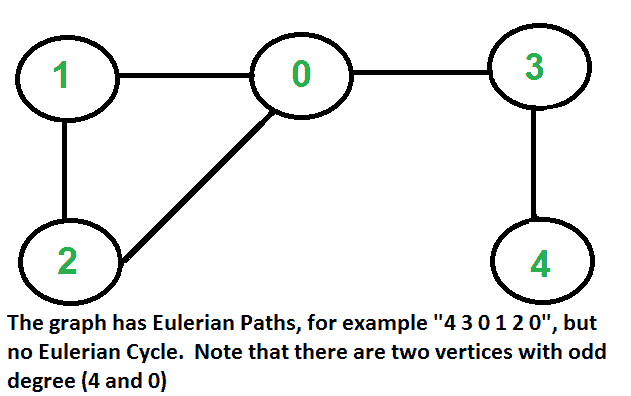
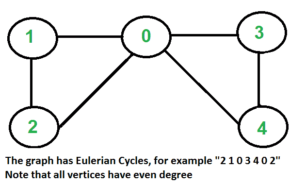
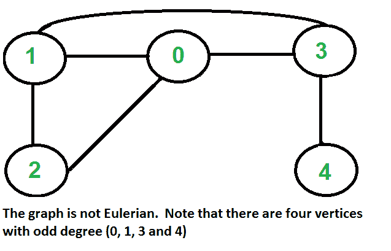

# 无向图的欧拉路径和电路

> 原文:[https://www.geeksforgeeks.org/eulerian-path-and-circuit/](https://www.geeksforgeeks.org/eulerian-path-and-circuit/)

[欧拉路径](http://en.wikipedia.org/wiki/Eulerian_path)是图中访问每条边精确一次的路径。欧拉回路是在同一顶点开始和结束的欧拉路径。







**如何求给定的图是否是欧拉图？**
问题和下面的问题一样。“有没有可能在不从纸上拿起铅笔的情况下画出给定的图形，并且不需要不止一次地描摹任何边”。
有欧拉圈的图叫欧拉，有欧拉路的图叫半欧拉。这个问题似乎类似于一般图的 NP 完全问题[哈密顿路径](https://www.geeksforgeeks.org/backtracking-set-7-hamiltonian-cycle/)。幸运的是，我们可以在多项式时间内找到给定的图是否有欧拉路径。其实我们可以在 O(V+E)时间内找到。
以下是具有欧拉路径和循环的无向图的一些有趣的性质。我们可以利用这些性质来判断一个图是否是欧拉图。
**欧拉循环**
如果以下两个条件成立，无向图具有欧拉循环。
…。a)所有非零度的顶点都是连通的。我们不关心零度的顶点，因为它们不属于欧拉循环或路径(我们只考虑所有边)。
…。b)所有顶点都有偶数度。
**欧拉路径**
如果满足以下两个条件，无向图具有欧拉路径。
…。a)与欧拉循环
的条件(a)相同。b)如果零个或两个顶点具有奇数度，而所有其他顶点具有偶数度。注意，无向图中不可能只有一个奇数度的顶点(无向图中所有度的和总是偶数)
注意，没有边的图被认为是欧拉图，因为没有边可以遍历。
**这是如何工作的？**
在欧拉路径中，我们每次访问一个顶点 v 时，都会走过两条未访问的边，其中一条边的端点为 v，因此，欧拉路径中的所有中间顶点都必须具有偶数度。对于欧拉循环，任何顶点都可以是中间顶点，因此所有顶点都必须有偶数度。

## C++

```
// A C++ program to check if a given graph is Eulerian or not
#include<iostream>
#include <list>
using namespace std;

// A class that represents an undirected graph
class Graph
{
    int V;    // No. of vertices
    list<int> *adj;    // A dynamic array of adjacency lists
public:
    // Constructor and destructor
    Graph(int V)   {this->V = V; adj = new list<int>[V]; }
    ~Graph() { delete [] adj; } // To avoid memory leak

     // function to add an edge to graph
    void addEdge(int v, int w);

    // Method to check if this graph is Eulerian or not
    int isEulerian();

    // Method to check if all non-zero degree vertices are connected
    bool isConnected();

    // Function to do DFS starting from v. Used in isConnected();
    void DFSUtil(int v, bool visited[]);
};

void Graph::addEdge(int v, int w)
{
    adj[v].push_back(w);
    adj[w].push_back(v);  // Note: the graph is undirected
}

void Graph::DFSUtil(int v, bool visited[])
{
    // Mark the current node as visited and print it
    visited[v] = true;

    // Recur for all the vertices adjacent to this vertex
    list<int>::iterator i;
    for (i = adj[v].begin(); i != adj[v].end(); ++i)
        if (!visited[*i])
            DFSUtil(*i, visited);
}

// Method to check if all non-zero degree vertices are connected.
// It mainly does DFS traversal starting from
bool Graph::isConnected()
{
    // Mark all the vertices as not visited
    bool visited[V];
    int i;
    for (i = 0; i < V; i++)
        visited[i] = false;

    // Find a vertex with non-zero degree
    for (i = 0; i < V; i++)
        if (adj[i].size() != 0)
            break;

    // If there are no edges in the graph, return true
    if (i == V)
        return true;

    // Start DFS traversal from a vertex with non-zero degree
    DFSUtil(i, visited);

    // Check if all non-zero degree vertices are visited
    for (i = 0; i < V; i++)
       if (visited[i] == false && adj[i].size() > 0)
            return false;

    return true;
}

/* The function returns one of the following values
   0 --> If graph is not Eulerian
   1 --> If graph has an Euler path (Semi-Eulerian)
   2 --> If graph has an Euler Circuit (Eulerian)  */
int Graph::isEulerian()
{
    // Check if all non-zero degree vertices are connected
    if (isConnected() == false)
        return 0;

    // Count vertices with odd degree
    int odd = 0;
    for (int i = 0; i < V; i++)
        if (adj[i].size() & 1)
            odd++;

    // If count is more than 2, then graph is not Eulerian
    if (odd > 2)
        return 0;

    // If odd count is 2, then semi-eulerian.
    // If odd count is 0, then eulerian
    // Note that odd count can never be 1 for undirected graph
    return (odd)? 1 : 2;
}

// Function to run test cases
void test(Graph &g)
{
    int res = g.isEulerian();
    if (res == 0)
        cout << "graph is not Eulerian\n";
    else if (res == 1)
        cout << "graph has a Euler path\n";
    else
        cout << "graph has a Euler cycle\n";
}

// Driver program to test above function
int main()
{
    // Let us create and test graphs shown in above figures
    Graph g1(5);
    g1.addEdge(1, 0);
    g1.addEdge(0, 2);
    g1.addEdge(2, 1);
    g1.addEdge(0, 3);
    g1.addEdge(3, 4);
    test(g1);

    Graph g2(5);
    g2.addEdge(1, 0);
    g2.addEdge(0, 2);
    g2.addEdge(2, 1);
    g2.addEdge(0, 3);
    g2.addEdge(3, 4);
    g2.addEdge(4, 0);
    test(g2);

    Graph g3(5);
    g3.addEdge(1, 0);
    g3.addEdge(0, 2);
    g3.addEdge(2, 1);
    g3.addEdge(0, 3);
    g3.addEdge(3, 4);
    g3.addEdge(1, 3);
    test(g3);

    // Let us create a graph with 3 vertices
    // connected in the form of cycle
    Graph g4(3);
    g4.addEdge(0, 1);
    g4.addEdge(1, 2);
    g4.addEdge(2, 0);
    test(g4);

    // Let us create a graph with all vertices
    // with zero degree
    Graph g5(3);
    test(g5);

    return 0;
}
```

## Java 语言(一种计算机语言，尤用于创建网站)

```
// A Java program to check if a given graph is Eulerian or not
import java.io.*;
import java.util.*;
import java.util.LinkedList;

// This class represents an undirected graph using adjacency list
// representation
class Graph
{
    private int V;   // No. of vertices

    // Array  of lists for Adjacency List Representation
    private LinkedList<Integer> adj[];

    // Constructor
    Graph(int v)
    {
        V = v;
        adj = new LinkedList[v];
        for (int i=0; i<v; ++i)
            adj[i] = new LinkedList();
    }

    //Function to add an edge into the graph
    void addEdge(int v, int w)
    {
        adj[v].add(w);// Add w to v's list.
        adj[w].add(v); //The graph is undirected
    }

    // A function used by DFS
    void DFSUtil(int v,boolean visited[])
    {
        // Mark the current node as visited
        visited[v] = true;

        // Recur for all the vertices adjacent to this vertex
        Iterator<Integer> i = adj[v].listIterator();
        while (i.hasNext())
        {
            int n = i.next();
            if (!visited[n])
                DFSUtil(n, visited);
        }
    }

    // Method to check if all non-zero degree vertices are
    // connected. It mainly does DFS traversal starting from
    boolean isConnected()
    {
        // Mark all the vertices as not visited
        boolean visited[] = new boolean[V];
        int i;
        for (i = 0; i < V; i++)
            visited[i] = false;

        // Find a vertex with non-zero degree
        for (i = 0; i < V; i++)
            if (adj[i].size() != 0)
                break;

        // If there are no edges in the graph, return true
        if (i == V)
            return true;

        // Start DFS traversal from a vertex with non-zero degree
        DFSUtil(i, visited);

        // Check if all non-zero degree vertices are visited
        for (i = 0; i < V; i++)
           if (visited[i] == false && adj[i].size() > 0)
                return false;

        return true;
    }

    /* The function returns one of the following values
       0 --> If graph is not Eulerian
       1 --> If graph has an Euler path (Semi-Eulerian)
       2 --> If graph has an Euler Circuit (Eulerian)  */
    int isEulerian()
    {
        // Check if all non-zero degree vertices are connected
        if (isConnected() == false)
            return 0;

        // Count vertices with odd degree
        int odd = 0;
        for (int i = 0; i < V; i++)
            if (adj[i].size()%2!=0)
                odd++;

        // If count is more than 2, then graph is not Eulerian
        if (odd > 2)
            return 0;

        // If odd count is 2, then semi-eulerian.
        // If odd count is 0, then eulerian
        // Note that odd count can never be 1 for undirected graph
        return (odd==2)? 1 : 2;
    }

    // Function to run test cases
    void test()
    {
        int res = isEulerian();
        if (res == 0)
            System.out.println("graph is not Eulerian");
        else if (res == 1)
            System.out.println("graph has a Euler path");
        else
           System.out.println("graph has a Euler cycle");
    }

    // Driver method
    public static void main(String args[])
    {
        // Let us create and test graphs shown in above figures
        Graph g1 = new Graph(5);
        g1.addEdge(1, 0);
        g1.addEdge(0, 2);
        g1.addEdge(2, 1);
        g1.addEdge(0, 3);
        g1.addEdge(3, 4);
        g1.test();

        Graph g2 = new Graph(5);
        g2.addEdge(1, 0);
        g2.addEdge(0, 2);
        g2.addEdge(2, 1);
        g2.addEdge(0, 3);
        g2.addEdge(3, 4);
        g2.addEdge(4, 0);
        g2.test();

        Graph g3 = new Graph(5);
        g3.addEdge(1, 0);
        g3.addEdge(0, 2);
        g3.addEdge(2, 1);
        g3.addEdge(0, 3);
        g3.addEdge(3, 4);
        g3.addEdge(1, 3);
        g3.test();

        // Let us create a graph with 3 vertices
        // connected in the form of cycle
        Graph g4 = new Graph(3);
        g4.addEdge(0, 1);
        g4.addEdge(1, 2);
        g4.addEdge(2, 0);
        g4.test();

        // Let us create a graph with all vertices
        // with zero degree
        Graph g5 = new Graph(3);
        g5.test();
    }
}
// This code is contributed by Aakash Hasija
```

## 计算机编程语言

```
# Python program to check if a given graph is Eulerian or not
#Complexity : O(V+E)

from collections import defaultdict

#This class represents a undirected graph using adjacency list representation
class Graph:

    def __init__(self,vertices):
        self.V= vertices #No. of vertices
        self.graph = defaultdict(list) # default dictionary to store graph

    # function to add an edge to graph
    def addEdge(self,u,v):
        self.graph[u].append(v)
        self.graph[v].append(u)

    #A function used by isConnected
    def DFSUtil(self,v,visited):
        # Mark the current node as visited
        visited[v]= True

        #Recur for all the vertices adjacent to this vertex
        for i in self.graph[v]:
            if visited[i]==False:
                self.DFSUtil(i,visited)

    '''Method to check if all non-zero degree vertices are
    connected. It mainly does DFS traversal starting from
    node with non-zero degree'''
    def isConnected(self):

        # Mark all the vertices as not visited
        visited =[False]*(self.V)

        #  Find a vertex with non-zero degree
        for i in range(self.V):
            if len(self.graph[i]) > 1:
                break

        # If there are no edges in the graph, return true
        if i == self.V-1:
            return True

        # Start DFS traversal from a vertex with non-zero degree
        self.DFSUtil(i,visited)

        # Check if all non-zero degree vertices are visited
        for i in range(self.V):
            if visited[i]==False and len(self.graph[i]) > 0:
                return False

        return True

    '''The function returns one of the following values
       0 --> If graph is not Eulerian
       1 --> If graph has an Euler path (Semi-Eulerian)
       2 --> If graph has an Euler Circuit (Eulerian)  '''
    def isEulerian(self):
        # Check if all non-zero degree vertices are connected
        if self.isConnected() == False:
            return 0
        else:
            #Count vertices with odd degree
            odd = 0
            for i in range(self.V):
                if len(self.graph[i]) % 2 !=0:
                    odd +=1

            '''If odd count is 2, then semi-eulerian.
            If odd count is 0, then eulerian
            If count is more than 2, then graph is not Eulerian
            Note that odd count can never be 1 for undirected graph'''
            if odd == 0:
                return 2
            elif odd == 2:
                return 1
            elif odd > 2:
                return 0

     # Function to run test cases
     def test(self):
         res = self.isEulerian()
         if res == 0:
             print "graph is not Eulerian"
         elif res ==1 :
             print "graph has a Euler path"
         else:
             print "graph has a Euler cycle"

#Let us create and test graphs shown in above figures
g1 = Graph(5);
g1.addEdge(1, 0)
g1.addEdge(0, 2)
g1.addEdge(2, 1)
g1.addEdge(0, 3)
g1.addEdge(3, 4)
g1.test()

g2 = Graph(5)
g2.addEdge(1, 0)
g2.addEdge(0, 2)
g2.addEdge(2, 1)
g2.addEdge(0, 3)
g2.addEdge(3, 4)
g2.addEdge(4, 0)
g2.test();

g3 = Graph(5)
g3.addEdge(1, 0)
g3.addEdge(0, 2)
g3.addEdge(2, 1)
g3.addEdge(0, 3)
g3.addEdge(3, 4)
g3.addEdge(1, 3)
g3.test()

#Let us create a graph with 3 vertices
# connected in the form of cycle
g4 = Graph(3)
g4.addEdge(0, 1)
g4.addEdge(1, 2)
g4.addEdge(2, 0)
g4.test()

# Let us create a graph with all vertices
# with zero degree
g5 = Graph(3)
g5.test()

#This code is contributed by Neelam Yadav
```

## C#

```
// A C# program to check if a given graph is Eulerian or not
using System;
using System.Collections.Generic;

// This class represents an undirected graph using adjacency list
// representation
public class Graph
{
    private int V;   // No. of vertices

    // Array  of lists for Adjacency List Representation
    private List<int> []adj;

    // Constructor
    Graph(int v)
    {
        V = v;
        adj = new List<int>[v];
        for (int i=0; i<v; ++i)
            adj[i] = new List<int>();
    }

    //Function to add an edge into the graph
    void addEdge(int v, int w)
    {
        adj[v].Add(w);// Add w to v's list.
        adj[w].Add(v); //The graph is undirected
    }

    // A function used by DFS
    void DFSUtil(int v,bool []visited)
    {
        // Mark the current node as visited
        visited[v] = true;

        // Recur for all the vertices adjacent to this vertex
        foreach(int i in adj[v]){
            int n = i;
            if (!visited[n])
                DFSUtil(n, visited);
        }
    }

    // Method to check if all non-zero degree vertices are
    // connected. It mainly does DFS traversal starting from
    bool isConnected()
    {
        // Mark all the vertices as not visited
        bool []visited = new bool[V];
        int i;
        for (i = 0; i < V; i++)
            visited[i] = false;

        // Find a vertex with non-zero degree
        for (i = 0; i < V; i++)
            if (adj[i].Count != 0)
                break;

        // If there are no edges in the graph, return true
        if (i == V)
            return true;

        // Start DFS traversal from a vertex with non-zero degree
        DFSUtil(i, visited);

        // Check if all non-zero degree vertices are visited
        for (i = 0; i < V; i++)
           if (visited[i] == false && adj[i].Count > 0)
                return false;

        return true;
    }

    /* The function returns one of the following values
       0 --> If graph is not Eulerian
       1 --> If graph has an Euler path (Semi-Eulerian)
       2 --> If graph has an Euler Circuit (Eulerian)  */
    int isEulerian()
    {
        // Check if all non-zero degree vertices are connected
        if (isConnected() == false)
            return 0;

        // Count vertices with odd degree
        int odd = 0;
        for (int i = 0; i < V; i++)
            if (adj[i].Count%2!=0)
                odd++;

        // If count is more than 2, then graph is not Eulerian
        if (odd > 2)
            return 0;

        // If odd count is 2, then semi-eulerian.
        // If odd count is 0, then eulerian
        // Note that odd count can never be 1 for undirected graph
        return (odd==2)? 1 : 2;
    }

    // Function to run test cases
    void test()
    {
        int res = isEulerian();
        if (res == 0)
            Console.WriteLine("graph is not Eulerian");
        else if (res == 1)
            Console.WriteLine("graph has a Euler path");
        else
           Console.WriteLine("graph has a Euler cycle");
    }

    // Driver method
    public static void Main(String []args)
    {
        // Let us create and test graphs shown in above figures
        Graph g1 = new Graph(5);
        g1.addEdge(1, 0);
        g1.addEdge(0, 2);
        g1.addEdge(2, 1);
        g1.addEdge(0, 3);
        g1.addEdge(3, 4);
        g1.test();

        Graph g2 = new Graph(5);
        g2.addEdge(1, 0);
        g2.addEdge(0, 2);
        g2.addEdge(2, 1);
        g2.addEdge(0, 3);
        g2.addEdge(3, 4);
        g2.addEdge(4, 0);
        g2.test();

        Graph g3 = new Graph(5);
        g3.addEdge(1, 0);
        g3.addEdge(0, 2);
        g3.addEdge(2, 1);
        g3.addEdge(0, 3);
        g3.addEdge(3, 4);
        g3.addEdge(1, 3);
        g3.test();

        // Let us create a graph with 3 vertices
        // connected in the form of cycle
        Graph g4 = new Graph(3);
        g4.addEdge(0, 1);
        g4.addEdge(1, 2);
        g4.addEdge(2, 0);
        g4.test();

        // Let us create a graph with all vertices
        // with zero degree
        Graph g5 = new Graph(3);
        g5.test();
    }
}

// This code contributed by PrinciRaj1992
```

## java 描述语言

```
<script>
// A Javascript program to check if a given graph is Eulerian or not

// This class represents an undirected graph using adjacency list
// representation
class Graph
{
    // Constructor
    constructor(v)
    {
        this.V = v;
        this.adj = new Array(v);
        for (let i = 0; i < v; ++i)
            this.adj[i] = [];
    }

    // Function to add an edge into the graph
    addEdge(v,w)
    {
        this.adj[v].push(w);// Add w to v's list.
        this.adj[w].push(v); //The graph is undirected
    }

    // A function used by DFS
    DFSUtil(v,visited)
    {
        // Mark the current node as visited
        visited[v] = true;

        // Recur for all the vertices adjacent to this vertex       
        for(let i of this.adj[v])
        {
            let n = i;
            if (!visited[n])
                this.DFSUtil(n, visited);
        }
    }

    // Method to check if all non-zero degree vertices are
    // connected. It mainly does DFS traversal starting from
    isConnected()
    {
        // Mark all the vertices as not visited
        let visited = new Array(this.V);
        let i;
        for (i = 0; i < this.V; i++)
            visited[i] = false;

        // Find a vertex with non-zero degree
        for (i = 0; i < this.V; i++)
            if (this.adj[i].length != 0)
                break;

        // If there are no edges in the graph, return true
        if (i == this.V)
            return true;

        // Start DFS traversal from a vertex with non-zero degree
        this.DFSUtil(i, visited);

        // Check if all non-zero degree vertices are visited
        for (i = 0; i < this.V; i++)
           if (visited[i] == false && this.adj[i].length > 0)
                return false;

        return true;
    }

    /* The function returns one of the following values
       0 --> If graph is not Eulerian
       1 --> If graph has an Euler path (Semi-Eulerian)
       2 --> If graph has an Euler Circuit (Eulerian)  */
    isEulerian()
    {
        // Check if all non-zero degree vertices are connected
        if (this.isConnected() == false)
            return 0;

        // Count vertices with odd degree
        let odd = 0;
        for (let i = 0; i < this.V; i++)
            if (this.adj[i].length%2!=0)
                odd++;

        // If count is more than 2, then graph is not Eulerian
        if (odd > 2)
            return 0;

        // If odd count is 2, then semi-eulerian.
        // If odd count is 0, then eulerian
        // Note that odd count can never be 1 for undirected graph
        return (odd==2)? 1 : 2;
    }

    // Function to run test cases
    test()
    {
        let res = this.isEulerian();
        if (res == 0)
            document.write("graph is not Eulerian<br>");
        else if (res == 1)
            document.write("graph has a Euler path<br>");
        else
           document.write("graph has a Euler cycle<br>");
    }
}

// Driver method
// Let us create and test graphs shown in above figures
let g1 = new Graph(5);
g1.addEdge(1, 0);
g1.addEdge(0, 2);
g1.addEdge(2, 1);
g1.addEdge(0, 3);
g1.addEdge(3, 4);
g1.test();

let g2 = new Graph(5);
g2.addEdge(1, 0);
g2.addEdge(0, 2);
g2.addEdge(2, 1);
g2.addEdge(0, 3);
g2.addEdge(3, 4);
g2.addEdge(4, 0);
g2.test();

let g3 = new Graph(5);
g3.addEdge(1, 0);
g3.addEdge(0, 2);
g3.addEdge(2, 1);
g3.addEdge(0, 3);
g3.addEdge(3, 4);
g3.addEdge(1, 3);
g3.test();

// Let us create a graph with 3 vertices
// connected in the form of cycle
let g4 = new Graph(3);
g4.addEdge(0, 1);
g4.addEdge(1, 2);
g4.addEdge(2, 0);
g4.test();

// Let us create a graph with all vertices
// with zero degree
let g5 = new Graph(3);
g5.test();

// This code is contributed by avanitrachhadiya2155
</script>
```

**输出:**

```
graph has a Euler path
graph has a Euler cycle
graph is not Eulerian
graph has a Euler cycle
graph has a Euler cycle
```

时间复杂度:O(V+E)
**下一篇文章:**
[有向图的欧拉路径和回路。](https://www.geeksforgeeks.org/euler-circuit-directed-graph/)
[弗勒里的算法打印欧拉路径还是电路？](https://www.geeksforgeeks.org/fleurys-algorithm-for-printing-eulerian-path/)
**参考文献:**
[http://en.wikipedia.org/wiki/Eulerian_path](http://en.wikipedia.org/wiki/Eulerian_path)
如发现任何不正确的地方，或者您想分享更多关于上述话题的信息，请写评论