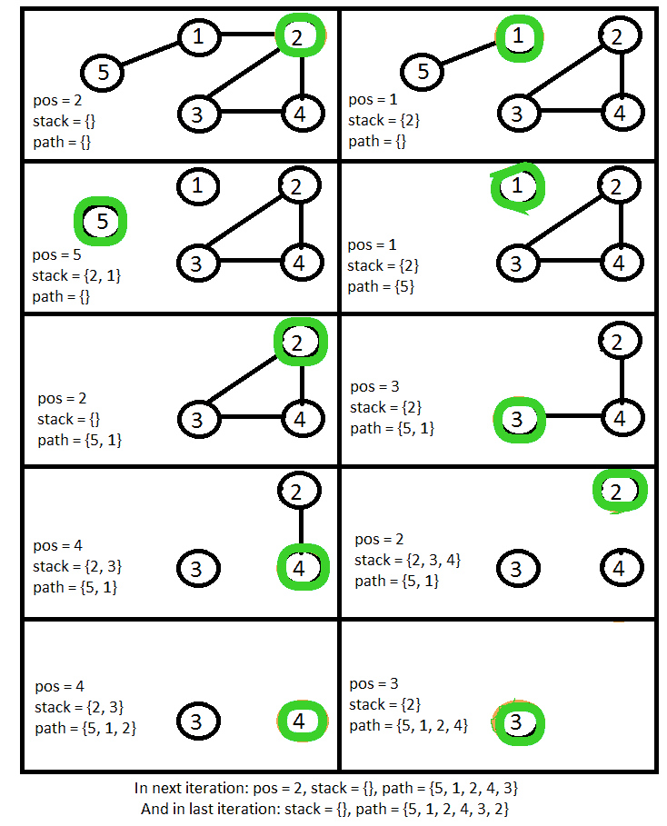

# 无向图中的欧拉路径

> 原文:[https://www . geesforgeks . org/欧拉-路径-无向图/](https://www.geeksforgeeks.org/eulerian-path-undirected-graph/)

给定无向图的邻接矩阵表示。查找图中是否有[欧拉路径](https://www.geeksforgeeks.org/mathematics-euler-hamiltonian-paths/)。如果没有路径，打印“无解决方案”。如果有路径，打印路径。

**示例:**

```
Input : [[0, 1, 0, 0, 1],
         [1, 0, 1, 1, 0],
         [0, 1, 0, 1, 0],
         [0, 1, 1, 0, 0],
         [1, 0, 0, 0, 0]]

Output : 5 -> 1 -> 2 -> 4 -> 3 -> 2

Input : [[0, 1, 0, 1, 1],
         [1, 0, 1, 0, 1],
         [0, 1, 0, 1, 1],
         [1, 1, 1, 0, 0],
         [1, 0, 1, 0, 0]]
Output : "No Solution"
```

这个问题的基本情况是，如果边数为奇数(即奇数度)的顶点数大于 2，则不存在欧拉路径。
如果它有解，并且所有节点都有偶数条边，那么我们可以从任何一个节点开始我们的路径。
如果它有解，并且正好两个顶点有奇数条边，那么我们必须从这两个顶点中的一个开始我们的路径。
不会有恰好一个顶点有奇数条边的情况，因为总共有偶数条边。

**寻找路径的过程:**

1.  首先，取一个空栈和一个空路径。
2.  如果所有顶点都有偶数条边，那么从其中任何一条开始。如果两个顶点有奇数个边，那么从其中一个开始。将当前变量设置为此起始顶点。
3.  如果当前顶点至少有一个相邻节点，则首先发现该节点，然后通过回溯发现当前节点。为此，将当前节点添加到堆栈中，移除当前节点和邻居节点之间的边缘，将当前节点设置为邻居节点。
4.  如果当前节点没有任何邻居，则将其添加到路径中，并弹出堆栈，将当前设置为弹出顶点。
5.  重复过程 3 和 4，直到堆栈为空，并且当前节点没有任何邻居。



在过程路径变量保存欧拉路径之后。

## C++

```
// Efficient C++ program to
// find out Eulerian path
#include <bits/stdc++.h>
using namespace std;

// Function to find out the path
// It takes the adjacency matrix 
// representation of the graph as input
void findpath(int graph[][5], int n)
{
    vector<int> numofadj;

    // Find out number of edges each vertex has
    for (int i = 0; i < n; i++)
        numofadj.push_back(accumulate(graph[i], 
                                      graph[i] + 5, 0));

    // Find out how many vertex has odd number edges
    int startpoint = 0, numofodd = 0;
    for (int i = n - 1; i >= 0; i--)
    {
        if (numofadj[i] % 2 == 1)
        {
            numofodd++;
            startpoint = i;
        }
    }

    // If number of vertex with odd number of edges
    // is greater than two return "No Solution".
    if (numofodd > 2) 
    {
        cout << "No Solution" << endl;
        return;
    }

    // If there is a path find the path
    // Initialize empty stack and path
    // take the starting current as discussed
    stack<int> stack;
    vector<int> path;
    int cur = startpoint;

    // Loop will run until there is element in the stack
    // or current edge has some neighbour.
    while (!stack.empty() or 
            accumulate(graph[cur], 
                       graph[cur] + 5, 0) != 0)
    {
        // If current node has not any neighbour
        // add it to path and pop stack
        // set new current to the popped element
        if (accumulate(graph[cur],
                       graph[cur] + 5, 0) == 0)
        {
            path.push_back(cur);
            cur = stack.top();
            stack.pop();
        }

        // If the current vertex has at least one
        // neighbour add the current vertex to stack,
        // remove the edge between them and set the
        // current to its neighbour.
        else 
        {
            for (int i = 0; i < n; i++)
            {
                if (graph[cur][i] == 1) 
                {
                    stack.push(cur);
                    graph[cur][i] = 0;
                    graph[i][cur] = 0;
                    cur = i;
                    break;
                }
            }
        }
    }

    // print the path
    for (auto ele : path) cout << ele << " -> ";
    cout << cur << endl;
}

// Driver Code
int main() 
{
    // Test case 1
    int graph1[][5] = {{0, 1, 0, 0, 1},
                       {1, 0, 1, 1, 0},
                       {0, 1, 0, 1, 0},
                       {0, 1, 1, 0, 0},
                       {1, 0, 0, 0, 0}};
    int n = sizeof(graph1) / sizeof(graph1[0]);
    findpath(graph1, n);

    // Test case 2
    int graph2[][5] = {{0, 1, 0, 1, 1},
                       {1, 0, 1, 0, 1},
                       {0, 1, 0, 1, 1},
                       {1, 1, 1, 0, 0},
                       {1, 0, 1, 0, 0}};
    n = sizeof(graph1) / sizeof(graph1[0]);
    findpath(graph2, n);

    // Test case 3
    int graph3[][5] = {{0, 1, 0, 0, 1},
                       {1, 0, 1, 1, 1},
                       {0, 1, 0, 1, 0},
                       {0, 1, 1, 0, 1},
                       {1, 1, 0, 1, 0}};
    n = sizeof(graph1) / sizeof(graph1[0]);
    findpath(graph3, n);
}

// This code is contributed by
// sanjeev2552
```

## Java 语言(一种计算机语言，尤用于创建网站)

```
// Efficient Java program to 
// find out Eulerian path 
import java.util.*;

class GFG 
{

    // Function to find out the path
    // It takes the adjacency matrix
    // representation of the graph as input
    static void findpath(int[][] graph, int n)
    {
        Vector<Integer> numofadj = new Vector<>();

        // Find out number of edges each vertex has
        for (int i = 0; i < n; i++)
            numofadj.add(accumulate(graph[i], 0));

        // Find out how many vertex has odd number edges
        int startPoint = 0, numofodd = 0;
        for (int i = n - 1; i >= 0; i--)
        {
            if (numofadj.elementAt(i) % 2 == 1) 
            {
                numofodd++;
                startPoint = i;
            }
        }

        // If number of vertex with odd number of edges
        // is greater than two return "No Solution".
        if (numofodd > 2)
        {
            System.out.println("No Solution");
            return;
        }

        // If there is a path find the path
        // Initialize empty stack and path
        // take the starting current as discussed
        Stack<Integer> stack = new Stack<>();
        Vector<Integer> path = new Vector<>();
        int cur = startPoint;

        // Loop will run until there is element in the stack
        // or current edge has some neighbour.
        while (!stack.isEmpty() || accumulate(graph[cur], 0) != 0)
        {

            // If current node has not any neighbour
            // add it to path and pop stack
            // set new current to the popped element
            if (accumulate(graph[cur], 0) == 0)
            {
                path.add(cur);
                cur = stack.pop();

                // If the current vertex has at least one
                // neighbour add the current vertex to stack,
                // remove the edge between them and set the
                // current to its neighbour.
            } 
            else 
            {
                for (int i = 0; i < n; i++)
                {
                    if (graph[cur][i] == 1) 
                    {
                        stack.add(cur);
                        graph[cur][i] = 0;
                        graph[i][cur] = 0;
                        cur = i;
                        break;
                    }
                }
            }
        }

        // print the path
        for (int ele : path)
            System.out.print(ele + " -> ");
        System.out.println(cur);
    }

    static int accumulate(int[] arr, int sum)
    {
        for (int i : arr)
            sum += i;
        return sum;
    }

    // Driver Code
    public static void main(String[] args)
    {

        // Test case 1
        int[][] graph1 = { { 0, 1, 0, 0, 1 },
                        { 1, 0, 1, 1, 0 },
                        { 0, 1, 0, 1, 0 },
                        { 0, 1, 1, 0, 0 },
                        { 1, 0, 0, 0, 0 } };
        int n = graph1.length;
        findpath(graph1, n);

        // Test case 2
        int[][] graph2 = { { 0, 1, 0, 1, 1 },
                        { 1, 0, 1, 0, 1 },
                        { 0, 1, 0, 1, 1 },
                        { 1, 1, 1, 0, 0 },
                        { 1, 0, 1, 0, 0 } };
        n = graph2.length;
        findpath(graph2, n);

        // Test case 3
        int[][] graph3 = { { 0, 1, 0, 0, 1 },
                        { 1, 0, 1, 1, 1 },
                        { 0, 1, 0, 1, 0 },
                        { 0, 1, 1, 0, 1 },
                        { 1, 1, 0, 1, 0 } };
        n = graph3.length;
        findpath(graph3, n);
    }
}

// This code is contributed by
// sanjeev2552
```

## 蟒蛇 3

```
# Efficient Python3 program to
# find out Eulerian path

# Function to find out the path
# It takes the adjacency matrix
# representation of the graph as input
def findpath(graph, n):

    numofadj = []

    # Find out number of edges each
    # vertex has
    for i in range(n):
        numofadj.append(sum(graph[i]))

    # Find out how many vertex has 
    # odd number edges
    startpoint, numofodd = 0, 0
    for i in range(n - 1, -1, -1):
        if (numofadj[i] % 2 == 1):
            numofodd += 1
            startpoint = i

    # If number of vertex with odd number of edges
    # is greater than two return "No Solution".
    if (numofodd > 2):
        print("No Solution")
        return

    # If there is a path find the path
    # Initialize empty stack and path
    # take the starting current as discussed
    stack = []
    path = []
    cur = startpoint

    # Loop will run until there is element in the
    # stack or current edge has some neighbour.
    while (len(stack) > 0 or sum(graph[cur])!= 0):

        # If current node has not any neighbour
        # add it to path and pop stack set new 
        # current to the popped element
        if (sum(graph[cur]) == 0):
            path.append(cur)
            cur = stack[-1]
            del stack[-1]

        # If the current vertex has at least one
        # neighbour add the current vertex to stack,
        # remove the edge between them and set the
        # current to its neighbour.
        else:
            for i in range(n):
                if (graph[cur][i] == 1):
                    stack.append(cur)
                    graph[cur][i] = 0
                    graph[i][cur] = 0
                    cur = i
                    break

    # Print the path
    for ele in path:
        print(ele, end = " -> ")

    print(cur)

# Driver Code
if __name__ == '__main__':

    # Test case 1
    graph1 = [ [ 0, 1, 0, 0, 1 ],
               [ 1, 0, 1, 1, 0 ],
               [ 0, 1, 0, 1, 0 ],
               [ 0, 1, 1, 0, 0 ],
               [ 1, 0, 0, 0, 0 ] ]
    n = len(graph1)
    findpath(graph1, n)

    # Test case 2
    graph2 = [ [ 0, 1, 0, 1, 1 ],
               [ 1, 0, 1, 0, 1 ],
               [ 0, 1, 0, 1, 1 ],
               [ 1, 1, 1, 0, 0 ],
               [ 1, 0, 1, 0, 0 ] ]
    n = len(graph2)
    findpath(graph2, n)

    # Test case 3
    graph3 = [ [ 0, 1, 0, 0, 1 ],
               [ 1, 0, 1, 1, 1 ],
               [ 0, 1, 0, 1, 0 ],
               [ 0, 1, 1, 0, 1 ],
               [ 1, 1, 0, 1, 0 ] ]
    n = len(graph3)
    findpath(graph3, n)

# This code is contributed by mohit kumar 29
```

## C#

```
// Efficient C# program to 
// find out Eulerian path 
using System;
using System.Collections.Generic;
class GFG{

// Function to find out the path
// It takes the adjacency matrix
// representation of the graph 
// as input
static void findpath(int[,] graph, 
                     int n)
{
  List<int> numofadj = 
            new List<int>();

  // Find out number of edges 
  // each vertex has
  for (int i = 0; i < n; i++)
    numofadj.Add(accumulate(graph, 
                            i, 0));

  // Find out how many vertex has 
  // odd number edges
  int startPoint = 0, numofodd = 0;
  for (int i = n - 1; i >= 0; i--)
  {
    if (numofadj[i] % 2 == 1) 
    {
      numofodd++;
      startPoint = i;
    }
  }

  // If number of vertex with odd 
  // number of edges is greater than 
  // two return "No Solution".
  if (numofodd > 2)
  {
    Console.WriteLine("No Solution");
    return;
  }

  // If there is a path find the path
  // Initialize empty stack and path
  // take the starting current as 
  // discussed
  Stack<int> stack = new Stack<int>();
  List<int> path = new List<int>();
  int cur = startPoint;

  // Loop will run until there is element 
  // in the stack or current edge has some 
  // neighbour.
  while (stack.Count != 0 || 
         accumulate(graph, cur, 0) != 0)
  {

    // If current node has not any 
    // neighbour add it to path and 
    // pop stack set new current to 
    // the popped element
    if (accumulate(graph,cur, 0) == 0)
    {
      path.Add(cur);
      cur = stack.Pop();

      // If the current vertex has at 
      // least one neighbour add the 
      // current vertex to stack, remove 
      // the edge between them and set the
      // current to its neighbour.
    } 
    else 
    {
      for (int i = 0; i < n; i++)
      {
        if (graph[cur, i] == 1) 
        {
          stack.Push(cur);
          graph[cur, i] = 0;
          graph[i, cur] = 0;
          cur = i;
          break;
        }
      }
    }
  }

  // print the path
  foreach (int ele in path)
    Console.Write(ele + " -> ");
  Console.WriteLine(cur);
}

static int accumulate(int[,] matrix, 
                      int row, int sum)
{    
  int []arr = GetRow(matrix, 
                     row);

 foreach (int i in arr)
   sum += i;
 return sum;
}

public static int[] GetRow(int[,] matrix, 
                           int row)
{
  var rowLength = matrix.GetLength(1);
  var rowVector = new int[rowLength];

  for (var i = 0; i < rowLength; i++)
    rowVector[i] = matrix[row, i];

  return rowVector;
}

// Driver Code
public static void Main(String[] args)
{
  // Test case 1
  int[,] graph1 = {{0, 1, 0, 0, 1},
                   {1, 0, 1, 1, 0},
                   {0, 1, 0, 1, 0},
                   {0, 1, 1, 0, 0},
                   {1, 0, 0, 0, 0}};
  int n = graph1.GetLength(0);
  findpath(graph1, n);

  // Test case 2
  int[,] graph2 = {{0, 1, 0, 1, 1},
                   {1, 0, 1, 0, 1},
                   {0, 1, 0, 1, 1},
                   {1, 1, 1, 0, 0},
                   {1, 0, 1, 0, 0}};
  n = graph2.GetLength(0);
  findpath(graph2, n);

  // Test case 3
  int[,] graph3 = {{0, 1, 0, 0, 1},
                   {1, 0, 1, 1, 1},
                   {0, 1, 0, 1, 0},
                   {0, 1, 1, 0, 1},
                   {1, 1, 0, 1, 0}};
  n = graph3.GetLength(0);
  findpath(graph3, n);
}
}

// This code is contributed by Rajput-Ji
```

**输出:**

```
4 -> 0 -> 1 -> 3 -> 2 -> 1
No Solution
4 -> 3 -> 2 -> 1 -> 4 -> 0 -> 1 -> 3
```

**时间复杂度:**
该算法的运行时复杂度为 O(E)。这种算法也可以用来寻找欧拉回路。如果路径的第一个和最后一个顶点相同，那么它将是一个欧拉回路。