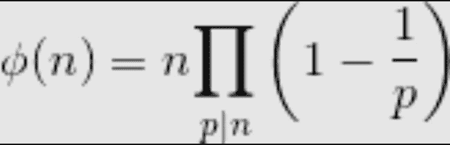
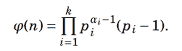

# 所有小于或等于 n 的数字的欧拉全能性函数

> 原文:[https://www . geesforgeks . org/Euler s-totilent-function-for-all-numbers-小于或等于 n/](https://www.geeksforgeeks.org/eulers-totient-function-for-all-numbers-smaller-than-or-equal-to-n/)

[输入 n 的欧拉全能性函数](https://www.geeksforgeeks.org/eulers-totient-function/)φ(n)是{1，2，3，…，n}中与 n 相对素数的数的计数，即与 n 的 GCD(最大公约数)为 1 的数。

例如，φ(4)= 2，φ(3)= 2，φ(5)= 4。有 2 个小于或等于 4 的数相对于 4 是素数，2 个小于或等于 3 的数相对于 3 是素数。和 4 个小于或等于 5 的数字，它们相对于 5 是素数。
我们在[之前的帖子](https://www.geeksforgeeks.org/eulers-totient-function/)中讨论了φ(n)的不同计算方法。

**所有小于等于 n 的数，如何计算φ？**

示例:

```
Input: n = 5
Output: Totient of 1 is 1
        Totient of 2 is 1
        Totient of 3 is 2
        Totient of 4 is 2
        Totient of 5 is 4
```

**我们强烈建议你尽量减少浏览器，先自己试试这个。**
一个**简单的解决方案**是调用[φ(I)](https://www.geeksforgeeks.org/eulers-totient-function/)为 i = 1 到 n。

一个**有效的解决方案**是使用一个类似于厄拉多塞的[筛子的想法来预计算所有的值。该方法基于以下产品配方。](https://www.geeksforgeeks.org/sieve-of-eratosthenes/)



公式基本上说，对于 n 的所有质因数 p，φ(n)的值等于 n 乘以(1–1/p)的乘积，例如φ(6)= 6 *(1-1/2)*(1–1/3)= 2。

下面是完整的算法:

```
1) Create an array phi[1..n] to store Φ values of all numbers 
   from 1 to n.  

2) Initialize all values such that phi[i] stores i.  This
   initialization serves two purposes.
   a) To check if phi[i] is already evaluated or not. Note that
      the maximum possible phi value of a number i is i-1.
   b) To initialize phi[i] as i is multiple in the above product
      formula. 

3) Run a loop for p = 2 to n
    a) If phi[p] is p, means p is not evaluated yet and p is a 
       prime number (similar to Sieve), otherwise phi[p] must 
       have been updated in step 3.b
    b) Traverse through all multiples of p and update all 
       multiples of p by multiplying with (1-1/p).

4) Run a loop from i = 1 to n and print all Ph[i] values.
```

下面是上述算法的实现。

## C++

```
// C++ program to compute Totient function for 
// all numbers smaller than or equal to n. 
#include<iostream> 
using namespace std; 

// Computes and prints totient of all numbers 
// smaller than or equal to n. 
void computeTotient(int n) 
{ 
    // Create and initialize an array to store 
    // phi or totient values 
    long long phi[n+1]; 
    for (int i=1; i<=n; i++) 
        phi[i] = i; // indicates not evaluated yet 
                    // and initializes for product 
                    // formula. 

    // Compute other Phi values 
    for (int p=2; p<=n; p++) 
    { 
        // If phi[p] is not computed already, 
        // then number p is prime 
        if (phi[p] == p) 
        { 
            // Phi of a prime number p is 
            // always equal to p-1. 
            phi[p] = p-1; 

            // Update phi values of all 
            // multiples of p 
            for (int i = 2*p; i<=n; i += p) 
            { 
            // Add contribution of p to its 
            // multiple i by multiplying with 
            // (1 - 1/p) 
            phi[i] = (phi[i]/p) * (p-1); 
            } 
        } 
    } 

    // Print precomputed phi values 
    for (int i=1; i<=n; i++) 
    cout << "Totient of " << i << " is "
        << phi[i] << endl; 
} 

// Driver program to test above function 
int main() 
{ 
    int n = 12; 
    computeTotient(n); 
    return 0; 
} 
```

## Java 语言(一种计算机语言，尤用于创建网站)

```
// Java program to compute Totient 
// function for all numbers smaller 
// than or equal to n. 
import java.util.*; 

class GFG { 

// Computes and prints totient of all numbers 
// smaller than or equal to n. 
static void computeTotient(int n) { 

    // Create and initialize an array to store 
    // phi or totient values 
    long phi[] = new long[n + 1]; 
    for (int i = 1; i <= n; i++) 
    phi[i] = i; // indicates not evaluated yet 
                // and initializes for product 
                // formula. 

    // Compute other Phi values 
    for (int p = 2; p <= n; p++) { 

    // If phi[p] is not computed already, 
    // then number p is prime 
    if (phi[p] == p) { 

        // Phi of a prime number p is 
        // always equal to p-1. 
        phi[p] = p - 1; 

        // Update phi values of all 
        // multiples of p 
        for (int i = 2 * p; i <= n; i += p) { 

        // Add contribution of p to its 
        // multiple i by multiplying with 
        // (1 - 1/p) 
        phi[i] = (phi[i] / p) * (p - 1); 
        } 
    } 
    } 

    // Print precomputed phi values 
    for (int i = 1; i <= n; i++) 
    System.out.println("Totient of " + i + 
                        " is " + phi[i]); 
} 

// Driver code 
public static void main(String[] args) { 

    int n = 12; 
    computeTotient(n); 
} 
} 

// This code is contributed by Anant Agarwal. 
```

## 蟒蛇 3

```
# Python program to compute 
# Totient function for 
# all numbers smaller than 
# or equal to n. 

# Computes and prints 
# totient of all numbers 
# smaller than or equal to n. 
def computeTotient(n): 

    # Create and initialize 
    # an array to store 
    # phi or totient values 
    phi=[] 
    for i in range(n + 2): 
        phi.append(0) 

    for i in range(1, n+1): 

        phi[i] = i # indicates not evaluated yet 
                    # and initializes for product 
                    # formula. 

    # Compute other Phi values 
    for p in range(2,n+1): 

        # If phi[p] is not computed already, 
        # then number p is prime 
        if (phi[p] == p): 

            # Phi of a prime number p is 
            # always equal to p-1. 
            phi[p] = p-1

            # Update phi values of all 
            # multiples of p 
            for i in range(2*p,n+1,p): 

                # Add contribution of p to its 
                # multiple i by multiplying with 
                # (1 - 1/p) 
                phi[i] = (phi[i]//p) * (p-1) 

    # Print precomputed phi values 
    for i in range(1,n+1): 
        print("Totient of ", i ," is ", 
        phi[i]) 

# Driver code 

n = 12
computeTotient(n) 

# This code is contributed 
# by Anant Agarwal 
```

## C#

```
// C# program to check if given two 
// strings are at distance one. 
using System; 

class GFG 
{ 

// Computes and prints totient of all 
// numbers smaller than or equal to n 
static void computeTotient(int n) 
{ 

    // Create and initialize an array to 
    // store phi or totient values 
    long []phi = new long[n + 1]; 
    for (int i = 1; i <= n; i++) 

    // indicates not evaluated yet 
    // and initializes for product 
    // formula. 
    phi[i] = i; 

    // Compute other Phi values 
    for (int p = 2; p <= n; p++) 
    { 

    // If phi[p] is not computed already, 
    // then number p is prime 
    if (phi[p] == p) 
    { 

        // Phi of a prime number p is 
        // always equal to p-1. 
        phi[p] = p - 1; 

        // Update phi values of all 
        // multiples of p 
        for (int i = 2 * p; i <= n; i += p) 
        { 

        // Add contribution of p to its 
        // multiple i by multiplying with 
        // (1 - 1/p) 
        phi[i] = (phi[i] / p) * (p - 1); 

        } 
    } 
    } 

    // Print precomputed phi values 
    for (int i = 1; i <= n; i++) 
    Console.WriteLine("Totient of " + i +" is " + phi[i]); 
} 

// Driver code 
public static void Main() 
{ 

    int n = 12; 
    computeTotient(n); 
} 
} 

// This code is contributed by Sam007. 
```

## 服务器端编程语言（Professional Hypertext Preprocessor 的缩写）

```
<?php 
// PHP program to compute Totient 
// function for all numbers smaller 
// than or equal to n. 

// Computes and prints totient 
// of all numbers smaller than 
// or equal to n. 
function computeTotient($n) 
{ 

    // Create and initialize 
    // an array to store 
    // phi or totient values 
    for($i = 1; $i <= $n; $i++) 

        // indicates not evaluated yet 
        // and initializes for product 
        // formula. 
        $phi[$i] = $i; 

    // Compute other Phi values 
    for($p = 2; $p <= $n; $p++) 
    { 

        // If phi[p] is not computed already, 
        // then number p is prime 
        if ($phi[$p] == $p) 
        { 

            // Phi of a prime number p is 
            // always equal to p-1. 
            $phi[$p] = $p - 1; 

            // Update phi values of all 
            // multiples of p 
            for($i = 2 * $p; $i <= $n; $i += $p) 
            { 

                // Add contribution of p to its 
                // multiple i by multiplying with 
                // (1 - 1/$p) 
                $phi[$i] = ($phi[$i] / $p) * ($p - 1); 
            } 
        } 
    } 

    // Print precomputed phi values 
    for($i = 1; $i <= $n; $i++) 
    echo "Totient of " , $i , " is ", 
        $phi[$i] ,"\n"; 
} 

    // Driver Code 
    $n = 12; 
    computeTotient($n); 

// This code is contributed by ajit 
?> 
```

## java 描述语言

```
<script>
    // Javascript program to check if given two
    // strings are at distance one.

    // Computes and prints totient of all
    // numbers smaller than or equal to n
    function computeTotient(n)
    {

        // Create and initialize an array to
        // store phi or totient values
        let phi = new Array(n + 1);
        for (let i = 1; i <= n; i++)

        // indicates not evaluated yet
        // and initializes for product
        // formula.
        phi[i] = i;

        // Compute other Phi values
        for (let p = 2; p <= n; p++)
        {

          // If phi[p] is not computed already,
          // then number p is prime
          if (phi[p] == p)
          {

              // Phi of a prime number p is
              // always equal to p-1.
              phi[p] = p - 1;

              // Update phi values of all
              // multiples of p
              for (let i = 2 * p; i <= n; i += p)
              {

              // Add contribution of p to its
              // multiple i by multiplying with
              // (1 - 1/p)
              phi[i] = parseInt(phi[i] / p, 10) * (p - 1);

              }
          }
        }

        // Print precomputed phi values
        for (let i = 1; i <= n; i++)
            document.write("Totient of " + i +" is " + phi[i] + "</br>");
    }

    let n = 12;
    computeTotient(n);
</script>
```

**Output**

```
Totient of 1 is 1
Totient of 2 is 1
Totient of 3 is 2
Totient of 4 is 2
Totient of 5 is 4
Totient of 6 is 2
Totient of 7 is 6
Totient of 8 is 4
Totient of 9 is 6
Totient of 10 is 4
Totient of 11 is 10
Totient of 12 is 4
```

当我们有大量用于计算全能性函数的查询时，可以使用相同的解决方案。

计算**欧拉全能函数**的另一种方法也可以通过使用以下公式来完成:



欧拉全能函数

让我们看一个例子来理解上面的功能，基本上，它做同样的工作，但方式不同:

> 例如，ϕ(12)= {(2^(2-1))x(2-1)} x {(3^(1-1))x(3-1)} = 4
> 
> 注意，如果 n 是素数，ϕ(n = n1。

下面是上述公式的实现:

## C++

```
// C++ program for the above approach
#include <bits/stdc++.h>
using namespace std;
#define ll long long

ll Euler_totient_function(ll n)
{
    ll result = 1;
    for (ll i = 2; i * i <= n; i++) {
        ll c = 0;
        if (n % i == 0) {
            while (n % i == 0) {
                c++;
                n /= i;
            }
        }
        if (c > 0) {
            ll power = (ll)pow(i, c - 1);
            ll sm = (ll)pow(i, c - 1) * (i - 1);
            result *= sm;
        }
    }
    if (n > 1) {
        result *= (n - 1);
    }
    return result;
}

// driver code
int main()
{
    for (ll i = 1; i < 13; i++) {
        cout << "Euler_totient_function(" << i << "): ";
        cout << Euler_totient_function(i) << endl;
    }
}
#praveeny182
```

## Java 语言(一种计算机语言，尤用于创建网站)

```
// Java program for the above approach
import java.io.*;

class GFG{

static long Euler_totient_function(long n)
{
    long result = 1;
    for(long i = 2; i * i <= n; i++) 
    {
        long c = 0;
        if (n % i == 0)
        {
            while (n % i == 0) 
            {
                c++;
                n /= i;
            }
        }
        if (c > 0)
        {
            long power = (long)Math.pow(i, c - 1);
            long sm = (long)Math.pow(i, c - 1) * (i - 1);
            result *= sm;
        }
    }
    if (n > 1) 
    {
        result *= (n - 1);
    }
    return result;
}

// Driver code
public static void main(String[] args)
{
    for(long i = 1; i < 13; i++) 
    {
        System.out.print("Euler_totient_function(" +
                         i + "): ");
        System.out.println(Euler_totient_function(i));
    }
}
}

// This code is contributed by rishavmahato348
```

## 蟒蛇 3

```
# python program for the above approach
import math
def Euler_totient_function(n):
    result = 1
    for i in range(2,n+1):
        c = 0
        if n % i == 0:
            while (n % i == 0):
                c+=1
                n //= i
        if (c > 0):
            power = math.pow(i,c-1)
            m = math.pow(i,c-1)*(i-1)
            result*=m
    if (n > 1):
        result *= (n - 1)
    return int(result)

for i in range(1,13):
    print("Euler_totient_function(" , i , "): ",end="")
    print(Euler_totient_function(i))
```

## C#

```
// C# program for the above approach
using System;

class GFG {

    static long Euler_totient_function(long n)
    {
        long result = 1;
        for (long i = 2; i * i <= n; i++) {
            long c = 0;
            if (n % i == 0) {
                while (n % i == 0) {
                    c++;
                    n /= i;
                }
            }
            if (c > 0) {
                long sm
                    = (long)Math.Pow(i, c - 1) * (i - 1);
                result *= sm;
            }
        }
        if (n > 1) {
            result *= (n - 1);
        }
        return result;
    }

    // Driver code
    public static void Main()
    {
        for (long i = 1; i < 13; i++) {
            Console.Write("Euler_totient_function(" + i
                          + "): ");
            Console.WriteLine(Euler_totient_function(i));
        }
    }
}

// This code is contributed by rishavmahato348
```

## java 描述语言

```
<script>
// Javascript program for the above approach

function Euler_totient_function(n)
{
    let result = 1;
    for (let i = 2; i * i <= n; i++) {
        let c = 0;
        if (n % i == 0) {
            while (n % i == 0) {
                c++;
                n = parseInt(n / i);
            }
        }
        if (c > 0) {
            let power = Math.pow(i, c - 1);
            let sm = Math.pow(i, c - 1) * (i - 1);
            result *= sm;
        }
    }
    if (n > 1) {
        result *= (n - 1);
    }
    return result;
}

// driver code
    for (let i = 1; i < 13; i++) {
        document.write("Euler_totient_function(" + i + "): ");
        document.write(Euler_totient_function(i) + "<br>");
    }

// This code is contributed by subham348.
</script>
```

**Output**

```
Euler_totient_function(1): 1
Euler_totient_function(2): 1
Euler_totient_function(3): 2
Euler_totient_function(4): 2
Euler_totient_function(5): 4
Euler_totient_function(6): 2
Euler_totient_function(7): 6
Euler_totient_function(8): 4
Euler_totient_function(9): 6
Euler_totient_function(10): 4
Euler_totient_function(11): 10
Euler_totient_function(12): 4
```

本文由 [Ekta Goel](https://www.linkedin.com/pub/ekta-goel/75/12a/3a6) 供稿。如果你发现任何不正确的地方，请写评论，或者你想分享更多关于上面讨论的话题的信息