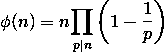
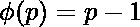
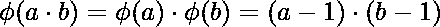
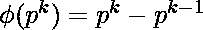
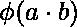
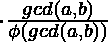
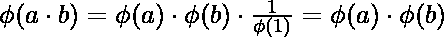
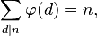

# 欧拉全能性函数

> 原文:[https://www.geeksforgeeks.org/eulers-totient-function/](https://www.geeksforgeeks.org/eulers-totient-function/)

输入 n 的欧拉全能函数φ(n)是{1，2，3，…，n}中与 n 相对素数的数的计数，即与 n 的 GCD(最大公约数)为 1 的数。

**示例:**

```
Φ(1) = 1  
gcd(1, 1) is 1

Φ(2) = 1
gcd(1, 2) is 1, but gcd(2, 2) is 2.

Φ(3) = 2
gcd(1, 3) is 1 and gcd(2, 3) is 1

Φ(4) = 2
gcd(1, 4) is 1 and gcd(3, 4) is 1

Φ(5) = 4
gcd(1, 5) is 1, gcd(2, 5) is 1, 
gcd(3, 5) is 1 and gcd(4, 5) is 1

Φ(6) = 2
gcd(1, 6) is 1 and gcd(5, 6) is 1, 
```

**如何计算一个输入 nφ的φ(n)**T2 A**简单的解决方法**就是迭代所有从 1 到 n-1 的数，用 n 为 1 的 gcd 计数。下面是计算输入整数 n 的欧拉全能函数的简单方法的实现。

## C++

```
// A simple C++ program to calculate
// Euler's Totient Function
#include <iostream>
using namespace std;

// Function to return gcd of a and b
int gcd(int a, int b)
{
    if (a == 0)
        return b;
    return gcd(b % a, a);
}

// A simple method to evaluate Euler Totient Function
int phi(unsigned int n)
{
    unsigned int result = 1;
    for (int i = 2; i < n; i++)
        if (gcd(i, n) == 1)
            result++;
    return result;
}

// Driver program to test above function
int main()
{
    int n;
    for (n = 1; n <= 10; n++)
        cout << "phi("<<n<<") = " << phi(n) << endl;
    return 0;
}

// This code is contributed by SHUBHAMSINGH10
```

## C

```
// A simple C program to calculate Euler's Totient Function
#include <stdio.h>

// Function to return gcd of a and b
int gcd(int a, int b)
{
    if (a == 0)
        return b;
    return gcd(b % a, a);
}

// A simple method to evaluate Euler Totient Function
int phi(unsigned int n)
{
    unsigned int result = 1;
    for (int i = 2; i < n; i++)
        if (gcd(i, n) == 1)
            result++;
    return result;
}

// Driver program to test above function
int main()
{
    int n;
    for (n = 1; n <= 10; n++)
        printf("phi(%d) = %d\n", n, phi(n));
    return 0;
}
```

## Java 语言(一种计算机语言，尤用于创建网站)

```
// A simple java program to calculate
// Euler's Totient Function
import java.io.*;

class GFG {

    // Function to return GCD of a and b
    static int gcd(int a, int b)
    {
        if (a == 0)
            return b;
        return gcd(b % a, a);
    }

    // A simple method to evaluate
    // Euler Totient Function
    static int phi(int n)
    {
        int result = 1;
        for (int i = 2; i < n; i++)
            if (gcd(i, n) == 1)
                result++;
        return result;
    }

    // Driver code
    public static void main(String[] args)
    {
        int n;

        for (n = 1; n <= 10; n++)
            System.out.println("phi(" + n + ") = " + phi(n));
    }
}

// This code is contributed by sunnusingh
```

## 蟒蛇 3

```
# A simple Python3 program
# to calculate Euler's
# Totient Function

# Function to return
# gcd of a and b
def gcd(a, b):

    if (a == 0):
        return b
    return gcd(b % a, a)

# A simple method to evaluate
# Euler Totient Function
def phi(n):

    result = 1
    for i in range(2, n):
        if (gcd(i, n) == 1):
            result+=1
    return result

# Driver Code
for n in range(1, 11):
    print("phi(",n,") = ",
           phi(n), sep = "")

# This code is contributed
# by Smitha
```

## C#

```
// A simple C# program to calculate
// Euler's Totient Function
using System;

class GFG {

    // Function to return GCD of a and b
    static int gcd(int a, int b)
    {
        if (a == 0)
            return b;
        return gcd(b % a, a);
    }

    // A simple method to evaluate
    // Euler Totient Function
    static int phi(int n)
    {
        int result = 1;
        for (int i = 2; i < n; i++)
            if (gcd(i, n) == 1)
                result++;
        return result;
    }

    // Driver code
    public static void Main()
    {
        for (int n = 1; n <= 10; n++)
        Console.WriteLine("phi(" + n + ") = " + phi(n));
    }
}

// This code is contributed by nitin mittal
```

## 服务器端编程语言（Professional Hypertext Preprocessor 的缩写）

```
<Φphp
// PHP program to calculate
// Euler's Totient Function

// Function to return
// gcd of a and b
function gcd($a, $b)
{
    if ($a == 0)
        return $b;
    return gcd($b % $a, $a);
}

// A simple method to evaluate
// Euler Totient Function
function phi($n)
{
    $result = 1;
    for ($i = 2; $i < $n; $i++)
        if (gcd($i, $n) == 1)
            $result++;
    return $result;
}

// Driver Code
for ($n = 1; $n <= 10; $n++)
    echo "phi(" .$n. ") =" . phi($n)."\n";

// This code is contributed by Sam007
Φ>
```

## java 描述语言

```
<script>
// Javascript program to calculate
// Euler's Totient Function

// Function to return
// gcd of a and b
function gcd(a, b)
{
    if (a == 0)
        return b;
    return gcd(b % a, a);
}

// A simple method to evaluate
// Euler Totient Function
function phi(n)
{
    let result = 1;
    for (let i = 2; i < n; i++)
        if (gcd(i, n) == 1)
            result++;
    return result;
}

// Driver Code
for (let n = 1; n <= 10; n++)
    document.write(`phi(${n}) = ${phi(n)} <br>`);

// This code is contributed by _saurabh_jaiswal

</script>
```

**输出:**

```
phi(1) = 1
phi(2) = 1
phi(3) = 2
phi(4) = 2
phi(5) = 4
phi(6) = 2
phi(7) = 6
phi(8) = 4 
phi(9) = 6
phi(10) = 4
```

上面的代码调用 gcd 函数 O(n)次。gcd 函数的时间复杂度是 O(h)，其中“h”是给定的两个数字中较小数字的位数。因此，上述解的时间复杂度的一个上界是 O(N Log N)[如何φ在从 1 到 N 的所有数字中最多可以有 Log <sub>10</sub> n 个数字]
下面是一个**更好的解**。这个想法是基于欧拉乘积公式，该公式指出全能函数的值低于 n 的乘积总质因数 p。



公式基本上说，对于 n 的所有质因数 p，φ(n)的值等于 n 乘以(1–1/p)的乘积，例如φ(6)= 6 *(1-1/2)*(1–1/3)= 2。
我们可以使用[这篇](https://www.geeksforgeeks.org/print-all-prime-factors-of-a-given-number/)帖子中使用的想法找到所有的质因数。

```
1) Initialize : result = n
2) Run a loop from 'p' = 2 to sqrt(n), do following for every 'p'.
     a) If p divides n, then 
           Set: result = result  * (1.0 - (1.0 / (float) p));
           Divide all occurrences of p in n.
3) Return result  
```

下面是欧拉乘积公式的实现。

## C++

```
// C++ program to calculate Euler's
// Totient Function using Euler's
// product formula
#include <bits/stdc++.h>
using namespace std;

int phi(int n)
{

    // Initialize result as n
    float result = n;

    // Consider all prime factors of n
    // and for every prime factor p,
    // multiply result with (1 - 1/p)
    for(int p = 2; p * p <= n; ++p)
    {

        // Check if p is a prime factor.
        if (n % p == 0)
        {

            // If yes, then update n and result
            while (n % p == 0)
                n /= p;

            result *= (1.0 - (1.0 / (float)p));
        }
    }

    // If n has a prime factor greater than sqrt(n)
    // (There can be at-most one such prime factor)
    if (n > 1)
        result *= (1.0 - (1.0 / (float)n));

    return (int)result;
}

// Driver code
int main()
{
    int n;

    for(n = 1; n <= 10; n++)
    {
        cout << "Phi" << "("
             << n << ")" << " = "
             << phi(n) <<endl;
    }
    return 0;
}

// This code is contributed by koulick_sadhu
```

## C

```
// C program to calculate Euler's Totient Function
// using Euler's product formula
#include <stdio.h>

int phi(int n)
{
    float result = n; // Initialize result as n

    // Consider all prime factors of n and for every prime
    // factor p, multiply result with (1 - 1/p)
    for (int p = 2; p * p <= n; ++p) {

        // Check if p is a prime factor.
        if (n % p == 0) {

            // If yes, then update n and result
            while (n % p == 0)
                n /= p;
            result *= (1.0 - (1.0 / (float)p));
        }
    }

    // If n has a prime factor greater than sqrt(n)
    // (There can be at-most one such prime factor)
    if (n > 1)
        result *= (1.0 - (1.0 / (float)n));

    return (int)result;
}

// Driver program to test above function
int main()
{
    int n;
    for (n = 1; n <= 10; n++)
        printf("phi(%d) = %d\n", n, phi(n));
    return 0;
}
```

## Java 语言(一种计算机语言，尤用于创建网站)

```
// Java program to calculate Euler's Totient
// Function using Euler's product formula
import java.io.*;

class GFG {
    static int phi(int n)
    {
        // Initialize result as n
        float result = n;

        // Consider all prime factors of n and for
        // every prime factor p, multiply result
        // with (1 - 1/p)
        for (int p = 2; p * p <= n; ++p) {
            // Check if p is a prime factor.
            if (n % p == 0) {
                // If yes, then update n and result
                while (n % p == 0)
                    n /= p;
                result *= (1.0 - (1.0 / (float)p));
            }
        }

        // If n has a prime factor greater than sqrt(n)
        // (There can be at-most one such prime factor)
        if (n > 1)
            result *= (1.0 - (1.0 / (float)n));

        return (int)result;
    }

    // Driver program to test above function
    public static void main(String args[])
    {
        int n;
        for (n = 1; n <= 10; n++)
            System.out.println("phi(" + n + ") = " + phi(n));
    }
}

// This code is contributed by Nikita Tiwari.
```

## 蟒蛇 3

```
# Python 3 program to calculate
# Euler's Totient Function
# using Euler's product formula

def phi(n) :

    result = n   # Initialize result as n

    # Consider all prime factors
    # of n and for every prime
    # factor p, multiply result with (1 - 1 / p)
    p = 2
    while p * p<= n :

        # Check if p is a prime factor.
        if n % p == 0 :

            # If yes, then update n and result
            while n % p == 0 :
                n = n // p
            result = result * (1.0 - (1.0 / float(p)))
        p = p + 1

    # If n has a prime factor
    # greater than sqrt(n)
    # (There can be at-most one
    # such prime factor)
    if n > 1 :
        result = result * (1.0 - (1.0 / float(n)))

    return int(result)

# Driver program to test above function
for n in range(1, 11) :
    print("phi(", n, ") = ", phi(n))

# This code is contributed
# by Nikita Tiwari.
```

## C#

```
// C# program to calculate Euler's Totient
// Function using Euler's product formula
using System;

class GFG {

    static int phi(int n)
    {

        // Initialize result as n
        float result = n;

        // Consider all prime factors
        // of n and for every prime
        // factor p, multiply result
        // with (1 - 1 / p)
        for (int p = 2; p * p <= n; ++p)
        {

            // Check if p is a prime factor.
            if (n % p == 0)
            {

                // If yes, then update
                // n and result
                while (n % p == 0)
                    n /= p;
                result *= (float)(1.0 - (1.0 / (float)p));
            }
        }

        // If n has a prime factor
        // greater than sqrt(n)
        // (There can be at-most
        // one such prime factor)
        if (n > 1)
            result *= (float)(1.0 - (1.0 / (float)n));

        return (int)result;
    }

    // Driver Code
    public static void Main()
    {
        int n;
        for (n = 1; n <= 10; n++)
            Console.WriteLine("phi(" + n + ") = " + phi(n));
    }
}

// This code is contributed by nitin mittal.
```

## 服务器端编程语言（Professional Hypertext Preprocessor 的缩写）

```
<Φphp
// PHP program to calculate
// Euler's Totient Function
// using Euler's product formula
function phi($n)
{
    // Initialize result as n
    $result = $n;

    // Consider all prime factors
    // of n and for every prime
    // factor p, multiply result
    // with (1 - 1/p)
    for ($p = 2; $p * $p <= $n; ++$p)
    {

        // Check if p is
        // a prime factor.
        if ($n % $p == 0)
        {

            // If yes, then update
            // n and result
            while ($n % $p == 0)
                $n /= $p;
            $result *= (1.0 - (1.0 / $p));
        }
    }

    // If n has a prime factor greater
    // than sqrt(n) (There can be at-most
    // one such prime factor)
    if ($n > 1)
        $result *= (1.0 - (1.0 / $n));

    return intval($result);
}

// Driver Code
for ($n = 1; $n <= 10; $n++)
echo "phi(" .$n. ") =" . phi($n)."\n";

// This code is contributed by Sam007
Φ>
```

## java 描述语言

```
// Javascript program to calculate
// Euler's Totient Function
// using Euler's product formula
function phi(n)
{
    // Initialize result as n
    let result = n;

    // Consider all prime factors
    // of n and for every prime
    // factor p, multiply result
    // with (1 - 1/p)
    for (let p = 2; p * p <= n; ++p)
    {

        // Check if p is
        // a prime factor.
        if (n % p == 0)
        {

            // If yes, then update
            // n and result
            while (n % p == 0)
                n /= p;
            result *= (1.0 - (1.0 / p));
        }
    }

    // If n has a prime factor greater
    // than sqrt(n) (There can be at-most
    // one such prime factor)
    if (n > 1)
        result *= (1.0 - (1.0 / n));

    return parseInt(result);
}

// Driver Code
for (let n = 1; n <= 10; n++)
 document.write(`phi(${n}) = ${phi(n)} <br>`);

// This code is contributed by _saurabh_jaiswal
```

**输出:**

```
phi(1) = 1
phi(2) = 1
phi(3) = 2
phi(4) = 2
phi(5) = 4
phi(6) = 2
phi(7) = 6
phi(8) = 4
phi(9) = 6
phi(10) = 4
```

我们可以在上面的方法中避免浮点计算。其思想是计算所有质因数及其倍数，并从 n 中减去这个计数，得到全能性函数值(质因数和质因数的倍数不会有 gcd 为 1)

```
1) Initialize result as n
2) Consider every number 'p' (where 'p' varies from 2 to Φn). 
   If p divides n, then do following
   a) Subtract all multiples of p from 1 to n [all multiples of p
      will have gcd more than 1 (at least p) with n]
   b) Update n by repeatedly dividing it by p.
3) If the reduced n is more than 1, then remove all multiples
   of n from result.
```

下面是上述算法的实现。

## C++

```
// C++ program to calculate Euler's
// Totient Function
#include <bits/stdc++.h>
using namespace std;

int phi(int n)
{
    // Initialize result as n
    int result = n;

    // Consider all prime factors of n
    // and subtract their multiples
    // from result
    for(int p = 2; p * p <= n; ++p)
    {

        // Check if p is a prime factor.
        if (n % p == 0)
        {

            // If yes, then update n and result
            while (n % p == 0)
                n /= p;

            result -= result / p;
        }
    }

    // If n has a prime factor greater than sqrt(n)
    // (There can be at-most one such prime factor)
    if (n > 1)
        result -= result / n;

    return result;
}

// Driver code
int main()
{
    int n;
    for(n = 1; n <= 10; n++)
    {
        cout << "Phi" << "("
             << n << ")" << " = "
             << phi(n) << endl;
    }
    return 0;
}

// This code is contributed by koulick_sadhu
```

## C

```
// C program to calculate Euler's Totient Function
#include <stdio.h>

int phi(int n)
{
    int result = n; // Initialize result as n

    // Consider all prime factors of n and subtract their
    // multiples from result
    for (int p = 2; p * p <= n; ++p) {

        // Check if p is a prime factor.
        if (n % p == 0) {

            // If yes, then update n and result
            while (n % p == 0)
                n /= p;
            result -= result / p;
        }
    }

    // If n has a prime factor greater than sqrt(n)
    // (There can be at-most one such prime factor)
    if (n > 1)
        result -= result / n;
    return result;
}

// Driver program to test above function
int main()
{
    int n;
    for (n = 1; n <= 10; n++)
        printf("phi(%d) = %d\n", n, phi(n));
    return 0;
}
```

## Java 语言(一种计算机语言，尤用于创建网站)

```
// Java program to calculate
// Euler's Totient Function
import java.io.*;

class GFG
{
static int phi(int n)
{
    // Initialize result as n
    int result = n;

    // Consider all prime factors
    // of n and subtract their
    // multiples from result
    for (int p = 2; p * p <= n; ++p)
    {

        // Check if p is
        // a prime factor.
        if (n % p == 0)
        {

            // If yes, then update
            // n and result
            while (n % p == 0)
                n /= p;
            result -= result / p;
        }
    }

    // If n has a prime factor
    // greater than sqrt(n)
    // (There can be at-most
    // one such prime factor)
    if (n > 1)
        result -= result / n;
    return result;
}

// Driver Code
public static void main (String[] args)
{
    int n;
    for (n = 1; n <= 10; n++)
        System.out.println("phi(" + n +
                           ") = " + phi(n));
}
}

// This code is contributed by ajit
```

## 蟒蛇 3

```
# Python3 program to calculate
# Euler's Totient Function
def phi(n):

    # Initialize result as n
    result = n;

    # Consider all prime factors
    # of n and subtract their
    # multiples from result
    p = 2;
    while(p * p <= n):

        # Check if p is a
        # prime factor.
        if (n % p == 0):

            # If yes, then
            # update n and result
            while (n % p == 0):
                n = int(n / p);
            result -= int(result / p);
        p += 1;

    # If n has a prime factor
    # greater than sqrt(n)
    # (There can be at-most
    # one such prime factor)
    if (n > 1):
        result -= int(result / n);
    return result;

# Driver Code
for n in range(1, 11):
    print("phi(",n,") =", phi(n));

# This code is contributed
# by mits
```

## C#

```
// C# program to calculate
// Euler's Totient Function
using System;

class GFG
{

static int phi(int n)
{
// Initialize result as n
int result = n;

// Consider all prime 
// factors of n and
// subtract their
// multiples from result
for (int p = 2;
         p * p <= n; ++p)
{

    // Check if p is
    // a prime factor.
    if (n % p == 0)
    {

        // If yes, then update
        // n and result
        while (n % p == 0)
            n /= p;
        result -= result / p;
    }
}

// If n has a prime factor
// greater than sqrt(n)
// (There can be at-most
// one such prime factor)
if (n > 1)
    result -= result / n;
return result;
}

// Driver Code
static public void Main ()
{
    int n;
    for (n = 1; n <= 10; n++)
        Console.WriteLine("phi(" + n +
                              ") = " +
                              phi(n));
}
}

// This code is contributed
// by akt_mit
```

## 服务器端编程语言（Professional Hypertext Preprocessor 的缩写）

```
<Φphp
// PHP program to calculate
// Euler's Totient Function

function phi($n)
{
    // Initialize
    // result as n
    $result = $n;

    // Consider all prime
    // factors of n and subtract
    // their multiples from result
    for ($p = 2;
         $p * $p <= $n; ++$p)
    {

        // Check if p is
        // a prime factor.
        if ($n % $p == 0)
        {

            // If yes, then
            // update n and result
            while ($n % $p == 0)
                $n = (int)$n / $p;
            $result -= (int)$result / $p;
        }
    }

    // If n has a prime factor
    // greater than sqrt(n)
    // (There can be at-most
    // one such prime factor)
    if ($n > 1)
        $result -= (int)$result / $n;
    return $result;
}

// Driver Code
for ($n = 1; $n <= 10; $n++)
    echo "phi(", $n,") =",
          phi($n), "\n";

// This code is contributed
// by ajit
Φ>
```

## java 描述语言

```
// Javascript program to calculate
// Euler's Totient Function

function phi(n)
{
    // Initialize
    // result as n
    let result = n;

    // Consider all prime
    // factors of n and subtract
    // their multiples from result
    for (let p = 2;
         p * p <= n; ++p)
    {

        // Check if p is
        // a prime factor.
        if (n % p == 0)
        {

            // If yes, then
            // update n and result
            while (n % p == 0)
                n = parseInt(n / p);
            result -= parseInt(result / p);
        }
    }

    // If n has a prime factor
    // greater than sqrt(n)
    // (There can be at-most
    // one such prime factor)
    if (n > 1)
        result -= parseInt(result / n);
    return result;
}

// Driver Code
for (let n = 1; n <= 10; n++)
    document.write(`phi(${n}) = ${phi(n)} <br>`);

// This code is contributed
// by _saurabh_jaiswal
```

**输出:**

```
phi(1) = 1
phi(2) = 1
phi(3) = 2
phi(4) = 2
phi(5) = 4
phi(6) = 2
phi(7) = 6
phi(8) = 4
phi(9) = 6
phi(10) = 4
```

让我们举个例子来理解上面的算法。

```
n = 10\. 
Initialize: result = 10

2 is a prime factor, so n = n/i = 5, result = 5
3 is not a prime factor.

The for loop stops after 3 as 4*4 is not less than or equal
to 10.

After for loop, result = 5, n = 5
Since n > 1, result = result - result/n = 4
```

## **欧拉全能函数的一些有趣性质**

**1)** 对于一个**素数 p** ，

**证明:**

```
 , where p is any prime number
We know that  where k is any random number and 

Total number from 1 to p = p 
Number for which  is , i.e the number p itself, so subtracting 1 from p 

```

**示例:**

**2)** 为**两个质数 a 和 b** ，用于 [RSA 算法](https://www.geeksforgeeks.org/rsa-algorithm-cryptography/)

**证明:**

```
, where a and b are prime numbers
 , 

Total number from 1 to ab = ab 
Total multiples of a from 1 to ab =  = 
Total multiples of b from 1 to ab =  = 
Example:
a = 5, b = 7, ab = 35
Multiples of a =  = 7 {5, 10, 15, 20, 25, 30, 35}
Multiples of b =  = 5 {7, 14, 21, 28, 35}

Can there be any double counting ?(watch above example carefully, try with other prime numbers also for more grasp)
Ofcourse, we have counted  twice in multiples of a and multiples of b so, 
Total multiples =  a + b - 1 (with which  with )

 , removing all number with  with  

```

**示例:**

**3)** 为**一个素数 p** ，

**证明:**

```
 , where p is a prime number

Total numbers from 1 to  
Total multiples of 
Removing these multiples as with them 

Example : 
p = 2, k = 5,  = 32
Multiples of 2 (as with them ) = 32 / 2 = 16 {2, 4, 6, 8, 10, 12, 14, 16, 18, 20, 22, 24, 26, 28, 30, 32}

```

**示例:**

**4)** 为**二号 a 和 b**T5

**特例:gcd(a，b) = 1**



**示例:**

```
Special Case : , 

Normal Case : , 

```

**5)**n 的所有除数的全函数值之和等于 n。



**示例:**

```
n = 6 
factors = {1, 2, 3, 6} 
n =  = 1 + 1 + 2 + 2 = 6

n = 8
factors = {1, 2, 4, 8}
n =  = 1 + 1 + 2 + 4 = 8

n = 10
factors = {1, 2, 5, 10}
n =  = 1 + 1 + 4 + 4 = 10
```

**6)** 最著名最重要的特征表现在 [***欧拉定理***](http://en.wikipedia.org/wiki/Euler%27s_theorem) :

```
The theorem states that if n and a are coprime
(or relatively prime) positive integers, then

aΦ(n) ≡ 1 (mod n) 
```

[RSA 密码系统](http://en.wikipedia.org/wiki/RSA_%28algorithm%29)就是基于这个定理:
在 m 是质数比如 p 的特殊情况下，欧拉定理变成了所谓的 [***费马小定理***](http://en.wikipedia.org/wiki/Fermat%27s_little_theorem) :

```
ap-1 ≡ 1 (mod p) 
```

**7)** [模 n 加法下有限循环群的生成元个数为φ(n)](https://www.geeksforgeeks.org/generators-finite-cyclic-group-addition/)。

**相关文章:**
[所有小于或等于 n 的数字的欧拉全能性函数](https://www.geeksforgeeks.org/eulers-totient-function-for-all-numbers-smaller-than-or-equal-to-n/)
[优化的欧拉全能性函数用于多重评估](https://www.geeksforgeeks.org/optimized-euler-totient-function-multiple-evaluations/)

**参考文献:**T2[http://e-maxx.ru/algo/euler_function](http://e-maxx.ru/algo/euler_function)T5[http://en.wikipedia.org/wiki/Euler%27s_totient_function](http://en.wikipedia.org/wiki/Euler%27s_totient_function)

[https://cp-algorithms.com/algebra/phi-function.html](https://cp-algorithms.com/algebra/phi-function.html)

[http://math center . Oxford . emory . edu/site/math 125/Chinese remaindertheorem/](http://mathcenter.oxford.emory.edu/site/math125/chineseRemainderTheorem/)
本文由 **Ankur** 供稿。如果您发现任何不正确的地方，请写评论，或者您想分享更多关于上面讨论的主题的信息