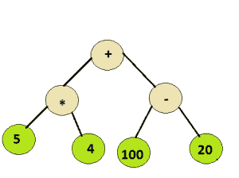
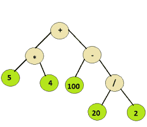

# 表达式树的评估

> 原文:[https://www . geesforgeks . org/evaluation-of-expression-tree/](https://www.geeksforgeeks.org/evaluation-of-expression-tree/)

给定一个简单的[表达式树](https://www.geeksforgeeks.org/expression-tree/)，由基本的二元运算符即+、–、*和/以及一些整数组成，计算表达式树。

**示例:**

```
Input :
Root node of the below tree
```



```
Output :
100
Input :
Root node of the below tree
```



```
Output :
110
```

由于树中的所有操作符都是二进制的，因此每个节点都有 0 或 2 个子节点。从上面的例子可以推断，整数值将出现在叶节点，而内部节点代表操作符。

为了评估语法树，可以遵循递归方法。

```
Algorithm :
Let t be the syntax tree
If  t is not null then
      If t.info is operand then  
         Return  t.info
      Else
         A = solve(t.left)
         B = solve(t.right)
         return A operator B
         where operator is the info contained in t
```

时间复杂度为 0(n)，因为每个节点被访问一次。下面是一个 C++程序:

## C++

```
// C++ program to evaluate an expression tree
#include <bits/stdc++.h>
using namespace std;

// Class to represent the nodes of syntax tree
class node
{
public:
    string info;
    node *left = NULL, *right = NULL;
    node(string x)
    {
        info = x;
    }
};

// Utility function to return the integer value
// of a given string
int toInt(string s)
{
    int num = 0;

    // Check if the integral value is
    // negative or not
    // If it is not negative, generate the number
    // normally
    if(s[0]!='-')
        for (int i=0; i<s.length(); i++)
            num = num*10 + (int(s[i])-48);
    // If it is negative, calculate the +ve number
    // first ignoring the sign and invert the
    // sign at the end
    else
        for (int i=1; i<s.length(); i++)
        {
            num = num*10 + (int(s[i])-48);
            num = num*-1;
        }

    return num;
}

// This function receives a node of the syntax tree
// and recursively evaluates it
int eval(node* root)
{
    // empty tree
    if (!root)
        return 0;

    // leaf node i.e, an integer
    if (!root->left && !root->right)
        return toInt(root->info);

    // Evaluate left subtree
    int l_val = eval(root->left);

    // Evaluate right subtree
    int r_val = eval(root->right);

    // Check which operator to apply
    if (root->info=="+")
        return l_val+r_val;

    if (root->info=="-")
        return l_val-r_val;

    if (root->info=="*")
        return l_val*r_val;

    return l_val/r_val;
}

//driver function to check the above program
int main()
{
    // create a syntax tree
    node *root = new node("+");
    root->left = new node("*");
    root->left->left = new node("5");
    root->left->right = new node("-4");
    root->right = new node("-");
    root->right->left = new node("100");
    root->right->right = new node("20");
    cout << eval(root) << endl;

    delete(root);

    root = new node("+");
    root->left = new node("*");
    root->left->left = new node("5");
    root->left->right = new node("4");
    root->right = new node("-");
    root->right->left = new node("100");
    root->right->right = new node("/");
    root->right->right->left = new node("20");
    root->right->right->right = new node("2");

    cout << eval(root);
    return 0;
}
```

## Java 语言(一种计算机语言，尤用于创建网站)

```
// Java program to evaluate expression tree
import java.lang.*;

class GFG{

Node root;

// Class to represent the nodes of syntax tree
public static class Node
{
    String data;
    Node left, right;

    Node(String d)
    {
        data = d;
        left = null;
        right = null;
    }
}

private static int toInt(String s)
{
    int num = 0;

    // Check if the integral value is
    // negative or not
    // If it is not negative, generate
    // the number normally
    if (s.charAt(0) != '-')
        for(int i = 0; i < s.length(); i++)
            num = num * 10 + ((int)s.charAt(i) - 48);

    // If it is negative, calculate the +ve number
    // first ignoring the sign and invert the
    // sign at the end
    else
        for(int i = 1; i < s.length(); i++)
        {
            num = num * 10 + ((int)(s.charAt(i)) - 48);
            num = num * -1;
        }
    return num;
}

// This function receives a node of the syntax
// tree and recursively evaluate it
public static int evalTree(Node root)
{

    // Empty tree
    if (root == null)
        return 0;

    // Leaf node i.e, an integer
    if (root.left == null && root.right == null)
        return toInt(root.data);

    // Evaluate left subtree
    int leftEval = evalTree(root.left);

    // Evaluate right subtree
    int rightEval = evalTree(root.right);

    // Check which operator to apply
    if (root.data.equals("+"))
        return leftEval + rightEval;

    if (root.data.equals("-"))
        return leftEval - rightEval;

    if (root.data.equals("*"))
        return leftEval * rightEval;

    return leftEval / rightEval;
}

// Driver code
public static void main(String[] args)
{

    // Creating a sample tree
    Node root = new Node("+");
    root.left = new Node("*");
    root.left.left = new Node("5");
    root.left.right = new Node("-4");
    root.right = new Node("-");
    root.right.left = new Node("100");
    root.right.right = new Node("20");
    System.out.println(evalTree(root));

    root = null;

    // Creating a sample tree
    root = new Node("+");
    root.left = new Node("*");
    root.left.left = new Node("5");
    root.left.right = new Node("4");
    root.right = new Node("-");
    root.right.left = new Node("100");
    root.right.right = new Node("/");
    root.right.right.left = new Node("20");
    root.right.right.right = new Node("2");
    System.out.println(evalTree(root));
}
}

// This code is contributed by Ankit Gupta
```

## 计算机编程语言

```
# Python program to evaluate expression tree

# Class to represent the nodes of syntax tree

class node:
    def __init__(self, value):
        self.left = None
        self.data = value
        self.right = None

# This function receives a node of the syntax tree
# and recursively evaluate it

def evaluateExpressionTree(root):

    # empty tree
    if root is None:
        return 0

    # leaf node
    if root.left is None and root.right is None:
        return int(root.data)

    # evaluate left tree
    left_sum = evaluateExpressionTree(root.left)

    # evaluate right tree
    right_sum = evaluateExpressionTree(root.right)

    # check which operation to apply
    if root.data == '+':
        return left_sum + right_sum

    elif root.data == '-':
        return left_sum - right_sum

    elif root.data == '*':
        return left_sum * right_sum

    else:
        return left_sum / right_sum

# Driver function to test above problem
if __name__ == '__main__':

    # creating a sample tree
    root = node('+')
    root.left = node('*')
    root.left.left = node('5')
    root.left.right = node('4')
    root.right = node('-')
    root.right.left = node('100')
    root.right.right = node('20')
    print evaluateExpressionTree(root)

    root = None

    # creating a sample tree
    root = node('+')
    root.left = node('*')
    root.left.left = node('5')
    root.left.right = node('4')
    root.right = node('-')
    root.right.left = node('100')
    root.right.right = node('/')
    root.right.right.left = node('20')
    root.right.right.right = node('2')
    print evaluateExpressionTree(root)

# This code is contributed by Harshit Sidhwa
```

## C#

```
// C# program to evaluate expression tree
using System;

public class GFG
{
    Node root;

    // Class to represent the nodes of syntax tree
    public class Node {
        public
 String data;
        public
 Node left, right;

        public Node(String d) {
            data = d;
            left = null;
            right = null;
        }
    }

    private static int toInt(String s) {
        int num = 0;

        // Check if the integral value is
        // negative or not
        // If it is not negative, generate
        // the number normally
        if (s[0] != '-')
            for (int i = 0; i < s.Length; i++)
                num = num * 10 + ((int) s[i] - 48);

        // If it is negative, calculate the +ve number
        // first ignoring the sign and invert the
        // sign at the end
        else
            for (int i = 1; i < s.Length; i++) {
                num = num * 10 + ((int) (s[i]) - 48);
                num = num * -1;
            }
        return num;
    }

    // This function receives a node of the syntax
    // tree and recursively evaluate it
    public static int evalTree(Node root) {

        // Empty tree
        if (root == null)
            return 0;

        // Leaf node i.e, an integer
        if (root.left == null && root.right == null)
            return toInt(root.data);

        // Evaluate left subtree
        int leftEval = evalTree(root.left);

        // Evaluate right subtree
        int rightEval = evalTree(root.right);

        // Check which operator to apply
        if (root.data.Equals("+"))
            return leftEval + rightEval;

        if (root.data.Equals("-"))
            return leftEval - rightEval;

        if (root.data.Equals("*"))
            return leftEval * rightEval;

        return leftEval / rightEval;
    }

    // Driver code
    public static void Main(String[] args) {

        // Creating a sample tree
        Node root = new Node("+");
        root.left = new Node("*");
        root.left.left = new Node("5");
        root.left.right = new Node("-4");
        root.right = new Node("-");
        root.right.left = new Node("100");
        root.right.right = new Node("20");
        Console.WriteLine(evalTree(root));

        root = null;

        // Creating a sample tree
        root = new Node("+");
        root.left = new Node("*");
        root.left.left = new Node("5");
        root.left.right = new Node("4");
        root.right = new Node("-");
        root.right.left = new Node("100");
        root.right.right = new Node("/");
        root.right.right.left = new Node("20");
        root.right.right.right = new Node("2");
        Console.WriteLine(evalTree(root));
    }
}

// This code is contributed by umadevi9616
```

## java 描述语言

```
<script>
// javascript program to evaluate expression tree
    var root;

    // Class to represent the nodes of syntax tree
     class Node {
        constructor(val) {
            this.data = val;
            this.left = null;
            this.right = null;
        }
    }

     function toInt( s) {
        var num = 0;
//res = res + String.fromCharCode('a'.charCodeAt(0) + count);

        // Check if the integral value is
        // negative or not
        // If it is not negative, generate
        // the number normally
        if (s.charAt(0) != '-')
            for (i = 0; i < s.length; i++)
                num = num * 10 + ( s.charCodeAt(i) - 48);

        // If it is negative, calculate the +ve number
        // first ignoring the sign and invert the
        // sign at the end
        else
            for (i = 1; i < s.length; i++) {
                num = num * 10 + ( s.charCodeAt(i) - 48);
                num = num * -1;
            }
        return num;
    }

    // This function receives a node of the syntax
    // tree and recursively evaluate it
    function evalTree(root) {

        // Empty tree
        if (root == null)
            return 0;

        // Leaf node i.e, an integer
        if (root.left == null && root.right == null)
            return toInt(root.data);

        // Evaluate left subtree
        var leftEval = evalTree(root.left);

        // Evaluate right subtree
        var rightEval = evalTree(root.right);

        // Check which operator to apply
        if (root.data === ("+"))
            return leftEval + rightEval;

        if (root.data === ("-"))
            return leftEval - rightEval;

        if (root.data === ("*"))
            return leftEval * rightEval;

        return leftEval / rightEval;
    }

    // Driver code

        // Creating a sample tree
var root = new Node("+");
        root.left = new Node("*");
        root.left.left = new Node("5");
        root.left.right = new Node("-4");
        root.right = new Node("-");
        root.right.left = new Node("100");
        root.right.right = new Node("20");
        document.write(evalTree(root));

        root = null;

        // Creating a sample tree
        root = new Node("+");
        root.left = new Node("*");
        root.left.left = new Node("5");
        root.left.right = new Node("4");
        root.right = new Node("-");
        root.right.left = new Node("100");
        root.right.right = new Node("/");
        root.right.right.left = new Node("20");
        root.right.right.right = new Node("2");
        document.write("<br/>"+evalTree(root));

// This code is contributed by gauravrajput1
</script>
```

**输出:**

```
60
110 
```

本文由 [**阿舒托什·库马尔**](https://www.linkedin.com/in/ashutosh-kumar-9527a7105?trk=nav_responsive_tab_profile) 供稿。如果你喜欢 GeeksforGeeks 并想投稿，你也可以使用[write.geeksforgeeks.org](http://www.write.geeksforgeeks.org)写一篇文章或者把你的文章邮寄到 review-team@geeksforgeeks.org。看到你的文章出现在极客博客主页上，帮助其他极客。
如果发现有不正确的地方，或者想分享更多关于上述话题的信息，请写评论。