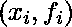
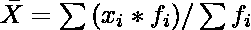

# 投资风险评估

> 原文:[https://www.geeksforgeeks.org/evaluation-risk-investments/](https://www.geeksforgeeks.org/evaluation-risk-investments/)

给定两个投资选项 A 和 B，我们必须找到两者中风险较小的投资。两个投资 A 和 B 各用一个数组表示。数组中的每个元素都是可能的投资结果。因此，数组中的每个元素都是一对两个值。第一个值是收到的钱的数量，第二个值是可以收到这笔钱的概率。例如，如果 A = [ (100，0.1)，(200，0.2) (300，0.7) ]，这意味着有 10 %的概率赚 100 卢比，20%的概率赚 200 卢比，70%的机会从投资 A 中赚 300 卢比

我们必须用统计学的方法来解决这个问题。对于每项投资，我们首先计算从中可以获得的平均金额。其次，我们还要计算赚到的钱的标准差。然后我们需要通过除以平均值来标准化这个标准偏差。

每个可能的结果都是一个观察。每笔钱的概率就是它的频率。由于观测值是以频率给出的，我们需要应用以下公式来计算平均值和标准偏差

如果表示观察组。
均值=
T5】标准差 T7

让我们举个例子来演示如何应用这个方法。

**示例:**

```
Input:  A = [(0,0.1), (100,0.1), (200,0.2), (333,0.3), (400,0.3) ]
        B = [ (100,0.1), (200,0.5), (700,0.4) ]

Explanation:
Mean Investment of A
Index | Outcome | Probability | Probability*Outcome
(i)       (xi)        (fi)        xi*fi
----------------------------------------------------------
1          0          0.1            0
2        100          0.1           10
3        200          0.2           40
4        333          0.3         99.9
5        400          0.3          120
----------------------------------------------------------
Total:                1.0        269.1
Mean = 269.1/1 = 269.1

Mean Investment of B:
Index | Outcome | Probability | Probability*Outcome
(i)       (xi)        (fi)        xi*fi
----------------------------------------------------------
1        100          0.1           10
2        200          0.5          100
3        700          0.4          280
----------------------------------------------------------
Total:                1.0          390
Mean = 390/1 = 390.1

Standard Deviation of A
Mean = 269.1
Index | Outcome | Probability | (xi-Mean)^2 | A*fi
(i)       (xi)        (fi)        (A)
----------------------------------------------------------
1          0          0.1         72414.81  7241.481 
2        100          0.1         28594.81  2859.481
3        200          0.2          4774.81   954.962
4        333          0.3          4083.21  1224.963
5        400          0.3         17134.81  5140.443
----------------------------------------------------------
Total:                1.0                   17421.33
Standard Deviation  = sqrt(17421.33/1) = 131.989
Normalized Standard Deviation = 131.989/269.1 = 0.49

Standard Deviation of B
Mean = 390.1
Index | Outcome | Probability | (xi-Mean)^2 | A*fi
(i)       (xi)        (fi)        (A)
----------------------------------------------------------
1        100          0.1         84158.01   8415.801
2        200          0.5         36138.01  18069.005
3        700          0.4         96100.00  38440.000
----------------------------------------------------------
Total:                1.0                   64924.801
Standard Deviation  = sqrt(64924.801/1) = 254.803
Normalized Standard Deviation: 254.803 / 390.1 = 0.65

Since Investment A has lesser normalized standard deviation,
it is less risky.

Input: A = [(0,0.1), (100,0.1), (200,0.2), (333,0.3), (400,0.3) ]
       B = [ (100,0.1), (200,0.5), (700,0.4) ]

Explanation: 
For Investment A
Average: 269.9
Standard Deviation: 131.987
Normalised Std: 0.489024
For Investment B
Average: 258.333
Standard Deviation: 44.8764
Normalised Std: 0.173715
Investment B is less risky
```

问题的实现如下

## C++

```
// C++ code for above approach
#include <iostream>
#include <vector>
#include <algorithm>
#include <cmath>
using namespace std;

// First Item in the pair is the
// value of observation (xi).
// Second Item in the pair is
// the frequency of xi (fi)
typedef pair<float,float> Data;

// Vector stores the observation
// in pairs of format (xi, fi),
// where xi = value of observation
typedef vector<Data> Vector;

// Function to calculate the
// summation of fi*xi
float sigma_fx(const Vector & v)
{
    float sum = 0;
    for ( auto i : v) {
        sum += i.first * i.second;
    }
    return sum;
}

// Function to calculate summation fi
float sigma_f(const Vector & v)
{
    float sum = 0.0;
    for ( auto i : v) {
        sum += i.second;
    }
    return sum;
}

// Function to calculate the mean
// of the set of observations v
float calculate_mean(const Vector & v)
{
    return sigma_fx(v) / sigma_f(v);
}

// Function to calculate the std
// deviation of set of observations v
float calculate_std(const Vector & v)
{
    // Get sum of frequencies
    float f = sigma_f(v);

    // Get the mean of the set
    // of observations
    float mean = sigma_fx(v) / f;

    float sum = 0;

    for (auto i: v) {
        sum += (i.first-mean)*
               (i.first-mean)*i.second;
    }

    return sqrt(sum/f);
}

// Driver Code
int main()
{

    Vector A = { {0,0.1}, {100,0.1},
               {200,0.2}, {333,0.3}, {400,0.3}};
    Vector B = { {100,0.1}, {200,0.5}, {700,0.4}};

    float avg_A = calculate_mean(A);
    float avg_B = calculate_mean(B);
    float std_A = calculate_std(A);
    float std_B = calculate_std(B);

    cout << "For Investment A" << endl;
    cout << "Average: " << avg_A << endl;
    cout << "Standard Deviation: " <<
                           std_A << endl;
    cout << "Normalised Std: " <<
                    std_A / avg_A << endl;
    cout << "For Investment B" << endl;
    cout << "Average: " << avg_B << endl;
    cout << "Standard Deviation: " <<
                            std_B << endl;
    cout << "Normalised Std: " << std_B /
                            avg_B << endl;

    (std_B/avg_B) < (std_A/avg_A) ? cout <<
            "Investment B is less risky\n":
            cout << "Investment A is less risky\n";

    return 0;
}
```

## Java 语言(一种计算机语言，尤用于创建网站)

```
// Java code for above approach
import java.util.*;

class GFG
{
    static class pair
    {
        float first, second;

        public pair(float first, float second)
        {
            this.first = first;
            this.second = second;
        }
    }

    // First Item in the pair is the
    // value of observation (xi).
    // Second Item in the pair is
    // the frequency of xi (fi)

    // Vector stores the observation
    // in pairs of format (xi, fi),
    // where xi = value of observation
    static Vector<pair> Vector;

    // Function to calculate the
    // summation of fi*xi
    static float sigma_fx(pair[] a)
    {
        float sum = 0;
        for (pair i : a)
        {
            sum += i.first * i.second;
        }
        return sum;
    }

    // Function to calculate summation fi
    static float sigma_f(pair[] a)
    {
        float sum = 0.0f;
        for (pair i : a)
        {
            sum += i.second;
        }
        return sum;
    }

    // Function to calculate the mean
    // of the set of observations v
    static float calculate_mean(pair[] a)
    {
        return sigma_fx(a) / sigma_f(a);
    }

    // Function to calculate the std
    // deviation of set of observations v
    static float calculate_std(pair[] a)
    {

        // Get sum of frequencies
        float f = sigma_f(a);

        // Get the mean of the set
        // of observations
        float mean = sigma_fx(a) / f;

        float sum = 0;

        for (pair i : a)
        {
            sum += (i.first - mean) *
                   (i.first - mean) * i.second;
        }
        return (float) Math.sqrt(sum / f);
    }

    // Driver Code
    public static void main(String[] args)
    {
        pair[] A = { new pair(0f, 0.1f),
                     new pair(100f, 0.1f),
                     new pair(200f, 0.2f),
                     new pair(333f, 0.3f),
                     new pair(400f, 0.3f) };
        pair[] B = { new pair(100f, 0.1f),
                     new pair(200f, 0.5f),
                     new pair(700f, 0.4f) };

        float avg_A = calculate_mean(A);
        float avg_B = calculate_mean(B);
        float std_A = calculate_std(A);
        float std_B = calculate_std(B);

        System.out.print("For Investment A" + "\n");
        System.out.print("Average: " + avg_A + "\n");
        System.out.print("Standard Deviation: " +
                                   std_A + "\n");
        System.out.print("Normalised Std: " +
                       std_A / avg_A + "\n");
        System.out.print("For Investment B" + "\n");
        System.out.print("Average: " + avg_B + "\n");
        System.out.print("Standard Deviation: " +
                                   std_B + "\n");
        System.out.print("Normalised Std: " +
                       std_B / avg_B + "\n");

        if ((std_B / avg_B) < (std_A / avg_A))
            System.out.print("Investment B is less risky\n");
        else
            System.out.print("Investment A is less risky\n");
    }
}

// This code is contributed by PrinciRaj1992
```

## C#

```
// C# code for above approach
using System;
using System.Collections.Generic;

class GFG
{
    class pair
    {
        public float first, second;

        public pair(float first,
                    float second)
        {
            this.first = first;
            this.second = second;
        }
    }

    // First Item in the pair is the
    // value of observation (xi).
    // Second Item in the pair is
    // the frequency of xi (fi)

    // List stores the observation
    // in pairs of format (xi, fi),
    // where xi = value of observation
    static List<pair> List;

    // Function to calculate the
    // summation of fi*xi
    static float sigma_fx(pair[] a)
    {
        float sum = 0;
        foreach (pair i in a)
        {
            sum += i.first * i.second;
        }
        return sum;
    }

    // Function to calculate summation fi
    static float sigma_f(pair[] a)
    {
        float sum = 0.0f;
        foreach (pair i in a)
        {
            sum += i.second;
        }
        return sum;
    }

    // Function to calculate the mean
    // of the set of observations v
    static float calculate_mean(pair[] a)
    {
        return sigma_fx(a) / sigma_f(a);
    }

    // Function to calculate the std
    // deviation of set of observations v
    static float calculate_std(pair[] a)
    {

        // Get sum of frequencies
        float f = sigma_f(a);

        // Get the mean of the set
        // of observations
        float mean = sigma_fx(a) / f;

        float sum = 0;

        foreach (pair i in a)
        {
            sum += (i.first - mean) *
                   (i.first - mean) * i.second;
        }
        return (float) Math.Sqrt(sum / f);
    }

    // Driver Code
    public static void Main(String[] args)
    {
        pair[] A = {new pair(0f, 0.1f),
                    new pair(100f, 0.1f),
                    new pair(200f, 0.2f),
                    new pair(333f, 0.3f),
                    new pair(400f, 0.3f)};
        pair[] B = {new pair(100f, 0.1f),
                    new pair(200f, 0.5f),
                    new pair(700f, 0.4f)};

        float avg_A = calculate_mean(A);
        float avg_B = calculate_mean(B);
        float std_A = calculate_std(A);
        float std_B = calculate_std(B);

        Console.Write("For Investment A" + "\n");
        Console.Write("Average: " + avg_A + "\n");
        Console.Write("Standard Deviation: " +
                                std_A + "\n");
        Console.Write("Normalised Std: " +
                    std_A / avg_A + "\n");
        Console.Write("For Investment B" + "\n");
        Console.Write("Average: " + avg_B + "\n");
        Console.Write("Standard Deviation: " +
                                std_B + "\n");
        Console.Write("Normalised Std: " +
                    std_B / avg_B + "\n");

        if ((std_B / avg_B) < (std_A / avg_A))
            Console.Write("Investment B is less risky\n");
        else
            Console.Write("Investment A is less risky\n");
    }
}

// This code is contributed by Rajput-Ji
```

**输出:**

```
For Investment A
Average: 269.9
Standard Deviation: 131.987
Normalised Std:  0.489024
For Investment B
Average: 390
Standard Deviation: 254.755
Normalised Std:  0.653217
Investment A is less risky
```

**参考文献:**
[https://www . stat can . GC . ca/edu/power-pouvoir/ch12/5214891-eng . htm](https://www.statcan.gc.ca/edu/power-pouvoir/ch12/5214891-eng.htm)
[STD::累加 cppreference.com](https://www.google.co.in/url?sa=t&rct=j&q=&esrc=s&source=web&cd=1&cad=rja&uact=8&ved=0ahUKEwjNwLDIqq_YAhUbSo8KHRaBBT8QFggoMAA&url=http%3A%2F%2Fen.cppreference.com%2Fw%2Fcpp%2Falgorithm%2Faccumulate&usg=AOvVaw0pBMEYFzJQ8lf7K9SDn5aF)