# 精确覆盖问题和算法 X |集合 1

> 原文:[https://www . geesforgeks . org/exact-cover-problem-algorithm-x-set-1/](https://www.geeksforgeeks.org/exact-cover-problem-algorithm-x-set-1/)

如果你曾经试图创建一个解决数独问题的程序，你可能会遇到 T2 精确覆盖问题。在本文中，我们将讨论什么是精确覆盖问题，以及由唐纳德·克努特提出的一个算法**“算法 X”**来解决这个问题。

给定集合 **X** 的子集的集合 **S** ，精确覆盖是 S 的子集 **S*** ，使得 X 的每个元素都恰好包含在 S*的一个子集中。它应满足以下两个条件–

*   S*中任意两个子集的交集应该为空。也就是说，X 的每个元素最多应该包含在 S*的一个子集内
*   S*中所有子集的并集是 x，这意味着并集应该包含集合 x 中的所有元素，所以我们可以说 S*覆盖了 x。

示例(标准表示)–
让 S = { A，B，C，D，E，F }和 X = {1，2，3，4，5，6，7}这样–

*   A = {1，4，7}
*   B = {1，4}
*   C = {4，5，7}
*   D = {3，5，6}
*   E = {2，3，6，7}
*   F = {2，7}

那么 S* = {B，D，F}就是一个精确的覆盖，因为 X 中的每个元素在子集{B，D，F}中恰好包含一次。如果我们联合子集，那么我们将得到 X–
[Tex]B \ big cup D \ big cup F = \ { 1，2，3，4，5，6，7\}[\Tex]的所有元素

精确覆盖问题是确定精确覆盖是否存在的决策问题。被认为是 [NP-Complete](https://www.geeksforgeeks.org/np-completeness-set-1/) 问题。

该问题可以用矩阵的形式表示，其中行表示 S 的子集，列表示 x 的元素。上述问题可以表示为–

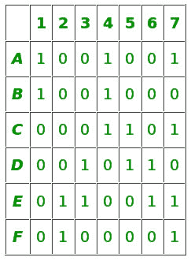

问题矩阵

在矩阵表示的上下文中，我们的精确覆盖是行的选择，使得每一列在所选行中只包含单个 1。因此我们可以在下面看到，每一列在所选行 B、D、f 中只有单个 1

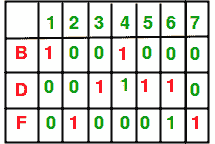

精确覆盖

**算法 X**

唐纳德·克努特提出了一种**算法 X** ，可以找到精确覆盖问题的所有解。通过唐纳德·克努特提出的名为 **DLX** 的**“跳舞环节”**技术，可以高效地实现算法 X。

算法 X 是递归、深度优先、回溯算法。它本质上是不确定的，这意味着对于相同的输入，它可以在不同的运行中表现出不同的行为。
以下是算法 X 的伪代码–

```

1\. If the matrix A has no columns, the current partial solution
   is a valid solution; terminate successfully. 
2\. Otherwise, choose a column c (deterministically). 
3\. Choose a row r such that A[r] = 1 (nondeterministically). 
4\. Include row r in the partial solution. 
5\. For each column j such that A[r][j] = 1,
        for each row i such that A[i][j] = 1, 
            delete row i from matrix A. 
      delete column j from matrix A. 
6\. Repeat this algorithm recursively on the reduced matrix A. 

```

r 均值的非确定性选择，算法将自身复制到子算法中。每个子算法继承原始矩阵 A，但相对于所选的 r 减少它(我们将在示例中很快看到这一点)

子算法以原问题为根形成一个搜索树，每一级 k 都有子算法对应上一级选择的行(就像 [n-queen](https://www.geeksforgeeks.org/backtracking-set-3-n-queen-problem/) 搜索空间一样)。

如果选择的列 c 完全为零，则没有子算法，并且该过程不成功地终止。Knuth 建议我们应该选择最小 1 个数的列。**如果没有剩余的列，那么我们知道我们已经找到了解决方案。**

**示例**
考虑上面的示例，我们将对其应用算法 X 来找到确切的覆盖–

**级别–0**
步骤-1:我们的矩阵不是空的，它有列，然后继续
步骤-2:第一列中最小的 1 是 C-1，所以我们将选择它
步骤-3:行 A 和 B 在 C-1 有 1，所以它们被选择。
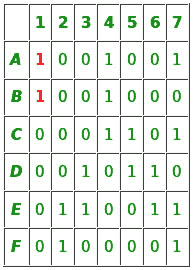
所以现在算法移动到第一级分支

**Level–1(选择行 A)**
Step-4:选择行 A 并将其添加到部分解决方案中
Step-5:行 A 在第 1、4、7 列中有 1
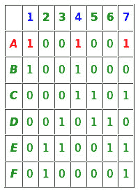
C-1 在 A、B 和 C 行中有 1，C-4 在 A、B 和 C 行中有 1，C-7 在 A、C、E 和 F 行中有 1。
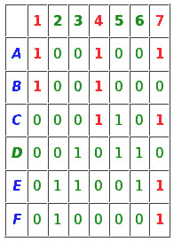
因此应删除第 1、4、7 列和行 A、B、C、E 和 F。
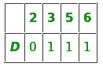
步骤 1–矩阵不为空，因此继续进行
步骤 2–第一个最小 1 的列是 C-2
由于 C-2 列中没有 1，我们的搜索将在此处失败终止。
现在，我们的算法将在 0 级回溯，并在 1 级的第二个分支继续处理 B 行

**Level–1(选择行 B)**
Step–4:选择行 B 并将其添加到部分解决方案中
Step–5:行 B 在列 C-1 和 C-4 中有 1
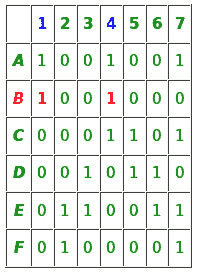
C-1 在行 A 和 B 中有 1。C-4 在行 A、B 和 C 中有 1。
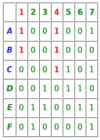
因此 C-1、C-2 和行 A、B、C 将从矩阵中删除。
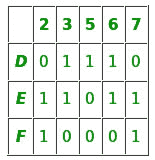
现在我们重复算法–
步骤-1:矩阵不为空，继续进行
步骤-2: C-5 中有最小数量的 1，所以选择它。
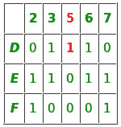
步骤 3:行 D 在 C-5 有 1，所以选择
现在算法移动到第 2 层的第 1 个分支，矩阵有行 D、E 和 F

**级别-2(选择 D 行)**
步骤-4:选择 D 行并添加到部分解。
Step-5: C-3、C-5、C-6 在 D 排有 1
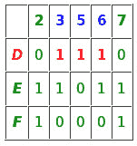
在 C-3 排 D 和 E 有 1，在 C-5 排 D 有 1，在 C-6 排 D、E 有 1。
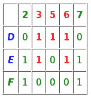
所以这些行和列应该被删除，我们只剩下一个只有行 F 和列 2，7 的矩阵。
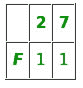
现在我们将重复算法–
步骤 1:矩阵不为空，因此继续进行
步骤 2:如果第一列中有 1，则 C-2 是第一个具有最小数字的列。所以选择
步骤 3:行 F 在 C-2 有 1，所以选择它。
现在算法将移动到第三级的第一个分支。

**Level–3(选择行 F)**
Step-4:将行 F 添加到部分解
Step-5: C-2 和 C-7 在行 F 处有 1 .
T5
C-2 在行 F 处有 1，C-7 在行 F 处有 1
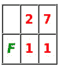T9】所以 C2、C7 和行 F 应该被删除。删除后，我们将留下一个空矩阵，这样我们的搜索就可以成功地在这里结束，我们有我们的确切封面{B，D，F}

子算法在第 2 级回溯，因为在第 3 级没有剩余行。
在 1 级进一步回溯。因为在级别 1，我们的算法没有剩余的行被终止。

在下一篇文章中，我们将讨论如何有效地实现 DLX 来解决精确覆盖。

**参考文献**

*   [https://en . Wikipedia . org/wiki/exact _ cover](https://en.wikipedia.org/wiki/Exact_cover)
*   [https://en.wikipedia.org/wiki/Knuth%27s_Algorithm_X](https://en.wikipedia.org/wiki/Knuth%27s_Algorithm_X)

本文由 [**阿图尔·库马尔**](https://www.linkedin.com/in/atul-kumar-733b32136/) 供稿。如果你喜欢 GeeksforGeeks 并想投稿，你也可以使用[contribute.geeksforgeeks.org](http://www.contribute.geeksforgeeks.org)写一篇文章或者把你的文章邮寄到 contribute@geeksforgeeks.org。看到你的文章出现在极客博客主页上，帮助其他极客。

如果你发现任何不正确的地方，或者你想分享更多关于上面讨论的话题的信息，请写评论。