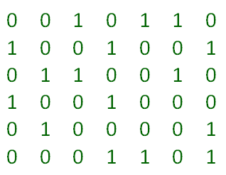
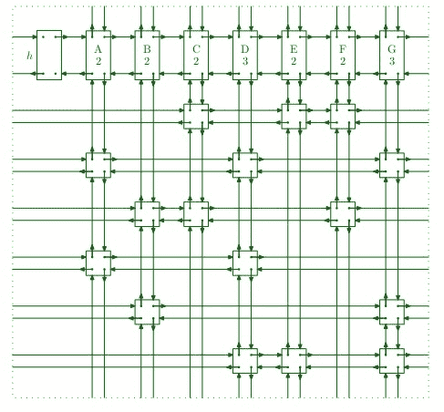
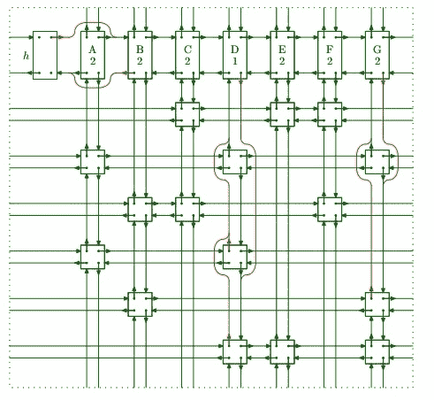

# 精确覆盖问题和算法 X |集合 2(用 DLX 实现)

> 原文:[https://www . geesforgeks . org/exact-cover-problem-algorithm-x-set-2-implementation-dlx/](https://www.geeksforgeeks.org/exact-cover-problem-algorithm-x-set-2-implementation-dlx/)

在文章[精确覆盖问题和算法 X |集合 1](https://www.geeksforgeeks.org/exact-cover-problem-algorithm-x-set-1/) 中，我们讨论了精确覆盖问题和解决精确覆盖问题的算法 X。在本文中，我们将讨论唐纳德·e·克努特博士在其论文“[舞蹈链接](https://arxiv.org/pdf/cs/0011047.pdf)中提出的使用舞蹈链接技术(DLX)的算法 X 的实现细节

**舞蹈链接技术**

跳舞链接技术依赖于[双循环链表](https://www.geeksforgeeks.org/doubly-circular-linked-list-set-1-introduction-and-insertion/)的思想。如前一篇[文章](https://www.geeksforgeeks.org/exact-cover-problem-algorithm-x-set-1/)所述，我们将精确覆盖问题转化为 0 和 1 的矩阵形式。**这里矩阵中的每个“1”由链表**的一个节点表示，整个矩阵被转化为一个 4 路连通节点的网格。每个节点包含以下字段–

*   指向左侧节点的指针
*   指向右边节点的指针
*   指向上面节点的指针
*   指向其下节点的指针
*   指向其所属列表头节点的指针

因此，矩阵的每一行是用左右指针相互链接的循环链表，矩阵的每一列也是用上下指针相互链接的循环链表。每个列列表还包括一个称为“列表头节点”的特殊节点。这个头节点就像简单的节点，但是几乎没有额外的字段–

*   列 id
*   当前列中的节点数

我们可以有两种不同的节点，但是在我们的实现中，为了方便起见，我们将只创建一种具有所有字段的节点，并添加一个“行 id”字段，该字段将告诉我们该节点属于哪一行。
所以对于矩阵–

4 向链接矩阵将如下所示–



四向链接矩阵

所以搜索算法(算法 X)的伪代码将是–

```
f( h.right == h ) { 
     printSolutions(); 
     return; 
} 
else { 
     ColumnNode column = getMinColumn(); 
     cover(column); 

     for( Node row = column.down ; rowNode != column ;
        rowNode = rowNode.down ) { 
            solutions.add( rowNode ); 

            for( Node rightNode = row.right ; rightNode != row ;
                 rightNode = rightNode.right ) 
                    cover( rightNode ); 

     Search( k+1); 
     solutions.remove( rowNode ); 
     column = rowNode.column; 

     for( Node leftNode = rowNode.left ; leftNode != row ;
              leftNode = leftNode.left )                                                                             
            uncover( leftNode ); 
     } 
     uncover( column ); 
} 

```

**覆盖节点**

正如算法中所讨论的，我们必须移除列以及该列的节点所属的所有行。这个过程在这里被称为节点覆盖。
要删除一列，我们可以简单地取消该列标题与相邻标题的链接。这样就无法访问此列。这个过程类似于从双向链表中移除节点，假设我们想要移除节点 x，那么–

```
x.left.right = x.right
x.right.left = x.left

```

类似地，要删除一行，我们必须取消该行所有节点与其上下行节点的链接。

```
x.up.down = x.down
x.down.up = x.up

```

因此**覆盖(节点)**的伪码变成–

```
Node column = dataNode.column; 

column.right.left = column.left; 
column.left.right = column.right; 

for( Node row = column.down ; row != column ; row = row.down ) 
    for( Node rightNode = row.right ; rightNode != row ; 
         rightNode = rightNode.right ) { 
         rightNode.up.down = rightNode.down; 
         rightNode.down.up = rightNode.up; 
    } 
} 

```

比如覆盖 A 列后，矩阵会是这样的–



覆盖

Here we first remove the column from other columns then we move down to each column node and remove row by traversing right, so row 2 and 4 is removed.

**揭开节点**

假设算法到达了一个死胡同，在这种情况下没有解决方案是可能的，算法必须回溯。因为我们在回溯时删除了列和行，所以我们再次链接了那些被删除的行和列。这就是我们所说的揭露。请注意，移除的节点仍然有指向其邻居的指针，因此我们可以使用这些指针再次将它们链接回来。
为了揭开柱子，我们将执行覆盖操作，但顺序相反–

```
x.left.right = x
x.right.left = x

```

类似地，为了发现任何行节点 x–

```
x.up.down = x
x.down.up = x

```

因此**揭开(节点)**的伪代码将变成–

```
Node column = dataNode.column; 

for( Node row = column.up ; row != column ; row = row.up ) 
    for( Node leftNode = row.left ; leftNode != row ;
         leftNode = leftNode.right ) { 
         leftNode.up.down = leftNode; 
         leftNode.down.up = leftNode; 
     } 
column.right.left = column; 
column.left.right = column; 
} 

```

以下是跳舞环节技术的实施–

```
// C++ program for solving exact cover problem
// using DLX (Dancing Links) technique

#include <bits/stdc++.h>

#define MAX_ROW 100
#define MAX_COL 100

using namespace std;

struct Node
{
public:
    struct Node *left;
    struct Node *right;
    struct Node *up;
    struct Node *down;
    struct Node *column;
    int rowID;
    int colID;
    int nodeCount;
};

// Header node, contains pointer to the
// list header node of first column
struct Node *header = new Node();

// Matrix to contain nodes of linked mesh
struct Node Matrix[MAX_ROW][MAX_COL];

// Problem Matrix
bool ProbMat[MAX_ROW][MAX_COL];

// vector containing solutions
vector <struct Node*> solutions;

// Number of rows and columns in problem matrix 
int nRow = 0,nCol = 0;

// Functions to get next index in any direction
// for given index (circular in nature) 
int getRight(int i){return (i+1) % nCol; }
int getLeft(int i){return (i-1 < 0) ? nCol-1 : i-1 ; }
int getUp(int i){return (i-1 < 0) ? nRow : i-1 ; }  
int getDown(int i){return (i+1) % (nRow+1); }

// Create 4 way linked matrix of nodes
// called Toroidal due to resemblance to
// toroid
Node *createToridolMatrix()
{
    // One extra row for list header nodes
    // for each column
    for(int i = 0; i <= nRow; i++)
    {
        for(int j = 0; j < nCol; j++)
        {
            // If it's 1 in the problem matrix then 
            // only create a node 
            if(ProbMat[i][j])
            {
                int a, b;

                // If it's 1, other than 1 in 0th row
                // then count it as node of column 
                // and increment node count in column header
                if(i) Matrix[0][j].nodeCount += 1;

                // Add pointer to column header for this 
                // column node
                Matrix[i][j].column = &Matrix[0][j];

                // set row and column id of this node
                Matrix[i][j].rowID = i;
                Matrix[i][j].colID = j;

                // Link the node with neighbors

                // Left pointer
                a = i; b = j;
                do{ b = getLeft(b); } while(!ProbMat[a][b] && b != j);
                Matrix[i][j].left = &Matrix[i][b];

                // Right pointer
                a = i; b = j;
                do { b = getRight(b); } while(!ProbMat[a][b] && b != j);
                Matrix[i][j].right = &Matrix[i][b];

                // Up pointer
                a = i; b = j;
                do { a = getUp(a); } while(!ProbMat[a][b] && a != i);
                Matrix[i][j].up = &Matrix[a][j];

                // Down pointer
                a = i; b = j;
                do { a = getDown(a); } while(!ProbMat[a][b] && a != i);
                Matrix[i][j].down = &Matrix[a][j];
            }
        }
    }

    // link header right pointer to column 
    // header of first column 
    header->right = &Matrix[0][0];

    // link header left pointer to column 
    // header of last column 
    header->left = &Matrix[0][nCol-1];

    Matrix[0][0].left = header;
    Matrix[0][nCol-1].right = header;
    return header;
}

// Cover the given node completely
void cover(struct Node *targetNode)
{
    struct Node *row, *rightNode;

    // get the pointer to the header of column
    // to which this node belong 
    struct Node *colNode = targetNode->column;

    // unlink column header from it's neighbors
    colNode->left->right = colNode->right;
    colNode->right->left = colNode->left;

    // Move down the column and remove each row
    // by traversing right
    for(row = colNode->down; row != colNode; row = row->down)
    {
        for(rightNode = row->right; rightNode != row;
            rightNode = rightNode->right)
        {
            rightNode->up->down = rightNode->down;
            rightNode->down->up = rightNode->up;

            // after unlinking row node, decrement the
            // node count in column header
            Matrix[0][rightNode->colID].nodeCount -= 1;
        }
    }
}

// Uncover the given node completely
void uncover(struct Node *targetNode)
{
    struct Node *rowNode, *leftNode;

    // get the pointer to the header of column
    // to which this node belong 
    struct Node *colNode = targetNode->column;

    // Move down the column and link back
    // each row by traversing left
    for(rowNode = colNode->up; rowNode != colNode; rowNode = rowNode->up)
    {
        for(leftNode = rowNode->left; leftNode != rowNode;
            leftNode = leftNode->left)
        {
            leftNode->up->down = leftNode;
            leftNode->down->up = leftNode;

            // after linking row node, increment the
            // node count in column header
            Matrix[0][leftNode->colID].nodeCount += 1;
        }
    }

    // link the column header from it's neighbors
    colNode->left->right = colNode;
    colNode->right->left = colNode;
}

// Traverse column headers right and 
// return the column having minimum 
// node count
Node *getMinColumn()
{
    struct Node *h = header;
    struct Node *min_col = h->right;
    h = h->right->right;
    do
    {
        if(h->nodeCount < min_col->nodeCount)
        {
            min_col = h;
        }
        h = h->right;
    }while(h != header);

    return min_col;
}

void printSolutions()
{
    cout<<"Printing Solutions: ";
    vector<struct Node*>::iterator i;

    for(i = solutions.begin(); i!=solutions.end(); i++)
        cout<<(*i)->rowID<<" ";
    cout<<"\n";
}

// Search for exact covers
void search(int k)
{
    struct Node *rowNode;
    struct Node *rightNode;
    struct Node *leftNode;
    struct Node *column;

    // if no column left, then we must
    // have found the solution
    if(header->right == header)
    {
        printSolutions();
        return;
    }

    // choose column deterministically
    column = getMinColumn();

    // cover chosen column
    cover(column);

    for(rowNode = column->down; rowNode != column; 
        rowNode = rowNode->down )
    {
        solutions.push_back(rowNode);

        for(rightNode = rowNode->right; rightNode != rowNode;
            rightNode = rightNode->right)
            cover(rightNode);

        // move to level k+1 (recursively)
        search(k+1);

        // if solution in not possible, backtrack (uncover)
        // and remove the selected row (set) from solution
        solutions.pop_back();

        column = rowNode->column;
        for(leftNode = rowNode->left; leftNode != rowNode;
            leftNode = leftNode->left)
            uncover(leftNode);
    }

    uncover(column);
}

// Driver code
int main()
{    
    /*
     Example problem

     X = {1,2,3,4,5,6,7}
     set-1 = {1,4,7}
     set-2 = {1,4}
     set-3 = {4,5,7}
     set-4 = {3,5,6}
     set-5 = {2,3,6,7}
     set-6 = {2,7}
     set-7 = {1,4}

     Solutions : {6 ,4, 2} and {6, 4, 7}
    */

    nRow = 7;
    nCol = 7;

    // initialize the problem matrix 
    // ( matrix of 0 and 1) with 0
    for(int i=0; i<=nRow; i++)
    {
        for(int j=0; j<nCol; j++)
        {
            // if it's row 0, it consist of column
            // headers. Initialize it with 1
            if(i == 0) ProbMat[i][j] = true;
            else ProbMat[i][j] = false;
        }
    }

    // Manually filling up 1's 
    ProbMat[1][0] = true; ProbMat[1][3] = true;
    ProbMat[1][6] = true; ProbMat[2][0] = true;
    ProbMat[2][3] = true; ProbMat[3][3] = true;
    ProbMat[3][4] = true; ProbMat[3][6] = true;
    ProbMat[4][2] = true; ProbMat[4][4] = true;
    ProbMat[4][5] = true; ProbMat[5][1] = true;
    ProbMat[5][2] = true; ProbMat[5][5] = true;
    ProbMat[5][6] = true; ProbMat[6][1] = true;
    ProbMat[6][6] = true; ProbMat[7][0] = true;
    ProbMat[7][3] = true;

    // create 4-way linked matrix
    createToridolMatrix();

    search(0);
    return 0;
}
```

输出:

```
Printing Solutions: 6 4 2 
Printing Solutions: 6 4 7

```

**参考文献**

*   [https://www . ocf . Berkeley . edu/% 7Ejchu/public portal/sudoku/sudoku . paper . html](https://www.ocf.berkeley.edu/%7Ejchu/publicportal/sudoku/sudoku.paper.html)
*   [唐纳德·克努特的舞蹈链接](https://arxiv.org/pdf/cs/0011047.pdf)

本文由 **[阿图尔·库马尔](https://www.linkedin.com/in/atul-kumar-733b32136/)** 供稿。如果你喜欢 GeeksforGeeks 并想投稿，你也可以使用[contribute.geeksforgeeks.org](http://www.contribute.geeksforgeeks.org)写一篇文章或者把你的文章邮寄到 contribute@geeksforgeeks.org。看到你的文章出现在极客博客主页上，帮助其他极客。

如果你发现任何不正确的地方，或者你想分享更多关于上面讨论的话题的信息，请写评论。