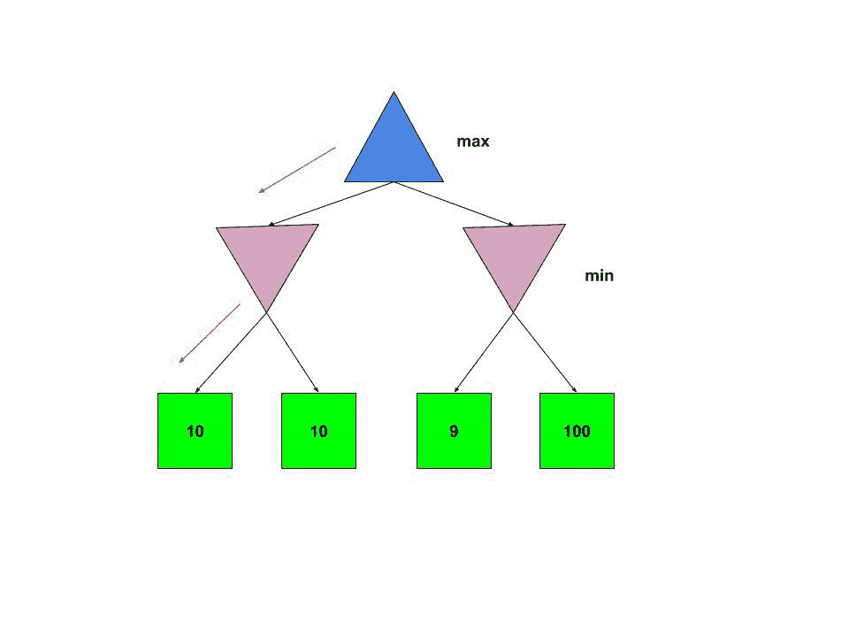
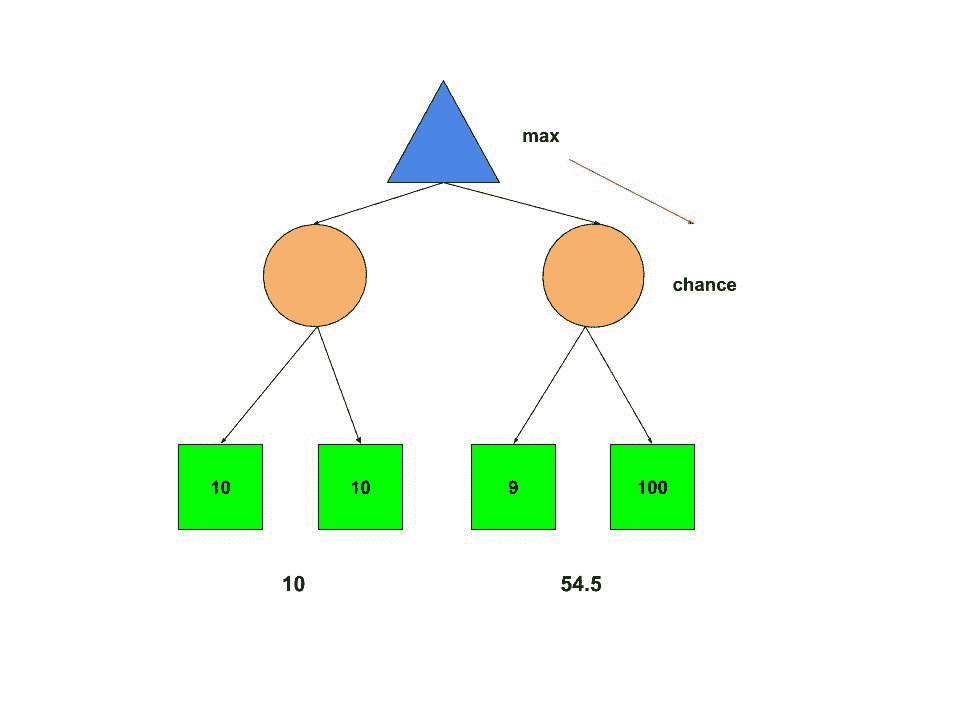

# 博弈论中的期望最大算法

> 原文:[https://www . geesforgeks . org/expectimax-博弈论中的算法/](https://www.geeksforgeeks.org/expectimax-algorithm-in-game-theory/)

**Expectimax 搜索算法**是一种用于最大化期望效用的博弈论算法。它是[极小极大算法](https://www.geeksforgeeks.org/minimax-algorithm-in-game-theory-set-1-introduction/)的变体。虽然极小极大假设对手(极小者)玩得最好，但期望极大却没有。这对于模拟对手代理不是最优的，或者他们的行为是基于机会的环境是有用的。
**<u>Expectimax vs Minimax</u>**
考虑下面的 Minimax 树:



正如我们所知，对手代理(minimizer)玩得最好，向左走是有意义的。但是，如果极小化者有可能犯错误(或者没有发挥出最佳状态)呢？因此，走对了可能听起来更有吸引力，或者可能导致更好的解决方案。
在下面的 Expectimax 树中，我们用机会节点替换了极小节点。



**机会节点**取所有可用效用的平均值，给出“预期效用”。因此，左右子树的预期效用是(10+10)/2=10 和(100+9)/2=54.5。最大化器节点选择正确的子树来最大化期望的效用。
**Expectimax 相对于 Minimax 的优势:**

*   Expectimax 算法有助于利用非最优对手。
*   与 Minimax 不同的是，Expectimax“可以冒险”，最终处于效用更高的状态，因为对手是随机的(不是最优的)。

**劣势:**T2】

*   Expectimax 不是最佳的。这可能导致代理丢失(最终处于效用较小的状态)
*   Expectimax 要求探索完整的搜索树。没有任何类型的修剪可以完成，因为单个未探索的实用程序的值可能会极大地改变预期的最大值。因此它可能很慢。
*   它对效用值的单调转换很敏感。
    **对于极小极大，**如果我们有两个状态**S<sub>1</sub>T6】和**S<sub>2</sub>T10】，如果**S<sub>1</sub>T14】优于**S<sub>2</sub>T18】，则评价函数值 **f(S <sub>1</sub> )** 和 **f(S <sub>的大小
    **对于期望值，评估函数值的大小很重要。**</sub>**********

**算法:** Expectimax 可以使用[递归算法](https://www.geeksforgeeks.org/recursion/)实现，如下所示，

1.  如果当前调用是最大化器节点，则返回该节点后续节点的最大状态值。
2.  如果当前调用是机会节点，则返回节点后继节点的状态值的平均值(假设所有节点的概率相等)。如果不同的节点具有不同的概率，那么来自那里的期望效用由**∑<sub>I</sub>x<sub>I</sub>p<sub>I</sub>**给出
3.  我们递归调用这个函数，直到到达一个终端节点(没有后继节点的状态)。然后返回该状态的实用程序。

**执行:**

## C++

```
// C++ program to illustrate
// Expectimax Algorithm

#include <iostream>
using namespace std;

// Structure to declare
// left and right nodes
struct Node {
    int value;
    struct Node *left, *right;
};

// Initializing Nodes to NULL
Node* newNode(int v)
{
    Node* temp = new Node;
    temp->value = v;
    temp->left = NULL;
    temp->right = NULL;
    return temp;
}

// Getting expectimax
float expectimax(Node* node, bool is_max)
{
    // Condition for Terminal node
    if (node->left == NULL
        && node->right == NULL) {
        return node->value;
    }

    // Maximizer node. Chooses the max from the
    // left and right sub-trees
    if (is_max) {
        return max(
            expectimax(
                node->left, false),
            expectimax(node->right, false));
    }

    // Chance node. Returns the average of
    // the left and right sub-trees
    else {
        return (
                   expectimax(node->left, true)
                   + expectimax(node->right, true))
               / 2.0;
    }
}

// Driver code
int main()
{
    // Non leaf nodes.
    // If search is limited
    // to a given depth,
    // their values are
    // taken as heuristic value.
    // But because the entire tree
    // is searched their
    // values don't matter
    Node* root = newNode(0);
    root->left = newNode(0);
    root->right = newNode(0);

    // Assigning values to Leaf nodes
    root->left->left = newNode(10);
    root->left->right = newNode(10);
    root->right->left = newNode(9);
    root->right->right = newNode(100);

    float res = expectimax(root, true);
    cout << "Expectimax value is "
<< res << endl;
    return 0;
}
```

## Java 语言(一种计算机语言，尤用于创建网站)

```
// Java program to illustrate
// Expectimax Algorithm
class GFG{

// Structure to declare
// left and right nodes
static class Node {
    int value;
    Node left, right;
};

// Initializing Nodes to null
static Node newNode(int v)
{
    Node temp = new Node();
    temp.value = v;
    temp.left = null;
    temp.right = null;
    return temp;
}

// Getting expectimax
static float expectimax(Node node, boolean is_max)
{
    // Condition for Terminal node
    if (node.left == null
        && node.right == null) {
        return node.value;
    }

    // Maximizer node. Chooses the max from the
    // left and right sub-trees
    if (is_max) {
        return Math.max(
            expectimax(
                node.left, false),
            expectimax(node.right, false));
    }

    // Chance node. Returns the average of
    // the left and right sub-trees
    else {
        return (float) ((
                   expectimax(node.left, true)
                   + expectimax(node.right, true))
               / 2.0);
    }
}

// Driver code
public static void main(String[] args)
{
    // Non leaf nodes.
    // If search is limited
    // to a given depth,
    // their values are
    // taken as heuristic value.
    // But because the entire tree
    // is searched their
    // values don't matter
    Node root = newNode(0);
    root.left = newNode(0);
    root.right = newNode(0);

    // Assigning values to Leaf nodes
    root.left.left = newNode(10);
    root.left.right = newNode(10);
    root.right.left = newNode(9);
    root.right.right = newNode(100);

    float res = expectimax(root, true);
    System.out.print("Expectimax value is "
+ res +"\n");
}
}

// This code is contributed by PrinciRaj1992
```

## 蟒蛇 3

```
# Python3 program to illustrate
# Expectimax Algorithm

# Structure to declare
# left and right nodes
class Node:

    def __init__(self, value):

        self.value = value
        self.left = None
        self.right = None

# Initializing Nodes to None
def newNode(v):

    temp = Node(v);
    return temp;

# Getting expectimax
def expectimax(node, is_max):

    # Condition for Terminal node
    if (node.left == None and node.right == None):
        return node.value;

    # Maximizer node. Chooses the max from the
    # left and right sub-trees
    if (is_max):
        return max(expectimax(node.left, False), expectimax(node.right, False))

    # Chance node. Returns the average of
    # the left and right sub-trees
    else:
        return (expectimax(node.left, True)+ expectimax(node.right, True))/2;

# Driver code
if __name__=='__main__':

    # Non leaf nodes.
    # If search is limited
    # to a given depth,
    # their values are
    # taken as heuristic value.
    # But because the entire tree
    # is searched their
    # values don't matter
    root = newNode(0);
    root.left = newNode(0);
    root.right = newNode(0);

    # Assigning values to Leaf nodes
    root.left.left = newNode(10);
    root.left.right = newNode(10);
    root.right.left = newNode(9);
    root.right.right = newNode(100);

    res = expectimax(root, True)
    print("Expectimax value is "+str(res))

# This code is contributed by rutvik_56
```

## C#

```
// C# program to illustrate
// Expectimax Algorithm
using System;

class GFG{

// Structure to declare
// left and right nodes
class Node {
    public int value;
    public Node left, right;
};

// Initializing Nodes to null
static Node newNode(int v)
{
    Node temp = new Node();
    temp.value = v;
    temp.left = null;
    temp.right = null;
    return temp;
}

// Getting expectimax
static float expectimax(Node node, bool is_max)
{
    // Condition for Terminal node
    if (node.left == null
        && node.right == null) {
        return node.value;
    }

    // Maximizer node. Chooses the max from the
    // left and right sub-trees
    if (is_max) {
        return Math.Max(
            expectimax(
                node.left, false),
            expectimax(node.right, false));
    }

    // Chance node. Returns the average of
    // the left and right sub-trees
    else {
        return (float) ((
                   expectimax(node.left, true)
                   + expectimax(node.right, true))
               / 2.0);
    }
}

// Driver code
public static void Main(String[] args)
{
    // Non leaf nodes.
    // If search is limited
    // to a given depth,
    // their values are
    // taken as heuristic value.
    // But because the entire tree
    // is searched their
    // values don't matter
    Node root = newNode(0);
    root.left = newNode(0);
    root.right = newNode(0);

    // Assigning values to Leaf nodes
    root.left.left = newNode(10);
    root.left.right = newNode(10);
    root.right.left = newNode(9);
    root.right.right = newNode(100);

    float res = expectimax(root, true);
    Console.Write("Expectimax value is "
+ res +"\n");
}
}

// This code is contributed by sapnasingh4991
```

## java 描述语言

```
<script>
    // Javascript program to illustrate Expectimax Algorithm

    // Structure to declare
    // left and right nodes
    class Node
    {
        constructor(v) {
           this.left = null;
           this.right = null;
           this.value = v;
        }
    }

    // Initializing Nodes to null
    function newNode(v)
    {
        let temp = new Node(v);
        return temp;
    }

    // Getting expectimax
    function expectimax(node, is_max)
    {
        // Condition for Terminal node
        if (node.left == null
            && node.right == null) {
            return node.value;
        }

        // Maximizer node. Chooses the max from the
        // left and right sub-trees
        if (is_max) {
            return Math.max(
                expectimax(
                    node.left, false),
                expectimax(node.right, false));
        }

        // Chance node. Returns the average of
        // the left and right sub-trees
        else {
            return ((
                       expectimax(node.left, true)
                       + expectimax(node.right, true))
                   / 2.0);
        }
    }

    // Non leaf nodes.
    // If search is limited
    // to a given depth,
    // their values are
    // taken as heuristic value.
    // But because the entire tree
    // is searched their
    // values don't matter
    let root = newNode(0);
    root.left = newNode(0);
    root.right = newNode(0);

    // Assigning values to Leaf nodes
    root.left.left = newNode(10);
    root.left.right = newNode(10);
    root.right.left = newNode(9);
    root.right.right = newNode(100);

    let res = expectimax(root, true);
    document.write("Expectimax value is " + res);

    // This code is contributed by mukesh07.
</script>
```

**Output:** 

```
Expectimax value is 54.5
```

**时间复杂度**:O(b<sup>m</sup>)
T5】空间复杂度 : O(b*m)，其中 *b* 为分枝因子， *m* 为树的最大深度。
**应用:** Expectimax 可用于其中一个代理的动作是随机的环境。以下是几个例子，

1.  在**帕克曼**中，如果我们有随机幽灵，我们可以将帕克曼建模为最大化器，幽灵建模为机会节点。效用值将是终端状态(赢、输或平)的值或给定深度的一组可能状态的评估函数值。
2.  我们可以通过将玩家代理建模为最大化器并将地雷建模为机会节点来创建一个[扫雷](https://www.geeksforgeeks.org/cpp-implementation-minesweeper-game/) AI。