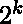
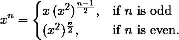

# 指数平方(快速模乘)

> 原文:[https://www . geeksforgeeks . org/index-squaring-fast-mod-乘法/](https://www.geeksforgeeks.org/exponential-squaring-fast-modulo-multiplication/)

给定两个数字**基数**和 **exp** ，我们需要在[模 10^9+7](https://www.geeksforgeeks.org/modulo-1097-1000000007/) 下计算基数 <sup>exp</sup>

**示例:**

```
Input : base = 2, exp = 2
Output : 4

Input  : base = 5, exp = 100000
Output : 754573817

```

在竞赛中，为了计算一个数的大幂，我们被赋予一个模数值(一个大的素数)，因为当的值被计算时，它会变得非常大，所以我们不得不计算(%模数值)。)
我们可以通过在所有中间步骤上使用模数，以我们的天真方式使用模数，并在最后取模数，
但是在比赛中，它肯定会显示 TLE。所以，我们能做的。
答案是我们可以试试[平方求幂](https://en.wikipedia.org/wiki/Exponentiation_by_squaring)这是一种快速计算一个数的幂的方法。
这里我们将讨论两种最常见/最重要的方法:

1.  基本方法(二进制幂运算)
2.  -元法。

**二进制幂运算**

如[这篇](https://en.wikipedia.org/wiki/Exponentiation_by_squaring)文章所述，我们将使用以下公式递归计算(%模量值):



## C++

```
// C++ program to compute exponential 
// value under modulo using binary 
// exponentiation.
#include<iostream>
using namespace std;

#define N 1000000007 // prime modulo value

long int exponentiation(long int base,
                        long int exp)
{
    if (exp == 0)
        return 1;

    if (exp == 1)
        return base % N;

    long int t = exponentiation(base, exp / 2);
    t = (t * t) % N;

    // if exponent is even value
    if (exp % 2 == 0)
        return t;

    // if exponent is odd value
    else
        return ((base % N) * t) % N;
}

// Driver Code
int main()
{
    long int base = 5;
    long int exp = 100000;

    long int modulo = exponentiation(base, exp);
    cout << modulo << endl;
    return 0;
}

// This Code is contributed by mits
```

## Java 语言(一种计算机语言，尤用于创建网站)

```
// Java program to compute exponential value under modulo
// using binary exponentiation.
import java.util.*;
import java.lang.*;
import java.io.*;

class exp_sq {
    static long N = 1000000007L; // prime modulo value
    public static void main(String[] args)
    {
        long base = 5;
        long exp = 100000;

        long modulo = exponentiation(base, exp);
        System.out.println(modulo);
    }

    static long exponentiation(long base, long exp)
    {
        if (exp == 0)
            return 1;

        if (exp == 1)
            return base % N;

        long t = exponentiation(base, exp / 2);
        t = (t * t) % N;

        // if exponent is even value
        if (exp % 2 == 0)
            return t;

        // if exponent is odd value
        else
            return ((base % N) * t) % N;
    }
}
```

## 蟒蛇 3

```
# Python3 program to compute 
# exponential value under
# modulo using binary 
# exponentiation.

# prime modulo value
N = 1000000007;

# Function code 
def exponentiation(bas, exp):
    if (exp == 0):
        return 1;
    if (exp == 1):
        return bas % N;

    t = exponentiation(bas, int(exp / 2));
    t = (t * t) % N;

    # if exponent is
    # even value
    if (exp % 2 == 0):
        return t;

    # if exponent is
    # odd value
    else:
        return ((bas % N) * t) % N;

# Driver code
bas = 5;
exp = 100000;

modulo = exponentiation(bas, exp);
print(modulo);

# This code is contributed
# by mits
```

## C#

```
// C# program to compute exponential
// value under modulo using binary 
// exponentiation.
using System;

class GFG {

    // prime modulo value
    static long N = 1000000007L;

    // Driver code
    public static void Main()
    {
        long bas = 5;
        long exp = 100000;

        long modulo = exponentiation(bas, exp);
        Console.Write(modulo);
    }

    static long exponentiation(long bas, long exp)
    {
        if (exp == 0)
            return 1;

        if (exp == 1)
            return bas % N;

        long t = exponentiation(bas, exp / 2);
        t = (t * t) % N;

        // if exponent is even value
        if (exp % 2 == 0)
            return t;

        // if exponent is odd value
        else
            return ((bas % N) * t) % N;
    }
}

// This code is contributed by nitin mittal.
```

## 服务器端编程语言（Professional Hypertext Preprocessor 的缩写）

```
<?php
// PHP program to compute exponential
// value under modulo using binary 
// exponentiation.

// prime modulo value
$N = 1000000007;

// Function code 
function exponentiation($bas, $exp)
{
    global $N ;
    if ($exp == 0)
        return 1;

    if ($exp == 1)
        return $bas % $N;

    $t = exponentiation($bas, 
                        $exp / 2);
    $t = ($t * $t) % $N;

    // if exponent is
    // even value
    if ($exp % 2 == 0)
        return $t;

    // if exponent is
    // odd value
    else
        return (($bas % $N) *
                 $t) % $N;
}

// Driver code
$bas = 5;
$exp = 100000;

$modulo = exponentiation($bas, $exp);
echo ($modulo);

// This code is contributed by ajit
?>
```

**Output :**

```
754573817

```

**-元法:**

在这个算法中，我们将在基数 (k > =1)中展开指数，这在某种程度上类似于上面的方法，只是我们没有使用递归。这个方法使用相对较少的内存和时间。

## C++

```
// C++ program to compute exponential value using (2^k)
// -ary method.
#include<bits/stdc++.h>
using namespace std;

#define N 1000000007L; // prime modulo value

long exponentiation(long base, long exp)
{
    long t = 1L;
    while (exp > 0) 
    {

        // for cases where exponent
        // is not an even value
        if (exp % 2 != 0)
            t = (t * base) % N;

        base = (base * base) % N;
        exp /= 2;
    }
    return t % N;
}

// Driver code
int main()
{
    long base = 5;
    long exp = 100000;

    long modulo = exponentiation(base, exp);
    cout << (modulo);
    return 0;
}

// This code is contributed by Rajput-Ji
```

## Java 语言(一种计算机语言，尤用于创建网站)

```
// Java program to compute exponential value using (2^k)
// -ary method.
import java.util.*;
import java.lang.*;
import java.io.*;

class exp_sq {
    static long N = 1000000007L; // prime modulo value
    public static void main(String[] args)
    {
        long base = 5;
        long exp = 100000;

        long modulo = exponentiation(base, exp);
        System.out.println(modulo);
    }

    static long exponentiation(long base, long exp)
    {
        long t = 1L;
        while (exp > 0) {

            // for cases where exponent
            // is not an even value
            if (exp % 2 != 0)
                t = (t * base) % N;

            base = (base * base) % N;
            exp /= 2;
        }
        return t % N;
    }
}
```

## 蟒蛇 3

```
# Python3 program to compute 
# exponential value 
# using (2^k) -ary method.

# prime modulo value
N = 1000000007; 

def exponentiation(bas, exp):
    t = 1;
    while(exp > 0): 

        # for cases where exponent
        # is not an even value
        if (exp % 2 != 0):
            t = (t * bas) % N;

        bas = (bas * bas) % N;
        exp = int(exp / 2);
    return t % N;

# Driver Code 
bas = 5;
exp = 100000;

modulo = exponentiation(bas,exp);
print(modulo);

# This code is contributed
# by mits
```

## C#

```
// C# program to compute 
// exponential value 
// using (2^k) -ary method.
using System;

class GFG
{
// prime modulo value
static long N = 1000000007L; 

static long exponentiation(long bas, 
                           long exp)
{
    long t = 1L;
    while (exp > 0) 
    {

        // for cases where exponent
        // is not an even value
        if (exp % 2 != 0)
            t = (t * bas) % N;

        bas = (bas * bas) % N;
        exp /= 2;
    }
    return t % N;
}

// Driver Code    
public static void Main ()
{
    long bas = 5;
    long exp = 100000;

    long modulo = exponentiation(bas, 
                                 exp);
    Console.WriteLine(modulo);
}
}

//This code is contributed by ajit
```

## 服务器端编程语言（Professional Hypertext Preprocessor 的缩写）

```
<?php
// PHP program to compute 
// exponential value 
// using (2^k) -ary method.

// prime modulo value
$N = 1000000007; 

function exponentiation($bas, 
                        $exp)
{
    global $N; 
    $t = 1;
    while ($exp > 0) 
    {

        // for cases where exponent
        // is not an even value
        if ($exp % 2 != 0)
            $t = ($t * $bas) % $N;

        $bas = ($bas * $bas) % $N;
        $exp = (int)$exp / 2;
    }
    return $t % $N;
}

// Driver Code 
$bas = 5;
$exp = 100000;

$modulo = exponentiation($bas, 
                         $exp);
echo ($modulo);

// This code is contributed
// by ajit
?>
```

**Output :**

```
754573817

```

**应用:**
除了快速计算外，这种方法还有其他几个优点，比如它被用于密码学，计算[矩阵求幂](https://www.geeksforgeeks.org/matrix-exponentiation/)等等。