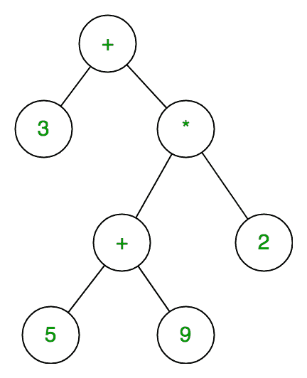

# 表达式树

> 原文:[https://www.geeksforgeeks.org/expression-tree/](https://www.geeksforgeeks.org/expression-tree/)

表达式树是二叉树，其中每个内部节点对应于运算符，每个叶节点对应于操作数，因此例如 3 + ((5+9)*2)的表达式树将是:



表达式树的有序遍历产生给定后缀表达式的中缀版本(与它给出后缀表达式的有序遍历相同)

**评估由**和**表达式树表示的表达式:**

```
Let t be the expression tree
If  t is not null then
      If t.value is operand then  
                Return  t.value
      A = solve(t.left)
      B = solve(t.right)

      // calculate applies operator 't.value' 
      // on A and B, and returns value
      Return calculate(A, B, t.value)
```

**表达树的构建:**

现在，为了构建表达式树，我们使用堆栈。我们循环输入表达式，并对每个字符执行以下操作。

1.  如果字符是操作数，则将它推入堆栈
2.  如果一个字符是一个运算符，从堆栈中弹出两个值，使它们成为它的子节点，并再次推送当前节点。

最后，堆栈中唯一的元素将是表达式树的根。

**示例:**

```
Input:  A B C*+ D/
Output: A + B * C / D
```

前三个符号是操作数，所以创建树节点并将指向它们的指针推到堆栈上，如下所示。


在下一步中，操作符“*”将被读取，因此弹出两个指向树的指针，形成一个新的树，并将指向它的指针推到堆栈上


在下一步中，将读取一个运算符“+”，因此弹出两个指向树的指针，形成一个新的树，并将指向它的指针推送到堆栈上。

a3 . png 格式

类似地，在上述情况下，我们首先将“D”推入堆栈，然后在最后一步中，首先将读取“/”，然后与上一步一样，最上面的元素将弹出，然后将是根“/”的右子树，其他节点将是右子树。

**最终构建的表达树为:**

a4 . png 格式

以下是上述方法的代码:

下面是上述方法的实现:

## C++

```
// C++ program for expression tree
#include <bits/stdc++.h>
using namespace std;
class node {
public:
    char value;
    node* left;
    node* right;
    node* next = NULL;
    node(char c)
    {
        this->value = c;
        left = NULL;
        right = NULL;
    }
    node()
    {
        left = NULL;
        right = NULL;
    }
    friend class Stack;
    friend class expression_tree;
};
class Stack {
    node* head = NULL;

public:
    void push(node*);
    node* pop();
    friend class expression_tree;
};
class expression_tree {
public:
    void inorder(node* x)
    {
        // cout<<"Tree in InOrder Traversal is: "<<endl;
        if (x == NULL)
            return;
        else {
            inorder(x->left);
            cout << x->value << "  ";
            inorder(x->right);
        }
    }
};

void Stack::push(node* x)
{
    if (head == NULL) {
        head = x;
    }
    // We are inserting here nodes at the top of the stack [following LIFO principle]
    else {
        x->next = head;
        head = x;
    }
}
node* Stack::pop()
{
    // Poping out the top most[ pointed with head] element
    node* p = head;
    head = head->next;
    return p;
}
int main()
{
    string s = "ABC*+D/";
    // If you  wish take input from user:
    //cout << "Insert Postorder Expression: " << endl;
    //cin >> s;
    Stack e;
    expression_tree a;
    node *x, *y, *z;
    int l = s.length();
    for (int i = 0; i < l; i++) {
        // if read character is operator then poping two
        // other elements from stack and making a binary
        // tree
        if (s[i] == '+' || s[i] == '-' || s[i] == '*'
            || s[i] == '/' || s[i] == '^') {
            z = new node(s[i]);
            x = e.pop();
            y = e.pop();
            z->left = y;
            z->right = x;
            e.push(z);
        }
        else {
            z = new node(s[i]);
            e.push(z);
        }
    }
    cout << " The Inorder Traversal of Expression Tree: ";
    a.inorder(z);
    return 0;
}

```

## Java 语言(一种计算机语言，尤用于创建网站)

```
import java.util.Stack;

class Node{
    char data;
    Node left,right;
    public Node(char data){
        this.data = data;
        left = right = null;
    }
}

public class Main {
    public static boolean isOperator(char ch){
        if(ch=='+' || ch=='-'|| ch=='*' || ch=='/' || ch=='^'){
            return true;
        }
        return false;
    }
    public static Node expressionTree(String postfix){
        Stack<Node> st = new Stack<Node>();
        Node t1,t2,temp;

        for(int i=0;i<postfix.length();i++){
            if(!isOperator(postfix.charAt(i))){
                temp = new Node(postfix.charAt(i));
                st.push(temp);
            }
            else{
                temp = new Node(postfix.charAt(i));

                t1 = st.pop();
                t2 = st.pop();

                temp.left = t1;
                temp.right = t2;

                st.push(temp);
            }

        }
        temp = st.pop();
        return temp;
    }
    public static void inorder(Node root){
        if(root==null) return;

        inorder(root.left);
        System.out.print(root.data);
        inorder(root.right);
    }
    public static void main(String[] args) {
        String postfix = "ABC*+D/";

        Node r = expressionTree(postfix);
        inorder(r);
    }
}
```

## C

```
#include <stdio.h>
#include <stdlib.h>

/* A binary tree node has data, pointer to left child
   and a pointer to right child */
struct node {
    char data;
    struct node* left;
    struct node* right;
    struct node* next;
};
 struct node *head=NULL;
/* Helper function that allocates a new node with the
   given data and NULL left and right pointers. */
struct node* newNode(char data)
{
    struct node* node
        = (struct node*)malloc(sizeof(struct node));
    node->data = data;
    node->left = NULL;
    node->right = NULL;
    node->next = NULL;

    return (node);
}
void printInorder(struct node* node)
{
    if (node == NULL)
        return;
    else{
    /* first recur on left child */
    printInorder(node->left);

    /* then print the data of node */
    printf("%c ", node->data);

    /* now recur on right child */
    printInorder(node->right);
    }
}

void push(struct node* x)
{
    if(head==NULL)
    head = x;
    else
    {
        (x)->next = head;
        head  = x;
    }
    // struct node* temp;
    // while(temp!=NULL)
    // {
    //     printf("%c ", temp->data);
    //     temp = temp->next;
    // }
}
struct node* pop()
{
    // Poping out the top most[ pointed with head] element
    struct node* p = head;
    head = head->next;
    return p;
}
int main()
{
    char s[] = {'A','B','C','*','+','D','/'};
    int l = sizeof(s) / sizeof(s[0]) ;
    struct node *x, *y, *z;
    for (int i = 0; i < l; i++) {
        // if read character is operator then poping two
        // other elements from stack and making a binary
        // tree
        if (s[i] == '+' || s[i] == '-' || s[i] == '*'
            || s[i] == '/' || s[i] == '^') {
            z = newNode(s[i]);
            x = pop();
            y = pop();
            z->left = y;
            z->right = x;
            push(z);
        }
        else {
            z = newNode(s[i]);
            push(z);
        }
    }
    printf(" The Inorder Traversal of Expression Tree: ");
    printInorder(z);
    return 0;
}
```

**输出:**

```
A+B*C/D
```