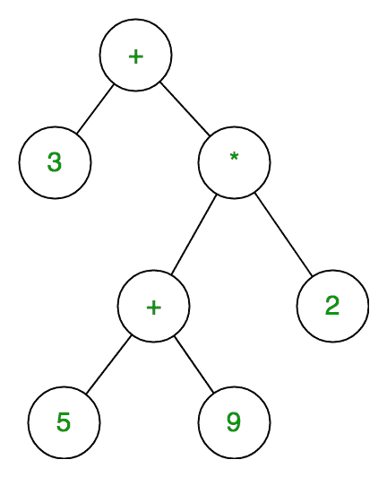
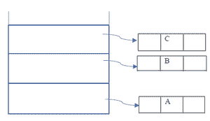
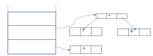
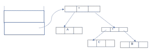
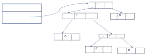

# 在 C++中使用类的表达式树，带有实现

> 原文:[https://www . geesforgeks . org/expression-trees-use-class-in-c-with-implementation/](https://www.geeksforgeeks.org/expression-trees-using-classes-in-c-with-implementation/)

**先决条件:** [表达式树](https://www.geeksforgeeks.org/expression-tree/)

表达式树是二叉树，其中每个内部节点对应于运算符，每个叶节点对应于操作数，因此例如 3 + ((5+9)*2)的表达式树将是:



在表达式树中，叶节点是操作数，非叶节点是运算符。这意味着表达式树是一个二叉树，其中内部节点是运算符，叶子是操作数。表达式树由二进制表达式组成。但是对于一元运算符，一个子树将为空。

**表达树的构建:**

*   用户将提供后缀表达式，程序将为其构建表达式树。
*   二叉树/表达式树的有序遍历将提供给定输入的中缀表达式。

**示例:**

```
Input:  A B C*+ D/
Output: A + B * C / D
```

**步骤 1:** 前三个符号是操作数，所以创建树节点，并将指向它们的指针推到堆栈上，如下所示。



**步骤 2:** 在下一步中，一个操作符“*”将被读取，因此弹出两个指向树的指针，形成一个新的树，并将指向它的指针推到堆栈上



**第三步:**下一步，会读取一个运算符“+”，于是弹出两个指向树的指针，形成一个新的树，并将指向它的指针推送到堆栈上。



**第四步:**同样，和上面的情况一样，首先我们将‘D’推入堆栈，然后在最后一步中，首先将读取“/”，然后作为上一步，最上面的元素将弹出，然后将是根“/”的右子树，其他节点将是右子树。

**最终构建的表达树为:**



下面是实现上述方法的 C++程序:

## C++

```
// C++ program to implement
// the above approach
#include <bits/stdc++.h>
using namespace std;
class node {
public:
    char value;
    node* left;
    node* right;
    node* next = NULL;
    node(char c)
    {
        this->value = c;
        left = NULL;
        right = NULL;
    }
    node()
    {
        left = NULL;
        right = NULL;
    }
    friend class Stack;
    friend class expression_tree;
};

// Class stack to hold
// tree nodes
class Stack {
    node* head = NULL;

public:
    void push(node*);
    node* pop();
    friend class expression_tree;
};

// Class to implement
// inorder traversal
class expression_tree {
public:
    // Function to implement
    // inorder traversal
    void inorder(node* x)
    {
        if (x == NULL)
            return;
        else {
            inorder(x->left);
            cout << x->value << "  ";
            inorder(x->right);
        }
    }
};

// Function to push values
// onto the stack
void Stack::push(node* x)
{
    if (head == NULL) {
        head = x;
    }

    // We are inserting nodes at
    // the top of the stack [
    // following LIFO principle]
    else {
        x->next = head;
        head = x;
    }
}

// Function to implement pop
// operation in the stack
node* Stack::pop()
{
    // Poping out the top most[
    // pointed with head] element
    node* p = head;
    head = head->next;
    return p;
}

// Driver code
int main()
{
    // Postfix expression
    string s = "ABC*+D/";

    Stack e;
    expression_tree a;
    node *x, *y, *z;
    int l = s.length();

    for (int i = 0; i < l; i++) {
        // if read character is operator
        // then poping two other elements
        // from stack and making a binary
        // tree
        if (s[i] == '+' || s[i] == '-'
            || s[i] == '*' || s[i] == '/'
            || s[i] == '^') {
            z = new node(s[i]);
            x = e.pop();
            y = e.pop();
            z->left = y;
            z->right = x;
            e.push(z);
        }
        else {
            z = new node(s[i]);
            e.push(z);
        }
    }

    // Print the inorder traversal
    cout << " The Inorder Traversal of Expression Tree: ";
    a.inorder(z);
    return 0;
}
```

**Output:**

> 表达式树的有序遍历:A + B * C / D