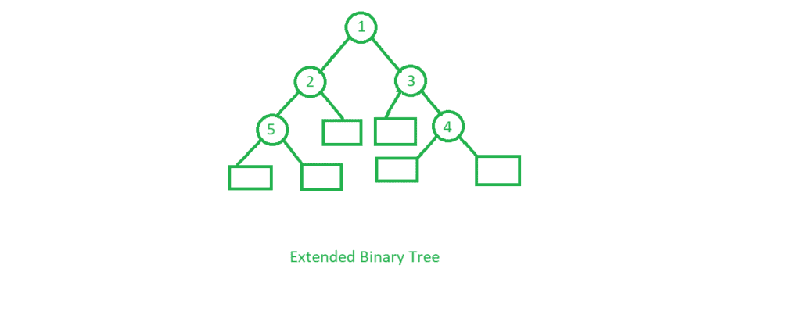
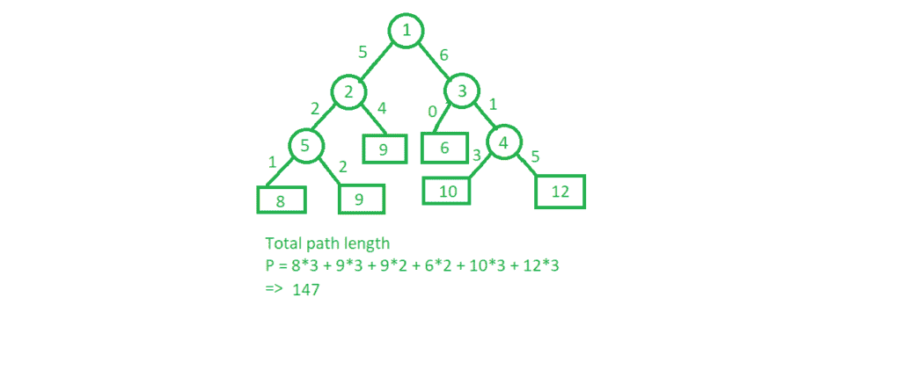

# 扩展二叉树

> 原文:[https://www.geeksforgeeks.org/extended-binary-tree/](https://www.geeksforgeeks.org/extended-binary-tree/)

扩展二叉树是一种二叉树，其中原始树的所有空子树被称为**外部节点**的特殊节点代替，而其他节点被称为**内部节点**



这里圆圈代表内部节点，方框代表外部节点。
**外部二叉树的属性**

1.  原始树中的节点是内部节点，特殊节点是外部节点。
2.  所有外部节点都是叶节点，内部节点是非叶节点。
3.  每个内部节点正好有两个子节点，每个外部节点都是一片叶子。它显示完整的二叉树的结果

下面是一个在 C++中通过将所有外部节点设为“-1”
来创建扩展二叉树的例子

## C++

```
// C++ program to make an extended binary tree
#include <bits/stdc++.h>
using namespace std;

// A Tree node
struct Node {
    int key;
    struct Node *left, *right;
};

// Utility function to
// create a new node
Node* newNode(int key)
{
    Node* temp = new Node;
    temp->key = key;
    temp->left = temp->right = NULL;
    return (temp);
}

// Function for inorder traversal
void traverse(Node* root)
{
    if (root != NULL) {
        traverse(root->left);
        cout << root->key << " ";
        traverse(root->right);
    }
    else {

        // Making external nodes
        root = newNode(-1);
        cout << root->key << " ";
    }
}

// Driver code
int main()
{
    Node* root = newNode(1);
    root->left = newNode(2);
    root->right = newNode(3);
    root->left->left = newNode(5);
    root->right->right = newNode(4);

    traverse(root);

    return 0;
}
```

## Java 语言(一种计算机语言，尤用于创建网站)

```
// Java program to make an extended binary tree
class GFG
{

// A Tree node
static class Node
{
    int key;
    Node left, right;
};

// Utility function to create a new node
static Node newNode(int key)
{
    Node temp = new Node();
    temp.key = key;
    temp.left = temp.right = null;
    return (temp);
}

// Function for inorder traversal
static void traverse(Node root)
{
    if (root != null)
    {
        traverse(root.left);
        System.out.print(root.key + " ");
        traverse(root.right);
    }
    else
    {

        // Making external nodes
        root = newNode(-1);
        System.out.print(root.key + " ");
    }
}

// Driver code
public static void main(String args[])
{
    Node root = newNode(1);
    root.left = newNode(2);
    root.right = newNode(3);
    root.left.left = newNode(5);
    root.right.right = newNode(4);

    traverse(root);
}
}

// This code is contributed by Arnab Kundu
```

## C#

```
// C# program to make an extended binary tree
using System;

class GFG
{

    // A Tree node
    public class Node
    {
        public int key;
        public Node left, right;
    };

    // Utility function to create a new node
    static Node newNode(int key)
    {
        Node temp = new Node();
        temp.key = key;
        temp.left = temp.right = null;
        return (temp);
    }

    // Function for inorder traversal
    static void traverse(Node root)
    {
        if (root != null)
        {
            traverse(root.left);
            Console.Write(root.key + " ");
            traverse(root.right);
        }
        else
        {

            // Making external nodes
            root = newNode(-1);
            Console.Write(root.key + " ");
        }
    }

    // Driver code
    public static void Main()
    {
        Node root = newNode(1);
        root.left = newNode(2);
        root.right = newNode(3);
        root.left.left = newNode(5);
        root.right.right = newNode(4);

        traverse(root);
    }
}

// This code is contributed by AnkitRai01
```

## java 描述语言

```
<script>

// Javascript program to make an extended binary tree

// A Tree node
class Node
{
    constructor()
    {
        this.key = 0;
        this.left = null;
        this.right = null;
    }
};

// Utility function to create a new node
function newNode(key)
{
    var temp = new Node();
    temp.key = key;
    temp.left = temp.right = null;
    return (temp);
}

// Function for inorder traversal
function traverse(root)
{
    if (root != null)
    {
        traverse(root.left);
        document.write(root.key + " ");
        traverse(root.right);
    }
    else
    {

        // Making external nodes
        root = newNode(-1);
        document.write(root.key + " ");
    }
}

// Driver code
var root = newNode(1);
root.left = newNode(2);
root.right = newNode(3);
root.left.left = newNode(5);
root.right.right = newNode(4);
traverse(root);

</script>
```

## 蟒蛇 3

```
# Python 3 program to make an extended binary tree

# A Tree node
class Node :
    def __init__(self):
        self.key=-1
        self.left=self.right=None

# Utility function to
# create a new node
def newNode(key):
    temp = Node()
    temp.key = key
    temp.left = temp.right = None
    return temp

# Function for inorder traversal
def traverse(root):
    if (root != None) :
        traverse(root.left)
        print(root.key,end=" ")
        traverse(root.right)

    else :

        # Making external nodes
        root = newNode(-1)
        print(root.key,end=" ")

# Driver code
if __name__ == '__main__':
    root = newNode(1)
    root.left = newNode(2)
    root.right = newNode(3)
    root.left.left = newNode(5)
    root.right.right = newNode(4)

    traverse(root)
    print()
# This code was added by Amartya Ghosh
```

**Output:** 

```
-1 5 -1 2 -1 1 -1 3 -1 4 -1
```

**时间复杂度** : O(N)。
**辅助空间** : O(N)。
**扩展二叉树的应用:**

1.  **计算加权路径长度:**用于计算加权树情况下的总路径长度。



1.  这里，总权重的总和已经被计算并存储在外部节点中，因此使得计算具有给定权重的树的总路径长度非常容易。同样的技术也可以用于更新网络中的路由表。
2.  **在完全二叉树中转换二叉树:**上面给定的已经移除了所有外部节点的树不是完全二叉树。为了将任何树作为完整的树引入，需要在其上添加外部节点。堆是完整二叉树的一个很好的例子，因此，如果向每个二叉树添加外部节点，则每个二叉树都可以表示为堆。