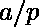

# 扩展的米迪定理

> 原文:[https://www.geeksforgeeks.org/extended-midys-theorem/](https://www.geeksforgeeks.org/extended-midys-theorem/)

根据[米迪定理](https://en.wikipedia.org/wiki/Midy%27s_theorem)，如果的重复小数的周期，其中 p 是**素数**和是一个**缩减分数**，有偶数个数字，那么将重复部分分成两半相加得到一串 9s。例如 1/7 = 0.14285714285..是重复的十进制数，重复 142857。现在，根据定理，它有偶数个重复数字，即 142857。此外，如果我们把它分成两半，我们得到 142 和 857。因此，将这两者相加，我们得到 999，它是一串 9，与我们的定理相匹配。

在**扩展的米迪定理**中，如果我们把 a/p 的重复部分分成 m 个数字，那么它们的和就是 10 的倍数 <sup>m</sup> -1。

> 假设 a = 1，p = 17，
> a/p = 1/17 = 0.0588235294117647……
> 那么，0588235294117647 就是 1/17 的十进制展开的重复部分。它的重复部分有 16 个数字，可以分成 m 个数字，其中 m 可以是 2，4，8。
> 如果我们考虑 m = 4，那么 0588235294117647 可以被分成 16/4 = 4 个数字，如果我们将这 4 个数字相加，那么结果应该是 10 的倍数<sup>4</sup>–1 = 9999，即
> 0588+2352+9411+7647 = 19998 = 2 * 9999

## C++

```
// C++ program to demonstrate extended
// Midy's theorem
#include <bits/stdc++.h>
using namespace std;

// Returns repeating sequence of a fraction.
// If repeating sequence doesn't exits,
// then returns -1
string fractionToDecimal(int numerator,
                         int denominator)
{
    string res;

    /* Create a map to store already seen remainders
    remainder is used as key and its position in
    result is stored as value. Note that we need
    position for cases like 1/6\. In this case,
    the recurring sequence doesn't start from first
    remainder. */
    unordered_map<int, int> mp;

    // Find first remainder
    int rem = numerator % denominator;

    // Keep finding remainder until either remainder
    // becomes 0 or repeats
    while ((rem != 0) && (mp.find(rem) == mp.end())) {

        // Store this remainder
        mp[rem] = res.length();

        // Multiply remainder with 10
        rem = rem * 10;

        // Append rem / denr to result
        int res_part = rem / denominator;
        res += to_string(res_part);

        // Update remainder
        rem = rem % denominator;
    }

    return (rem == 0) ? "-1" : res.substr(mp[rem]);
}

// Checks whether a number is prime or not
bool isPrime(int n)
{
    for (int i = 2; i <= n / 2; i++)
        if (n % i == 0)
            return false;
    return true;
}

// If all conditions are met,
// it proves Extended Midy's theorem
void ExtendedMidys(string str, int n, int m)
{
    if (!isPrime(n)) {
        cout << "Denominator is not prime, "
             << "thus Extended Midy's "
             << "theorem is not applicable";
        return;   
    }

    int l = str.length();
    int part1 = 0, part2 = 0;
    if (l % 2 == 0 && l % m == 0) {

        // Dividing repeated part into m parts
        int part[m] = { 0 }, sum = 0, res = 0;
        for (int i = 0; i < l; i++) {
            int var = i / m;
            part[var] = part[var] * 10 + (str[i] - '0');
        }

        // Computing sum of parts.
        for (int i = 0; i < m; i++) {
            sum = sum + part[i];
            cout << part[i] << " ";
        }

        // Checking for Extended Midy
        cout << endl;
        res = pow(10, m) - 1;
        if (sum % res == 0)
            cout << "Extended Midy's theorem holds!";       
        else
            cout << "Extended Midy's theorem"
                 << " doesn't hold!";       
    }
    else if (l % 2 != 0) {
        cout << "The repeating decimal is"
             << " of odd length thus Extended "
            << "Midy's theorem is not applicable";
    }
    else if (l % m != 0) {
        cout << "The repeating decimal can "
             << "not be divided into m digits";
    }
}

// Driver code
int main()
{
    int numr = 1, denr = 17, m = 4;
    string res = fractionToDecimal(numr, denr);
    if (res == "-1")
        cout << "The fraction does not"
             << " have repeating decimal";
    else {
        cout << "Repeating decimal = " << res << endl;
        ExtendedMidys(res, denr, m);
    }
    return 0;
}
```

## Java 语言(一种计算机语言，尤用于创建网站)

```
// Java program to demonstrate extended
// Midy's theorem
import java.util.*;

class GFG{

// Returns repeating sequence of a fraction.
// If repeating sequence doesn't exits,
// then returns -1
static String fractionToDecimal(int numerator,
                                int denominator)
{
    String res = "";

    /* Create a map to store already seen remainders
    remainder is used as key and its position in
    result is stored as value. Note that we need
    position for cases like 1/6\. In this case,
    the recurring sequence doesn't start from first
    remainder. */
    HashMap<Integer, Integer> mp = new HashMap<>();

    // Find first remainder
    int rem = numerator % denominator;

    // Keep finding remainder until either remainder
    // becomes 0 or repeats
    while ((rem != 0) && !mp.containsKey(rem))
    {

        // Store this remainder
        mp.put(rem, res.length());

        // Multiply remainder with 10
        rem = rem * 10;

        // Append rem / denr to result
        int res_part = rem / denominator;
        res += res_part + "";

        // Update remainder
        rem = rem % denominator;
    }

    return (rem == 0) ? "-1" : res.substring(mp.get(rem));
}

// Checks whether a number is prime or not
static boolean isPrime(int n)
{
    for(int i = 2; i <= n / 2; i++)
        if (n % i == 0)
            return false;

    return true;
}

// If all conditions are met,
// it proves Extended Midy's theorem
static void ExtendedMidys(String str, int n, int m)
{
    if (!isPrime(n))
    {
        System.out.print("Denominator is not prime, " +
                         "thus Extended Midy's theorem " +
                         "is not applicable");
        return;   
    }

    int l = str.length();
    int part1 = 0, part2 = 0;

    if (l % 2 == 0 && l % m == 0)
    {

        // Dividing repeated part into m parts
        int []part = new int[m];
        int sum = 0, res = 0;
        for(int i = 0; i < l; i++)
        {
            int var = i / m;
            part[var] = part[var] * 10 +
                   (str.charAt(i) - '0');
        }

        // Computing sum of parts.
        for(int i = 0; i < m; i++)
        {
            sum = sum + part[i];
            System.out.print(part[i] + " ");
        }

        // Checking for Extended Midy
        System.out.println();
        res = (int)Math.pow(10, m) - 1;

        if (sum % res == 0)
            System.out.print("Extended Midy's " +
                             "theorem holds!");       
        else
            System.out.print("Extended Midy's " +
                             "theorem doesn't hold!");       
    }
    else if (l % 2 != 0)
    {
        System.out.print("The repeating decimal is of " +
                         "odd length thus Extended Midy's " +
                         "theorem is not applicable");
    }
    else if (l % m != 0)
    {
        System.out.print("The repeating decimal can " +
                         "not be divided into m digits");
    }
}

// Driver code
public static void main(String []args)
{
    int numr = 1, denr = 17, m = 4;
    String res = fractionToDecimal(numr, denr);

    if (res == "-1")
        System.out.print("The fraction does not " +
                         "have repeating decimal");
    else
    {
        System.out.println("Repeating decimal = " + res);
        ExtendedMidys(res, denr, m);
    }
}
}

// This code is contributed by rutvik_56
```

## C#

```
// C# program to demonstrate extended
// Midy's theorem
using System;
using System.Collections;
using System.Collections.Generic;

class GFG{

// Returns repeating sequence of a fraction.
// If repeating sequence doesn't exits,
// then returns -1
static string fractionToDecimal(int numerator,
                                int denominator)
{
    string res = "";

    /* Create a map to store already seen remainders
    remainder is used as key and its position in
    result is stored as value. Note that we need
    position for cases like 1/6\. In this case,
    the recurring sequence doesn't start from first
    remainder. */
    Dictionary<int,int> mp = new Dictionary<int,int>();

    // Find first remainder
    int rem = numerator % denominator;

    // Keep finding remainder until either remainder
    // becomes 0 or repeats
    while ((rem != 0) && !mp.ContainsKey(rem))
    {

        // Store this remainder
        mp[rem]= res.Length;

        // Multiply remainder with 10
        rem = rem * 10;

        // Append rem / denr to result
        int res_part = rem / denominator;
        res += res_part + "";

        // Update remainder
        rem = rem % denominator;
    }

    return (rem == 0) ? "-1" : res.Substring(mp[rem]);
}

// Checks whether a number is prime or not
static bool isPrime(int n)
{
    for(int i = 2; i <= n / 2; i++)
        if (n % i == 0)
            return false;

    return true;
}

// If all conditions are met,
// it proves Extended Midy's theorem
static void ExtendedMidys(string str, int n, int m)
{
    if (!isPrime(n))
    {
        Console.Write("Denominator is not prime, " +
                         "thus Extended Midy's theorem " +
                         "is not applicable");
        return;   
    }

    int l = str.Length;

    if (l % 2 == 0 && l % m == 0)
    {

        // Dividing repeated part into m parts
        int []part = new int[m];
        int sum = 0, res = 0;
        for(int i = 0; i < l; i++)
        {
            int var = i / m;
            part[var] = part[var] * 10 +
                   (str[i] - '0');
        }

        // Computing sum of parts.
        for(int i = 0; i < m; i++)
        {
            sum = sum + part[i];
            Console.Write(part[i] + " ");
        }

        // Checking for Extended Midy
        Console.WriteLine();
        res = (int)Math.Pow(10, m) - 1;

        if (sum % res == 0)
            Console.Write("Extended Midy's " +
                             "theorem holds!");       
        else
            Console.Write("Extended Midy's " +
                             "theorem doesn't hold!");       
    }
    else if (l % 2 != 0)
    {
        Console.Write("The repeating decimal is of " +
                         "odd length thus Extended Midy's " +
                         "theorem is not applicable");
    }
    else if (l % m != 0)
    {
        Console.Write("The repeating decimal can " +
                         "not be divided into m digits");
    }
}

// Driver code
public static void Main(string []args)
{
    int numr = 1, denr = 17, m = 4;
    string res = fractionToDecimal(numr, denr);

    if (res == "-1")
        Console.Write("The fraction does not " +
                         "have repeating decimal");
    else
    {
        Console.WriteLine("Repeating decimal = " + res);
        ExtendedMidys(res, denr, m);
    }
}
}

// This code is contributed by pratham76.
```

**Output:** 

```
Repeating decimal = 0588235294117647
588 2352 9411 7647 
Extended Midy's theorem holds!
```