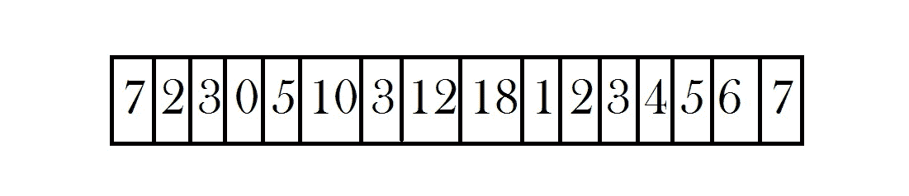
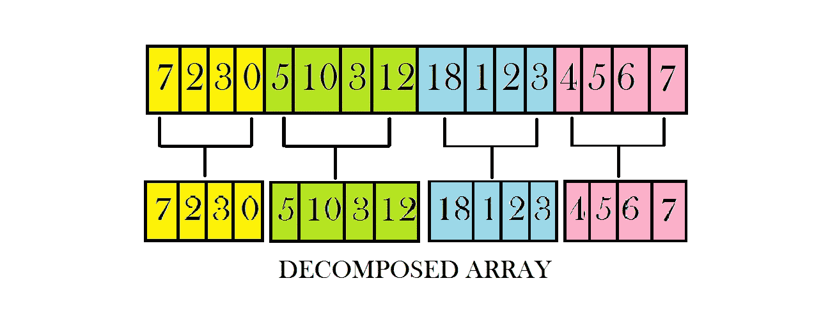
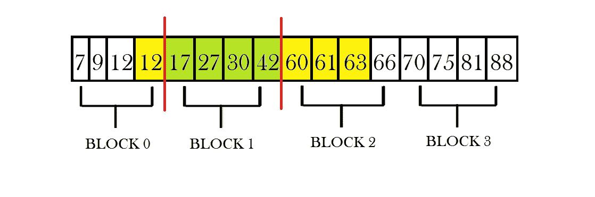
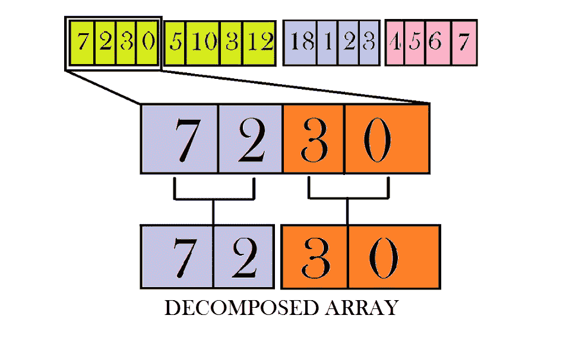
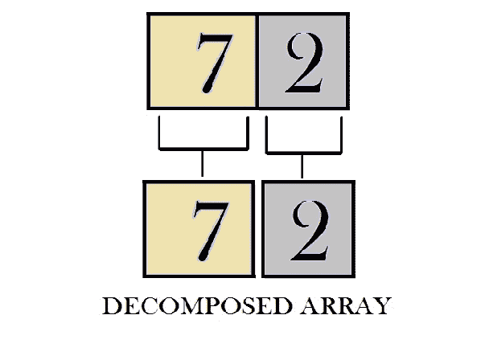

# 时间复杂度≈ O(1)的扩展莫氏算法

> 原文:[https://www . geesforgeks . org/extended-mos-algorithm-O1-时间复杂度/](https://www.geeksforgeeks.org/extended-mos-algorithm-o1-time-complexity/)

给定一个没有更新的 n 元素数组和 q 个范围查询(本文中的范围总和)，任务是以高效的时间和空间复杂度来回答这些查询。应用平方根分解后范围查询的时间复杂度为 **O(√n)** 。通过对较早分解的阵列块应用平方根分解，可以将该平方根因子减少到恒定的线性因子。
**先决条件:** [莫算法](https://www.geeksforgeeks.org/mos-algorithm-query-square-root-decomposition-set-1-introduction/) | [前缀数组](https://www.geeksforgeeks.org/prefix-sum-array-implementation-applications-competitive-programming/)

**方法:**
当我们将[平方根分解](https://www.geeksforgeeks.org/sqrt-square-root-decomposition-technique-set-1-introduction/)应用于给定的数组时，查询范围和出现在**0(√n)**时间。
这里计算在考虑的块(角块)之间的块的和，需要 **O(√n)** 次迭代。
初始阵列:



初始数组

将数组分解成块:



1 级分解

并且开始块和结束块上的和的计算时间都需要 **O(√n)** 次迭代。

**这样我们每次查询的时间复杂度为:**

```
= O(√n) + O(√n) + O(√n)
= 3 * O(√n)   
~O(√n)
```

在这里，我们可以通过计算分块前缀和并使用它来计算位于所考虑的块之间的块中累积的和，来巧妙地降低我们的查询算法的运行时复杂度。考虑下面的代码:

```
interblock_sum[x1][x2] = prefixData[x2 - 1] - prefixData[x1];
```

**上表计算所用时间为:**

```
= O(√n) * O(√n)  
~O(n)
```

**注意:**我们没有考虑块 x1 & x2 的总和，因为它们可能携带部分数据。
T3】前缀数组:



前缀数组

假设我们想要查询范围从 4 到 11 的总和，我们考虑块 0 和块 2 之间的总和(不包括块 0 和块 1 中包含的数据)，这可以使用上图中表示的绿色块中的总和来计算。
块 0 和块 2 之间的总和= 42–12 = 30
为了计算黄色块中存在的总和的剩余部分，考虑分解级别-2 的前缀数组，并再次重复该过程。
在这里，我们观察到每个查询的时间复杂度显著降低，尽管我们的运行时与上一个方法相似:

**我们的新时间复杂度可以计算为:**

```
= O(√n) + O(1) + O(√n)
= 2 * O(√n)   
~O(√n)    
```

二级平方根分解:



二级分解

此外，我们将平方根分解再次应用于之前分解中保留的每个分解块。现在在这个级别，我们在每个块中大约有 **√√n 个**子块，它们在最后一级被分解。因此，我们只需要对这些块运行两次范围查询，一次针对起始块，一次针对结束块。

**二级分解所需的预评估时间:**
一级块数~ **√n**
二级块数~**√n**

**一级分解块的二级分解运行时间:**

```
= O(√n)
```

**所有块的二级分解的整体运行时间:**

```
= O(√n) * O(√n)
~O(n)
```

现在可以查询我们在**O(√n)**时间的二级分解块。
因此，我们将整体时间复杂度从 **O(√n)** 降低到了**O(√n)**

**查询边缘块的时间复杂度:**

```
= O(√√n) + O(1) + O(√√n)
= 2 * O(√√n)
~O(√√n)
```

**总时间复杂度可以计算为:**

```
= O(√√n)+O(1)+O(√√n)
= 2 * O(√√n)   
~O(√√n)  
```

第三级平方根分解:



三级分解

使用这种方法，我们可以一次又一次地递归分解我们的数组 **d 次**，以将我们的时间复杂度降低到一个因子**恒定线性度**。

```
O(d * n<sup>1/(2^d)) ~ O(k), as d increases this factor converges to a constant linear term</sup>
```

下面给出的代码是三平方根分解的表示，其中 d = 3:

```
O(q * d * n1/(2 ^ 3)) ~ O(q * k) ~ O(q) 
```

[其中 q 代表范围查询的数量]

## C++

```
// CPP code for offline queries in
// approx constant time.
#include<bits/stdc++.h>
using namespace std;

int n1;

// Structure to store decomposed data
typedef struct
{
    vector<int> data;
    vector<vector<int>> rdata;
    int blocks;
    int blk_sz;
}sqrtD;

vector<vector<sqrtD>> Sq3;
vector<sqrtD> Sq2;
sqrtD Sq1;

// Square root Decomposition of
// a given array
sqrtD decompose(vector<int> arr)
{
    sqrtD sq;
    int n = arr.size();
    int blk_idx = -1;
    sq.blk_sz = sqrt(n);
    sq.data.resize((n/sq.blk_sz) + 1, 0);

    // Calculation of data in blocks
    for (int i = 0; i < n; i++)
    {
        if (i % sq.blk_sz == 0)
        {
            blk_idx++;
        }
        sq.data[blk_idx] += arr[i];
    }

    int blocks = blk_idx + 1;
    sq.blocks = blocks;

    // Calculation of prefix data
    int prefixData[blocks];
    prefixData[0] = sq.data[0];
    for(int i = 1; i < blocks; i++)
    {
        prefixData[i] =
          prefixData[i - 1] + sq.data[i];
    }

    sq.rdata.resize(blocks + 1,
             vector<int>(blocks + 1));

    // Calculation of data between blocks
    for(int i = 0 ;i < blocks; i++)
    {
        for(int j = i + 1; j < blocks; j++)
        {
            sq.rdata[i][j] = sq.rdata[j][i] =
            prefixData[j - 1] - prefixData[i];
        }
    }

    return sq;
}

// Square root Decomposition at level3
vector<vector<sqrtD>> tripleDecompose(sqrtD sq1,
                      sqrtD sq2,vector<int> &arr)
{
    vector<vector<sqrtD>> sq(sq1.blocks,
                      vector<sqrtD>(sq1.blocks));

    int blk_idx1 = -1;

    for(int i = 0; i < sq1.blocks; i++)
    {
        int blk_ldx1 = blk_idx1 + 1;
        blk_idx1 = (i + 1) * sq1.blk_sz - 1;
        blk_idx1 = min(blk_idx1,n1 - 1);

        int blk_idx2 = blk_ldx1 - 1;

        for(int j = 0; j < sq2.blocks; ++j)
        {
            int blk_ldx2 = blk_idx2 + 1;
            blk_idx2 = blk_ldx1 + (j + 1) *
                       sq2.blk_sz - 1;
            blk_idx2 = min(blk_idx2, blk_idx1);

            vector<int> ::iterator it1 =
                        arr.begin() + blk_ldx2;
            vector<int> ::iterator it2 =
                        arr.begin() + blk_idx2 + 1;
            vector<int> vec(it1, it2);
            sq[i][j] = decompose(vec);    
        }
    }
    return sq;        
}

// Square root Decomposition at level2
vector<sqrtD> doubleDecompose(sqrtD sq1,
                              vector<int> &arr)
{
    vector<sqrtD> sq(sq1.blocks);
    int blk_idx = -1;
    for(int i = 0; i < sq1.blocks; i++)
    {
        int blk_ldx = blk_idx + 1;
        blk_idx = (i + 1) * sq1.blk_sz - 1;
        blk_idx = min(blk_idx, n1 - 1);
        vector<int> ::iterator it1 =
                    arr.begin() + blk_ldx;
        vector<int> ::iterator it2 =
                    arr.begin() + blk_idx + 1;
        vector<int> vec(it1, it2);
        sq[i] = decompose(vec);
    }

    return sq;    
}

// Square root Decomposition at level1
void singleDecompose(vector<int> &arr)
{
    sqrtD sq1 = decompose(arr);
    vector<sqrtD> sq2(sq1.blocks);
    sq2 = doubleDecompose(sq1, arr);

    vector<vector<sqrtD>> sq3(sq1.blocks,
           vector<sqrtD>(sq2[0].blocks));

    sq3 = tripleDecompose(sq1, sq2[0],arr);

    // ASSIGNMENT TO GLOBAL VARIABLES
    Sq1 = sq1;
    Sq2.resize(sq1.blocks);
    Sq2 = sq2;
    Sq3.resize(sq1.blocks,
        vector<sqrtD>(sq2[0].blocks));
    Sq3 = sq3;
}

// Function for query at level 3
int queryLevel3(int start,int end, int main_blk,
                int sub_main_blk, vector<int> &arr)
{
    int blk_sz= Sq3[0][0].blk_sz;

    // Element Indexing at level2 decomposition
    int nstart = start - main_blk *
        Sq1.blk_sz - sub_main_blk * Sq2[0].blk_sz;
    int nend = end - main_blk *
        Sq1.blk_sz - sub_main_blk * Sq2[0].blk_sz;

    // Block indexing at level3 decomposition
    int st_blk = nstart / blk_sz;
    int en_blk = nend / blk_sz;

    int answer =
        Sq3[main_blk][sub_main_blk].rdata[st_blk][en_blk];

    // If start and end point don't lie in same block
    if(st_blk != en_blk)
    {
        int left = 0, en_idx = main_blk * Sq1.blk_sz +
                      sub_main_blk * Sq2[0].blk_sz +
                      (st_blk + 1) * blk_sz -1;

        for(int i = start; i <= en_idx; i++)
        {
            left += arr[i];
        }

        int right = 0, st_idx = main_blk * Sq1.blk_sz +
                       sub_main_blk * Sq2[0].blk_sz +
                       (en_blk) * blk_sz;

        for(int i = st_idx; i <= end; i++)
        {
            right += arr[i];
        }

        answer += left;
        answer += right;
    }
    else
    {
        for(int i = start; i <= end; i++)
        {
            answer += arr[i];
    }
}
return answer;    
}

// Function for splitting query to level two
int queryLevel2(int start, int end, int main_blk,
                vector<int> &arr)
{
    int blk_sz = Sq2[0].blk_sz;

    // Element Indexing at level1 decomposition
    int nstart = start - (main_blk * Sq1.blk_sz);
    int nend = end - (main_blk * Sq1.blk_sz);

    // Block indexing at level2 decomposition
    int st_blk = nstart / blk_sz;
    int en_blk = nend / blk_sz;

    // Interblock data level2 decomposition
    int answer = Sq2[main_blk].rdata[st_blk][en_blk];

    if(st_blk == en_blk)
    {
        answer += queryLevel3(start, end, main_blk,
                              st_blk, arr);
    }
    else
    {
        answer += queryLevel3(start, (main_blk *
                  Sq1.blk_sz) + ((st_blk + 1) *
                  blk_sz) - 1, main_blk, st_blk, arr);

        answer += queryLevel3((main_blk * Sq1.blk_sz) +
                  (en_blk * blk_sz), end, main_blk, en_blk, arr);
    }
    return answer;    
}

// Function to return answer according to query
int Query(int start,int end,vector<int>& arr)
{
    int blk_sz = Sq1.blk_sz;
    int st_blk = start / blk_sz;
    int en_blk = end / blk_sz;

    // Interblock data level1 decomposition    
    int answer = Sq1.rdata[st_blk][en_blk];

    if(st_blk == en_blk)
    {
        answer += queryLevel2(start, end, st_blk, arr);
    }
    else
    {
        answer += queryLevel2(start, (st_blk + 1) *
                  blk_sz - 1, st_blk, arr);
        answer += queryLevel2(en_blk * blk_sz, end,
                              en_blk, arr);
    }

    // returning final answer
    return answer;
}

// Driver code
int main()
{    
    n1 = 16;

    vector<int> arr = {7, 2, 3, 0, 5, 10, 3, 12,
                       18, 1, 2, 3, 4, 5, 6, 7};

    singleDecompose(arr);

    int q = 5;
    pair<int, int> query[q] = {{6, 10}, {7, 12},
                  {4, 13}, {4, 11}, {12, 16}};

    for(int i = 0; i < q; i++)
    {
        int a = query[i].first, b = query[i].second;
        printf("%d\n", Query(a - 1, b - 1, arr));
    }

    return 0;
}
```

**Output:** 

```
44
39
58
51
25
```

**时间复杂度:**o(q * d * n<sup>1/(2^3)</sup>)≈o(q * k)≈o(q)
**辅助空间:** O(k * n) ≈ O(n)
**注:**本文仅解释分解平方根进一步分解的方法。