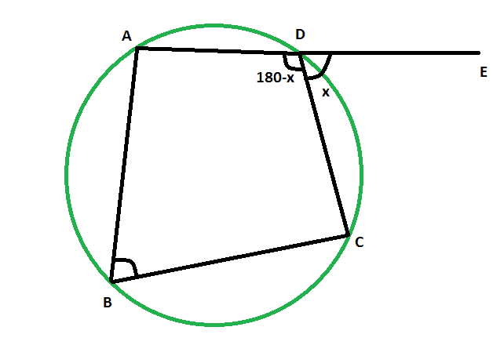

# 给定相反内角时循环四边形的外角

> 原文:[https://www . geesforgeks . org/当给定相反的内角时，外角为循环四边形/](https://www.geeksforgeeks.org/exterior-angle-of-a-cyclic-quadrilateral-when-the-opposite-interior-angle-is-given/)

给定圆内的循环四边形，当给定相反的内角时，任务是求循环四边形的外角。
**例:**

```
Input: 48 
Output: 48 degrees

Input: 83
Output: 83 degrees
```



**接近** :

*   让，外角，角度 **CDE = x**
*   而且，它相反的内角是角度 **ABC**
*   如， **ADE** 是一条直线
*   所以，角度 **ADC = (180-x)度**
*   因为循环四边形的相对角度是补充的，
*   角度 **ABC = x**


以下是上述方法的实施:

## C++

```
// C++ program to find the exterior angle
// of a cyclic quadrilateral when
// the opposite interior angle is given

#include <bits/stdc++.h>
using namespace std;

void angleextcycquad(int z)
{
    cout << "The exterior angle of the"
         << " cyclic quadrilateral is "
         << z << " degrees" << endl;
}

// Driver code
int main()
{
    int z = 48;
    angleextcycquad(z);
    return 0;
}
```

## Java 语言(一种计算机语言，尤用于创建网站)

```
// Java program to find the exterior angle
// of a cyclic quadrilateral when
// the opposite interior angle is given

import java.io.*;

class GFG
{

static void angleextcycquad(int z)
{
    System.out.print( "The exterior angle of the"
        + " cyclic quadrilateral is "
        + z +" degrees");
}

// Driver code
public static void main (String[] args)
{
        int z = 48;
    angleextcycquad(z);
}
}

// This code is contributed by anuj_67..
```

## 蟒蛇 3

```
# Python program to find the exterior angle
# of a cyclic quadrilateral when
# the opposite interior angle is given

def angleextcycquad(z):
    print("The exterior angle of the",end="");
    print("cyclic quadrilateral is ",end="");
    print(z," degrees");

# Driver code
z = 48;
angleextcycquad(z);

# This code is contributed by 29AjayKumar
```

## C#

```
// C# program to find the exterior angle
// of a cyclic quadrilateral when
// the opposite interior angle is given
using System;

class GFG
{

static void angleextcycquad(int z)
{
    Console.WriteLine( "The exterior angle of the"
        + " cyclic quadrilateral is "
        + z +" degrees");
}

// Driver code
public static void Main ()
{
        int z = 48;
    angleextcycquad(z);
}
}

// This code is contributed by anuj_67..
```

## java 描述语言

```
<script>
// javascript program to find the exterior angle
// of a cyclic quadrilateral when
// the opposite interior angle is given
function angleextcycquad(z)
{
    document.write( "The exterior angle of the"
        + " cyclic quadrilateral is "
        + z +" degrees");
}

// Driver code
var z = 48;
angleextcycquad(z);

// This code is contributed by Princi Singh
</script>
```

**Output:** 

```
The exterior angle of the cyclic quadrilateral is 48 degrees
```