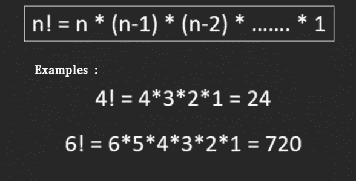

# 大数阶乘

> 原文:[https://www.geeksforgeeks.org/factorial-large-number/](https://www.geeksforgeeks.org/factorial-large-number/)

非负整数的阶乘，是所有小于或等于 n 的整数的乘积。例如，6 的阶乘是 6*5*4*3*2*1，等于 720。



我们已经讨论了阶乘的简单程序。

**如何用 C/C++程序计算 100 的阶乘？**
100 的阶乘有 158 位数字。即使我们使用 long long int，也不可能存储这么多数字。

**示例:**

```
Input : 100
Output : 933262154439441526816992388562667004-
         907159682643816214685929638952175999-
         932299156089414639761565182862536979-
         208272237582511852109168640000000000-
         00000000000000

Input :50
Output : 3041409320171337804361260816606476884-
         4377641568960512000000000000
```

下面是一个简单的解决方案，我们使用一个数组来存储结果的各个数字。这个想法是用基础数学进行乘法运算。

下面是寻找阶乘的详细算法。
***阶乘(n)***
1)创建一个最大大小的数组“res[]”，其中 MAX 是输出中的最大位数。
2)将存储在“res[]”中的值初始化为 1，并将“RES _ size”(RES[]”的大小)初始化为 1。
3)对从 x = 2 到 n 的所有数字执行以下操作。
……a)用 res[]乘以 x，并更新 res[]和 res_size 以存储乘法结果。

***如何将数字‘x’乘以 res[]中存储的数字？***
的想法是用简单的学校数学。我们将 x 与 res[]的每个数字一一相乘。这里需要注意的重要一点是，数字是从最右边的数字乘以最左边的数字。如果我们在 res[]中以相同的顺序存储数字，那么在没有额外空间的情况下很难更新 res[]。这就是为什么 res[]以相反的方式维护，即从右向左的数字被存储。

***乘法(res[]，x)***
1)初始化进位为 0。
2)对 i = 0 至 RES _ size–1
执行以下操作。a)求 res[i] * x +进位的值。让这个值被戳。
…。b)通过存储产品的最后一位数字来更新产品。
…。c)通过在进位中存储剩余数字来更新进位。
3)将进位的所有数字放在 res[]中，并按进位的位数增加 res_size。

```
Example to show working of multiply(res[], x)
A number 5189 is stored in res[] as following.
res[] = {9, 8, 1, 5}
x = 10

Initialize carry = 0;

i = 0, prod = res[0]*x + carry = 9*10 + 0 = 90.
res[0] = 0, carry = 9

i = 1, prod = res[1]*x + carry = 8*10 + 9 = 89
res[1] = 9, carry = 8

i = 2, prod = res[2]*x + carry = 1*10 + 8 = 18
res[2] = 8, carry = 1

i = 3, prod = res[3]*x + carry = 5*10 + 1 = 51
res[3] = 1, carry = 5

res[4] = carry = 5

res[] = {0, 9, 8, 1, 5} 
```

下面是上述算法的实现。

**注意:**在下面的实现中，输出中的最大位数假设为 500。要找到一个更大的数的阶乘(> 254)，增加数组的大小或最大值。

## C++

```
// C++ program to compute factorial of big numbers
#include<iostream>
using namespace std;

// Maximum number of digits in output
#define MAX 500

int multiply(int x, int res[], int res_size);

// This function finds factorial of large numbers
// and prints them
void factorial(int n)
{
    int res[MAX];

    // Initialize result
    res[0] = 1;
    int res_size = 1;

    // Apply simple factorial formula n! = 1 * 2 * 3 * 4...*n
    for (int x=2; x<=n; x++)
        res_size = multiply(x, res, res_size);

    cout << "Factorial of given number is \n";
    for (int i=res_size-1; i>=0; i--)
        cout << res[i];
}

// This function multiplies x with the number
// represented by res[].
// res_size is size of res[] or number of digits in the
// number represented by res[]. This function uses simple
// school mathematics for multiplication.
// This function may value of res_size and returns the
// new value of res_size
int multiply(int x, int res[], int res_size)
{
    int carry = 0;  // Initialize carry

    // One by one multiply n with individual digits of res[]
    for (int i=0; i<res_size; i++)
    {
        int prod = res[i] * x + carry;

        // Store last digit of 'prod' in res[] 
        res[i] = prod % 10; 

        // Put rest in carry
        carry  = prod/10;   
    }

    // Put carry in res and increase result size
    while (carry)
    {
        res[res_size] = carry%10;
        carry = carry/10;
        res_size++;
    }
    return res_size;
}

// Driver program
int main()
{
    factorial(100);
    return 0;
}
```

## Java 语言(一种计算机语言，尤用于创建网站)

```
// JAVA program to compute factorial
// of big numbers
class GFG {

    // This function finds factorial of
    // large numbers and prints them
    static void factorial(int n)
    {
        int res[] = new int[500];

        // Initialize result
        res[0] = 1;
        int res_size = 1;

        // Apply simple factorial formula
        // n! = 1 * 2 * 3 * 4...*n
        for (int x = 2; x <= n; x++)
            res_size = multiply(x, res, res_size);

        System.out.println("Factorial of given number is ");
        for (int i = res_size - 1; i >= 0; i--)
            System.out.print(res[i]);
    }

    // This function multiplies x with the number
    // represented by res[]. res_size is size of res[] or
    // number of digits in the number represented by res[].
    // This function uses simple school mathematics for
    // multiplication. This function may value of res_size
    // and returns the new value of res_size
    static int multiply(int x, int res[], int res_size)
    {
        int carry = 0; // Initialize carry

        // One by one multiply n with individual
        // digits of res[]
        for (int i = 0; i < res_size; i++)
        {
            int prod = res[i] * x + carry;
            res[i] = prod % 10; // Store last digit of
                                // 'prod' in res[]
            carry = prod/10; // Put rest in carry
        }

        // Put carry in res and increase result size
        while (carry!=0)
        {
            res[res_size] = carry % 10;
            carry = carry / 10;
            res_size++;
        }
        return res_size;
    }

    // Driver program
    public static void main(String args[])
    {
        factorial(100);
    }
}
//This code is contributed by Nikita Tiwari
```

## 计算机编程语言

```
# Python program to compute factorial
# of big numbers

import sys

# This function finds factorial of large
# numbers and prints them
def factorial( n) :
    res = [None]*500
    # Initialize result
    res[0] = 1
    res_size = 1

    # Apply simple factorial formula
    # n! = 1 * 2 * 3 * 4...*n
    x = 2
    while x <= n :
        res_size = multiply(x, res, res_size)
        x = x + 1

    print ("Factorial of given number is")
    i = res_size-1
    while i >= 0 :
        sys.stdout.write(str(res[i]))
        sys.stdout.flush()
        i = i - 1

# This function multiplies x with the number
# represented by res[]. res_size is size of res[]
# or number of digits in the number represented
# by res[]. This function uses simple school
# mathematics for multiplication. This function
# may value of res_size and returns the new value
# of res_size
def multiply(x, res,res_size) :

    carry = 0 # Initialize carry

    # One by one multiply n with individual
    # digits of res[]
    i = 0
    while i < res_size :
        prod = res[i] *x + carry
        res[i] = prod % 10; # Store last digit of
                            # 'prod' in res[]
        # make sure floor division is used
        carry = prod//10; # Put rest in carry
        i = i + 1

    # Put carry in res and increase result size
    while (carry) :
        res[res_size] = carry % 10
        # make sure floor division is used
        # to avoid floating value
        carry = carry // 10
        res_size = res_size + 1

    return res_size

# Driver program
factorial(100)

#This code is contributed by Nikita Tiwari.
```

## C#

```
// C# program to compute
// factorial of big numbers
using System;

class GFG
{

    // This function finds factorial
    // of large numbers and prints them
    static void factorial(int n)
    {
        int []res = new int[500];

        // Initialize result
        res[0] = 1;
        int res_size = 1;

        // Apply simple factorial formula
        // n! = 1 * 2 * 3 * 4...*n
        for (int x = 2; x <= n; x++)
            res_size = multiply(x, res,
                                res_size);

        Console.WriteLine("Factorial of " +
                       "given number is ");
        for (int i = res_size - 1; i >= 0; i--)
            Console.Write(res[i]);
    }

    // This function multiplies x
    // with the number represented
    // by res[]. res_size is size
    // of res[] or number of digits
    // in the number represented by
    // res[]. This function uses
    // simple school mathematics for
    // multiplication. This function
    // may value of res_size and
    // returns the new value of res_size
    static int multiply(int x, int []res,
                        int res_size)
    {
        int carry = 0; // Initialize carry

        // One by one multiply n with
        // individual digits of res[]
        for (int i = 0; i < res_size; i++)
        {
            int prod = res[i] * x + carry;
            res[i] = prod % 10; // Store last digit of
                                // 'prod' in res[]
            carry = prod / 10; // Put rest in carry
        }

        // Put carry in res and
        // increase result size
        while (carry != 0)
        {
            res[res_size] = carry % 10;
            carry = carry / 10;
            res_size++;
        }
        return res_size;
    }

    // Driver Code
    static public void Main ()
    {

        factorial(100);
    }
}

// This code is contributed by ajit
```

## 服务器端编程语言（Professional Hypertext Preprocessor 的缩写）

```
<?php
// PHP program to compute factorial
// of big numbers

// Maximum number of digits in output
$MAX = 500;

// This function finds factorial of
// large numbers and prints them
function factorial($n)
{
    global $MAX;
    $res = array_fill(0, $MAX, 0);

    // Initialize result
    $res[0] = 1;
    $res_size = 1;

    // Apply simple factorial formula
    // n! = 1 * 2 * 3 * 4...*n
    for ($x = 2; $x <= $n; $x++)
        $res_size = multiply($x, $res, $res_size);

    echo "Factorial of given number is \n";
    for ($i = $res_size - 1; $i >= 0; $i--)
        echo $res[$i];
}

// This function multiplies x with the number
// represented by res[].
// res_size is size of res[] or number of
// digits in the number represented by res[].
// This function uses simple school mathematics
// for multiplication. This function may value 
// of res_size and returns the new value of res_size
function multiply($x, &$res, $res_size)
{
    $carry = 0; // Initialize carry

    // One by one multiply n with individual
    // digits of res[]
    for ($i = 0; $i < $res_size; $i++)
    {
        $prod = $res[$i] * $x + $carry;

        // Store last digit of 'prod' in res[]
        $res[$i] = $prod % 10;

        // Put rest in carry
        $carry = (int)($prod / 10);
    }

    // Put carry in res and increase
    // result size
    while ($carry)
    {
        $res[$res_size] = $carry % 10;
        $carry = (int)($carry / 10);
        $res_size++;
    }
    return $res_size;
}

// Driver Code
factorial(100);

// This code is contributed by chandan_jnu
?>
```

## java 描述语言

```
<script>

// Javascript program to compute factorial of big numbers

// This function finds factorial of large numbers
// and prints them
function factorial(n)
{
    let res = new Array(500);

    // Initialize result
    res[0] = 1;
    let res_size = 1;

    // Apply simple factorial formula n! = 1 * 2 * 3 * 4...*n
    for (let x=2; x<=n; x++)
        res_size = multiply(x, res, res_size);

    document.write("Factorial of given number is " + "<br>");
    for (let i=res_size-1; i>=0; i--)
        document.write(res[i]);
}

// This function multiplies x with the number
// represented by res[].
// res_size is size of res[] or number of digits in the
// number represented by res[]. This function uses simple
// school mathematics for multiplication.
// This function may value of res_size and returns the
// new value of res_size
function multiply(x, res, res_size)
{
    let carry = 0; // Initialize carry

    // One by one multiply n with individual digits of res[]
    for (let i=0; i<res_size; i++)
    {
        let prod = res[i] * x + carry;

        // Store last digit of 'prod' in res[]
        res[i] = prod % 10;

        // Put rest in carry
        carry = Math.floor(prod/10);
    }

    // Put carry in res and increase result size
    while (carry)
    {
        res[res_size] = carry%10;
        carry = Math.floor(carry/10);
        res_size++;
    }
    return res_size;
}

// Driver program
    factorial(100);

// This  code is contributed by Mayank Tyagi

</script>
```

**Output**

```
Factorial of given number is 
93326215443944152681699238856266700490715968264381621468592963895217599993229915608941463976156518286253697920827223758251185210916864000000000000000000000000
```

上述方法可以通过多种方式进行优化。我们将很快讨论针对相同情况的优化解决方案。
本文由**哈什特·阿格沃尔**供稿。如果您发现任何不正确的地方，或者您想分享更多关于上面讨论的主题的信息，请写评论

### 程序 2: (BigInteger 方法)

大整数也可以用来计算大数的阶乘。

## Java 语言(一种计算机语言，尤用于创建网站)

```
// Java program to find large
// factorials using BigInteger
import java.math.BigInteger;
import java.util.Scanner;

public class Example {

    // Returns Factorial of N
    static BigInteger factorial(int N)
    {
        // Initialize result
        BigInteger f
            = new BigInteger("1"); // Or BigInteger.ONE

        // Multiply f with 2, 3, ...N
        for (int i = 2; i <= N; i++)
            f = f.multiply(BigInteger.valueOf(i));

        return f;
    }

    // Driver method
    public static void main(String args[]) throws Exception
    {
        int N = 20;
        System.out.println(factorial(N));
    }
}
```

**Output**

```
2432902008176640000
```

### **程序 3:(使用链接列表)**

链表也可以使用，这种方法不会浪费任何额外的空间。

## C++

```
#include <bits/stdc++.h>

using namespace std;

#define rep(i, a, b) for (int i = a; i <= b; i++)

using namespace std;
// Made a class node containing data and previous pointer as
// we are using tail pointer
class Node {
public:
    int data;
    Node* prev;
    Node(int n)
    {
        data = n;
        prev = NULL;
    }
};

void Multiply(Node* tail, int n)
{
    Node *temp = tail,
         *prevNode = tail; // Temp variable for keeping tail
    int carry = 0;
    while (temp != NULL) {
        int data = temp->data * n + carry;
        temp->data = data % 10; // stores the last digit
        carry = data / 10;
        prevNode = temp;
        temp = temp->prev; // Moving temp by 1 prevNode will
                           // now denote temp
    }
    // If carry is greater than 0 then we create another
    // node for it.
    while (carry != 0) {
        prevNode->prev = new Node((int)(carry % 10));
        carry /= 10;
        prevNode = prevNode->prev;
    }
}

void print(Node* tail)
{
    if (tail == NULL) // Using tail recursion
        return;
    print(tail->prev);
    cout
        << tail->data; // Print linked list in reverse order
}

// Driver code
int main()
{
    int n = 20;
    Node tail(1); // Create a node and initialise it by 1
    rep(i, 2, n)
        Multiply(&tail, i); // Run a loop from 2 to n and
                            // multiply with tail's i
    print(&tail); // Print the linked list
    cout << endl;
    return 0;
}

// This code is contributed by Kingshuk Deb
```

**Output**

```
2432902008176640000
```