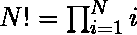
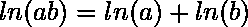
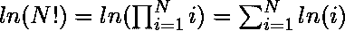
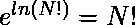

# 使用对数恒等式的大数阶乘

> 原文:[https://www . geeksforgeeks . org/大数阶乘-使用对数恒等式/](https://www.geeksforgeeks.org/factorial-of-large-numbers-using-logarithmic-identity/)

给定一个非常大的数 **N** ，任务是使用 Log 找到这个数的阶乘。

> [非负整数的阶乘](https://www.geeksforgeeks.org/program-for-factorial-of-a-number/)是所有小于或等于 **N** 的整数的乘积。

我们之前在本文中讨论了一个求阶乘的简单程序。在这里，我们将讨论一种寻找大数阶乘的有效方法。

**示例:**

> **输入:** N = 100
> **输出:**9332621544394415268169923885626670049071596826438162146859292963895、2993229156084、2994146397615、299932995、299915915615、2828625、299952179999329、2932929995、
> 
> **输入:**N = 50
> T3】输出:304140932017133780436126081660647688443764156896051200000000000000000000000000000000000000000000000000000000000000000

**方法:**最常见的迭代版本在预期的 O(N)时间内运行。但是随着数字变大，假设乘法需要恒定的时间将是错误的。天真的方法需要 O(K*M)时间进行乘法，其中 K 是乘数的长度，M 是被乘数的长度。因此，想法是使用对数属性:

我们知道和

因此:


另一个属性是

用 ln(N！).

下面是上述方法的实现:

## C++

```
// C++ program to compute the
// factorial of big numbers

#include <bits/stdc++.h>
using namespace std;

// Maximum number of digits
// in output
#define MAX 1000

// Function to find the factorial
// of large number and return
// them in string format
string factorial(long long n)
{
    if (n > MAX) {
        cout << " Integer Overflow"
             << endl;
        return "";
    }

    long long counter;
    long double sum = 0;

    // Base case
    if (n == 0)
        return "1";

    // Calculate the sum of
    // logarithmic values

    for (counter = 1; counter <= n;
         counter++) {
        sum = sum + log(counter);
    }

    // Number becomes too big to hold in
    // unsigned long integers.
    // Hence converted to string
    // Answer is sometimes under
    // estimated due to floating point
    // operations so round() is used
    string result
        = to_string(round(exp(sum)));

    return result;
}

// Driver code
int main()
{
    clock_t tStart = clock();
    string str;
    str = factorial(100);
    cout << "The factorial is: "
         << str << endl;

    // Calculates the time taken
    // by the algorithm to execute
    cout << "Time taken: " << setprecision(10)
         << ((double)(clock() - tStart)
             / CLOCKS_PER_SEC)
         << " s" << endl;
}
```

**Output:**

> 阶乘是:93326215443944231979346762015、249568315、249555555、24955、24955、24955、24955、24955、24955、24955、24955、24955、24955、24955、24955、2495955、2495955、2495955、2495958、2495955、2495955、2495

**时间复杂度:** *O(N)* ，其中 N 为给定数。