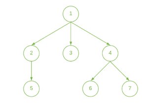
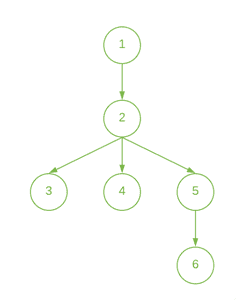

# 一个节点到一棵树的每个节点的最远距离

> 原文:[https://www . geeksforgeeks . org/距离树的每个节点最远的节点距离/](https://www.geeksforgeeks.org/farthest-distance-of-a-node-from-each-node-of-a-tree/)

给定一棵**树**，任务是找到给定树中从每个节点到另一个节点的最远节点。

**示例**

> **输入:**
> 
> [](https://media.geeksforgeeks.org/wp-content/uploads/20200729140404/DiameterTree-300x227.png)
> 
> **输出:**2 3 3 4 4 4
> **说明:**
> 距节点 1 : 2 的最大距离(节点{5，6，7}在距离 2)
> 距节点 2 : 3 的最大距离(节点{6，7}在距离 3)
> 距节点 3 : 3 的最大距离(节点{5，6， 7}在距离 3)
> 距节点 4 : 3 的最大距离(节点{5}在距离 3)
> 距节点 5 : 4 的最大距离(节点{6，7}在距离 4)
> 距节点 6 : 4 的最大距离(节点{5}在距离 4)
> 距节点 7 : 4 的最大距离(节点{5}在距离 4)
> 
> **输入:**
> 
> [](https://media.geeksforgeeks.org/wp-content/uploads/20200729143959/DiameterTree1-241x300.png)
> 
> **输出** : 3 2 3 3 2 3

**进场:**

按照以下步骤解决问题:

*   使用[离散傅立叶变换](https://www.geeksforgeeks.org/depth-first-search-or-dfs-for-a-graph/)计算树的每个节点的**高度**(假设叶节点在高度 1)
*   这给出了从一个节点到其“T2”子树中所有节点的最大距离。储存这些高度。
*   现在，执行 **DFS** 来计算节点与其所有祖先的最大距离。存储这些距离。
*   对于每个节点，打印计算出的两个距离的最大值。

下面是上述方法的实现:

## C++

```
// C++ Program to implement
// the above approach
#include <bits/stdc++.h>
using namespace std;

#define maxN 100001

// Adjacency List to store the graph
vector<int> adj[maxN];

// Stores the height of each node
int height[maxN];

// Stores the maximum distance of a
// node from its ancestors
int dist[maxN];

// Function to add edge between
// two vertices
void addEdge(int u, int v)
{
    // Insert edge from u to v
    adj[u].push_back(v);

    // Insert edge from v to u
    adj[v].push_back(u);
}

// Function to calculate height of
// each Node
void dfs1(int cur, int par)
{
    // Iterate in the adjacency
    // list of the current node
    for (auto u : adj[cur]) {

        if (u != par) {

            // Dfs for child node
            dfs1(u, cur);

            // Calculate height of nodes
            height[cur]
                = max(height[cur], height[u]);
        }
    }

    // Increase height
    height[cur] += 1;
}

// Function to calculate the maximum
// distance of a node from its ancestor
void dfs2(int cur, int par)
{
    int max1 = 0;
    int max2 = 0;

    // Iterate in the adjacency
    // list of the current node
    for (auto u : adj[cur]) {

        if (u != par) {

            // Find two children
            // with maximum heights
            if (height[u] >= max1) {
                max2 = max1;
                max1 = height[u];
            }
            else if (height[u] > max2) {
                max2 = height[u];
            }
        }
    }

    int sum = 0;

    for (auto u : adj[cur]) {
        if (u != par) {

            // Calculate the maximum distance
            // with ancestor for every node
            sum = ((max1 == height[u]) ? max2 : max1);

            if (max1 == height[u])
                dist[u]
                    = 1 + max(1 + max2, dist[cur]);
            else
                dist[u]
                    = 1 + max(1 + max1, dist[cur]);

            // Calculating for children
            dfs2(u, cur);
        }
    }
}

// Driver Code
int main()
{
    int n = 6;

    addEdge(1, 2);
    addEdge(2, 3);
    addEdge(2, 4);
    addEdge(2, 5);
    addEdge(5, 6);

    // Calculate height of
    // nodes of the tree
    dfs1(1, 0);

    // Calculate the maximum
    // distance with ancestors
    dfs2(1, 0);

    // Print the maximum of the two
    // distances from each node
    for (int i = 1; i <= n; i++)
        cout << (max(dist[i], height[i]) - 1) << " ";

    return 0;
}
```

## Java 语言(一种计算机语言，尤用于创建网站)

```
// Java program to implement
// the above approach
import java.util.*;

class GFG{

static final int maxN = 100001;

// Adjacency List to store the graph
@SuppressWarnings("unchecked")
static Vector<Integer> []adj = new Vector[maxN];

// Stores the height of each node
static int []height = new int[maxN];

// Stores the maximum distance of a
// node from its ancestors
static int []dist = new int[maxN];

// Function to add edge between
// two vertices
static void addEdge(int u, int v)
{

    // Insert edge from u to v
    adj[u].add(v);

    // Insert edge from v to u
    adj[v].add(u);
}

// Function to calculate height of
// each Node
static void dfs1(int cur, int par)
{

    // Iterate in the adjacency
    // list of the current node
    for(int u : adj[cur])
    {
        if (u != par)
        {

            // Dfs for child node
            dfs1(u, cur);

            // Calculate height of nodes
            height[cur] = Math.max(height[cur],
                                   height[u]);
        }
    }

    // Increase height
    height[cur] += 1;
}

// Function to calculate the maximum
// distance of a node from its ancestor
static void dfs2(int cur, int par)
{
    int max1 = 0;
    int max2 = 0;

    // Iterate in the adjacency
    // list of the current node
    for(int u : adj[cur])
    {
        if (u != par)
        {

            // Find two children
            // with maximum heights
            if (height[u] >= max1)
            {
                max2 = max1;
                max1 = height[u];
            }
            else if (height[u] > max2)
            {
                max2 = height[u];
            }
        }
    }
    int sum = 0;

    for(int u : adj[cur])
    {
        if (u != par)
        {

            // Calculate the maximum distance
            // with ancestor for every node
            sum = ((max1 == height[u]) ?
                    max2 : max1);

            if (max1 == height[u])
                dist[u] = 1 + Math.max(1 + max2,
                                       dist[cur]);
            else
                dist[u] = 1 + Math.max(1 + max1,
                                       dist[cur]);

            // Calculating for children
            dfs2(u, cur);
        }
    }
}

// Driver Code
public static void main(String[] args)
{
    int n = 6;
    for(int i = 0; i < adj.length; i++)
        adj[i] = new Vector<Integer>();

    addEdge(1, 2);
    addEdge(2, 3);
    addEdge(2, 4);
    addEdge(2, 5);
    addEdge(5, 6);

    // Calculate height of
    // nodes of the tree
    dfs1(1, 0);

    // Calculate the maximum
    // distance with ancestors
    dfs2(1, 0);

    // Print the maximum of the two
    // distances from each node
    for(int i = 1; i <= n; i++)
        System.out.print((Math.max(dist[i],
                                 height[i]) - 1) + " ");
}
}

// This code is contributed by 29AjayKumar
```

## 蟒蛇 3

```
# Python3 program to implement
# the above approach
maxN = 100001

# Adjacency List to store the graph
adj = [[] for i in range(maxN)]

# Stores the height of each node
height = [0 for i in range(maxN)]

# Stores the maximum distance of a
# node from its ancestors
dist = [0 for i in range(maxN)]

# Function to add edge between
# two vertices
def addEdge(u, v):

    # Insert edge from u to v
    adj[u].append(v)

    # Insert edge from v to u
    adj[v].append(u)

# Function to calculate height of
# each Node
def dfs1(cur, par):

    # Iterate in the adjacency
    # list of the current node
    for u in adj[cur]:
        if (u != par):

            # Dfs for child node
            dfs1(u, cur)

            # Calculate height of nodes
            height[cur] = max(height[cur],
                              height[u])

    # Increase height
    height[cur] += 1

# Function to calculate the maximum
# distance of a node from its ancestor
def dfs2(cur, par):

    max1 = 0
    max2 = 0

    # Iterate in the adjacency
    # list of the current node
    for u in adj[cur]:
        if (u != par):

            # Find two children
            # with maximum heights
            if (height[u] >= max1):
                max2 = max1
                max1 = height[u]

            elif (height[u] > max2):
                max2 = height[u]

    sum = 0

    for u in adj[cur]:
        if (u != par):

            # Calculate the maximum distance
            # with ancestor for every node
            sum = (max2 if (max1 == height[u]) else max1)

            if (max1 == height[u]):
                dist[u] = 1 + max(1 + max2, dist[cur])
            else:
                dist[u] = 1 + max(1 + max1, dist[cur])

            # Calculating for children
            dfs2(u, cur)

# Driver Code
if __name__=="__main__":

    n = 6

    addEdge(1, 2)
    addEdge(2, 3)
    addEdge(2, 4)
    addEdge(2, 5)
    addEdge(5, 6)

    # Calculate height of
    # nodes of the tree
    dfs1(1, 0)

    # Calculate the maximum
    # distance with ancestors
    dfs2(1, 0)

    # Print the maximum of the two
    # distances from each node
    for i in range(1, n + 1):
        print(max(dist[i],
                height[i]) - 1, end = ' ')

# This code is contributed by rutvik_56
```

## C#

```
// C# program to implement
// the above approach
using System;
using System.Collections.Generic;

class GFG{

static readonly int maxN = 100001;

// Adjacency List to store the graph
static List<int> []adj = new List<int>[maxN];

// Stores the height of each node
static int []height = new int[maxN];

// Stores the maximum distance of a
// node from its ancestors
static int []dist = new int[maxN];

// Function to add edge between
// two vertices
static void addEdge(int u, int v)
{

    // Insert edge from u to v
    adj[u].Add(v);

    // Insert edge from v to u
    adj[v].Add(u);
}

// Function to calculate height of
// each Node
static void dfs1(int cur, int par)
{

    // Iterate in the adjacency
    // list of the current node
    foreach(int u in adj[cur])
    {
        if (u != par)
        {

            // Dfs for child node
            dfs1(u, cur);

            // Calculate height of nodes
            height[cur] = Math.Max(height[cur],
                                   height[u]);
        }
    }

    // Increase height
    height[cur] += 1;
}

// Function to calculate the maximum
// distance of a node from its ancestor
static void dfs2(int cur, int par)
{
    int max1 = 0;
    int max2 = 0;

    // Iterate in the adjacency
    // list of the current node
    foreach(int u in adj[cur])
    {
        if (u != par)
        {

            // Find two children
            // with maximum heights
            if (height[u] >= max1)
            {
                max2 = max1;
                max1 = height[u];
            }
            else if (height[u] > max2)
            {
                max2 = height[u];
            }
        }
    }
    int sum = 0;

    foreach(int u in adj[cur])
    {
        if (u != par)
        {

            // Calculate the maximum distance
            // with ancestor for every node
            sum = ((max1 == height[u]) ?
                    max2 : max1);

            if (max1 == height[u])
                dist[u] = 1 + Math.Max(1 + max2,
                                       dist[cur]);
            else
                dist[u] = 1 + Math.Max(1 + max1,
                                       dist[cur]);

            // Calculating for children
            dfs2(u, cur);
        }
    }
}

// Driver Code
public static void Main(String[] args)
{
    int n = 6;
    for(int i = 0; i < adj.Length; i++)
        adj[i] = new List<int>();

    addEdge(1, 2);
    addEdge(2, 3);
    addEdge(2, 4);
    addEdge(2, 5);
    addEdge(5, 6);

    // Calculate height of
    // nodes of the tree
    dfs1(1, 0);

    // Calculate the maximum
    // distance with ancestors
    dfs2(1, 0);

    // Print the maximum of the two
    // distances from each node
    for(int i = 1; i <= n; i++)
        Console.Write((Math.Max(dist[i],
                                height[i]) - 1) + " ");
}
}

// This code is contributed by Rohit_ranjan
```

## java 描述语言

```
<script>

    // JavaScript program to implement the above approach

    let maxN = 100001;

    // Adjacency List to store the graph
    let adj = new Array(maxN);
    adj.fill(0);

    // Stores the height of each node
    let height = new Array(maxN);
    height.fill(0);

    // Stores the maximum distance of a
    // node from its ancestors
    let dist = new Array(maxN);
    dist.fill(0);

    // Function to add edge between
    // two vertices
    function addEdge(u, v)
    {

        // Insert edge from u to v
        adj[u].push(v);

        // Insert edge from v to u
        adj[v].push(u);
    }

    // Function to calculate height of
    // each Node
    function dfs1(cur, par)
    {

        // Iterate in the adjacency
        // list of the current node
        for(let u  = 0; u < adj[cur].length; u++)
        {
            if (adj[cur][u] != par)
            {

                // Dfs for child node
                dfs1(adj[cur][u], cur);

                // Calculate height of nodes
                height[cur] = Math.max(height[cur],
                                       height[adj[cur][u]]);
            }
        }

        // Increase height
        height[cur] += 1;
    }

    // Function to calculate the maximum
    // distance of a node from its ancestor
    function dfs2(cur, par)
    {
        let max1 = 0;
        let max2 = 0;

        // Iterate in the adjacency
        // list of the current node
        for(let u = 0; u < adj[cur].length; u++)
        {
            if (adj[cur][u] != par)
            {

                // Find two children
                // with maximum heights
                if (height[adj[cur][u]] >= max1)
                {
                    max2 = max1;
                    max1 = height[adj[cur][u]];
                }
                else if (height[adj[cur][u]] > max2)
                {
                    max2 = height[adj[cur][u]];
                }
            }
        }
        let sum = 0;

        for(let u = 0; u < adj[cur].length; u++)
        {
            if (adj[cur][u] != par)
            {

                // Calculate the maximum distance
                // with ancestor for every node
                sum = ((max1 == height[adj[cur][u]]) ?
                        max2 : max1);

                if (max1 == height[adj[cur][u]])
                    dist[adj[cur][u]] = 1 + Math.max(1 + max2,
                                           dist[cur]);
                else
                    dist[adj[cur][u]] = 1 + Math.max(1 + max1,
                                           dist[cur]);

                // Calculating for children
                dfs2(adj[cur][u], cur);
            }
        }
    }

    let n = 6;
    for(let i = 0; i < adj.length; i++)
        adj[i] = [];

    addEdge(1, 2);
    addEdge(2, 3);
    addEdge(2, 4);
    addEdge(2, 5);
    addEdge(5, 6);

    // Calculate height of
    // nodes of the tree
    dfs1(1, 0);

    // Calculate the maximum
    // distance with ancestors
    dfs2(1, 0);

    // Print the maximum of the two
    // distances from each node
    for(let i = 1; i <= n; i++)
        document.write((Math.max(dist[i],
                                height[i]) - 1) + " ");

</script>
```

**Output:** 

```
3 2 3 3 2 3
```

***时间复杂度:** O(V+E)*
***辅助空间:** O(N)*