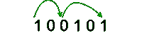

# 在 K 跳中二进制字符串中，通过交替跳位可以到达的最远位置

> 原文:[https://www . geeksforgeeks . org/二进制字符串中可到达的最远位置通过在交替数字上跳跃来跳跃/](https://www.geeksforgeeks.org/farthest-position-that-can-be-reached-in-a-binary-string-in-k-jumps-by-jumping-on-alternate-digits/)

给定一个长度为 **N** 的二进制字符串 **S** 和一个整数 **K** ，任务是精确计算从**中的第一个位置开始的**最远的**位置。
只有在下列情况下，才能从索引 I 跳转到索引 j:**

*   我！= j
*   如果其中一个字符是“0”，另一个字符是“1”。

**示例**:

> **输入**:S =【100101】，K = 2
> **输出** : 6
> **说明**:可以采取以下步骤:1 - > 5 - > 6，这样正好 2 跳就可以达到第 6 个指标
> 
> 
> 
> **输入** : S = "10111 "，K = 1
> **输出** : 2
> **解释**:可以采取以下步骤:1 - > 2，因此 2 跳正好可以达到第 2 个指标

**进场:**对问题的**主**观察是 **0s** 和 **1s** 的**连续**图案可以用**单 0** 或**单 1** 代替，因为不能在相似的字符之间跳转。在替换了 **0s** 和 **1s** 的这些连续图案之后，现在，人们可以简单地检查一下**新图案**是否表示形成的 **str** 小于或等于 **K** 那么**不可能随着 **K** 的移动而到达某个点，否则，该位置只是包含字符**的实际图案中从右侧开始的**第一个位置******

按照以下步骤解决问题:

*   从给定字符串 i = 0 到 i = N-1 的开始到结束迭代，并在用单个 0 替换所有连续的 0 子模式，用单个 1 替换所有连续的 1 子模式后生成新的字符串。
*   现在，检查新形成的字符串长度是否**小于**等于 K，然后打印 **-1**
*   否则，如果新形成的字符串的长度**大于**大于 K，那么只需从右侧打印字符**字符串【K】**的基于 1 的位置。

下面是上述方法的实现:

## C++

```
// C++ program for the above approach
#include <bits/stdc++.h>
using namespace std;

// Function to find the farthest point
void get(string s, int k)
{
    // Store the answer
    int ans = 0;

    // Find the new string str
    string str = "";
    str += s[0];

    // Variables to count the zeroes and ones
    int cnt1 = 0, cnt0 = 0;
    int n = s.length();

    // Boolean variable to keep track of the subpattern
    bool isOne;

    if (s[0] == '0')
        isOne = false;

    // Iterate over the string and remove the
    // continuous patterns of 0s and 1s
    for (int i = 1; i < n; i++) {
        if (s[i] == '0' && isOne) {
            str += s[i];
            isOne = !isOne;
        }
        else if (s[i] == '1' && !isOne) {
            str += s[i];
            isOne = !isOne;
        }
    }

    // Count the number of zeroes and ones
    for (int i = 0; i < n; i++) {
        if (str[i] == '0')
            cnt0++;
        else
            cnt1++;
    }

    // Check if the K jumps are not possible
    if (str.length() <= k) {
        cout << -1 << endl;
        return;
    }

    // If K jumps are possible
    for (int i = n - 1; i >= 0; i--) {
        if (s[i] == str[k]) {
            ans = i + 1;
            break;
        }
    }
    cout << ans + 1 << endl;
}

// Driver Code
int main()
{
    string s = "100101";
    int k = 2;
    get(s, k);
    return 0;
}
```

## Java 语言(一种计算机语言，尤用于创建网站)

```
// Java program for the above approach
import java.util.*;
public class GFG
{
// Function to find the farthest point
static void get(String s, int k)
{
    // Store the answer
    int ans = 0;

    // Find the new string str
    String str = "";
    str += s.charAt(0);

    // Variables to count the zeroes and ones
    int cnt1 = 0, cnt0 = 0;
    int n = s.length();

    // Boolean variable to keep track of the subpattern
    boolean isOne = false;

    if (s.charAt(0) == '0')
        isOne = false;

    // Iterate over the string and remove the
    // continuous patterns of 0s and 1s
    for (int i = 1; i < n; i++) {
        if (s.charAt(i) == '0' && isOne) {
            str += s.charAt(i);
            isOne = !isOne;
        }
        else if (s.charAt(i) == '1' && !isOne) {
            str += s.charAt(i);
            isOne = !isOne;
        }
    }

    // Count the number of zeroes and ones
    for (int i = 0; i < str.length(); i++) {
        if (str.charAt(i) == '0')
            cnt0++;
        else
            cnt1++;
    }

    // Check if the K jumps are not possible
    if (str.length() <= k) {
        System.out.print(-1);
        return;
    }

    // If K jumps are possible
    for (int i = n - 1; i >= 0; i--) {
        if (s.charAt(i) == str.charAt(k)) {
            ans = i + 1;
            break;
        }
    }
    System.out.print(ans + 1);
}

// Driver Code
public static void main(String args[])
{
    String s = "100101";
    int k = 2;
    get(s, k);
}
}
// This code is contributed by Samim Hossain Mondal
```

## 蟒蛇 3

```
# Python3 program for the above approach

# Function to find the farthest point
def get(s, k) :

    # Store the answer
    ans = 0;

    # Find the new string str
    string = "";
    string += s[0];

    # Variables to count the zeroes and ones
    cnt1 = 0; cnt0 = 0;
    n = len(s);

    # Boolean variable to keep track of the subpattern
    isOne=False;

    if (s[0] == '0') :
        isOne = False;

    # Iterate over the string and remove the
    # continuous patterns of 0s and 1s
    for i in range(1, n) :
        if (s[i] == '0' and isOne) :
            string += s[i];
            isOne = not isOne;

        elif (s[i] == '1' and (not isOne)) :
            string += s[i];
            isOne = not isOne;

    # Count the number of zeroes and ones
    for i in range(len(string)) :
        if (string[i] == '0') :
            cnt0 += 1;
        else :
            cnt1 += 1;

    # Check if the K jumps are not possible
    if (len(string) <= k) :
        print(-1) ;
        return;

    # If K jumps are possible
    for i in range(n - 1, -1, -1) :

        if (s[i] == string[k]) :
            ans = i + 1;
            break;
    print(ans + 1);

# Driver Code
if __name__ ==  "__main__" :

    s = "100101";
    k = 2;
    get(s, k);

    # This code is contributed by AnkThon
```

## C#

```
// C# program for the above approach
using System;
class GFG
{
// Function to find the farthest point
static void get(string s, int k)
{
    // Store the answer
    int ans = 0;

    // Find the new string str
    string str = "";
    str += s[0];

    // Variables to count the zeroes and ones
    int cnt1 = 0, cnt0 = 0;
    int n = s.Length;

    // Bool variable to keep track of the subpattern
    bool isOne = false;

    if (s[0] == '0')
        isOne = false;

    // Iterate over the string and remove the
    // continuous patterns of 0s and 1s
    for (int i = 1; i < n; i++) {
        if (s[i] == '0' && isOne) {
            str += s[i];
            isOne = !isOne;
        }
        else if (s[i] == '1' && !isOne) {
            str += s[i];
            isOne = !isOne;
        }
    }

    // Count the number of zeroes and ones
    for (int i = 0; i < str.Length; i++) {
        if (str[i] == '0')
            cnt0++;
        else
            cnt1++;
    }

    // Check if the K jumps are not possible
    if (str.Length <= k) {
        Console.Write(-1);
        return;
    }

    // If K jumps are possible
    for (int i = n - 1; i >= 0; i--) {
        if (s[i] == str[k]) {
            ans = i + 1;
            break;
        }
    }
    Console.Write(ans + 1);
}

// Driver Code
public static void Main()
{
    string s = "100101";
    int k = 2;
    get(s, k);
}
}
// This code is contributed by Samim Hossain Mondal
```

## java 描述语言

```
<script>
        // JavaScript Program to implement
        // the above approach

        // Function to find the farthest point
        function get(s, k)
        {

            // Store the answer
            let ans = 0;

            // Find the new string str
            let str = "";
            str += s[0];

            // Variables to count the zeroes and ones
            let cnt1 = 0, cnt0 = 0;
            let n = s.length;

            // Boolean variable to keep track of the subpattern
            let isOne;

            if (s[0] == '0')
                isOne = false;

            // Iterate over the string and remove the
            // continuous patterns of 0s and 1s
            for (let i = 1; i < n; i++) {
                if (s[i] == '0' && isOne) {
                    str += s[i];
                    isOne = !isOne;
                }
                else if (s[i] == '1' && !isOne) {
                    str += s[i];
                    isOne = !isOne;
                }
            }

            // Count the number of zeroes and ones
            for (let i = 0; i < n; i++) {
                if (str[i] == '0')
                    cnt0++;
                else
                    cnt1++;
            }

            // Check if the K jumps are not possible
            if (str.length <= k) {
                document.write(-1 + '<br>');
                return;
            }

            // If K jumps are possible
            for (let i = n - 1; i >= 0; i--) {
                if (s[i] == str[k]) {
                    ans = i + 1;
                    break;
                }
            }
            document.write(ans + 1 + '<br>');
        }

        // Driver Code

        let s = "100101";
        let k = 2;
        get(s, k);

    // This code is contributed by Potta Lokesh
    </script>
```

**Output**

```
6
```

***时间复杂度*****:**O(N)
***辅助空间*** **:** O(1)