# 多项式乘法的快速傅立叶变换

> 原文:[https://www . geeksforgeeks . org/fast-Fourier-transformation-poynomial-乘法/](https://www.geeksforgeeks.org/fast-fourier-transformation-poynomial-multiplication/)

给定两个多项式 A(x)和 B(x)，求乘积 C(x) = A(x)*B(x)。已经有一种 O( 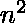)幼稚的方法可以解决这个问题。[这里](https://www.geeksforgeeks.org/multiply-two-polynomials-2/)。这种方法使用多项式的系数形式来计算乘积。
多项式的系数表示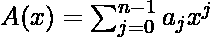是 a = a0，a1，…，an-1。

**例-**
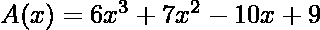
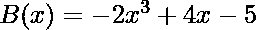
系数表示 A(x) = (9，-10，7，6)
系数表示 B(x) = (-5，4，0，-2)

```
Input :
 A[] = {9, -10, 7, 6}
 B[] = {-5, 4, 0, -2}
Output : 

```

如果我们用另一种形式表示多项式，我们可以做得更好。

yes

想法是用点值形式表示多项式，然后计算乘积。次数有界 n 的多项式 A(x)的点值表示是 n 个点值对的集合，是{ (x0，y0)，(x1，y1)，…，(xn-1，yn-1)}使得所有的 xi 都是不同的，并且对于 i = 0，1，…，n-1，yi = A(xi)。

例子

```

 xi    -- 0, 1, 2, 3

 A(xi) -- 1, 0, 5, 22
```

上述多项式的点值表示为{ (0，1)，(1，0)，(2，5)，(3，22) }。使用霍纳的方法，([这里讨论](https://www.geeksforgeeks.org/horners-method-polynomial-evaluation/))，n 点评估需要时间 O( )。这只是对 n 个不同点的某个 x 处的 A(x)值的计算，所以时间复杂度为 O( )。现在多项式转换为点值，可以很容易地再次使用霍纳方法计算 C(x) = A(x)*B(x)。这需要 O(n)个时间。这里很重要的一点是 C(x)有度界 2n，那么 n 个点将只给出 C(x)的 n 个点，所以对于那种情况，我们需要 2n 个不同的 x 值来计算 2n 个不同的 y 值。现在乘积被计算出来了，答案可以重新转换成系数向量的形式。为了回到系数向量形式，我们使用这个评估的逆。求值的逆过程称为插值。使用拉格朗日公式的插值给出多项式的点值形式到系数向量形式。拉格朗日公式是–
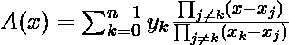
到目前为止我们讨论过，

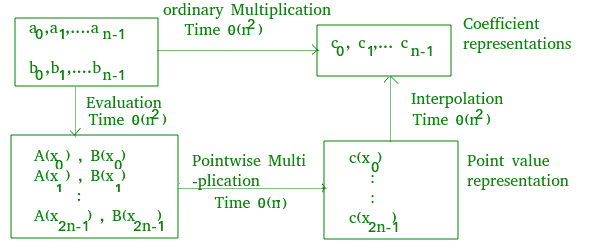

。
这个思路还是解决了 O( )时间复杂度上的问题。我们可以使用任何我们想要的点作为评估点，但是通过仔细选择评估点，我们可以仅在 O(n log n)时间内在表示之间进行转换。如果我们选择“单位的复根”作为评估点，我们可以通过对系数向量进行离散傅立叶变换来产生点值表示。我们可以通过取点-值对的“逆离散傅立叶变换”来执行逆运算，即插值，产生一个系数向量。快速傅里叶变换可以在时间上进行离散傅里叶变换和逆离散傅里叶变换。

**离散傅立叶变换**
离散傅立叶变换是在单位的 n 个复数 n 个根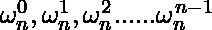处计算多项式的值。所以，对于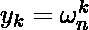 k = 0，1，2，…，n-1，y = (y0，y1，y2，…，yn-1)是给定多项式的离散傅里叶变换。
两个次数界为 n 的多项式的乘积是次数界为 2n 的多项式。因此，在评估输入多项式 A 和 B 之前，我们首先通过添加 n 个 0 的高阶系数将它们的度界加倍到 2n。因为向量有 2n 个元素，所以我们使用“复数的第 2n 个单位根”，用 W2n(ω2n)表示。我们假设 n 是 2 的幂；我们总是可以通过增加高阶零系数来满足这个要求。

**FFT**
下面是解决这个问题的各个击破策略。
分别使用 A(x)的偶指数系数和奇指数系数定义两个新的度界 n/2 多项式
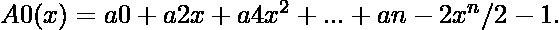
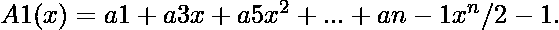
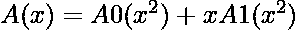
在求 A(x)的问题简化为在
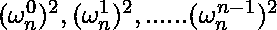
点求度界 n/2 多项式 A0(x)和 A1(x)的问题现在结合的结果

列表不包含 n 个不同的值，而是 n/2 个复数 n/2 个单位根。多项式 A0 和 A1 在单位的 n 个复数 n 次根处递归求值。子问题的形式与原问题完全相同，但大小只有原问题的一半。所以形成的递归是 T(n) = 2T(n/2) + O(n)，即复杂度 O(nlogn)。

```
Algorithm
1\. Add n higher-order zero coefficients to A(x) and B(x)
2\. Evaluate A(x) and B(x) using FFT for 2n points
3\. Pointwise multiplication of point-value forms
4\. Interpolate C(x) using FFT to compute inverse DFT
```

递归快速傅立叶变换伪码

```
Recursive_FFT(a){
n = length(a) // a is the input coefficient vector
if n = 1
  then return a

// wn is principle complex nth root of unity.
wn = e^(2*pi*i/n)
w = 1

// even indexed coefficients
A0 = (a0, a2, ..., an-2 )

// odd indexed coefficients
A1 = (a1, a3, ..., an-1 ) 

y0 = Recursive_FFT(A0) // local array
y1 = Recursive-FFT(A1) // local array

for k = 0 to n/2 - 1

  // y array stores values of the DFT 
  // of given polynomial. 
  do y[k] = y0[k] + w*y1[k]  
     y[k+(n/2)] = y0[k] - w*y1[k]
     w = w*wn
return y
}
Recursion Tree of Above Execution-
```

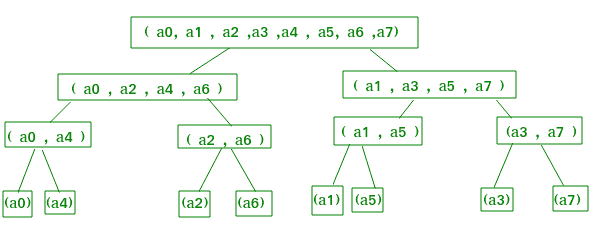

为什么会这样？
![y_{k} = y_{k}^{[0]} + \omega ^{k}_{n}y^{[1]}_{k}\newline y_{k} = A^{[0]}(\omega ^{2k}_{n})) + \omega ^{k}_{n}A^{[1]}(\omega ^{2k}_{n}) \newline y_{k} = A( \omega ^{k}_{n}) \newline \newline y_{k+(n/2)} = y_{k}^{[0]} - \omega ^{k}_{n}y^{[1]}_{k}\newline y_{k+(n/2)} = y_{k}^{[0]} + \omega ^{k+(n/2)}_{n} y_{k}^{[1]}\newline y_{k+(n/2)} = A^{[0]}(\omega ^{2k}_{n})) + \omega ^{k+(n/2)}_{n}A^{[1]}(\omega ^{2k}_{n})\newline y_{k+(n/2)} = A^{[0]}(\omega ^{2k+n}_{n})) + \omega ^{k+(n/2)}_{n}A^{[1]}(\omega ^{2k+n}_{n})\newline y_{k+(n/2)} = A^{[0]}(\omega ^{k+(n/2)}_{n}))  ](img/333e2be9e321004b05af00c8ffe8321e.png "Rendered by QuickLaTeX.com")
自，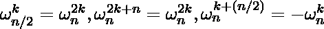
由此可见，递归-FFT 返回的向量 y 确实是输入
向量 a 的 DFT

## C++

```
#include <bits/stdc++.h>
using namespace std;

// For storing complex values of nth roots
// of unity we use complex<double>
typedef complex<double> cd;

// Recursive function of FFT
vector<cd> fft(vector<cd>& a)
{
    int n = a.size();

    // if input contains just one element
    if (n == 1)
        return vector<cd>(1, a[0]);

    // For storing n complex nth roots of unity
    vector<cd> w(n);
    for (int i = 0; i < n; i++) {
        double alpha = -2 * M_PI * i / n;
        w[i] = cd(cos(alpha), sin(alpha));
    }

    vector<cd> A0(n / 2), A1(n / 2);
    for (int i = 0; i < n / 2; i++) {

        // even indexed coefficients
        A0[i] = a[i * 2];

        // odd indexed coefficients
        A1[i] = a[i * 2 + 1];
    }

    // Recursive call for even indexed coefficients
    vector<cd> y0 = fft(A0);

    // Recursive call for odd indexed coefficients
    vector<cd> y1 = fft(A1);

    // for storing values of y0, y1, y2, ..., yn-1.
    vector<cd> y(n);

    for (int k = 0; k < n / 2; k++) {
        y[k] = y0[k] + w[k] * y1[k];
        y[k + n / 2] = y0[k] - w[k] * y1[k];
    }
    return y;
}

// Driver code
int main()
{
    vector<cd> a{1, 2, 3, 4};
    vector<cd> b = fft(a);
    for (int i = 0; i < 4; i++)
        cout << b[i] << endl;

    return 0;
}
```

## 蟒蛇 3

```
from math import sin,cos,pi

# Recursive function of FFT
def fft(a):

    n = len(a)

    # if input contains just one element
    if n == 1:
        return [a[0]]

    # For storing n complex nth roots of unity
    theta = -2*pi/n
    w = list( complex(cos(theta*i), sin(theta*i)) for i in range(n) )

    # Separe coefficients
    Aeven = a[0::2]
    Aodd  = a[1::2]

    # Recursive call for even indexed coefficients
    Yeven = fft(Aeven)

    # Recursive call for odd indexed coefficients
    Yodd = fft(Aodd)

    # for storing values of y0, y1, y2, ..., yn-1.
    Y = [0]*n

    middle = n//2
    for k in range(n//2):
        w_yodd_k  = w[k] * Yodd[k]
        yeven_k   =  Yeven[k]

        Y[k]          =  yeven_k  +  w_yodd_k
        Y[k + middle] =  yeven_k  -  w_yodd_k

    return Y

# Driver code
if __name__ == '__main__':

    a = [1, 2, 3, 4]
    b = fft(a)
    for B in b:
        print(B)
```

```
Input:  1 2 3 4
Output:
(10, 0)
(-2, 2)
(-2, 0)
(-2,-2)
```

**插值**
切换 a 和 y 的角色，
用 wn^-1.替换 wn
将结果的每个元素除以 n。
时间复杂度:O(nlogn)。