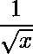
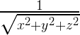
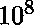
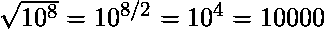
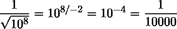

# 快速反平方根

> 原文:[https://www.geeksforgeeks.org/fast-inverse-square-root/](https://www.geeksforgeeks.org/fast-inverse-square-root/)

快速求逆平方根是一种估计的算法，T0 是 IEEE 754 浮点格式的 32 位浮点数 x 的平方根的倒数(或乘法逆)。计算倒数平方根在许多应用中是必要的，例如视频游戏中的向量归一化，并且主要用于 3D 编程中涉及的计算。在三维图形中，使用表面法线(长度为 1 的 3 坐标向量)来表示光照和反射。有很多表面法线。计算它们需要归一化很多向量。正常化通常只是分裂的一个花哨术语。毕达哥拉斯定理计算点与点之间的距离，除以距离有助于向量标准化:


这种算法最著名的实现是在 1999 年 [Quake III 竞技场游戏](https://en.wikipedia.org/wiki/Quake_III_Arena)的源代码中，这是一款大量使用 3D 图形的第一人称射击视频游戏。当时，计算一个浮点数的倒数通常在计算上很昂贵，尤其是在大规模上；快速反平方根绕过了这一步。

**算法:**
**步骤 1 :** 它将浮点输入的位重新解释为整数。

```
i  = * ( long * ) &y; 

```

**第二步:**取结果值，对其进行整数运算，得到我们要找的值的近似值。

```
i  = 0x5f3759df - ( i >> 1 );

```

**第三步:**结果不是近似值，而是一个整数，如果你将这些位重新解释为浮点数，它就是近似值。因此，代码执行与第 1 步相反的转换，返回浮点:

```
y  = * ( float * ) &i;

```

**第 4 步:**最后运行牛顿法的单次迭代来改进逼近。

```
y  = y * ( threehalfs - ( x2 * y * y ) );         //threehalfs = 1.5F;

```

该算法接受 32 位浮点数作为输入，并存储一个减半的值供以后使用。然后，将代表浮点数的位视为 32 位整数，执行逻辑右移一位，并从幻数 0x5F3759DF 中减去结果。这是输入平方根倒数的第一个近似值。再次将这些位视为浮点数，它运行牛顿近似法的一次迭代，产生更精确的近似。

假设有一个指数形式或科学符号的数字:
 =1 亿
现在，为了找到规则的平方根，我们只需将指数除以 2:

如果想知道平方根的倒数，将指数除以-2 即可翻转符号:


因此，代码将浮点数转换为整数。然后，它将这些位移位 1，这意味着指数位被 2 除(当我们最终将这些位变回浮点数时)。最后，为了否定指数，我们从幻数 0x5f3759df 中减去。这做了一些事情:它保留了尾数(非指数部分，又名 5 in: 5 )，处理奇偶指数，将位从指数转移到尾数，以及各种时髦的东西。

下面的代码是地震三竞技场的快速平方根实现(确切的原始评论写在地震三竞技场游戏中)。

```
// CPP program for fast inverse square root.
#include<bits/stdc++.h>
using namespace std;

// function to find the inverse square root
float inverse_rsqrt( float number )
{
    const float threehalfs = 1.5F;

    float x2 = number * 0.5F;
    float y = number;

    // evil floating point bit level hacking
    long i = * ( long * ) &y;

    // value is pre-assumed
    i = 0x5f3759df - ( i >> 1 );
    y = * ( float * ) &i;

    // 1st iteration
    y = y * ( threehalfs - ( x2 * y * y ) );

    // 2nd iteration, this can be removed
    // y = y * ( threehalfs - ( x2 * y * y ) );

    return y;
}

// driver code
int main(){

    int n = 256;
    float f = inverse_rsqrt(n);
    cout << f << endl;

    return 0;
}
```

输出:

```
0.0623942

```