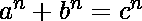

# 费马大定理

> 原文:[https://www.geeksforgeeks.org/fermats-last-theorem/](https://www.geeksforgeeks.org/fermats-last-theorem/)

根据[费马大定理](https://en.wikipedia.org/wiki/Fermat%27s_Last_Theorem)，对于任何大于 2 的整数值，没有三个正整数 a、b、c 满足方程。对于 n = 1 和 n = 2，方程有无穷多个解。

```
Some solutions for n = 1 are,
 2 + 3 = 5
 7 + 13 = 20
 5 + 6 = 11
 10 + 9 = 19

Some solutions for n = 2 are,

```

## C++

```
// C++ program to verify fermat's last theorem
// for a given range and n.
#include <bits/stdc++.h>
using namespace std;

void testSomeNumbers(int limit, int n)
{
   if (n < 3)
     return;

   for (int a=1; a<=limit; a++)
     for (int b=a; b<=limit; b++)
     {
         // Check if there exists a triplet
         // such that a^n + b^n = c^n
         int pow_sum = pow(a, n) + pow(b, n);
         double c = pow(pow_sum, 1.0/n);
         int c_pow = pow((int)c, n);
         if (c_pow == pow_sum)
         {
             cout << "Count example found";
             return;
         }
     }

     cout << "No counter example within given"
            " range and data";
}

// driver code
int main()
{
    testSomeNumbers(10, 3);
    return 0;
}
```

## Java 语言(一种计算机语言，尤用于创建网站)

```
// Java program to verify fermat's last theorem
// for a given range and n.
import java.io.*;

class GFG
{
    static void testSomeNumbers(int limit, int n)
    {
        if (n < 3)
            return;

        for (int a = 1; a <= limit; a++)
            for (int b = a; b <= limit; b++)
            {
                // Check if there exists a triplet
                // such that a^n + b^n = c^n
                int pow_sum = (int)(Math.pow(a, n)
                               + Math.pow(b, n));
                double c = Math.pow(pow_sum, 1.0 / n);
                int c_pow = (int)Math.pow((int)c, n);
                if (c_pow == pow_sum)
                {
                    System.out.println("Count example found");
                    return;
                }
            }

            System.out.println("No counter example within given"+
                               " range and data");
    }

    // Driver code
    public static void main (String[] args)
    {
        testSomeNumbers(12, 5);

    }
}

// This code is contributed by vt_m.
```

## 蟒蛇 3

```
# Python3 program to verify fermat's last
# theorem for a given range and n.

def testSomeNumbers(limit, n) :

    if (n < 3):
        return

    for a in range(1, limit + 1):
        for b in range(a, limit + 1):

            # Check if there exists a triplet
            # such that a^n + b^n = c^n
            pow_sum = pow(a, n) + pow(b, n)
            c = pow(pow_sum, 1.0 / n)
            c_pow = pow(int(c), n)

            if (c_pow == pow_sum):
                print("Count example found")
                return
    print("No counter example within given range and data")

# Driver code
testSomeNumbers(10, 3)

# This code is contributed by Smitha Dinesh Semwal.
```

## C#

```
// C# program to verify fermat's last theorem
// for a given range and n.
using System;

class GFG {

    static void testSomeNumbers(int limit, int n)
    {
        if (n < 3)
            return;

        for (int a = 1; a <= limit; a++)
            for (int b = a; b <= limit; b++)
            {

                // Check if there exists a triplet
                // such that a^n + b^n = c^n
                int pow_sum = (int)(Math.Pow(a, n)
                                + Math.Pow(b, n));
                double c = Math.Pow(pow_sum, 1.0 / n);
                int c_pow = (int)Math.Pow((int)c, n);

                if (c_pow == pow_sum)
                {
                    Console.WriteLine("Count example found");
                    return;
                }
            }

            Console.WriteLine("No counter example within"
                                + " given range and data");
    }

    // Driver code
    public static void Main ()
    {
        testSomeNumbers(12, 3);

    }
}

// This code is contributed by vt_m.
```

## 服务器端编程语言（Professional Hypertext Preprocessor 的缩写）

```
<?php
// PHP program to verify fermat's
// last theorem for a given range
//and n.

function testSomeNumbers($limit, $n)
{
    if ($n < 3)

    for($a = 1; $a <= $limit; $a++)
        for($b = $a; $b <= $limit; $b++)
    {

        // Check if there exists a triplet
        // such that a^n + b^n = c^n
        $pow_sum = pow($a, $n) + pow($b, $n);

        $c = pow($pow_sum, 1.0 / $n);
        $c_pow = pow($c, $n);
        if ($c_pow != $pow_sum)
        {
            echo "Count example found";
            return;
        }
    }

    echo "No counter example within ".
              "given range and data";
}

    // Driver Code
    testSomeNumbers(10, 3);

// This code is contributed by m_kit
?>
```

## java 描述语言

```
<script>

// JavaScript program to verify fermat's last theorem
// for a given range and n.

    function testSomeNumbers(limit, n)
    {
        if (n < 3)
            return;

        for (let a = 1; a <= limit; a++)
            for (let b = a; b <= limit; b++)
            {
                // Check if there exists a triplet
                // such that a^n + b^n = c^n
                let pow_sum = (Math.pow(a, n)
                               + Math.pow(b, n));
                let c = Math.pow(pow_sum, 1.0 / n);
                let c_pow = Math.pow(Math.round(c), n);
                if (c_pow == pow_sum)
                {
                    document.write("Count example found");
                    return;
                }
            }

            document.write("No counter example within given"+
                               " range and data");
    }

// Driver Code

        testSomeNumbers(12, 5);

</script>
```

**Output:** 

```
No counter example within given range and data
```