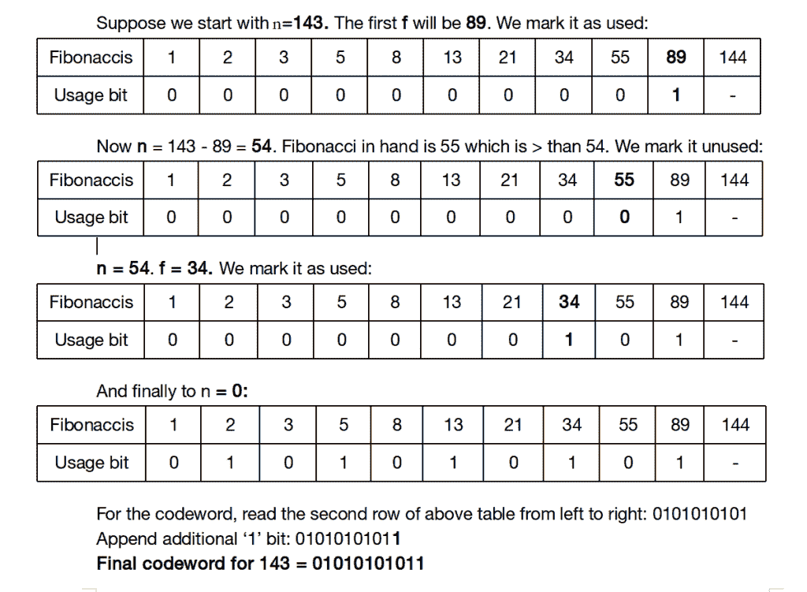

# 斐波那契编码

> 原文:[https://www.geeksforgeeks.org/fibonacci-coding/](https://www.geeksforgeeks.org/fibonacci-coding/)

[斐波那契编码](https://en.wikipedia.org/wiki/Fibonacci_coding)使用数字的斐波那契表示将整数编码为二进制数。这个想法是基于[泽肯多夫定理](https://www.geeksforgeeks.org/zeckendorfs-theorem-non-neighbouring-fibonacci-representation/)，该定理指出，每个正整数都可以唯一地写成不同的非相邻斐波那契数(0，1，1，2，3，5，8，13，21，34，55，89，144，…)的和..).

特定整数的斐波那契码字正好是该整数的 [Zeckendorf 表示](https://www.geeksforgeeks.org/zeckendorfs-theorem-non-neighbouring-fibonacci-representation/)，其数字顺序颠倒，末尾附加一个“1”。附加额外的 1 表示代码结束(注意，根据[泽肯多夫定理](https://www.geeksforgeeks.org/zeckendorfs-theorem-non-neighbouring-fibonacci-representation/)，代码从不包含两个连续的 1。该表示使用从 1(第二个斐波那契数)开始的斐波那契数。所以用的斐波那契数是 1，2，3，5，8，13，21，34，55，89，141，…。

**给定一个数字 n，打印其斐波那契码。**

**示例:**

```
Input: n = 1
Output: 11
1 is first Fibonacci number in this representation
and an extra 1 is appended at the end.

Input:  n = 11
Output: 001011
11 is sum of 8 and 3\.  The last 1 represents extra 1
that is always added. A 1 before it represents 8\. The
third 1 (from beginning) represents 3.
```

**我们强烈建议你尽量减少浏览器，先自己试试这个。**
下面的算法将一个整数作为输入，生成一个存储斐波那契编码的字符串。
求小于等于 n 的最大斐波那契数 f，说它是斐波那契数列中的第 I 个数。n 的码字长度将是 i+3 个字符(一个用于结尾追加的额外 1，一个因为 I 是索引，一个用于' \0 ')。假设存储了斐波那契数列:

*   让 f 是小于或等于 n 的最大斐波那契数，在二进制字符串中前置' 1 '。这表示用 f 表示 n。从 n 中减去 f:n = n–f
*   否则，如果 f 大于 n，则在二进制字符串前面加上“0”。
*   移到略小于 f 的斐波那契数。
*   重复直到余数为零(n = 0)
*   向二进制字符串追加一个附加的“1”。我们获得了一种编码，两个连续的 1 表示一个数字的结束(和下一个数字的开始)。

下面是上述算法的实现。

## C++

```
/* C++ program for Fibonacci Encoding of a positive integer n */
#include <bits/stdc++.h>
using namespace std;

// To limit on the largest Fibonacci number to be used
#define N 30

/* Array to store fibonacci numbers.  fib[i] is going
   to store (i+2)'th Fibonacci number*/
int fib[N];

// Stores values in fib and returns index of the largest
// fibonacci number smaller than n.
int largestFiboLessOrEqual(int n)
{
    fib[0] = 1;  // Fib[0] stores 2nd Fibonacci No.
    fib[1] = 2;  // Fib[1] stores 3rd Fibonacci No.

    // Keep Generating remaining numbers while previously
    // generated number is smaller
    int i;
    for (i=2; fib[i-1]<=n; i++)
        fib[i] = fib[i-1] + fib[i-2];

    // Return index of the largest fibonacci number
    // smaller than or equal to n. Note that the above
    // loop stopped when fib[i-1] became larger.
    return (i-2);
}

/* Returns pointer to the char string which corresponds to
   code for n */
char* fibonacciEncoding(int n)
{
    int index = largestFiboLessOrEqual(n);

    //allocate memory for codeword
    char *codeword = (char*)malloc(sizeof(char)*(index+3));

    // index of the largest Fibonacci f <= n
    int i = index;

    while (n)
    {
        // Mark usage of Fibonacci f (1 bit)
        codeword[i] = '1';

        // Subtract f from n
        n = n - fib[i];

        // Move to Fibonacci just smaller than f
        i = i - 1;

        // Mark all Fibonacci > n as not used (0 bit),
        // progress backwards
        while (i>=0 && fib[i]>n)
        {
            codeword[i] = '0';
            i = i - 1;
        }
    }

    //additional '1' bit
    codeword[index+1] = '1';
    codeword[index+2] = '\0';

    //return pointer to codeword
    return codeword;
}

/* driver function */
int main()
{
    int n = 143;
    cout <<"Fibonacci code word for " <<n <<" is " << fibonacciEncoding(n);

    return 0;
}
// This code is contributed by shivanisinghss2110
```

## C

```
/* C program for Fibonacci Encoding of a positive integer n */

#include<stdio.h>
#include<stdlib.h>

// To limit on the largest Fibonacci number to be used
#define N 30

/* Array to store fibonacci numbers.  fib[i] is going
   to store (i+2)'th Fibonacci number*/
int fib[N];

// Stores values in fib and returns index of the largest
// fibonacci number smaller than n.
int largestFiboLessOrEqual(int n)
{
    fib[0] = 1;  // Fib[0] stores 2nd Fibonacci No.
    fib[1] = 2;  // Fib[1] stores 3rd Fibonacci No.

    // Keep Generating remaining numbers while previously
    // generated number is smaller
    int i;
    for (i=2; fib[i-1]<=n; i++)
        fib[i] = fib[i-1] + fib[i-2];

    // Return index of the largest fibonacci number
    // smaller than or equal to n. Note that the above
    // loop stopped when fib[i-1] became larger.
    return (i-2);
}

/* Returns pointer to the char string which corresponds to
   code for n */
char* fibonacciEncoding(int n)
{
    int index = largestFiboLessOrEqual(n);

    //allocate memory for codeword
    char *codeword = (char*)malloc(sizeof(char)*(index+3));

    // index of the largest Fibonacci f <= n
    int i = index;

    while (n)
    {
        // Mark usage of Fibonacci f (1 bit)
        codeword[i] = '1';

        // Subtract f from n
        n = n - fib[i];

        // Move to Fibonacci just smaller than f
        i = i - 1;

        // Mark all Fibonacci > n as not used (0 bit),
        // progress backwards
        while (i>=0 && fib[i]>n)
        {
            codeword[i] = '0';
            i = i - 1;
        }
    }

    //additional '1' bit
    codeword[index+1] = '1';
    codeword[index+2] = '\0';

    //return pointer to codeword
    return codeword;
}

/* driver function */
int main()
{
    int n = 143;
    printf("Fibonacci code word for %d is %s\n", n, fibonacciEncoding(n));
    return 0;
}
```

## Java 语言(一种计算机语言，尤用于创建网站)

```
// Java program for Fibonacci Encoding
// of a positive integer n
import java.io.*;

class GFG{

// To limit on the largest Fibonacci
// number to be used
public static int N = 30;

// Array to store fibonacci numbers.
// fib[i] is going to store (i+2)'th
// Fibonacci number
public static int[] fib = new int[N];

// Stores values in fib and returns index of
// the largest fibonacci number smaller than n. 
public static int largestFiboLessOrEqual(int n)
{

    // Fib[0] stores 2nd Fibonacci No.
    fib[0] = 1; 

    // Fib[1] stores 3rd Fibonacci No.
    fib[1] = 2; 

    // Keep Generating remaining numbers while
    // previously generated number is smaller
    int i;
    for(i = 2; fib[i - 1] <= n; i++)
    {
        fib[i] = fib[i - 1] + fib[i - 2];
    }

    // Return index of the largest fibonacci
    // number smaller than or equal to n.
    // Note that the above loop stopped when
    // fib[i-1] became larger.
    return(i - 2);
}

// Returns pointer to the char string which
// corresponds to code for n
public static String fibonacciEncoding(int n)
{
    int index = largestFiboLessOrEqual(n);

    // Allocate memory for codeword
    char[] codeword = new char[index + 3];

    // Index of the largest Fibonacci f <= n
    int i = index;

    while (n > 0)
    {

        // Mark usage of Fibonacci f(1 bit)
        codeword[i] = '1';

        // Subtract f from n
        n = n - fib[i];

        // Move to Fibonacci just smaller than f
        i = i - 1;

        // Mark all Fibonacci > n as not used
        // (0 bit), progress backwards
        while (i >= 0 && fib[i] > n)
        {
            codeword[i] = '0';
            i = i - 1;
        }
    }

    // Additional '1' bit
    codeword[index + 1] = '1';
    codeword[index + 2] = '\0';
    String string = new String(codeword);

    // Return pointer to codeword
    return string;
}

// Driver code
public static void main(String[] args)
{
    int n = 143;

    System.out.println("Fibonacci code word for " +
                       n + " is " + fibonacciEncoding(n));
}
}

// This code is contributed by avanitrachhadiya2155
```

## 蟒蛇 3

```
# Python3 program for Fibonacci Encoding
# of a positive integer n

# To limit on the largest
# Fibonacci number to be used
N = 30

# Array to store fibonacci numbers.
# fib[i] is going to store
# (i+2)'th Fibonacci number
fib = [0 for i in range(N)]

# Stores values in fib and returns index of
# the largest fibonacci number smaller than n.
def largestFiboLessOrEqual(n):
    fib[0] = 1 # Fib[0] stores 2nd Fibonacci No.
    fib[1] = 2 # Fib[1] stores 3rd Fibonacci No.

    # Keep Generating remaining numbers while
    # previously generated number is smaller
    i = 2

    while fib[i - 1] <= n:
        fib[i] = fib[i - 1] + fib[i - 2]
        i += 1

    # Return index of the largest fibonacci number
    # smaller than or equal to n. Note that the above
    # loop stopped when fib[i-1] became larger.
    return (i - 2)

# Returns pointer to the char string which
# corresponds to code for n
def fibonacciEncoding(n):
    index = largestFiboLessOrEqual(n)

    # allocate memory for codeword
    codeword = ['a' for i in range(index + 2)]

    # index of the largest Fibonacci f <= n
    i = index

    while (n):

        # Mark usage of Fibonacci f (1 bit)
        codeword[i] = '1'

        # Subtract f from n
        n = n - fib[i]

        # Move to Fibonacci just smaller than f
        i = i - 1

        # Mark all Fibonacci > n as not used (0 bit),
        # progress backwards
        while (i >= 0 and fib[i] > n):
            codeword[i] = '0'
            i = i - 1

    # additional '1' bit
    codeword[index + 1] = '1'

    # return pointer to codeword
    return "".join(codeword)

# Driver Code
n = 143
print("Fibonacci code word for", n,
         "is", fibonacciEncoding(n))

# This code is contributed by Mohit Kumar
```

## C#

```
// C# program for Fibonacci Encoding
// of a positive integer n
using System;

class GFG{

// To limit on the largest Fibonacci
// number to be used
public static int N = 30;

// Array to store fibonacci numbers.
// fib[i] is going to store (i+2)'th
// Fibonacci number
public static int[] fib = new int[N];

// Stores values in fib and returns index of
// the largest fibonacci number smaller than n. 
public static int largestFiboLessOrEqual(int n)
{

    // Fib[0] stores 2nd Fibonacci No.
    fib[0] = 1; 

    // Fib[1] stores 3rd Fibonacci No.
    fib[1] = 2;

    // Keep Generating remaining numbers while
    // previously generated number is smaller
    int i;
    for(i = 2; fib[i - 1] <= n; i++)
    {
        fib[i] = fib[i - 1] + fib[i - 2];
    }

    // Return index of the largest fibonacci
    // number smaller than or equal to n.
    // Note that the above loop stopped when
    // fib[i-1] became larger.
    return(i - 2);
}

// Returns pointer to the char string which
// corresponds to code for n
public static String fibonacciEncoding(int n)
{
    int index = largestFiboLessOrEqual(n);

    // Allocate memory for codeword
    char[] codeword = new char[index + 3];

    // Index of the largest Fibonacci f <= n
    int i = index;
    while (n > 0)
    {

        // Mark usage of Fibonacci f(1 bit)
        codeword[i] = '1';

        // Subtract f from n
        n = n - fib[i];

        // Move to Fibonacci just smaller than f
        i = i - 1;

        // Mark all Fibonacci > n as not used
        // (0 bit), progress backwards
        while (i >= 0 && fib[i] > n)
        {
            codeword[i] = '0';
            i = i - 1;
        }
    }

    // Additional '1' bit
    codeword[index + 1] = '1';
    codeword[index + 2] = '\0';
    string str = new string(codeword);

    // Return pointer to codeword
    return str;
}

// Driver code
static public void Main()
{
    int n = 143;

    Console.WriteLine("Fibonacci code word for " +
                      n + " is " + fibonacciEncoding(n));
}
}

// This code is contributed by rag2127
```

## java 描述语言

```
<script>
// Javascript program for Fibonacci Encoding
// of a positive integer n

    // To limit on the largest Fibonacci
// number to be used
    let N = 30;

    // Array to store fibonacci numbers.
// fib[i] is going to store (i+2)'th
// Fibonacci number
    let fib = new Array(N);

    // Stores values in fib and returns index of
// the largest fibonacci number smaller than n.
    function largestFiboLessOrEqual(n)
    {
        // Fib[0] stores 2nd Fibonacci No.
    fib[0] = 1;

    // Fib[1] stores 3rd Fibonacci No.
    fib[1] = 2;

    // Keep Generating remaining numbers while
    // previously generated number is smaller
    let i;
    for(i = 2; fib[i - 1] <= n; i++)
    {
        fib[i] = fib[i - 1] + fib[i - 2];
    }

    // Return index of the largest fibonacci
    // number smaller than or equal to n.
    // Note that the above loop stopped when
    // fib[i-1] became larger.
    return(i - 2);
    }

    // Returns pointer to the char string which
// corresponds to code for n
    function fibonacciEncoding(n)
    {
        let index = largestFiboLessOrEqual(n);

    // Allocate memory for codeword
    let codeword = new Array(index + 3);

    // Index of the largest Fibonacci f <= n
    let i = index;

    while (n > 0)
    {

        // Mark usage of Fibonacci f(1 bit)
        codeword[i] = '1';

        // Subtract f from n
        n = n - fib[i];

        // Move to Fibonacci just smaller than f
        i = i - 1;

        // Mark all Fibonacci > n as not used
        // (0 bit), progress backwards
        while (i >= 0 && fib[i] > n)
        {
            codeword[i] = '0';
            i = i - 1;
        }
    }

    // Additional '1' bit
    codeword[index + 1] = '1';
    codeword[index + 2] = '\0';
    let string =(codeword).join("");

    // Return pointer to codeword
    return string;
    }

    // Driver code
    let n = 143;
    document.write("Fibonacci code word for " +
                       n + " is " + fibonacciEncoding(n));

    // This code is contributed by unknown2108
</script>
```

**输出:**

```
Fibonacci code word for 143 is 01010101011
```

插图



**应用领域:**
数据处理&压缩–以存储或传输数据所需空间小于输入数据大小的方式表示数据(可以是文本、图像、视频……)。统计方法使用可变长度代码，较短的代码分配给出现概率较高的符号或符号组。如果要在有噪声的通信信道上使用这些代码，它们对比特插入、删除和比特翻转的恢复能力是非常重要的。
点击此处阅读更多关于应用程序[的信息。](http://www.ijetajournal.org/volume-2/issue-3/IJETA-V2I3P7.pdf)

本文由 **Yash Varyani** 供稿。如果你发现任何不正确的地方，请写评论，或者你想分享更多关于上面讨论的话题的信息