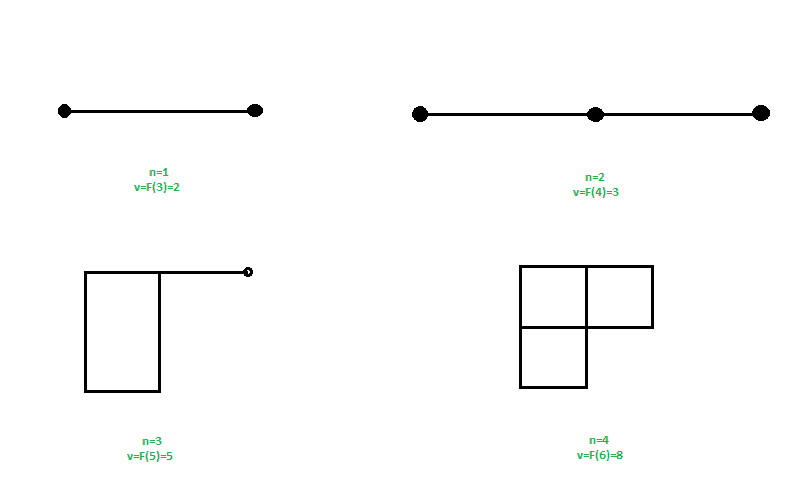

# 斐波那契立方体图

> 原文:[https://www.geeksforgeeks.org/fibonacci-cube-graph/](https://www.geeksforgeeks.org/fibonacci-cube-graph/)

给你的输入是 n 阶图形(连接到一个节点的最高边数)，你必须找到 n 阶斐波那契立方体图形的顶点数。
**示例:**

```
Input : n = 3
Output : 5
Explanation : 
Fib(n + 2) = Fib(5) = 5

Input : n = 2
Output : 3
```

斐波那契立方体图类似于[超立方体图](https://www.geeksforgeeks.org/hypercube-graph/)，但是有一个[斐波那契数](https://www.geeksforgeeks.org/program-for-nth-fibonacci-number/)的顶点。在斐波那契立方图中，只有 1 个顶点的度数为 n，其余的都小于 n。
n 阶斐波那契立方图有 F(n + 2)个顶点，其中 F(n)是第 n 个[斐波那契数](https://www.geeksforgeeks.org/program-for-nth-fibonacci-number/)，
斐波那契数列:1，1，2，3，5，8，13，21，34……



对于输入 n 作为图的顺序，在 n + 2 位置找到对应的斐波那契数。
其中 F(n)= F(n–1)+F(n–2)
**方法:**求第(n + 2)个斐波那契数。
以下是上述方法的实施:

## C++

```
// CPP code to find vertices in a fibonacci
// cube graph of order n
#include<iostream>
using namespace std;

// function to find fibonacci number
int fib(int n)
{
    if (n <= 1)
        return n;
    return fib(n - 1) + fib(n - 2);
}

// function for finding number of vertices 
// in fibonacci cube graph
int findVertices (int n)
{
    // return fibonacci number for f(n + 2) 
    return fib(n + 2);
}

// driver program
int main()
{
    // n is the order of the graph
    int n = 3;
    cout << findVertices(n);
    return 0;
}
```

## Java 语言(一种计算机语言，尤用于创建网站)

```
// java code to find vertices in a fibonacci
// cube graph of order n
public class GFG {

    // function to find fibonacci number
    static int fib(int n)
    {
        if (n <= 1)
            return n;
        return fib(n - 1) + fib(n - 2);
    }

    // function for finding number of vertices 
    // in fibonacci cube graph
    static int findVertices (int n)
    {
        // return fibonacci number for f(n + 2) 
        return fib(n + 2);
    }

    public static void main(String args[]) {

        // n is the order of the graph
        int n = 3;
        System.out.println(findVertices(n));
    }
}

// This code is contributed by Sam007
```

## 蟒蛇 3

```
# Python3 code to find vertices in 
# a fibonacci cube graph of order n 

# Function to find fibonacci number 
def fib(n): 

    if n <= 1: 
        return n

    return fib(n - 1) + fib(n - 2) 

# Function for finding number of 
# vertices in fibonacci cube graph 
def findVertices(n): 

    # return fibonacci number 
    # for f(n + 2) 
    return fib(n + 2) 

# Driver Code
if __name__ == "__main__": 

    # n is the order of the graph 
    n = 3
    print(findVertices(n)) 

# This code is contributed 
# by Rituraj Jain
```

## C#

```
// C# code to find vertices in a fibonacci
// cube graph of order n
using System;

class GFG {

    // function to find fibonacci number
    static int fib(int n)
    {
        if (n <= 1)
            return n;
        return fib(n - 1) + fib(n - 2);
    }

    // function for finding number of 
    // vertices in fibonacci cube graph
    static int findVertices (int n)
    {

        // return fibonacci number for
        // f(n + 2) 
        return fib(n + 2);
    }

    // Driver code
    static void Main()
    {

        // n is the order of the graph
        int n = 3;

        Console.Write(findVertices(n));
    }
}

// This code is contributed by Sam007
```

## 服务器端编程语言（Professional Hypertext Preprocessor 的缩写）

```
<?php
// PHP code to find vertices in a 
// fibonacci cube graph of order n

// function to find fibonacci number
function fib($n)
{
    if ($n <= 1)
        return $n;
    return fib($n - 1) + fib($n - 2);
}

// function for finding number of  
// vertices in fibonacci cube graph
function findVertices ($n)
{
    // return fibonacci number
    // for f(n + 2) 
    return fib($n + 2);
}

// Driver Code

// n is the order of the graph
$n = 3;
echo findVertices($n);     

// This code is contributed by Sam007
?>
```

## java 描述语言

```
<script>

// Javascript code to find vertices in a fibonacci
// cube graph of order n

// function to find fibonacci number
function fib(n)
{
    if (n <= 1)
        return n;
    return fib(n - 1) + fib(n - 2);
}

// function for finding number of vertices 
// in fibonacci cube graph
function findVertices (n)
{
    // return fibonacci number for f(n + 2) 
    return fib(n + 2);
}

// driver program
// n is the order of the graph
var n = 3;
document.write( findVertices(n));

</script>
```

**Output :** 

```
5
```

请注意，上面的代码可以使用[程序中针对斐波那契数](https://www.geeksforgeeks.org/program-for-nth-fibonacci-number/)
讨论的高效实现进行优化，以在 O(Log n)中工作