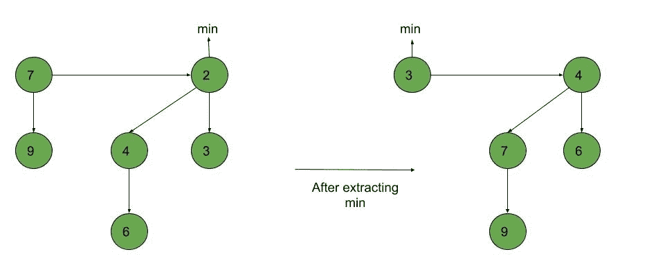
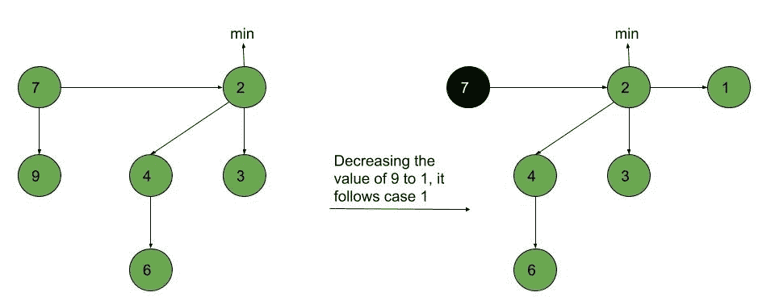
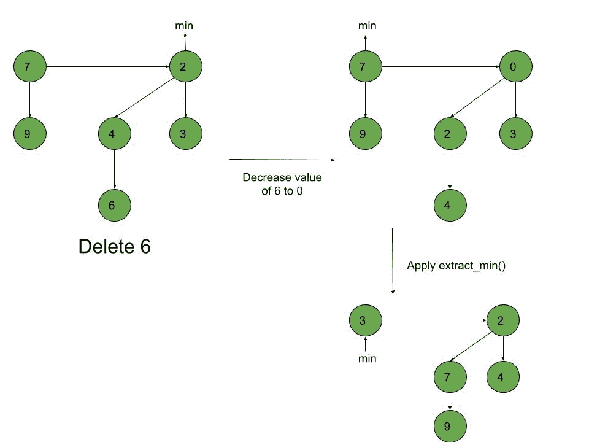

# 斐波那契堆–删除、提取最小值和减少键

> 原文:[https://www . geesforgeks . org/Fibonacci-heap-delete-extract-min-and-reduce-key/](https://www.geeksforgeeks.org/fibonacci-heap-deletion-extract-min-and-decrease-key/)

在上一篇文章中，我们讨论了斐波那契堆的[插入和并集。](https://www.geeksforgeeks.org/fibonacci-heap-insertion-and-union/)在这篇文章中，我们将讨论斐波那契堆上的 Extract_min()、reduce _ key()和 Deletion()操作。

**先决条件:**
[斐波那契堆(简介)](https://www.geeksforgeeks.org/fibonacci-heap-set-1-introduction/)
[斐波那契堆–插入和并集](https://www.geeksforgeeks.org/fibonacci-heap-insertion-and-union/)

**Extract_min():** 我们创建一个函数，用于删除最小节点，并将 min 指针设置为剩余堆中的最小值。遵循以下算法:

1.  删除最小节点。
2.  将 head 设置为下一个最小节点，并将已删除节点的所有树添加到根列表中。
3.  创建一个已删除节点大小的度指针数组。
4.  将度数指针设置为当前节点。
5.  移动到下一个节点。
    *   如果度数不同，则将度数指针设置为下一个节点。
    *   如果度数相同，则通过并集运算连接斐波那契树。
6.  重复步骤 4 和 5，直到堆完成。

**例:**



**reduce _ key():**要减少堆中任何元素的值，我们遵循以下算法:

*   将节点“x”的值减少到新选择的值。
*   情况 1)如果没有违反最小堆属性，
    *   如有必要，更新最小指针。
*   情况 2)如果违反了最小堆属性并且未标记“x”的父级，
    *   切断“x”与其父级之间的链接。
    *   标记“x”的父级。
    *   将以“x”为根的树添加到根列表中，并在必要时更新最小指针。
*   案例 3)如果违反了最小堆属性并且标记了“x”的父级，
    *   切断“x”与其父 p[x]之间的链接。
    *   将“x”添加到根列表，必要时更新最小指针。
    *   切断 p[x]和 p[p[x]之间的链接。
    *   将 p[x]添加到根列表，必要时更新最小指针。
    *   如果 p[p[x]]未标记，请标记它。
    *   否则，切断 p[p[x]]并重复步骤 4.2 至 4.5，将 p[p[x]]作为“x”。

**示例:**



**delete():**要删除斐波那契堆中的任何元素，请遵循以下算法:

1.  通过 reduce _ key()函数将要删除的节点的值“x”减小到最小值。
2.  通过使用 min-heap 属性，heapify 包含“x”的堆，将“x”带到根列表。
3.  将 Extract_min()算法应用于斐波那契堆。

**示例:**



**下面是一个演示斐波那契堆上提取最小值()，删除()和减少键()操作的程序:**

## C++

```
// C++ program to demonstrate Extract min, Deletion()
// and Decrease key() operations in a fibonacci heap
#include <cmath>
#include <cstdlib>
#include <iostream>
#include <malloc.h>
using namespace std;

// Creating a structure to represent a node in the heap
struct node {
    node* parent; // Parent pointer
    node* child; // Child pointer
    node* left; // Pointer to the node on the left
    node* right; // Pointer to the node on the right
    int key; // Value of the node
    int degree; // Degree of the node
    char mark; // Black or white mark of the node
    char c; // Flag for assisting in the Find node function
};

// Creating min pointer as "mini"
struct node* mini = NULL;

// Declare an integer for number of nodes in the heap
int no_of_nodes = 0;

// Function to insert a node in heap
void insertion(int val)
{
    struct node* new_node = new node();
    new_node->key = val;
    new_node->degree = 0;
    new_node->mark = 'W';
    new_node->c = 'N';
    new_node->parent = NULL;
    new_node->child = NULL;
    new_node->left = new_node;
    new_node->right = new_node;
    if (mini != NULL) {
        (mini->left)->right = new_node;
        new_node->right = mini;
        new_node->left = mini->left;
        mini->left = new_node;
        if (new_node->key < mini->key)
            mini = new_node;
    }
    else {
        mini = new_node;
    }
    no_of_nodes++;
}
// Linking the heap nodes in parent child relationship
void Fibonnaci_link(struct node* ptr2, struct node* ptr1)
{
    (ptr2->left)->right = ptr2->right;
    (ptr2->right)->left = ptr2->left;
    if (ptr1->right == ptr1)
        mini = ptr1;
    ptr2->left = ptr2;
    ptr2->right = ptr2;
    ptr2->parent = ptr1;
    if (ptr1->child == NULL)
        ptr1->child = ptr2;
    ptr2->right = ptr1->child;
    ptr2->left = (ptr1->child)->left;
    ((ptr1->child)->left)->right = ptr2;
    (ptr1->child)->left = ptr2;
    if (ptr2->key < (ptr1->child)->key)
        ptr1->child = ptr2;
    ptr1->degree++;
}
// Consolidating the heap
void Consolidate()
{
    int temp1;
    float temp2 = (log(no_of_nodes)) / (log(2));
    int temp3 = temp2;
    struct node* arr[temp3+1];
    for (int i = 0; i <= temp3; i++)
        arr[i] = NULL;
    node* ptr1 = mini;
    node* ptr2;
    node* ptr3;
    node* ptr4 = ptr1;
    do {
        ptr4 = ptr4->right;
        temp1 = ptr1->degree;
        while (arr[temp1] != NULL) {
            ptr2 = arr[temp1];
            if (ptr1->key > ptr2->key) {
                ptr3 = ptr1;
                ptr1 = ptr2;
                ptr2 = ptr3;
            }
            if (ptr2 == mini)
                mini = ptr1;
            Fibonnaci_link(ptr2, ptr1);
            if (ptr1->right == ptr1)
                mini = ptr1;
            arr[temp1] = NULL;
            temp1++;
        }
        arr[temp1] = ptr1;
        ptr1 = ptr1->right;
    } while (ptr1 != mini);
    mini = NULL;
    for (int j = 0; j <= temp3; j++) {
        if (arr[j] != NULL) {
            arr[j]->left = arr[j];
            arr[j]->right = arr[j];
            if (mini != NULL) {
                (mini->left)->right = arr[j];
                arr[j]->right = mini;
                arr[j]->left = mini->left;
                mini->left = arr[j];
                if (arr[j]->key < mini->key)
                    mini = arr[j];
            }
            else {
                mini = arr[j];
            }
            if (mini == NULL)
                mini = arr[j];
            else if (arr[j]->key < mini->key)
                mini = arr[j];
        }
    }
}

// Function to extract minimum node in the heap
void Extract_min()
{
    if (mini == NULL)
        cout << "The heap is empty" << endl;
    else {
        node* temp = mini;
        node* pntr;
        pntr = temp;
        node* x = NULL;
        if (temp->child != NULL) {

            x = temp->child;
            do {
                pntr = x->right;
                (mini->left)->right = x;
                x->right = mini;
                x->left = mini->left;
                mini->left = x;
                if (x->key < mini->key)
                    mini = x;
                x->parent = NULL;
                x = pntr;
            } while (pntr != temp->child);
        }
        (temp->left)->right = temp->right;
        (temp->right)->left = temp->left;
        mini = temp->right;
        if (temp == temp->right && temp->child == NULL)
            mini = NULL;
        else {
            mini = temp->right;
            Consolidate();
        }
        no_of_nodes--;
    }
}

// Cutting a node in the heap to be placed in the root list
void Cut(struct node* found, struct node* temp)
{
    if (found == found->right)
        temp->child = NULL;

    (found->left)->right = found->right;
    (found->right)->left = found->left;
    if (found == temp->child)
        temp->child = found->right;

    temp->degree = temp->degree - 1;
    found->right = found;
    found->left = found;
    (mini->left)->right = found;
    found->right = mini;
    found->left = mini->left;
    mini->left = found;
    found->parent = NULL;
    found->mark = 'B';
}

// Recursive cascade cutting function
void Cascase_cut(struct node* temp)
{
    node* ptr5 = temp->parent;
    if (ptr5 != NULL) {
        if (temp->mark == 'W') {
            temp->mark = 'B';
        }
        else {
            Cut(temp, ptr5);
            Cascase_cut(ptr5);
        }
    }
}

// Function to decrease the value of a node in the heap
void Decrease_key(struct node* found, int val)
{
    if (mini == NULL)
        cout << "The Heap is Empty" << endl;

    if (found == NULL)
        cout << "Node not found in the Heap" << endl;

    found->key = val;

    struct node* temp = found->parent;
    if (temp != NULL && found->key < temp->key) {
        Cut(found, temp);
        Cascase_cut(temp);
    }
    if (found->key < mini->key)
        mini = found;
}

// Function to find the given node
void Find(struct node* mini, int old_val, int val)
{
    struct node* found = NULL;
    node* temp5 = mini;
    temp5->c = 'Y';
    node* found_ptr = NULL;
    if (temp5->key == old_val) {
        found_ptr = temp5;
        temp5->c = 'N';
        found = found_ptr;
        Decrease_key(found, val);
    }
    if (found_ptr == NULL) {
        if (temp5->child != NULL)
            Find(temp5->child, old_val, val);
        if ((temp5->right)->c != 'Y')
            Find(temp5->right, old_val, val);
    }
    temp5->c = 'N';
    found = found_ptr;
}

// Deleting a node from the heap
void Deletion(int val)
{
    if (mini == NULL)
        cout << "The heap is empty" << endl;
    else {

        // Decreasing the value of the node to 0
        Find(mini, val, 0);

        // Calling Extract_min function to
        // delete minimum value node, which is 0
        Extract_min();
        cout << "Key Deleted" << endl;
    }
}

// Function to display the heap
void display()
{
    node* ptr = mini;
    if (ptr == NULL)
        cout << "The Heap is Empty" << endl;

    else {
        cout << "The root nodes of Heap are: " << endl;
        do {
            cout << ptr->key;
            ptr = ptr->right;
            if (ptr != mini) {
                cout << "-->";
            }
        } while (ptr != mini && ptr->right != NULL);
        cout << endl
             << "The heap has " << no_of_nodes << " nodes" << endl
             << endl;
    }
}

// Driver code
int main()
{
    // We will create a heap and insert 3 nodes into it
    cout << "Creating an initial heap" << endl;
    insertion(5);
    insertion(2);
    insertion(8);

    // Now we will display the root list of the heap
    display();

    // Now we will extract the minimum value node from the heap
    cout << "Extracting min" << endl;
    Extract_min();
    display();

    // Now we will decrease the value of node '8' to '7'
    cout << "Decrease value of 8 to 7" << endl;
    Find(mini, 8, 7);
    display();

    // Now we will delete the node '7'
    cout << "Delete the node 7" << endl;
    Deletion(7);
    display();

    return 0;
}
```

## 蟒蛇 3

```
# Python3 program to demonstrate Extract min, Deletion()
# and Decrease key() operations in a fibonacci heap
import math

# Creating a class to represent a node in the heap
class node:
    def __init__(self):
        parent=None # Parent pointer
        child=None # Child pointer
        left=None # Pointer to the node on the left
        right=None # Pointer to the node on the right
        key=-1 # Value of the node
        degree=-1 # Degree of the node
        mark='' # Black or white mark of the node
        c='' # Flag for assisting in the Find node function

# Creating min pointer as "mini"
mini = None

# Declare an integer for number of nodes in the heap
no_of_nodes = 0

# Function to insert a node in heap
def insertion(val):
    global mini,no_of_nodes

    new_node = node()
    new_node.key = val
    new_node.degree = 0
    new_node.mark = 'W'
    new_node.c = 'N'
    new_node.parent = None
    new_node.child = None
    new_node.left = new_node
    new_node.right = new_node
    if (mini != None):
        mini.left.right = new_node
        new_node.right = mini
        new_node.left = mini.left
        mini.left = new_node
        if (new_node.key < mini.key):
            mini = new_node
    else:
        mini = new_node
    no_of_nodes+=1

#  Linking the heap nodes in parent child relationship
def Fibonnaci_link(ptr2, ptr1):
    ptr2.left.right = ptr2.right
    ptr2.right.left = ptr2.left
    if (ptr1.right == ptr1):
        mini = ptr1
    ptr2.left = ptr2
    ptr2.right = ptr2
    ptr2.parent = ptr1
    if (ptr1.child == None):
        ptr1.child = ptr2
    ptr2.right = ptr1.child
    ptr2.left = ptr1.child.left
    ptr1.child.left.right = ptr2
    ptr1.child.left = ptr2
    if ptr2.key < ptr1.child.key:
        ptr1.child = ptr2
    ptr1.degree+=1

# Consolidating the heap
def Consolidate():

    global mini
    temp2 = math.log2(no_of_nodes)
    temp3 = int(temp2)
    arr=[None]*(temp3+1)
    for i in range(temp3+1):
        arr[i] = None
    ptr1 = mini
    ptr4 = ptr1
    while True:
        ptr4 = ptr4.right
        temp1 = ptr1.degree
        while (arr[temp1] != None):
            ptr2 = arr[temp1]
            if (ptr1.key > ptr2.key):
                ptr3 = ptr1
                ptr1 = ptr2
                ptr2 = ptr3
            if (ptr2 == mini):
                mini = ptr1
            Fibonnaci_link(ptr2, ptr1)
            if (ptr1.right == ptr1):
                mini = ptr1
            arr[temp1] = None
            temp1+=1
        arr[temp1] = ptr1
        ptr1 = ptr1.right
        if (ptr1 == mini):
            break
    mini = None
    for j in range(temp3+1):
        if (arr[j] != None):
            arr[j].left = arr[j]
            arr[j].right = arr[j]
            if (mini != None) :
                mini.left.right = arr[j]
                arr[j].right = mini
                arr[j].left = mini.left
                mini.left = arr[j]
                if (arr[j].key < mini.key):
                    mini = arr[j]
            else:
                mini = arr[j]
            if mini == None:
                mini = arr[j]
            elif arr[j].key < mini.key:
                mini = arr[j]

# Function to extract minimum node in the heap
def Extract_min():

    global mini,no_of_nodes
    if mini == None:
        print("The heap is empty")
    else:
        temp = mini
        pntr = temp
        x = None
        if (temp.child != None):

            x = temp.child
            while(True):
                pntr = x.right
                mini.left.right = x
                x.right = mini
                x.left = mini.left
                mini.left = x
                if x.key < mini.key:
                    mini = x
                x.parent = None
                x = pntr
                if (pntr == temp.child):
                    break

        temp.left.right = temp.right
        temp.right.left = temp.left
        mini = temp.right
        if temp == temp.right and temp.child == None:
            mini = None
        else:
            mini = temp.right
            Consolidate()
        no_of_nodes-=1

# Cutting a node in the heap to be placed in the root list
def Cut(found, temp):

    if (found == found.right):
        temp.child = None

    found.left.right = found.right
    found.right.left = found.left
    if (found == temp.child):
        temp.child = found.right

    temp.degree = temp.degree - 1
    found.right = found
    found.left = found
    mini.left.right = found
    found.right = mini
    found.left = mini.left
    mini.left = found
    found.parent = None
    found.mark = 'B'

# Recursive cascade cutting function
def Cascase_cut(temp):

    ptr5 = temp.parent
    if (ptr5 != None):
        if (temp.mark == 'W'):
            temp.mark = 'B'
        else:
            Cut(temp, ptr5)
            Cascase_cut(ptr5)

# Function to decrease the value of a node in the heap
def Decrease_key(found, val):

    global mini
    if (mini == None):
        print("The Heap is Empty")

    if found == None:
        print("Node not found in the Heap")

    found.key = val

    temp = found.parent
    if (temp != None and found.key < temp.key):
        Cut(found, temp)
        Cascase_cut(temp)

    if (found.key < mini.key):
        mini = found

# Function to find the given node
def Find(mini, old_val, val):

    found = None
    temp5 = mini
    temp5.c = 'Y'
    found_ptr = None
    if (temp5.key == old_val):
        found_ptr = temp5
        temp5.c = 'N'
        found = found_ptr
        Decrease_key(found, val)

    if (found_ptr == None):
        if (temp5.child != None):
            Find(temp5.child, old_val, val)
        if temp5.right.c != 'Y':
            Find(temp5.right, old_val, val)
    temp5.c = 'N'
    found = found_ptr

# Deleting a node from the heap
def Deletion(val):

    if (mini == None):
        print("The heap is empty")
    else:
        # Decreasing the value of the node to 0
        Find(mini, val, 0)

        # Calling Extract_min function to
        # delete minimum value node, which is 0
        Extract_min()
        print("Key Deleted")

# Function to display the heap
def display():
    ptr = mini
    if (ptr == None):
        print("The Heap is Empty")

    else:
        print("The root nodes of Heap are: ")
        while(True):
            print(ptr.key,end='')
            ptr = ptr.right
            if (ptr != mini):
                print("-->",end='')
            if not(ptr != mini and ptr.right != None):
                break
        print()
        print("The heap has {} nodes".format(no_of_nodes))

# Driver code
if __name__ == '__main__':

    # We will create a heap and insert 3 nodes into it
    print("Creating an initial heap")
    insertion(5)
    insertion(2)
    insertion(8)

    # Now we will display the root list of the heap
    display()

    # Now we will extract the minimum value node from the heap
    print("Extracting min")
    Extract_min()
    display()

    # Now we will decrease the value of node '8' to '7'
    print("Decrease value of 8 to 7")
    Find(mini, 8, 7)
    display()

    print("Now we will delete the node '7'")
    print("Delete the node 7")
    Deletion(7)
    display()

# This code is contributed by Amartya Ghosh
```

**Output:** 

```
Creating an initial heap
The root nodes of Heap are: 
2-->5-->8
The heap has 3 nodes

Extracting min
The root nodes of Heap are: 
5
The heap has 2 nodes

Decrease value of 8 to 7
The root nodes of Heap are: 
5
The heap has 2 nodes

Delete the node 7
Key Deleted
The root nodes of Heap are: 
5
The heap has 1 nodes
```