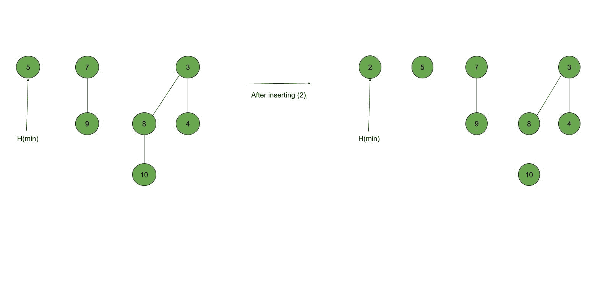
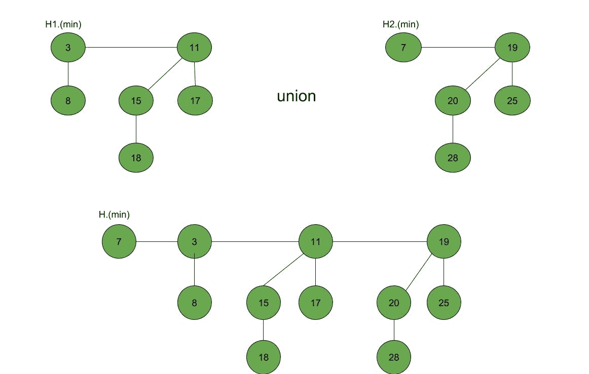

# 斐波那契堆–插入和并集

> 原文:[https://www . geeksforgeeks . org/Fibonacci-堆-插入-合并/](https://www.geeksforgeeks.org/fibonacci-heap-insertion-and-union/)

**先决条件:**T2【斐波那契堆(简介)

斐波那契堆是具有最小堆或最大堆属性的树的集合。在斐波那契堆中，树可以有任何形状，甚至所有的树都可以是单个节点(这与二叉树堆不同，二叉树堆中的每棵树都必须是二叉树)。
在本文中，我们将讨论斐波那契堆上的插入和并集操作。

**插入:**要在斐波那契堆 H 中插入一个节点，遵循以下算法:

> 1.  Create a new node' x'.
> 2.  Check whether the H heap is empty.
> 3.  If h is empty, then:
>     *   Make x the only node in the root list.
>     *   Set the H(min) pointer to X. 。
> 4.  否则:
>     *   Insert x into the root list and update H(min).

**示例:**



**并集:**两个斐波那契堆 H1 和 H2 的并集可以按如下方式完成:

> 1.  Connect the root lists of Fibonacci heap H1 and H2 to form a Fibonacci heap H. 。
> 2.  If H1 (min) < H2 (min), then:
>     *   H (minutes) = H1 (minutes).
> 3.  否则:
>     *   h(分)= H2(分).

**示例:**



**下面是一个演示在斐波那契堆中构建和插入的程序:**

## C++

```
// C++ program to demonstrate building
// and inserting in a Fibonacci heap
#include <cstdlib>
#include <iostream>
#include <malloc.h>
using namespace std;

struct node {
    node* parent;
    node* child;
    node* left;
    node* right;
    int key;
};

// Creating min pointer as "mini"
struct node* mini = NULL;

// Declare an integer for number of nodes in the heap
int no_of_nodes = 0;

// Function to insert a node in heap
void insertion(int val)
{
    struct node* new_node = (struct node*)malloc(sizeof(struct node));
    new_node->key = val;
    new_node->parent = NULL;
    new_node->child = NULL;
    new_node->left = new_node;
    new_node->right = new_node;
    if (mini != NULL) {
        (mini->left)->right = new_node;
        new_node->right = mini;
        new_node->left = mini->left;
        mini->left = new_node;
        if (new_node->key < mini->key)
            mini = new_node;
    }
    else {
        mini = new_node;
    }
}

// Function to display the heap
void display(struct node* mini)
{
    node* ptr = mini;
    if (ptr == NULL)
        cout << "The Heap is Empty" << endl;

    else {
        cout << "The root nodes of Heap are: " << endl;
        do {
            cout << ptr->key;
            ptr = ptr->right;
            if (ptr != mini) {
                cout << "-->";
            }
        } while (ptr != mini && ptr->right != NULL);
        cout << endl
             << "The heap has " << no_of_nodes << " nodes" << endl;
    }
}
// Function to find min node in the heap
void find_min(struct node* mini)
{
    cout << "min of heap is: " << mini->key << endl;
}

// Driver code
int main()
{

    no_of_nodes = 7;
    insertion(4);
    insertion(3);
    insertion(7);
    insertion(5);
    insertion(2);
    insertion(1);
    insertion(10);

    display(mini);

    find_min(mini);

    return 0;
}
```

**Output:** 

```
The root nodes of Heap are: 
1-->2-->3-->4-->7-->5-->10
The heap has 7 nodes
Min of heap is: 1
```