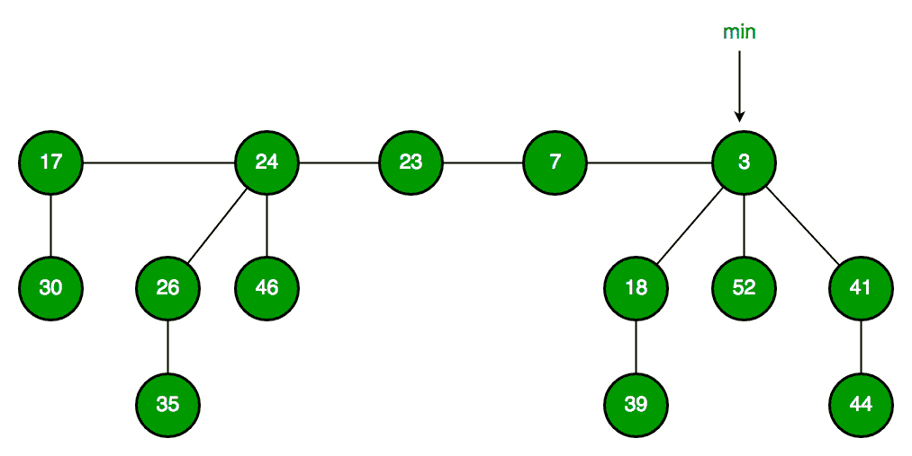

# 斐波那契堆|集合 1(简介)

> 原文:[https://www . geesforgeks . org/Fibonacci-heap-set-1-introduction/](https://www.geeksforgeeks.org/fibonacci-heap-set-1-introduction/)

堆主要用于实现优先级队列。我们在之前的文章中已经讨论过了。

[二进制堆](http://geeksquiz.com/binary-heap/)
[二进制堆](https://www.geeksforgeeks.org/binomial-heap-2/)

就时间复杂度而言，斐波那契堆胜过二进制和二项式堆。

以下是**斐波那契堆**的[摊销时间复杂度](https://www.geeksforgeeks.org/analysis-algorithm-set-5-amortized-analysis-introduction/)。

```
1) Find Min:      Θ(1)     [Same as both Binary and Binomial]
2) Delete Min:    O(Log n) [Θ(Log n) in both Binary and Binomial]
3) Insert:        Θ(1)     [Θ(Log n) in Binary and Θ(1) in Binomial]
4) Decrease-Key:  Θ(1)     [Θ(Log n) in both Binary and Binomial]
5) Merge:         Θ(1)     [Θ(m Log n) or Θ(m+n) in Binary and
                            Θ(Log n) in Binomial]
```

像[二项式堆](https://www.geeksforgeeks.org/binomial-heap-2/)一样，斐波那契堆是具有最小堆或最大堆属性的树的集合。在斐波那契堆中，树可以有任何形状，甚至所有的树都可以是单个节点(这与二叉树堆不同，二叉树堆中的每棵树都必须是二叉树)。

下面是一个取自[这里](https://www.cs.princeton.edu/~wayne/teaching/fibonacci-heap.pdf)的斐波那契堆的例子。



斐波那契堆保持一个指向最小值的指针(它是一棵树的根)。所有的树根都是用循环双向链表连接的，所以所有的树根都可以用一个“最小”指针来访问。

主要思想是以“懒惰”的方式执行操作。例如，合并操作只是链接两个堆，插入操作只是添加一个具有单个节点的新树。最小抽取操作是最复杂的操作。它延迟了巩固树木的工作。这使得删除也变得复杂，因为删除首先将键减少到负无穷大，然后调用提取最小值。

**下面是一些关于斐波那契堆**的有趣事实

1.  减少密钥的时间复杂度在 Dijkstra 和 Prim 算法中具有重要意义。对于二进制堆，这些算法的时间复杂度为 O(VLogV + ELogV)。如果使用斐波那契堆，那么时间复杂度提高到 O(VLogV + E)
2.  虽然斐波那契堆在时间复杂度方面看起来很有前途，但在实践中发现它很慢，因为隐藏常数很高(来源[维基](https://en.wikipedia.org/wiki/Fibonacci_heap))。
3.  斐波那契堆之所以叫斐波那契堆，主要是因为斐波那契数用于运行时间分析。此外，斐波那契堆中的每个节点最多具有 0(log n)度，并且扎根于 k 度节点的子树的大小至少为 F <sub>k+2</sub> ，其中 F <sub>k</sub> 是第 kth 个斐波那契数。

我们将很快详细讨论斐波那契堆操作。

本文由**希瓦姆**供稿。如果你发现任何不正确的地方，或者你想分享更多关于上面讨论的话题的信息，请写评论。