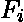
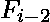
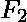
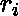
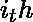
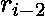

# 斐波那契表格 p

> 原文:[https://www.geeksforgeeks.org/fibonacci-modulo-p/](https://www.geeksforgeeks.org/fibonacci-modulo-p/)

[斐波那契数列](https://www.geeksforgeeks.org/program-for-nth-fibonacci-number/)定义为 =  + ，其中 = 1 和 = 1 是种子。
对于给定的素数 p，考虑一个新序列，它是(斐波那契序列)mod p。例如，对于 p = 5，新序列将是 1，1，2，3，0，3，3，1，4，0，4 …
新序列的最小零被定义为 p 的倍数或 mod p = 0 的第一个斐波那契数。
给定素数无 p，求数列斐波那契模 p 的最小零点
**例:**

```
Input : 5
Output : 5
The fifth Fibonacci no (1 1 2 3 5) 
is divisible by 5 so 5 % 5 = 0.

Input : 7
Output : 8
The 8th Fibonacci no (1 1 2 3 5 8 13 21) 
is divisible by 7 so 21 % 7 = 0.
```

一个简单的方法是继续计算斐波那契数，并为每个数计算 Fi mod p。然而，如果我们观察这个新序列，让表示序列的项，那么它如下: = (  +  ) mod p，即余数实际上是这个序列前两个项的余数之和。因此，我们不是生成斐波那契序列，然后取每个项的模，而是简单地将前面的两个余数相加，然后取其模 p。
下面是求最小 0 的实现。

## C++

```
// C++ program to find minimal 0 Fibonacci
// for a prime number p
#include<bits/stdc++.h>
using namespace std;

// Returns position of first Fibonacci number
// whose modulo p is 0.
int findMinZero(int p)
{
    int first = 1, second = 1, number = 2, next = 1;
    while (next)
    {
        next = (first + second) % p;
        first = second;
        second = next;
        number++;
    }
    return number;
}

// Driver code
int main()
{
    int p = 7;
    cout << "Minimal zero is: "
        << findMinZero(p) << endl;
    return 0;
}
```

## Java 语言(一种计算机语言，尤用于创建网站)

```
// Java program to find minimal 0 Fibonacci
// for a prime number p
import java.io.*;

class FibZero
{
    // Function that returns position of first Fibonacci number
    // whose modulo p is 0
    static int findMinZero(int p)
    {
        int first = 1, second = 1, number = 2, next = 1;
        while (next > 0)
        {
            // add previous two remainders and
            // then take its modulo p.
            next = (first + second) % p;
            first = second;
            second = next;
            number++;
        }
        return number;
    }

    // Driver program
    public static void main (String[] args)
    {
        int p = 7;
        System.out.println("Minimal zero is " + findMinZero(p));
    }
}
```

## 蟒蛇 3

```
# Python 3 program to find minimal
# 0 Fibonacci for a prime number p

# Returns position of first Fibonacci
# number whose modulo p is 0.
def findMinZero(p):
    first = 1
    second = 1
    number = 2
    next = 1

    while (next):
        next = (first + second) % p
        first = second
        second = next
        number = number + 1

    return number

# Driver code
if __name__ == '__main__':
    p = 7
    print("Minimal zero is:", findMinZero(p))

# This code is contributed by
# Surendra_Gangwar
```

## C#

```
// C# program to find minimal 0
// Fibonacci for a prime number p
using System;

class GFG {

    // Function that returns position
    // of first Fibonacci number
    // whose modulo p is 0
    static int findMinZero(int p)
    {
        int first = 1, second = 1;
        int number = 2, next = 1;
        while (next > 0)
        {

            // add previous two
            // remainders and then
            // take its modulo p.
            next = (first + second) % p;
            first = second;
            second = next;
            number++;
        }
        return number;
    }

    // Driver program
    public static void Main ()
    {
        int p = 7;
        Console.WriteLine("Minimal zero "
              + "is :" + findMinZero(p));
    }
}

// This code is contributed by anuj_67.
```

## 服务器端编程语言（Professional Hypertext Preprocessor 的缩写）

```
<?php
// PHP program to find
// minimal 0 Fibonacci
// for a prime number p

// Returns position of
// first Fibonacci number
// whose modulo p is 0.
function findMinZero($p)
{
    $first = 1;
    $second = 1;
    $number = 2;
    $next = 1;
    while ($next)
    {
        $next = ($first +
                 $second) % $p;
        $first = $second;
        $second = $next;
        $number++;
    }

    return $number;
}

// Driver code
$p = 7;
echo "Minimal zero is: ",
    findMinZero($p), "\n";

// This code is contributed
// by akt_mit
?>
```

## java 描述语言

```
<script>
// Javascript program to find
// minimal 0 Fibonacci
// for a prime number p

// Returns position of
// first Fibonacci number
// whose modulo p is 0.
function findMinZero(p)
{
    let first = 1;
    let second = 1;
    let number = 2;
    let next = 1;
    while (next)
    {
        next = (first +
                second) % p;
        first = second;
        second = next;
        number++;
    }

    return number;
}

// Driver code
let p = 7;
document.write("Minimal zero is: ",
    findMinZero(p) + "<br>");

// This code is contributed
// by akt_mit
</script>
```

**输出:**

```
Minimal zero is: 8
```

本文由**阿迪提·夏尔马**供稿。如果你喜欢 GeeksforGeeks 并想投稿，你也可以使用[contribute.geeksforgeeks.org](http://www.contribute.geeksforgeeks.org)写一篇文章或者把你的文章邮寄到 contribute@geeksforgeeks.org。看到你的文章出现在极客博客主页上，帮助其他极客。
如果你发现任何不正确的地方，或者你想分享更多关于上面讨论的话题的信息，请写评论。