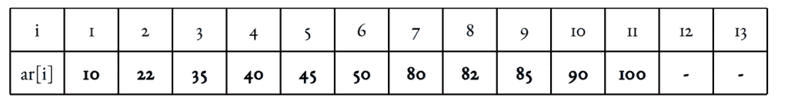
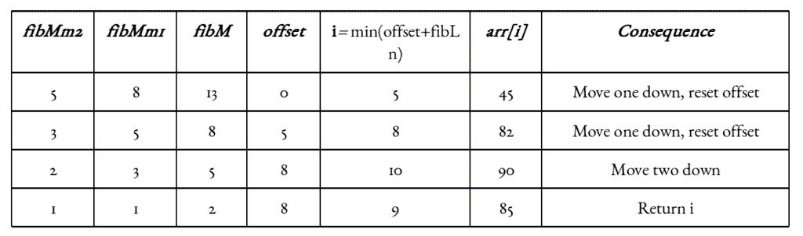
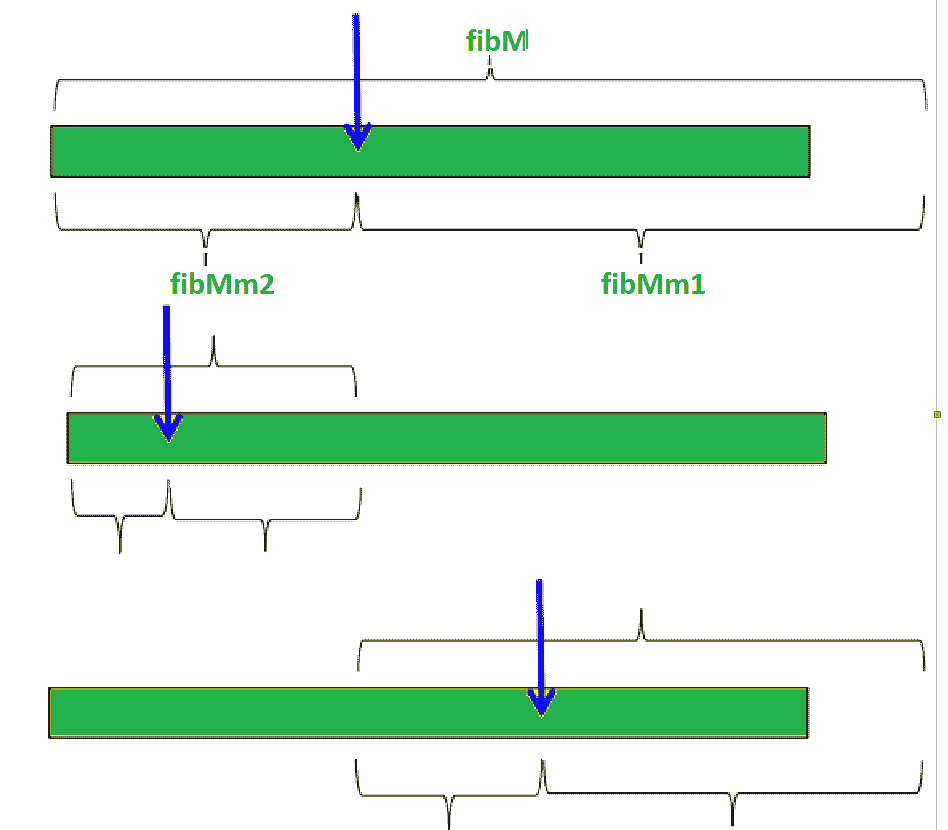
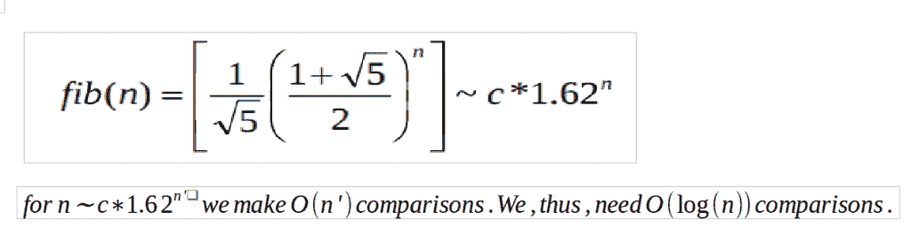

# 斐波那契搜索

> 原文:[https://www.geeksforgeeks.org/fibonacci-search/](https://www.geeksforgeeks.org/fibonacci-search/)

给定大小为 n 的排序数组 arr[]和其中要搜索的元素 x。如果 x 存在于数组中，返回 x 的索引，否则返回-1。
示例:

```
Input:  arr[] = {2, 3, 4, 10, 40}, x = 10
Output:  3
Element x is present at index 3.

Input:  arr[] = {2, 3, 4, 10, 40}, x = 11
Output:  -1
Element x is not present.
```

斐波那契搜索是一种基于比较的技术，它使用斐波那契数来搜索排序数组中的元素。
**与二分搜索法的相似之处:**

1.  适用于排序数组
2.  分治算法。
3.  具有对数时间复杂度。

**与二分搜索法的差异**:

1.  斐波那契搜索将给定的数组分成不相等的部分
2.  二分搜索法使用除法运算符来划分范围。斐波那契搜索不使用/，而是使用+和-。在某些中央处理器上，除法运算可能成本很高。
3.  斐波那契搜索在后续步骤中检查相对较近的元素。因此，当输入数组很大，无法放入中央处理器缓存甚至内存时，斐波那契搜索会很有用。

**背景:**
斐波那契数递归定义为 F(n) = F(n-1) + F(n-2)，F(0) = 0，F(1) = 1。前几个斐波那契数是 0、1、1、2、3、5、8、13、21、34、55、89、144、……
**观测值:**
下面的观测值用于范围消除，因此用于 O(log(n))复杂度。

```
F(n - 2) &approx; (1/3)*F(n) and 
F(n - 1) &approx; (2/3)*F(n).
```

**算法:**
让搜索到的元素为 x.
思路是先找到大于等于给定数组长度的最小斐波那契数。让找到的斐波那契数是 fib(第 m 个斐波那契数)。我们使用第(m-2)个斐波那契数作为索引(如果它是有效的索引)。设(m-2)第几个斐波那契数为 I，我们将 arr[i]与 x 进行比较，如果 x 相同，我们返回 I，否则如果 x 更大，我们在 I 之后对子阵进行递归，否则我们在 I 之前对子阵进行递归
下面是完整的算法
设 arr[0..n-1]是输入数组，要搜索的元素是 x。

1.  求大于或等于 n 的最小斐波那契数，让这个数为 Fibm[第 m 个斐波那契数]。假设它前面的两个斐波那契数是斐波那契 1 [(m-1)第一个斐波那契数]和斐波那契 2 [(m-2)第一个斐波那契数]。
2.  当阵列有要检查的元素时:
    1.  将 x 与 fibMm2 覆盖的范围的最后一个元素进行比较
    2.  **如果** x 匹配，返回索引
    3.  **否则如果** x 小于元素，将三个斐波那契变量下移两个斐波那契，表示剩余数组的大约后三分之二被消除。
    4.  **否则** x 大于元素，将三个斐波那契变量下移一个斐波那契。将偏移量重置为索引。这些一起表示剩余阵列的大约前三分之一被消除。
3.  因为可能还有一个元素需要比较，所以检查 fibMm1 是否为 1。如果是，将 x 与剩余元素进行比较。如果匹配，返回索引。

## C

```
// C program for Fibonacci Search
#include <stdio.h>

// Utility function to find minimum of two elements
int min(int x, int y) { return (x <= y) ? x : y; }

/* Returns index of x if present,  else returns -1 */
int fibMonaccianSearch(int arr[], int x, int n)
{
    /* Initialize fibonacci numbers */
    int fibMMm2 = 0; // (m-2)'th Fibonacci No.
    int fibMMm1 = 1; // (m-1)'th Fibonacci No.
    int fibM = fibMMm2 + fibMMm1; // m'th Fibonacci

    /* fibM is going to store the smallest Fibonacci
       Number greater than or equal to n */
    while (fibM < n) {
        fibMMm2 = fibMMm1;
        fibMMm1 = fibM;
        fibM = fibMMm2 + fibMMm1;
    }

    // Marks the eliminated range from front
    int offset = -1;

    /* while there are elements to be inspected. Note that
       we compare arr[fibMm2] with x. When fibM becomes 1,
       fibMm2 becomes 0 */
    while (fibM > 1) {
        // Check if fibMm2 is a valid location
        int i = min(offset + fibMMm2, n - 1);

        /* If x is greater than the value at index fibMm2,
           cut the subarray array from offset to i */
        if (arr[i] < x) {
            fibM = fibMMm1;
            fibMMm1 = fibMMm2;
            fibMMm2 = fibM - fibMMm1;
            offset = i;
        }

        /* If x is greater than the value at index fibMm2,
           cut the subarray after i+1  */
        else if (arr[i] > x) {
            fibM = fibMMm2;
            fibMMm1 = fibMMm1 - fibMMm2;
            fibMMm2 = fibM - fibMMm1;
        }

        /* element found. return index */
        else
            return i;
    }

    /* comparing the last element with x */
    if (fibMMm1 && arr[offset + 1] == x)
        return offset + 1;

    /*element not found. return -1 */
    return -1;
}

/* driver function */
int main(void)
{
    int arr[]
        = { 10, 22, 35, 40, 45, 50, 80, 82, 85, 90, 100,235};
    int n = sizeof(arr) / sizeof(arr[0]);
    int x = 235;
      int ind = fibMonaccianSearch(arr, x, n);
  if(ind>=0)
    printf("Found at index: %d",ind);
  else
    printf("%d isn't present in the array",x);
    return 0;
}
```

## Java 语言(一种计算机语言，尤用于创建网站)

```
// Java program for Fibonacci Search
import java.util.*;

class Fibonacci {
    // Utility function to find minimum
    // of two elements
    public static int min(int x, int y)
    {
        return (x <= y) ? x : y;
    }

    /* Returns index of x if present, else returns -1 */
    public static int fibMonaccianSearch(int arr[], int x,
                                         int n)
    {
        /* Initialize fibonacci numbers */
        int fibMMm2 = 0; // (m-2)'th Fibonacci No.
        int fibMMm1 = 1; // (m-1)'th Fibonacci No.
        int fibM = fibMMm2 + fibMMm1; // m'th Fibonacci

        /* fibM is going to store the smallest
        Fibonacci Number greater than or equal to n */
        while (fibM < n) {
            fibMMm2 = fibMMm1;
            fibMMm1 = fibM;
            fibM = fibMMm2 + fibMMm1;
        }

        // Marks the eliminated range from front
        int offset = -1;

        /* while there are elements to be inspected.
        Note that we compare arr[fibMm2] with x.
        When fibM becomes 1, fibMm2 becomes 0 */
        while (fibM > 1) {
            // Check if fibMm2 is a valid location
            int i = min(offset + fibMMm2, n - 1);

            /* If x is greater than the value at
            index fibMm2, cut the subarray array
            from offset to i */
            if (arr[i] < x) {
                fibM = fibMMm1;
                fibMMm1 = fibMMm2;
                fibMMm2 = fibM - fibMMm1;
                offset = i;
            }

            /* If x is less than the value at index
            fibMm2, cut the subarray after i+1 */
            else if (arr[i] > x) {
                fibM = fibMMm2;
                fibMMm1 = fibMMm1 - fibMMm2;
                fibMMm2 = fibM - fibMMm1;
            }

            /* element found. return index */
            else
                return i;
        }

        /* comparing the last element with x */
        if (fibMMm1 == 1 && arr[n-1] == x)
            return n-1;

        /*element not found. return -1 */
        return -1;
    }

    // driver code
    public static void main(String[] args)
    {
        int arr[] = { 10, 22, 35, 40, 45, 50,
                      80, 82, 85, 90, 100,235};
        int n = 12;
        int x = 235;
      int ind = fibMonaccianSearch(arr, x, n);
        if(ind>=0)
        System.out.print("Found at index: "
                         +ind);
      else
        System.out.print(x+" isn't present in the array");
    }
}

// This code is contributed by rishabh_jain
```

## 蟒蛇 3

```
# Python3 program for Fibonacci search.
from bisect import bisect_left

# Returns index of x if present,  else
# returns -1

def fibMonaccianSearch(arr, x, n):

    # Initialize fibonacci numbers
    fibMMm2 = 0  # (m-2)'th Fibonacci No.
    fibMMm1 = 1  # (m-1)'th Fibonacci No.
    fibM = fibMMm2 + fibMMm1  # m'th Fibonacci

    # fibM is going to store the smallest
    # Fibonacci Number greater than or equal to n
    while (fibM < n):
        fibMMm2 = fibMMm1
        fibMMm1 = fibM
        fibM = fibMMm2 + fibMMm1

    # Marks the eliminated range from front
    offset = -1

    # while there are elements to be inspected.
    # Note that we compare arr[fibMm2] with x.
    # When fibM becomes 1, fibMm2 becomes 0
    while (fibM > 1):

        # Check if fibMm2 is a valid location
        i = min(offset+fibMMm2, n-1)

        # If x is greater than the value at
        # index fibMm2, cut the subarray array
        # from offset to i
        if (arr[i] < x):
            fibM = fibMMm1
            fibMMm1 = fibMMm2
            fibMMm2 = fibM - fibMMm1
            offset = i

        # If x is less than the value at
        # index fibMm2, cut the subarray
        # after i+1
        elif (arr[i] > x):
            fibM = fibMMm2
            fibMMm1 = fibMMm1 - fibMMm2
            fibMMm2 = fibM - fibMMm1

        # element found. return index
        else:
            return i

    # comparing the last element with x */
    if(fibMMm1 and arr[n-1] == x):
        return n-1

    # element not found. return -1
    return -1

# Driver Code
arr = [10, 22, 35, 40, 45, 50,
       80, 82, 85, 90, 100,235]
n = len(arr)
x = 235
ind = fibMonaccianSearch(arr, x, n)
if ind>=0:
  print("Found at index:",ind)
else:
  print(x,"isn't present in the array");

# This code is contributed by rishabh_jain
```

## C#

```
// C# program for Fibonacci Search
using System;

class GFG {

    // Utility function to find minimum
    // of two elements
    public static int min(int x, int y)
    {
        return (x <= y) ? x : y;
    }

    /* Returns index of x if present, else returns -1 */
    public static int fibMonaccianSearch(int[] arr, int x,
                                         int n)
    {
        /* Initialize fibonacci numbers */
        int fibMMm2 = 0; // (m-2)'th Fibonacci No.
        int fibMMm1 = 1; // (m-1)'th Fibonacci No.
        int fibM = fibMMm2 + fibMMm1; // m'th Fibonacci

        /* fibM is going to store the smallest
        Fibonacci Number greater than or equal to n */
        while (fibM < n) {
            fibMMm2 = fibMMm1;
            fibMMm1 = fibM;
            fibM = fibMMm2 + fibMMm1;
        }

        // Marks the eliminated range from front
        int offset = -1;

        /* while there are elements to be inspected.
        Note that we compare arr[fibMm2] with x.
        When fibM becomes 1, fibMm2 becomes 0 */
        while (fibM > 1) {
            // Check if fibMm2 is a valid location
            int i = min(offset + fibMMm2, n - 1);

            /* If x is greater than the value at
            index fibMm2, cut the subarray array
            from offset to i */
            if (arr[i] < x) {
                fibM = fibMMm1;
                fibMMm1 = fibMMm2;
                fibMMm2 = fibM - fibMMm1;
                offset = i;
            }

            /* If x is less than the value at index
            fibMm2, cut the subarray after i+1 */
            else if (arr[i] > x) {
                fibM = fibMMm2;
                fibMMm1 = fibMMm1 - fibMMm2;
                fibMMm2 = fibM - fibMMm1;
            }

            /* element found. return index */
            else
                return i;
        }

        /* comparing the last element with x */
        if (fibMMm1 == 1 && arr[n-1] == x)
            return n-1;

        /*element not found. return -1 */
        return -1;
    }

    // driver code
    public static void Main()
    {
        int[] arr = { 10, 22, 35, 40, 45, 50,
                      80, 82, 85, 90, 100,235 };
        int n = 12;
        int x = 235;
          int ind = fibMonaccianSearch(arr, x, n);
          if(ind>=0)
        Console.Write("Found at index: "+ind);
          else
        Console.Write(x+" isn't present in the array");
    }
}

// This code is contributed by nitin mittal.
```

## 服务器端编程语言（Professional Hypertext Preprocessor 的缩写）

```
<?php
// PHP program for Fibonacci Search

/* Returns index of x if present, else returns -1 */
function fibMonaccianSearch($arr, $x, $n)
{
    /* Initialize fibonacci numbers */
    $fibMMm2 = 0; // (m-2)'th Fibonacci No.
    $fibMMm1 = 1; // (m-1)'th Fibonacci No.
    $fibM = $fibMMm2 + $fibMMm1; // m'th Fibonacci

    /* fibM is going to store the smallest Fibonacci
    Number greater than or equal to n */
    while ($fibM < $n)
    {
        $fibMMm2 = $fibMMm1;
        $fibMMm1 = $fibM;
        $fibM = $fibMMm2 + $fibMMm1;
    }

    // Marks the eliminated range from front
    $offset = -1;

    /* while there are elements to be inspected. Note that
    we compare arr[fibMm2] with x. When fibM becomes 1,
    fibMm2 becomes 0 */
    while ($fibM > 1)
    {
        // Check if fibMm2 is a valid location
        $i = min($offset+$fibMMm2, $n-1);

        /* If x is greater than the value at index fibMm2,
        cut the subarray array from offset to i */
        if ($arr[$i] < $x)
        {
            $fibM = $fibMMm1;
            $fibMMm1 = $fibMMm2;
            $fibMMm2 = $fibM - $fibMMm1;
            $offset = $i;
        }

        /* If x is less than the value at index fibMm2,
        cut the subarray after i+1 */
        else if ($arr[$i] > $x)
        {
            $fibM = $fibMMm2;
            $fibMMm1 = $fibMMm1 - $fibMMm2;
            $fibMMm2 = $fibM - $fibMMm1;
        }

        /* element found. return index */
        else return $i;
    }

    /* comparing the last element with x */
    if($fibMMm1 && $arr[$n-1] == $x)return $n-1;

    /*element not found. return -1 */
    return -1;
}

/* driver code */
    $arr = array(10, 22, 35, 40, 45, 50, 80, 82,85, 90, 100,235);
    $n = count($arr);
    $x = 235;
    $ind = fibMonaccianSearch($arr, $x, $n);
    if($ind>=0)
    printf("Found at index: ".$ind);
    else
    printf($x." isn't present in the array");

// This code is contributed by mits
?>
```

## java 描述语言

```
<script>

// Javascript program for Fibonacci Search

/* Returns index of x if present, else returns -1 */
function fibMonaccianSearch(arr, x, n)
{
    /* Initialize fibonacci numbers */
    let fibMMm2 = 0; // (m-2)'th Fibonacci No.
    let fibMMm1 = 1; // (m-1)'th Fibonacci No.
    let fibM = fibMMm2 + fibMMm1; // m'th Fibonacci

    /* fibM is going to store the smallest Fibonacci
    Number greater than or equal to n */
    while (fibM < n)
    {
        fibMMm2 = fibMMm1;
        fibMMm1 = fibM;
        fibM = fibMMm2 + fibMMm1;
    }

    // Marks the eliminated range from front
    let offset = -1;

    /* while there are elements to be inspected. Note that
    we compare arr[fibMm2] with x. When fibM becomes 1,
    fibMm2 becomes 0 */

    while (fibM > 1)
    {
        // Check if fibMm2 is a valid location
        let i = Math.min(offset + fibMMm2, n-1);

        /* If x is greater than the value at index fibMm2,
        cut the subarray array from offset to i */
        if (arr[i] < x)
        {
            fibM = fibMMm1;
            fibMMm1 = fibMMm2;
            fibMMm2 = fibM - fibMMm1;
            offset = i;
        }

        /* If x is less than the value at index fibMm2,
        cut the subarray after i+1 */
        else if (arr[i] > x)
        {
            fibM = fibMMm2;
            fibMMm1 = fibMMm1 - fibMMm2;
            fibMMm2 = fibM - fibMMm1;
        }

        /* element found. return index */
        else return i;
    }

    /* comparing the last element with x */
    if(fibMMm1 && arr[n-1] == x){
      return n-1
    }

    /*element not found. return -1 */
    return -1;
}

/* driver code */
    let arr = [10, 22, 35, 40, 45, 50, 80, 82,85, 90, 100,235];
    let n = arr.length;
    let x = 235;
    let ind = fibMonaccianSearch(arr, x, n);
    if(ind>=0){
       document.write("Found at index: " + ind);
    }else{
       document.write(x + " isn't present in the array");
    }

// This code is contributed by _saurabh_jaiswal

</script>
```

**Output**

```
Found at index: 11
```

**图解:**
我们用下面的例子来理解算法:



插图假设:基于 1 的索引。目标元素 x 是 85。数组长度 n = 11。
大于等于 11 的最小斐波那契数为 13。根据我们的说明，fibMm2 = 5，fibMm1 = 8，fibM = 13。
另一个实现细节是偏移变量(零初始化)。它标志着已经被淘汰的范围，从前面开始。我们会不时更新。
现在，由于偏移值是一个指数，包括它和它以下的所有指数都被消除了，所以增加一些东西是有意义的。由于 fibMm2 标记了大约三分之一的数组，以及它所标记的索引，肯定是有效的，所以我们可以添加 fibMm2 来偏移并检查索引 i = min 处的元素(偏移+ fibMm2，n)。



**可视化:**



**时间复杂度分析:**
当我们继续寻找目标时，最糟糕的情况将发生在我们的目标位于阵列的较大(2/3)部分时。换句话说，我们每次都在消除数组中较小的(1/3)部分。我们一次调用 n，然后调用(2/3) n，然后调用(4/9) n，此后。
考虑:



**参考文献:**
[【https://en.wikipedia.org/wiki/Fibonacci_search_technique】](https://en.wikipedia.org/wiki/Fibonacci_search_technique)
本文由**雅什·瓦利亚尼**供稿。如果您发现任何不正确的地方，或者您想分享更多关于上面讨论的主题的信息，请写评论