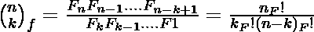
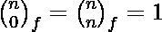
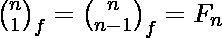
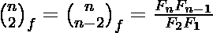
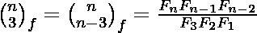
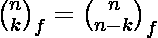
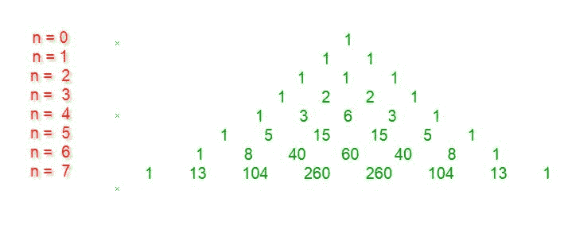
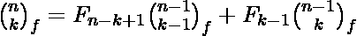

# 纤维经济系数和纤维经济三角形

> 原文:[https://www . geesforgeks . org/fib 经济-系数-fib 经济-三角形/](https://www.geeksforgeeks.org/fibonomial-coefficient-fibonomial-triangle/)

**斐波那契系数**
在数学中， [**斐波那契系数**](https://en.wikipedia.org/wiki/Fibonomial_coefficient) 或 [**斐波那契-二项式系数**](https://en.wikipedia.org/wiki/Fibonomial_coefficient) 定义为

，其中 **n** 和 **k** 为非负整数，0 ≤ k ≤ n，F <sub>j</sub> 为第 j 个[斐波那契数](https://www.geeksforgeeks.org/program-for-nth-fibonacci-number/)和 n！ <sub>F</sub> 是第 n 个 [Fibonorial](https://en.wikipedia.org/wiki/Fibonorial) ，其中 0！ <sub>F</sub> 为空积，评估为 1。
纤维经济系数都是整数。一些特殊的值是:





**纤维经济三角形**
纤维经济系数类似于二项式系数，可以显示在类似帕斯卡三角形的三角形中。前八行如下所示。



国际三角的递归关系:

给定一个正整数 **n** 。任务是打印高度为 n(或 n + 1 行)的三角形。
示例:

```
Input : n = 6
Output :
1
1 1
1 1 1
1 2 2 1
1 3 6 3 1
1 5 15 15 5 1
1 8 40 60 40 8 1

Input : n = 5
Output :
1
1 1
1 1 1
1 2 2 1
1 3 6 3 1
1 5 15 15 5 1
```

下面是打印高度为 n 的三角形的实现:

## C++

```
// CPP Program to print Fibonomial Triangle of height n.
#include<bits/stdc++.h>
#define N 6
using namespace std;

// Function to produce Fibonacci Series.
void fib(int f[], int n)
{
    int i;

    /* 0th and 1st number of the series are 0 and 1*/
    f[0] = 0;
    f[1] = 1;

    for (i = 2; i <= n; i++)

        /* Add the previous 2 numbers in the series
         and store it */
        f[i] = f[i-1] + f[i-2];    
}

// Function to produce fibonomial coefficient
void fibcoef(int fc[][N+1], int f[], int n)
{
    for (int i = 0; i <= n; i++)
        fc[i][0] = 1;

    for (int i = 1; i <= n; i++)
    {
        for (int j = 1; j <= i; j++)
        {
            int k = j;
            while(k--)
                fc[i][j] *= f[k];

            k = 1;

            while((j+1)!=k)
                fc[i][j] /= f[k++];
        }
    }
}

// Function to print Fibonomial Triangle.
void printFibonomialTriangle(int n)
{
    int f[N+1] = { 0 };

    // Finding the fibonacci series.
    fib(f, n);

    // to store triangle value.
    int dp[N+1][N+1] = { 0 };

    // initialising the 0th element of each row 
    // and diagonal element equal to 0.
    for (int i = 0; i <= n; i++)
        dp[i][0] = dp[i][i] = 1;

    // for each row.
    for (int i = 1; i <= n; i++)
    {
        // for each column.
        for (int j = 1; j < i; j++)

            // finding each element using recurrence 
            // relation.
            dp[i][j] = f[i-j+1]*dp[i-1][j-1] +
                       f[j-1]*dp[i-1][j];    
    }

    // printing the Fibonomial Triangle.
    for (int i = 0; i <= n; i++)
    {
        for (int j = 0; j <= i; j++)        
            cout << dp[i][j] << " ";        
        cout << endl;
    }
}
// Driven Program
int main()
{
    int n = 6;    
    printFibonomialTriangle(n);
    return 0;
} 
```

## Java 语言(一种计算机语言，尤用于创建网站)

```
// Java Program to print Fibonomial 
// Triangle of height n.
class GFG
{
    static final int N=6;

    // Function to produce Fibonacci Series.
    static void fib(int f[], int n)
    {
        int i;

        /* 0th and 1st number of
         the series are 0 and 1*/
        f[0] = 0;
        f[1] = 1;

        for (i = 2; i <= n; i++)

            /* Add the previous 2 numbers in 
            the series and store it */
            f[i] = f[i-1] + f[i-2]; 
    }

    // Function to produce fibonomial coefficient
    static void fibcoef(int fc[][], int f[], int n)
    {
        for (int i = 0; i <= n; i++)
            fc[i][0] = 1;

        for (int i = 1; i <= n; i++)
        {
            for (int j = 1; j <= i; j++)
            {
                int k = j;

                while(k > 0)
                {
                    k--;
                    fc[i][j] *= f[k];
                }

                k = 1;

                while((j + 1) != k)
                    fc[i][j] /= f[k++];
            }
        }
    }

    // Function to print Fibonomial Triangle.
    static void printFibonomialTriangle(int n)
    {
        int f[] = new int[N+1];

        // Finding the fibonacci series.
        fib(f, n);

        // to store triangle value.
        int dp[][] = new int[N + 1][N + 1];

        // initialising the 0th element of each row 
        // and diagonal element equal to 0.
        for (int i = 0; i <= n; i++)
            dp[i][0] = dp[i][i] = 1;

        // for each row.
        for (int i = 1; i <= n; i++)
        {
            // for each column.
            for (int j = 1; j < i; j++)

                // finding each element using recurrence 
                // relation.
                dp[i][j] = f[i - j + 1] * dp[i - 1][j - 1] +
                                           f[j-1]*dp[i-1][j]; 
        }

        // printing the Fibonomial Triangle.
        for (int i = 0; i <= n; i++)
        {
            for (int j = 0; j <= i; j++)     
                System.out.print(dp[i][j] + " ");     
            System.out.println();
        }
}

    // Driver code
    public static void main (String[] args)
    {
        int n = 6;

        printFibonomialTriangle(n);
    }
}

// This code is contributed by Anant Agarwal.
```

## 蟒蛇 3

```
# Python3 Program to print Fibonomial 
# Triangle of height n.
N = 6;

# Function to produce Fibonacci Series.
def fib(f, n):

    # 0th and 1st number of the 
    # series are 0 and 1
    f[0] = 0;
    f[1] = 1;

    for i in range(2, n + 1):

        # Add the previous 2 numbers in 
        # the series and store it 
        f[i] = f[i - 1] + f[i - 2]; 

# Function to produce fibonomial
# coefficient
def fibcoef(fc, f, n):

    for i in range(n + 1):
        fc[i][0] = 1;

    for i in range(1, n + 1):
        for j in range(1, i + 1):
            k = j;
            while(k > 0):
                k -= 1;
                fc[i][j] *= f[k];

            k = 1;

            while((j + 1) != k):
                fc[i][j] /= f[k];
                k += 1;

# Function to print Fibonomial Triangle.
def printFibonomialTriangle(n):

    f = [0] * (N + 1);

    # Finding the fibonacci series.
    fib(f, n);

    # to store triangle value.
    dp = [[0 for x in range(N + 1)] 
             for y in range(N + 1)];

    # initialising the 0th element of each
    # row and diagonal element equal to 0.
    for i in range(n + 1):
        dp[i][0] = 1;
        dp[i][i] = 1;

    # for each row.
    for i in range(1, n + 1):
        # for each column.
        for j in range(1, i):

            # finding each element using 
            # recurrence relation.
            dp[i][j] = (f[i - j + 1] * dp[i - 1][j - 1] + 
                        f[j - 1] * dp[i - 1][j]); 

    # printing the Fibonomial Triangle.
    for i in range(n + 1):
        for j in range(i + 1):     
            print(dp[i][j], end = " ");     
        print("");

# Driver Code
n = 6; 
printFibonomialTriangle(n);

# This code is contributed by mits
```

## C#

```
// C# Program to print Fibonomial 
// Triangle of height n.
using System;

class GFG
{
    static int N = 6;

    // Function to produce Fibonacci Series.
    static void fib(int []f, int n)
    {
        int i;

        /* 0th and 1st number of
        the series are 0 and 1*/
        f[0] = 0;
        f[1] = 1;

        for (i = 2; i <= n; i++)

            /* Add the previous 2 numbers in 
            the series and store it */
            f[i] = f[i - 1] + f[i - 2]; 
    }

    // Function to produce fibonomial coefficient
    static void fibcoef(int [,]fc, int []f, int n)
    {
        for (int i = 0; i <= n; i++)
            fc[i,0] = 1;

        for (int i = 1; i <= n; i++)
        {
            for (int j = 1; j <= i; j++)
            {
                int k = j;

                while(k > 0)
                {
                    k--;
                    fc[i, j] *= f[k];
                }

                k = 1;

                while((j + 1) != k)
                    fc[i, j] /= f[k++];
            }
        }
    }

    // Function to print Fibonomial Triangle.
    static void printFibonomialTriangle(int n)
    {
        int []f = new int[N + 1];

        // Finding the fibonacci series.
        fib(f, n);

        // to store triangle value.
        int [,]dp = new int[N + 1, N + 1];

        // initialising the 0th element of each row 
        // and diagonal element equal to 0.
        for (int i = 0; i <= n; i++)
            dp[i, 0] = dp[i, i] = 1;

        // for each row.
        for (int i = 1; i <= n; i++)
        {
            // for each column.
            for (int j = 1; j < i; j++)

                // finding each element using recurrence 
                // relation.
                dp[i,j] = f[i - j + 1] * dp[i - 1,j - 1] +
                                    f[j - 1] * dp[i - 1, j]; 
        }

        // printing the Fibonomial Triangle.
        for (int i = 0; i <= n; i++)
        {
            for (int j = 0; j <= i; j++) 
            Console.Write(dp[i,j] + " "); 
            Console.WriteLine();
        }
}

    // Driver code
    public static void Main ()
    {
        int n = 6;

        printFibonomialTriangle(n);
    }
}

// This code is contributed by Vt_m.
```

## 服务器端编程语言（Professional Hypertext Preprocessor 的缩写）

```
<?php
// PHP Program to print Fibonomial Triangle of height n.

$N=6;

// Function to produce Fibonacci Series.
function fib(&$f, $n)
{

    /* 0th and 1st number of the series are 0 and 1*/
    $f[0] = 0;
    $f[1] = 1;

    for ($i = 2; $i <= $n; $i++)

        /* Add the previous 2 numbers in the series
        and store it */
        $f[$i] = $f[$i-1] + $f[$i-2]; 
}

// Function to produce fibonomial coefficient
function fibcoef($fc, $f, $n)
{
    for ($i = 0; $i <= $n; $i++)
        $fc[$i][0] = 1;

    for ($i = 1; $i <= $n; $i++)
    {
        for ($j = 1; $j <= $i; $j++)
        {
            $k = $j;
            while($k--)
                $fc[$i][$j] *= $f[$k];

            $k = 1;

            while(($j+1)!=$k)
                $fc[$i][$j] /= $f[$k++];
        }
    }
}

// Function to print Fibonomial Triangle.
function printFibonomialTriangle($n)
{
    global $N;
    $f=array_fill(0,$N+1,0);

    // Finding the fibonacci series.
    fib($f, $n);

    // to store triangle value.
    $dp=array_fill(0,$N+1,array_fill(0,$N+1,0));

    // initialising the 0th element of each row 
    // and diagonal element equal to 0.
    for ($i = 0; $i <= $n; $i++)
        $dp[$i][0] = $dp[$i][$i] = 1;

    // for each row.
    for ($i = 1; $i <= $n; $i++)
    {
        // for each column.
        for ($j = 1; $j < $i; $j++)

            // finding each element using recurrence 
            // relation.
            $dp[$i][$j] = $f[$i-$j+1]*$dp[$i-1][$j-1] +
                    $f[$j-1]*$dp[$i-1][$j]; 
    }

    // printing the Fibonomial Triangle.
    for ($i = 0; $i <= $n; $i++)
    {
        for ($j = 0; $j <= $i; $j++)     
            echo $dp[$i][$j]." ";     
        echo "\n";
    }
}
// Driven Program

    $n = 6; 
    printFibonomialTriangle($n);

// This code is contributed by mits
?>
```

## java 描述语言

```
<script>

// Javascript Program to print Fibonomial 
// Triangle of height n.

     var N = 6;

    // Function to produce Fibonacci Series.
    function fib(f , n) {
        var i;

        /*
         * 0th and 1st number of the series are 0 and 1
         */
        f[0] = 0;
        f[1] = 1;

        for (i = 2; i <= n; i++)

            /*
             * Add the previous 2 numbers in 
             the series and store it
             */
            f[i] = f[i - 1] + f[i - 2];
    }

    // Function to produce fibonomial coefficient
    function fibcoef(fc , f , n) {
        for (i = 0; i <= n; i++)
            fc[i][0] = 1;

        for (i = 1; i <= n; i++) {
            for (j = 1; j <= i; j++) {
                var k = j;

                while (k > 0) {
                    k--;
                    fc[i][j] *= f[k];
                }

                k = 1;

                while ((j + 1) != k)
                    fc[i][j] /= f[k++];
            }
        }
    }

    // Function to prvar Fibonomial Triangle.
    function printFibonomialTriangle(n) {
        var f = Array(N + 1).fill(0);

        // Finding the fibonacci series.
        fib(f, n);

        // to store triangle value.
        var dp = Array(N + 1);
        for(var i =0;i<N+1;i++)
        dp[i] = Array(N + 1).fill(0);

        // initialising the 0th element of each row
        // and diagonal element equal to 0.
        for (i = 0; i <= n; i++)
            dp[i][0] = dp[i][i] = 1;

        // for each row.
        for (i = 1; i <= n; i++) {
            // for each column.
            for (j = 1; j < i; j++)

                // finding each element using recurrence
                // relation.
                dp[i][j] = f[i - j + 1] * dp[i - 1][j - 1] + 
                f[j - 1] * dp[i - 1][j];
        }

        // printing the Fibonomial Triangle.
        for (i = 0; i <= n; i++) {
            for (j = 0; j <= i; j++)
                document.write(dp[i][j] + " ");
            document.write("<br/>");
        }
    }

    // Driver code

        var n = 6;

        printFibonomialTriangle(n);

// This code contributed by Rajput-Ji 

</script>
```

**输出:**

```
1 
1 1 
1 1 1 
1 2 2 1 
1 3 6 3 1 
1 5 15 15 5 1 
1 8 40 60 40 8 1 
```