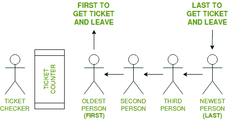

# 编程中的先进先出方法

> 原文:[https://www . geesforgeks . org/FIFO-先进先出-编程方式/](https://www.geeksforgeeks.org/fifo-first-in-first-out-approach-in-programming/)

**先进先出**是**先进先出**的缩写。这是一种处理数据结构的方法，首先处理**第一个元素**，最后处理**最新的元素**。
**现实生活中的例子:**



在本例中，需要考虑以下事项:

*   有一个售票柜台，人们来了，拿着票走了。
*   人们排着队有组织地到达售票柜台。
*   先进入队列的人，会先拿到票再离开队列。
*   下一个排队的人将在他前面的人之后拿到票
*   这样，最后一个进入队列的人将是最后一张票
*   因此，第一个进入队列的人首先获得票证，最后一个进入队列的人最后获得票证。

这就是所谓的先进先出方法。
**使用 FIFO 的地方:**

1.  **数据结构**
    某些数据结构，如队列和队列的其他变体，使用先进先出的方法来处理数据。

2.  **磁盘调度**
    磁盘控制器可以使用先进先出作为磁盘调度算法来确定服务磁盘输入/输出请求的顺序。

3.  **通信和网络**
    计算机网络中使用的通信网桥、交换机和路由器使用先进先出来保存去往下一个目的地的数据包。

**先进先出**
**程序示例程序 1:** 队列

## C++

```
// C++ program to demonstrate
// working of FIFO
// using Queue interface in C++

#include<bits/stdc++.h>
using namespace std;

// print the elements of queue
void print_queue(queue<int> q)
{
    while (!q.empty())
    {
        cout << q.front() << " ";
        q.pop();
    }
    cout << endl;
}

// Driver code
int main()
{
    queue<int> q ;

    // Adds elements {0, 1, 2, 3, 4} to queue
    for (int i = 0; i < 5; i++)
        q.push(i);

    // Display contents of the queue.
    cout << "Elements of queue-";

    print_queue(q);

    // To remove the head of queue.
    // In this the oldest element '0' will be removed
    int removedele = q.front();
    q.pop();
    cout << "removed element-" << removedele << endl;

    print_queue(q);

    // To view the head of queue
    int head = q.front();
    cout << "head of queue-" << head << endl;

    // Rest all methods of collection interface,
    // Like size and contains can be used with this
    // implementation.
    int size = q.size();
    cout << "Size of queue-" << size;

    return 0;
}

// This code is contributed by Arnab Kundu
```

## Java 语言(一种计算机语言，尤用于创建网站)

```
// Java program to demonstrate
// working of FIFO
// using Queue interface in Java

import java.util.LinkedList;
import java.util.Queue;

public class QueueExample {
    public static void main(String[] args)
    {
        Queue<Integer> q = new LinkedList<>();

        // Adds elements {0, 1, 2, 3, 4} to queue
        for (int i = 0; i < 5; i++)
            q.add(i);

        // Display contents of the queue.
        System.out.println("Elements of queue-" + q);

        // To remove the head of queue.
        // In this the oldest element '0' will be removed
        int removedele = q.remove();
        System.out.println("removed element-" + removedele);

        System.out.println(q);

        // To view the head of queue
        int head = q.peek();
        System.out.println("head of queue-" + head);

        // Rest all methods of collection interface,
        // Like size and contains can be used with this
        // implementation.
        int size = q.size();
        System.out.println("Size of queue-" + size);
    }
}
```

## 蟒蛇 3

```
# Python program to demonstrate
# working of FIFO
# using Queue interface in Java

q = []

# Adds elements {0, 1, 2, 3, 4} to queue
for i in range(5):
    q.append(i)

# Display contents of the queue.
print("Elements of queue-" , q)

# To remove the head of queue.
# In this the oldest element '0' will be removed
removedele = q.pop(0)
print("removed element-" , removedele)

print(q)

# To view the head of queue
head = q[0]
print("head of queue-" , head)

# Rest all methods of collection interface,
# Like size and contains can be used with this
# implementation.
size = len(q)
print("Size of queue-" , size)

# This code is contributed by patel2127.
```

## C#

```
// C# program to demonstrate
// working of FIFO
using System;
using System.Collections.Generic;

public class QueueExample
{
    public static void Main(String[] args)
    {
        Queue<int> q = new Queue<int>();

        // Adds elements {0, 1, 2, 3, 4} to queue
        for (int i = 0; i < 5; i++)
            q.Enqueue(i);

        // Display contents of the queue.
        Console.Write("Elements of queue-");
        foreach(int s in q)
                Console.Write(s + " ");

        // To remove the head of queue.
        // In this the oldest element '0' will be removed
        int removedele = q.Dequeue();
        Console.Write("\nremoved element-" + removedele + "\n");
        foreach(int s in q)
                Console.Write(s + " ");

        // To view the head of queue
        int head = q.Peek();
        Console.Write("\nhead of queue-" + head);

        // Rest all methods of collection interface,
        // Like size and contains can be used with this
        // implementation.
        int size = q.Count;
        Console.WriteLine("\nSize of queue-" + size);
    }
}

// This code has been contributed by 29AjayKumar
```

## java 描述语言

```
<script>

// JavaScript program to demonstrate
// working of FIFO
// using Queue interface in Java

let q = [];
// Adds elements {0, 1, 2, 3, 4} to queue
for (let i = 0; i < 5; i++)
    q.push(i);

// Display contents of the queue.
document.write("Elements of queue-[" + q.join(", ")+"]<br>");

// To remove the head of queue.
// In this the oldest element '0' will be removed
let removedele = q.shift();
document.write("removed element-" + removedele+"<br>");

document.write("["+q.join(", ")+"]<br>");

// To view the head of queue
let head = q[0];
document.write("head of queue-" + head+"<br>");

// Rest all methods of collection interface,
// Like size and contains can be used with this
// implementation.
let size = q.length;
document.write("Size of queue-" + size+"<br>");

// This code is contributed by avanitrachhadiya2155

</script>
```

**输出:**

```
Elements of queue-[0, 1, 2, 3, 4]
removed element-0
[1, 2, 3, 4]
head of queue-1
Size of queue-4
```