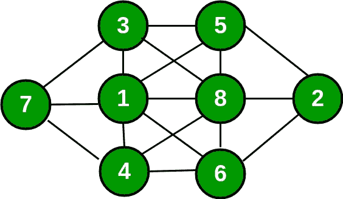

# 用给定条件在网格中填入 8 个数字

> 原文:[https://www.geeksforgeeks.org/fill-grid-1-8-numbers/](https://www.geeksforgeeks.org/fill-grid-1-8-numbers/)

将数字 1、2、3、4、5、6、7、8 放入下图中的八个圆圈中，这样，在序列中没有数字与它旁边的数字相邻。例如，1 不应与 2 相邻，但可以与 3、4、5、6、7、8 相邻。其他人也是如此。



**天真算法**
天真算法是生成从 1 到 8 的所有可能的数字配置来填充空单元格。逐个尝试每个配置，直到找到正确的配置。
**回溯算法**
和所有其他[回溯](https://www.geeksforgeeks.org/category/algorithm/backtracking/)问题一样，我们可以通过为空单元格逐个赋值来解决这个问题。在分配号码之前，我们检查分配是否安全。我们基本上检查相同的数字没有出现在它的相邻单元格中(垂直、水平或对角)。检查安全后，我们分配号码，并递归地检查这个分配是否导致解决方案。如果赋值没有导致解决方案，那么我们尝试当前空单元格的下一个数字。如果没有一个数字(1 到 8)导致解，我们返回 false。

```
  Find row, col of an unassigned cell
  If there is none, return true
  For digits from 1 to 8
    a) If there is no conflict for digit at row, col
        assign digit to row, col and recursively try fill in rest of grid
    b) If recursion successful, return true
    c) Else, remove digit and try another
  If all digits have been tried and nothing worked, return false
```

## 卡片打印处理机（Card Print Processor 的缩写）

```
// A Backtracking program in
// C++ to solve given problem
#include <cmath>
#include <iostream>

#define N 3 // row of grid
#define M 4 // column of grid
#define UNASSIGNED -1
using namespace std;

/* Returns a boolean which indicates
whether any assigned entry within the
specified grid matches the given number. */
bool UsedInGrid(int grid[N][M], int num)
{
    for (int i = 0; i < N; i++) {
        for (int j = 0; j < M; j++)
            if (grid[i][j] == num)
                return true;
    }
    return false;
}

/* Returns a boolean which indicates
whether it will be legal to assign
num to the given row, col location. */
bool isSafe(int grid[N][M], int row, int col, int num)
{
    /* Check if 'num' is not already placed in Whole Grid*/
    if (row == 0 && col == 1) {

        if (UsedInGrid(grid, num)
            || (abs(num - grid[row][col + 1]) <= 1)
            || (abs(num - grid[row + 1][col]) <= 1)
            || (abs(num - grid[row + 1][col - 1]) <= 1)
            || (abs(num - grid[row + 1][col + 1]) <= 1))
            return false;
    }
    else if (row == 0 && col == 2) {
        if (UsedInGrid(grid, num)
            || (abs(num - grid[row][col - 1]) <= 1)
            || (abs(num - grid[row + 1][col]) <= 1)
            || (abs(num - grid[row + 1][col + 1]) <= 1)
            || (abs(num - grid[row + 1][col - 1]) <= 1))
            return false;
    }
    else if (row == 1 && col == 0) {
        if (UsedInGrid(grid, num)
            || (abs(num - grid[row - 1][col + 1]) <= 1)
            || (abs(num - grid[row][col + 1]) <= 1)
            || (abs(num - grid[row + 1][col + 1]) <= 1))
            return false;
    }
    else if (row == 1 && col == 3) {
        if (UsedInGrid(grid, num)
            || (abs(num - grid[row - 1][col - 1]) <= 1)
            || (abs(num - grid[row][col - 1]) <= 1)
            || (abs(num - grid[row + 1][col - 1]) <= 1))
            return false;
    }
    else if (row == 2 && col == 1) {
        if (UsedInGrid(grid, num)
        || (abs(num - grid[row - 1][col - 1]) <= 1)
        || (abs(num - grid[row - 1][col]) <= 1)
        || (abs(num - grid[row - 1][col + 1]) <= 1)
        || (abs(num - grid[row][col + 1]) <= 1))
            return false;
    }
    else if (row == 2 && col == 2) {
        if (UsedInGrid(grid, num)
        || (abs(num - grid[row][col - 1]) <= 1)
        || (abs(num - grid[row - 1][col]) <= 1)
        || (abs(num - grid[row - 1][col + 1]) <= 1)
        || (abs(num - grid[row - 1][col - 1]) <= 1))
            return false;
    }
    else if (row == 1 && col == 1) {
        if (UsedInGrid(grid, num)
        || (abs(num - grid[row][col - 1]) <= 1)
        || (abs(num - grid[row - 1][col]) <= 1)
        || (abs(num - grid[row - 1][col + 1]) <= 1)
        || (abs(num - grid[row][col + 1]) <= 1)
        || (abs(num - grid[row + 1][col + 1]) <= 1)
        || (abs(num - grid[row + 1][col]) <= 1))
            return false;
    }
    else if (row == 1 && col == 2) {
        if (UsedInGrid(grid, num)
        || (abs(num - grid[row][col - 1]) <= 1)
        || (abs(num - grid[row - 1][col]) <= 1)
        || (abs(num - grid[row + 1][col - 1]) <= 1)
        || (abs(num - grid[row][col + 1]) <= 1)
        || (abs(num - grid[row - 1][col - 1]) <= 1)
        || (abs(num - grid[row + 1][col]) <= 1))
            return false;
    }
    return true;
}

// This function finds an entry
// in grid that is still unassigned
bool FindUnassignedLocation(int grid[N][M],
                        int& row, int& col)
{
    for (row = 0; row < N; row++)
        for (col = 0; col < M; col++) {
            if (grid[row][col] == UNASSIGNED)
                return true;
        }
    return false;
}

/* A utility function to print grid */
void printGrid(int grid[N][M])
{
    for (int i = 0; i < N; i++) {
        if (i == 0 || i == N - 1)
            cout << " ";
        for (int j = 0; j < M; j++) {
            if (grid[i][j] == 0)
                cout << " ";
            else
                cout << grid[i][j] << " ";
        }
        cout << endl;
    }
}

/* Takes a grid and attempts to assign values to
all unassigned locations in such a way to meet
the requirements for this solution.*/
bool Solve(int grid[N][M])
{
    int row, col;

    // If there is no unassigned location, we are done
    if (!FindUnassignedLocation(grid, row, col))
        return true; // success!

    // consider digits 1 to 8
    for (int num = 1; num <= 8; num++) {

        // if looks promising
        if (isSafe(grid, row, col, num)) {

            // make tentative assignment
            grid[row][col] = num;

            // return, if success, yay!
            if (Solve(grid))
                return true;

            // failure, unmake & try again
            grid[row][col] = UNASSIGNED;
        }
    }
    return false; // this triggers backtracking
}

/* Driver Program to test above functions */
int main()
{
    // -1 means unassigned cells
    int grid[N][M] = { { 0, -1, -1, 0 },
                    { -1, -1, -1, -1 },
                    { 0, -1, -1, 0 } };

    if (Solve(grid) == true)
        printGrid(grid);
    else
        cout << "Not possible";

    return 0;
}
```

**Output:** 

```
  3 5  
7 1 8 2 
  4 6
```