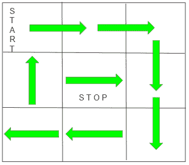

# 从(0，0)

开始访问矩阵的每个单元后的最终方向

> 原文:[https://www . geeksforgeeks . org/final-方向-参观完矩阵的每个单元-从 0-0 开始/](https://www.geeksforgeeks.org/final-direction-after-visiting-every-cell-of-matrix-starting-from-0-0/)

给定一个大小为**N×M**的 2D 网格。任务是在给定条件下访问每个细胞后找到最终方向。

*   您只能从 N*M 网格的左上角开始，并面向右侧。
*   你可以一次朝你面对的方向走一个方块。
*   如果你到达了网格的边界，或者你将要参观的下一个广场已经被参观过了，你就向右转。

**例:**

> **输入:** N = 3，M = 3
> **输出:**右
> **说明:**下图为穿越网格
> 后的最终位置
> 
> 
> 
> **输入:** N = 3，M = 1
> T3】输出:下降

**方法:**对于上述问题陈述，我们必须观察以下几点:

*   形成的路径将永远是螺旋路径。所以，我们可以说，中间的任何一个细胞都将是最终的细胞，我们需要找到那个细胞的方向。
*   如果 **n > m** ，那么最终方向只能是向上或向下，这取决于 m 的值，因为当所有其他列都被覆盖时，在最后一个未覆盖的列中总会留下一些单元。
*   如果 **n < = m** ，那么最终方向只能是左或右，这取决于 n 的值

因此基于以上观察，4 个方向只能有 4 种情况:

1.  如果 n > m，m 为偶数，则最终方向为向上。
2.  如果 n > m，m 为奇数，则最终方向为向下。
3.  如果 n <= m 且 n 为偶数，则最终方向为左。
4.  如果 n <= m 且 n 为奇数，则最终方向为右。

以下是上述方法的实现:

## C++

```
// C++ program to find the direction
// when stopped moving

#include <bits/stdc++.h>
using namespace std;

// Function to find the direction
// when stopped moving
void findDirection(int n, int m)
{
    if (n > m) {
        if (m % 2 == 0)
            printf("Up\n");
        else
            printf("Down\n");
    }
    else {
        if (n % 2 == 0)
            printf("Left\n");
        else
            printf("Right\n");
    }
}

// Driver Code
int main()
{
    // Given size of NxM grid
    int n = 3, m = 3;

    // Function Call
    findDirection(n, m);
    return 0;
}
```

## Java 语言(一种计算机语言，尤用于创建网站)

```
// Java program to find the direction
// when stopped moving
class GFG{

// Function to find the direction
// when stopped moving
static void findDirection(int n, int m)
{
    if (n > m)
    {
        if (m % 2 == 0)
            System.out.print("Up\n");
        else
            System.out.print("Down\n");
    }
    else
    {
        if (n % 2 == 0)
            System.out.print("Left\n");
        else
            System.out.print("Right\n");
    }
}

// Driver code
public static void main(String[] args)
{

    // Given size of NxM grid
    int n = 3, m = 3;

    // Function Call
    findDirection(n, m);
}
}

// This code is contributed by shubham
```

## 蟒蛇 3

```
# Python3 program to find the direction
# when stopped moving

# Function to find the direction
# when stopped moving
def findDirection(n, m):

    if (n > m):
        if (m % 2 == 0):
            print("Up\n");
        else:
            print("Down\n");

    else:
        if (n % 2 == 0):
            print("Left\n");
        else:
            print("Right\n");

# Driver Code

# Given size of NxM grid
n = 3; m = 3;

# Function Call
findDirection(n, m);

# This code is contributed by Code_Mech
```

## C#

```
// C# program to find the direction
// when stopped moving
using System;
class GFG{

// Function to find the direction
// when stopped moving
static void findDirection(int n, int m)
{
    if (n > m)
    {
        if (m % 2 == 0)
            Console.Write("Up\n");
        else
            Console.Write("Down\n");
    }
    else
    {
        if (n % 2 == 0)
            Console.Write("Left\n");
        else
            Console.Write("Right\n");
    }
}

// Driver code
public static void Main()
{

    // Given size of NxM grid
    int n = 3, m = 3;

    // Function Call
    findDirection(n, m);
}
}

// This code is contributed by Code_Mech
```

## java 描述语言

```
<script>
// Javascript program to find the direction
// when stopped moving

// Function to find the direction
// when stopped moving
function findDirection(n, m)
{
    if (n > m) {
        if (m % 2 == 0)
            document.write("Up<br>");
        else
            document.write("Down<br>");
    }
    else {
        if (n % 2 == 0)
            document.write("Left<br>");
        else
            document.write("Right<br>");
    }
}

// Driver Code
// Given size of NxM grid
let n = 3, m = 3;

// Function Call
findDirection(n, m);

// This code is contributed by rishavmahato348.
</script>
```

**Output:** 

```
Right
```

**时间复杂度:***O(1)*
T5】辅助空间: *O(1)*