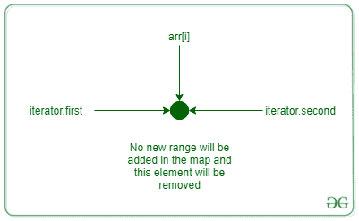
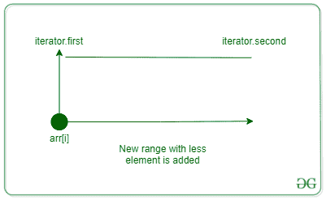
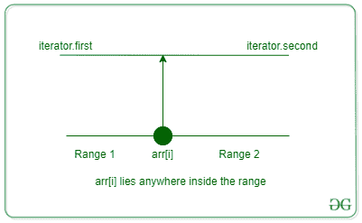

# 期末考试| Google Kickstart 2021 轮

> 原文:[https://www . geesforgeks . org/final-exam-Google-kickstart-2021-round-d/](https://www.geeksforgeeks.org/final-exam-google-kickstart-2021-round-d/)

算法与数据结构期末考试时间到了！

埃德格准备了 **N** 套题。每一组由难度递增的问题组成；第 I 个集合可以用两个整数 Ai 和 Bi (Ai≤Bi)来描述，表示这个集合包含有困难的问题 Ai，Ai+1…，Bi。在所有集合的所有问题中，保证没有两个问题的难度相同。

这学期埃德格要考 **M** 的学生。他想用他的一组问题中的一个来测试每个学生。没有两个学生能得到完全相同的问题，所以当 Edsger 测试一个有问题的学生时，他不能再用这个问题了。通过无数的讲座、练习和项目，Edsger 已经测量出学生人数 j 具有技能水平 Sj，并想给该学生一个有难度的问题 Sj。不幸的是，这并不总是可能的，因为 Edsger 可能没有准备好这个难度的问题，或者他可能早些时候已经向其他一些学生提出了这个问题。因此，Edsger 将为第 j 名学生选择一个难度为 Pj 的问题，其方式是| Pj-Sj |最小，并且难度为 Pj 的问题在第 j 名学生之前没有给任何学生。在打成平手的情况下，埃德格总是会选择更容易的问题。请注意，为第 j 个学生选择的问题可能会影响为以后测试的所有学生选择的问题，因此您必须按照输入中出现的相同顺序处理学生。

由于跟踪所有问题可能相当复杂，你能帮助 Edsger 确定他应该给所有学生哪些问题吗？

运筹学

给定一个由 **N** 对组成的数组**问题范围**，数组的起始值和结束值作为难度等级的范围，以及一个大小为 **M** 的数组 **arr** ，表示每个学生可以尝试的难度等级。任务是将唯一的整数 **X** 从**问题范围**分配给数组 **arr** 中的每个整数，使得**| arr[I]–X |**最小化。如果最接近**arr【I】**的两个值之间存在联系，则必须选择难度较小的值。 **X** 值必须按顺序分配给学生，因为 **X** 的相同值不能分配给多个学生。打印分配给每个学生的 **X** 值。

**示例:**

> **输入:** N = 5，M = 4，arr = [14，24，24，4]，问题范围= [[1，2]，[6，7]，[9，12]，[24，24]，[41，50]]
> **输出:** 12 24 11 2
> **解释:**可分配给学生的值为{1，2}，{6，7}，{9，8 }24 最接近 24。下一个学生也可以尝试难度为 24 的问题，但是已经选择了范围内的 24 个，下一个最接近的是 11 个。2 和 6 最接近难度 4 的最后一个学生，因为 2 和 6 都类似地接近 4，难度 2 的较容易的问题被分配。
> 
> **输入:** N = 1，M = 1，arr = [24]，问题范围= [[42，42]]
> **输出:** 42

**方法:**给定的问题可以通过以下步骤解决:

*   使用[映射](https://www.geeksforgeeks.org/map-associative-containers-the-c-standard-template-library-stl/)将范围的开始存储为键，范围的结束存储为值
*   [迭代数组](https://www.geeksforgeeks.org/iterating-arrays-java/)，对于数组中的每个元素，在地图中找到它的**下界**
*   有两种情况是可能的:**下界**将返回迭代器，指向等于**arr【I】**的键或大于**arr【I】**的键
    *   假设**下界**提供的迭代器是 **it** ， **pre** 是刚好在 **it** 之前的迭代器( **pre** 将等于 **it** 当**it**=**MP . begin()**)
    *   要么**pre . first<= arr[I]<= pre . second**要么**it . first<= arr[I]<= it . second**为真。 **arr[i]** 将位于该范围的前部或后部
    *   每次给 **arr[i]** 赋值时，先前的范围会从地图中删除，并添加一个新的范围，如图所示
    *   如下图所示，要么添加两个新范围，要么添加一个新范围:



该区域中只有一个元素，因此它被删除，并且没有添加新的区域



arr[i]等于以下任一范围



先前的范围被移除，两个新的范围被添加到地图中

下面是上述方法的实现:

## C++

```
// C++ implementation for the above approach

#include <bits/stdc++.h>

using namespace std;

void solve(long long int N, long long int M,
           vector<pair<long long int,
                       long long int> >
               problemRange,
           vector<long long int> arr)
{

    // Store the problem range in a map
    map<long long int, long long int> mp;

    for (long long int i = 0; i < N; i++) {
        long long int a, b;
        a = problemRange[i].first;
        b = problemRange[i].second;
        mp[a] = b;
    }

    vector<long long int> ans(M);

    for (long long int i = 0; i < M; i++) {
        auto it = mp.lower_bound(arr[i]);
        auto pre = it;
        if (it != mp.begin())
            pre--;

        // If answer lies in a valid range
        if (pre->first <= arr[i]
            && arr[i] <= pre->second) {
            ans[i] = arr[i];
            long long int st = pre->first,
                          end = pre->second;
            mp.erase(pre);
            long long int left = arr[i] - 1,
                          right = arr[i] + 1;
            if (st <= left) {
                mp[st] = left;
            }
            if (end >= right) {
                mp[right] = end;
            }
        }

        // If answer is not in a valid range
        else {
            long long int op1 = pre->second,
                          op2 = it->first;
            if (abs(arr[i] - op1) <= abs(arr[i] - op2)) {
                ans[i] = op1;
                long long int st = pre->first,
                              end = op1 - 1;
                mp.erase(pre);
                if (st <= end)
                    mp[st] = end;
            }
            else {
                ans[i] = op2;
                long long int st = it->first + 1,
                              end = it->second;
                mp.erase(it);
                if (st <= end)
                    mp[st] = end;
            }
        }
    }
    for (auto it : ans)
        cout << it << " ";
    cout << endl;
}

// Driver code
int main()
{
    long long int N, M;
    N = 5;
    M = 4;

    // Student difficulty level
    vector<long long int> arr = { 14, 24, 24, 4 };

    vector<pair<long long int,
                long long int> >
        problemRange = { { 1, 2 },
                         { 6, 7 },
                         { 9, 12 },
                         { 24, 24 },
                         { 41, 50 } };
    solve(N, M, problemRange, arr);
    return 0;
}
```

**Output**

```
12 24 11 2 
```

**时间复杂度:**MLog(N)
T3】辅助空间: O(N)