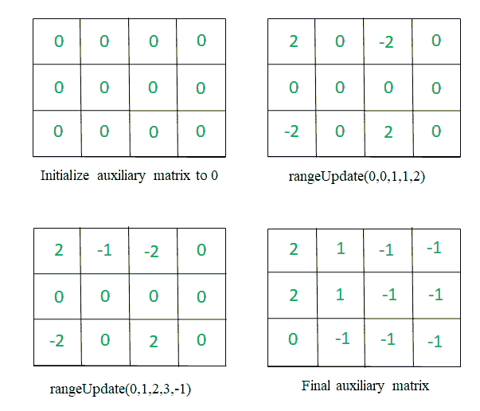

# 在 Q 查询给出的范围内将子矩阵增加 K 后的最终矩阵

> 原文:[https://www . geeksforgeeks . org/final-递增后的矩阵-范围内的 k 个子矩阵-由 q-query 给出/](https://www.geeksforgeeks.org/final-matrix-after-incrementing-submatrices-by-k-in-range-given-by-q-queries/)

给定大小为 **N*M** 和 **Q** 的 2D 矩阵 **mat[][]** ，查询形式为 **{x1，y1，x2，y2，K}** 。对于每个查询，任务是将值 **K** 添加到从单元格 **(x1，y1)** 到 **(x2，y2)** 的子矩阵中。执行所有查询后打印矩阵。

**示例:**

> **输入:** N = 3，M = 4，mat[][] = {{1，0，1，2}，{0，2，4，1}，{1，2，1，0}}，Q = 1，query[][]= { { 0，0，1，1，2 } }
> T3】输出:T5】3 2 1 2
> 2 4 1
> 1 2 1 0
> T9】解释:
> 只有一个查询 I。
> 
> **输入:** N = 2，M = 3，mat[][] = {{3，2，1}，{2，4，4}}，Q = 1，query[][]= { {0，1，1，2，-1}，{ 0，0，1，1，5}}
> **输出:**
> 8 6 0
> 7 8 3
> **解释:**
> 为查询 1，即从单元格 mat[0][1]更新子矩阵 即，将子矩阵从单元 mat[0][0]更新为 mat[2][2],增量为 5，矩阵变为:
> 8 6 0
> 7 8 3

**<u>天真方法</u> :** 最简单的方法是迭代子矩阵，并为每个查询将 **K** 添加到从 **mat[x1][y1]** 到 **mat[x2][y2]** 的所有元素中。完成上述操作后，打印矩阵。

***时间复杂度:**O(N * M * Q)*
T5**辅助空间:** O(1)

**<u>高效方法</u> :** 思路是利用一个辅助矩阵对子矩阵单元的角进行更新操作，然后找到矩阵的[前缀和](https://www.geeksforgeeks.org/prefix-sum-array-implementation-applications-competitive-programming/)得到结果矩阵。以下是步骤:

1.  初始化辅助矩阵的所有元素，比如 **aux[][]** 到 **0** 。
2.  对于每个查询 **{x1，y1，x2，y2，K}** 将辅助矩阵更新为:
    *   在[x1][y1] += K 时
    *   如果(x2 + 1 < N)则返回到[x2 + 1][y1] -= K
    *   如果(x2+1 < n & y2+1 < n)，则返回到[x2 + 1][y2 + 1] += K
    *   如果(y2 + 1 < N)则返回到[x1][y2 + 1] -= K
3.  求辅助矩阵每行的[前缀和](https://www.geeksforgeeks.org/prefix-sum-array-implementation-applications-competitive-programming/)。
4.  求辅助矩阵每列的前缀和。
5.  现在，将辅助矩阵更新为辅助矩阵和给定矩阵的每个相应单元的元素之和。
6.  完成上述所有操作后，打印辅助矩阵。

> 以下是**查询[][] = {{0，0，1，1，2}，{0，1，2，3，-1}}** 如何创建和更新辅助矩阵的**图解**:
> 
> [](https://media.geeksforgeeks.org/wp-content/uploads/20200820124308/gfg.png)

下面是上述方法的实现:

## C++

```
// C++ program for the above approach

#include <bits/stdc++.h>
using namespace std;
#define N 3
#define M 4

// Query data type
struct query {
    int x1, x2, y1, y2, K;
};

// Function to update the given query
void updateQuery(int from_x, int from_y,
                 int to_x, int to_y,
                 int k, int aux[][M])
{
    // Update top cell
    aux[from_x][from_y] += k;

    // Update bottom left cell
    if (to_x + 1 < N)
        aux[to_x + 1][from_y] -= k;

    // Update bottom right cell
    if (to_x + 1 < N && to_y + 1 < M)
        aux[to_x + 1][to_y + 1] += k;

    // Update top right cell
    if (to_y + 1 < M)
        aux[from_x][to_y + 1] -= k;
}

// Function that updates the matrix
// mat[][] by adding elements of aux[][]
void updateMatrix(int mat[][M], int aux[][M])
{

    // Compute the prefix sum of all columns
    for (int i = 0; i < N; i++) {
        for (int j = 1; j < M; j++) {
            aux[i][j] += aux[i][j - 1];
        }
    }

    // Compute the prefix sum of all rows
    for (int i = 0; i < M; i++) {
        for (int j = 1; j < N; j++) {
            aux[j][i] += aux[j - 1][i];
        }
    }

    // Get the final matrix by adding
    // mat and aux matrix at each cell
    for (int i = 0; i < N; i++) {
        for (int j = 0; j < M; j++) {

            mat[i][j] += aux[i][j];
        }
    }
}

// Function that prints matrix mat[]
void printMatrix(int mat[][M])
{
    // Traverse each row
    for (int i = 0; i < N; i++) {

        // Traverse each columns
        for (int j = 0; j < M; j++) {

            cout << mat[i][j] << " ";
        }
        cout << "\n";
    }
}

// Function that performs each query in
// the given matrix and print the updated
// matrix after each operation performed
void matrixQuery(int mat[][M], int Q,
 query q[])
{

    // Initialize all elements to 0
    int aux[N][M] = {};

    // Update auxiliary matrix
    // by traversing each query
    for (int i = 0; i < Q; i++) {

        // Update Query
        updateQuery(q[i].x1, q[i].x2,
                    q[i].y1, q[i].y2,
                    q[i].K, aux);
    }

    // Compute the final answer
    updateMatrix(mat, aux);

    // Print the updated matrix
    printMatrix(mat);
}

// Driver Code
int main()
{
    // Given Matrix
    int mat[N][M] = { { 1, 0, 1, 2 },
                      { 0, 2, 4, 1 },
                      { 1, 2, 1, 0 } };

    int Q = 1;

    // Given Queries
    query q[] = { { 0, 0, 1, 1, 2 } };

    // Function Call
    matrixQuery(mat, Q, q);
    return 0;
}
```

## Java 语言(一种计算机语言，尤用于创建网站)

```
// Java program for the above approach
class GFG{
static final int N = 3;
static final int M = 4;

// Query data type
static class query
{
    int x1, x2, y1, y2, K;
    public query(int x1, int x2,
                 int y1, int y2, int k)
    {
        this.x1 = x1;
        this.x2 = x2;
        this.y1 = y1;
        this.y2 = y2;
        K = k;
    }
};

// Function to update the given query
static void updateQuery(int from_x, int from_y,
                        int to_x, int to_y,
                        int k, int aux[][])
{
    // Update top cell
    aux[from_x][from_y] += k;

    // Update bottom left cell
    if (to_x + 1 < N)
        aux[to_x + 1][from_y] -= k;

    // Update bottom right cell
    if (to_x + 1 < N && to_y + 1 < M)
        aux[to_x + 1][to_y + 1] += k;

    // Update top right cell
    if (to_y + 1 < M)
        aux[from_x][to_y + 1] -= k;
}

// Function that updates the matrix
// mat[][] by adding elements of aux[][]
static void updateMatrix(int mat[][],
                         int aux[][])
{

    // Compute the prefix sum of all columns
    for (int i = 0; i < N; i++)
    {
        for (int j = 1; j < M; j++)
        {
            aux[i][j] += aux[i][j - 1];
        }
    }

    // Compute the prefix sum of all rows
    for (int i = 0; i < M; i++)
    {
        for (int j = 1; j < N; j++)
        {
            aux[j][i] += aux[j - 1][i];
        }
    }

    // Get the final matrix by adding
    // mat and aux matrix at each cell
    for (int i = 0; i < N; i++)
    {
        for (int j = 0; j < M; j++)
        {
            mat[i][j] += aux[i][j];
        }
    }
}

// Function that prints matrix mat[]
static void printMatrix(int mat[][])
{
    // Traverse each row
    for (int i = 0; i < N; i++)
    {
        // Traverse each columns
        for (int j = 0; j < M; j++)
        {
            System.out.print(mat[i][j] + " ");
        }
        System.out.print("\n");
    }
}

// Function that performs each query in
// the given matrix and print the updated
// matrix after each operation performed
static void matrixQuery(int mat[][],
                        int Q, query q[])
{
    // Initialize all elements to 0
    int [][]aux = new int[N][M];

    // Update auxiliary matrix
    // by traversing each query
    for (int i = 0; i < Q; i++)
    {
        // Update Query
        updateQuery(q[i].x1, q[i].x2,
                    q[i].y1, q[i].y2,
                    q[i].K, aux);
    }

    // Compute the final answer
    updateMatrix(mat, aux);

    // Print the updated matrix
    printMatrix(mat);
}

// Driver Code
public static void main(String[] args)
{
    // Given Matrix
    int mat[][] = {{1, 0, 1, 2},
                   {0, 2, 4, 1},
                   {1, 2, 1, 0}};

    int Q = 1;

    // Given Queries
    query q[] = {new query(0, 0, 1, 1, 2 )};

    // Function Call
    matrixQuery(mat, Q, q);
}
}

// This code is contributed by 29AjayKumar
```

## 蟒蛇 3

```
# Python3 program for the above approach

# Query data type

# Function to update the given query
def updateQuery(from_x, from_y,
                to_x, to_y, k, aux):

    # Update top cell
    aux[from_x][from_y] += k

    # Update bottom left cell
    if (to_x + 1 < 3):
        aux[to_x + 1][from_y] -= k

    # Update bottom right cell
    if (to_x + 1 < 3 and to_y + 1 < 4):
        aux[to_x + 1][to_y + 1] += k

    # Update top right cell
    if (to_y + 1 < 4):
        aux[from_x][to_y + 1] -= k

    # return aux

# Function that updates the matrix
# mat[][] by adding elements of aux[][]
def updatematrix(mat, aux):

    # Compute the prefix sum of all columns
    for i in range(3):
        for j in range(1, 4):
            aux[i][j] += aux[i][j - 1]

    # Compute the prefix sum of all rows
    for i in range(4):
        for j in range(1, 3):
            aux[j][i] += aux[j - 1][i]

    # Get the final matrix by adding
    # mat and aux matrix at each cell
    for i in range(3):
        for j in range(4):
            mat[i][j] += aux[i][j]

    # return mat

# Function that prints matrix mat[]
def printmatrix(mat):

    # Traverse each row
    for i in range(3):

        # Traverse each columns
        for j in range(4):

            print(mat[i][j], end = " ")

        print()

# Function that performs each query in
# the given matrix and print the updated
# matrix after each operation performed
def matrixQuery(mat, Q, q):

    # Initialize all elements to 0
    aux = [[ 0 for i in range(4)]
               for i in range(3)]

    # Update auxiliary matrix
    # by traversing each query
    for i in range(Q):

        # Update Query
        updateQuery(q[i][0], q[i][1],
                    q[i][2], q[i][3],
                    q[i][4], aux)

    # Compute the final answer
    updatematrix(mat, aux)

    # Print the updated matrix
    printmatrix(mat)

# Driver Code
if __name__ == '__main__':

    # Given 4atrix
    mat = [ [ 1, 0, 1, 2 ],
            [ 0, 2, 4, 1 ],
            [ 1, 2, 1, 0 ] ]

    Q = 1

    # Given Queries
    q = [ [0, 0, 1, 1, 2 ] ]

    # Function Call
    matrixQuery(mat, Q, q)

# This code is contributed by mohit kumar 29
```

## C#

```
// C# program for the above approach
using System;

class GFG{

static readonly int N = 3;
static readonly int M = 4;

// Query data type
class query
{
    public int x1, x2, y1, y2, K;
    public query(int x1, int x2,
                 int y1, int y2,
                 int k)
    {
        this.x1 = x1;
        this.x2 = x2;
        this.y1 = y1;
        this.y2 = y2;
        K = k;
    }
};

// Function to update the given query
static void updateQuery(int from_x, int from_y,
                        int to_x, int to_y,
                        int k, int [,]aux)
{

    // Update top cell
    aux[from_x, from_y] += k;

    // Update bottom left cell
    if (to_x + 1 < N)
        aux[to_x + 1, from_y] -= k;

    // Update bottom right cell
    if (to_x + 1 < N && to_y + 1 < M)
        aux[to_x + 1, to_y + 1] += k;

    // Update top right cell
    if (to_y + 1 < M)
        aux[from_x, to_y + 1] -= k;
}

// Function that updates the matrix
// [,]mat by adding elements of aux[,]
static void updateMatrix(int [,]mat,
                         int [,]aux)
{

    // Compute the prefix sum of all columns
    for(int i = 0; i < N; i++)
    {
        for(int j = 1; j < M; j++)
        {
            aux[i, j] += aux[i, j - 1];
        }
    }

    // Compute the prefix sum of all rows
    for(int i = 0; i < M; i++)
    {
        for(int j = 1; j < N; j++)
        {
            aux[j, i] += aux[j - 1, i];
        }
    }

    // Get the readonly matrix by adding
    // mat and aux matrix at each cell
    for(int i = 0; i < N; i++)
    {
        for(int j = 0; j < M; j++)
        {
            mat[i, j] += aux[i, j];
        }
    }
}

// Function that prints matrix []mat
static void printMatrix(int [,]mat)
{

    // Traverse each row
    for(int i = 0; i < N; i++)
    {

        // Traverse each columns
        for(int j = 0; j < M; j++)
        {
            Console.Write(mat[i, j] + " ");
        }
        Console.Write("\n");
    }
}

// Function that performs each query in
// the given matrix and print the updated
// matrix after each operation performed
static void matrixQuery(int [,]mat,
                        int Q, query []q)
{

    // Initialize all elements to 0
    int [,]aux = new int[N, M];

    // Update auxiliary matrix
    // by traversing each query
    for(int i = 0; i < Q; i++)
    {
        // Update Query
        updateQuery(q[i].x1, q[i].x2,
                    q[i].y1, q[i].y2,
                    q[i].K, aux);
    }

    // Compute the readonly answer
    updateMatrix(mat, aux);

    // Print the updated matrix
    printMatrix(mat);
}

// Driver Code
public static void Main(String[] args)
{

    // Given Matrix
    int [,]mat = { { 1, 0, 1, 2 },
                   { 0, 2, 4, 1 },
                   { 1, 2, 1, 0 } };

    int Q = 1;

    // Given Queries
    query []q = {new query( 0, 0, 1, 1, 2 )};

    // Function call
    matrixQuery(mat, Q, q);
}
}

// This code is contributed by 29AjayKumar
```

## java 描述语言

```
<script>
// Javascript program for the above approach

let N = 3;
let M = 4;

// Query data type
class query
{
    constructor(x1,x2,y1,y2,k)
    {
        this.x1 = x1;
        this.x2 = x2;
        this.y1 = y1;
        this.y2 = y2;
        this.K = k;
    }
}

// Function to update the given query
function updateQuery(from_x,from_y,to_x,to_y,k,aux)
{
    // Update top cell
    aux[from_x][from_y] += k;

    // Update bottom left cell
    if (to_x + 1 < N)
        aux[to_x + 1][from_y] -= k;

    // Update bottom right cell
    if (to_x + 1 < N && to_y + 1 < M)
        aux[to_x + 1][to_y + 1] += k;

    // Update top right cell
    if (to_y + 1 < M)
        aux[from_x][to_y + 1] -= k;
}

// Function that updates the matrix
// mat[][] by adding elements of aux[][]
function updateMatrix(mat,aux)
{
    // Compute the prefix sum of all columns
    for (let i = 0; i < N; i++)
    {
        for (let j = 1; j < M; j++)
        {
            aux[i][j] += aux[i][j - 1];
        }
    }

    // Compute the prefix sum of all rows
    for (let i = 0; i < M; i++)
    {
        for (let j = 1; j < N; j++)
        {
            aux[j][i] += aux[j - 1][i];
        }
    }

    // Get the final matrix by adding
    // mat and aux matrix at each cell
    for (let i = 0; i < N; i++)
    {
        for (let j = 0; j < M; j++)
        {
            mat[i][j] += aux[i][j];
        }
    }
}

// Function that prints matrix mat[]
function printMatrix(mat)
{
    // Traverse each row
    for (let i = 0; i < N; i++)
    {
        // Traverse each columns
        for (let j = 0; j < M; j++)
        {
            document.write(mat[i][j] + " ");
        }
        document.write("<br>");
    }
}

// Function that performs each query in
// the given matrix and print the updated
// matrix after each operation performed
function matrixQuery(mat,Q,q)
{
    // Initialize all elements to 0
    let aux = new Array(N);
    for(let i=0;i<N;i++)
    {
        aux[i]=new Array(M);
        for(let j=0;j<M;j++)
        {
            aux[i][j]=0;
        }
    }

    // Update auxiliary matrix
    // by traversing each query
    for (let i = 0; i < Q; i++)
    {
        // Update Query
        updateQuery(q[i].x1, q[i].x2,
                    q[i].y1, q[i].y2,
                    q[i].K, aux);
    }

    // Compute the final answer
    updateMatrix(mat, aux);

    // Print the updated matrix
    printMatrix(mat);
}

// Driver Code

// Given Matrix
let mat = [[1, 0, 1, 2],
[0, 2, 4, 1],
[1, 2, 1, 0]];

let Q = 1;

// Given Queries
let q = [new query(0, 0, 1, 1, 2 )];

// Function Call
matrixQuery(mat, Q, q);

// This code is contributed by unknown2108
</script>
```

**Output:** 

```
3 2 1 2 
2 4 4 1 
1 2 1 0
```

***时间复杂度:**O(Q+N * M)*
T5**辅助空间:** O(N*M)