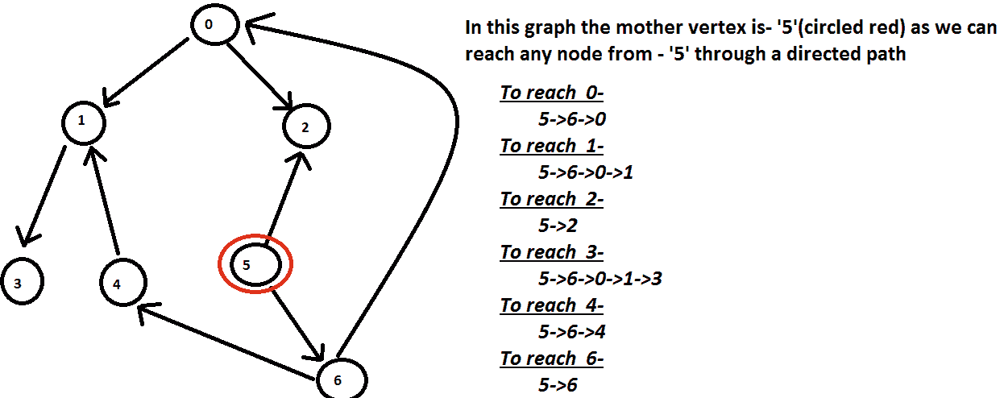

# 使用位屏蔽在图中找到母顶点

> 原文:[https://www . geeksforgeeks . org/find-a-母亲-图中顶点-使用位屏蔽/](https://www.geeksforgeeks.org/find-a-mother-vertex-in-a-graph-using-bit-masking/)

**图 G = (V，E)** 中的一个[母顶点](https://www.geeksforgeeks.org/find-a-mother-vertex-in-a-graph/)是一个顶点 V，使得从 V 开始的路径可以通过从 V 开始的路径到达 **G** 中的所有其他顶点【例:

> **输入:**
> 
> 
> 
> **输出:**T2【5】T3

**方法:**
我们可以使用[深度优先搜索](https://www.geeksforgeeks.org/find-a-mother-vertex-in-a-graph/)方法来解决这个问题。为了进一步优化我们的方法，我们将使用高效的解决方案。
下面的解决方案也是用深度优先搜索来解决这个问题，但是它只执行一次深度优先搜索循环，一找到母顶点就停止执行。

*   在执行深度优先搜索时，我们有一个[位掩码数组](https://www.geeksforgeeks.org/bitmasking-and-dynamic-programming-set-1-count-ways-to-assign-unique-cap-to-every-person/)代表每个顶点的位掩码。该位掩码数组在执行过程中被传递给所有顶点。
*   每个顶点修改它们的专用位掩码，使得表示顶点的所有设置位都可以从此顶点访问，包括当前顶点。
*   在每次迭代中，我们通过检查当前顶点位掩码值来检查是否可以从此顶点访问所有顶点(如果设置了代表所有顶点的位)。如果可以从此顶点访问所有顶点，那么它会中断执行，并找到母顶点作为当前顶点。
*   如果已经从顶点-1 访问了顶点-2，并且先前已经访问了顶点-2，则顶点-1 通过对顶点-2 位掩码执行“或”操作来更新其位掩码。

***时间复杂度:O(V+E)***
**上面的想法是怎么运作的？**
让这个方法支持一个最多有 32 个顶点的图。这种方法也可以扩展到支持更多的顶点，但是这里最多只能处理 32 个顶点。

1.  创建 32 位掩码的位掩码阵列。数组的第 0 个索引表示顶点-0 的位掩码，而数组的第 1 个索引表示顶点-1 的位掩码，依此类推。

2.  使用[深度优先搜索算法](https://www.geeksforgeeks.org/depth-first-search-or-dfs-for-a-graph/)访问图的所有顶点，并将相同的位掩码数组传递给所有顶点。相应地设置位掩码值，以表示从该顶点可以访问的所有顶点。
3.  位索引是对应于相邻顶点设置的，包括自己的位索引。相邻顶点也将对其位掩码重复相同的操作，并将其返回给顶点 1。
4.  顶点 1 将继续对其位掩码的所有邻居的返回值执行“或”运算，以表示从顶点 1 可以访问的所有顶点。
5.  请注意，如果顶点-2 是顶点-1 的邻居，并且它已经被另一个邻居顶点访问过，那么它将不会再次访问其邻居的顶点，并将其位掩码返回给第一个节点。
6.  每次迭代将检查对应于当前顶点的位掩码是否所有位都设置为 1。如果当前顶点的所有位都设置为 1，则意味着可以从当前顶点访问所有顶点，并且当前顶点是图的母顶点。

下面是我们上面方法的实现:

## 卡片打印处理机（Card Print Processor 的缩写）

```
#include<bits/stdc++.h>
using namespace std;

void PrintGraph(vector<vector<int>> adj)
{
    int n=(int)adj.size();
    for(int i=0;i<n;i++)
    {
        for(auto x:adj[i])
        {
            cout << "There is an edge from " << i <<" to " << x << '\n';
        }
    }
}

bool IsEdge(vector<vector<int>> adj,int src, int dest)
{
    for(auto x:adj[src])
    {
        if(x==dest)
            return true;
    }
    return false;
}

int MotherVertexUtil(
    vector<vector<int>> adj, int index,
    vector<int> mask, int* m_vertex)
{
    int n=(int)adj.size();
    // If mother vertex is already found
    // then simply return with existing
    // mask of the vertex index
    if (*m_vertex != -1) {

        return mask[index];
    }

    // if this vertex is already visited,
    // return the bit-mask
    // value of this vertex.
    if (mask[index] != 0) {
        return mask[index];
    }

    int tmpmask = 0;

    // Set the bit corresponding
    // to vertex index in tmpmask
    tmpmask |= (1 << index);

    for (int i = 0; i < n; i++) {
        if ((index != i)
            && IsEdge(adj, index, i)) {

            // Set bits corresponding to all
            // vertex which can be visite
            // by this vertex by ORing
            // the return value by util function

            // Vertex is not visited
            if (mask[i] == 0) {

                int retmask
                    = MotherVertexUtil(
                        adj, i, mask, m_vertex);
                tmpmask |= retmask;
            }

            // Vertex is already visited
            else {
                tmpmask |= mask[i];
            }

            // Check if current vertex is
            // mother vertex or mother vertex
            // is already found
            if (tmpmask == (pow(2, n) - 1)) {

                // If all bits of a mask is set
                // it means current vertex
                // is mother vertex
                if (*m_vertex == -1) {
                    *m_vertex = index;
                }
                return tmpmask;
            }
        }
    }

    // populate tmpmask as final
    // bit mask of the vertex
    mask[index] |= tmpmask;

    return mask[index];
}

int MotherVertex(vector<vector<int>> adj)
{
    int n=adj.size();
    vector<int> mask(n);

    // Initially bit mask
    // for all vertex will be 0
    for(int i=0;i<n;i++)
        mask[i]=0;

    // DFS traversal is used to check
    // for the mother vertex
    // All set bits (of bitmask of a vertex)
    // represent the current vertex index
    // and index of vertices which could be
    // visited from the current vertex.

    /* Example:
       If a vertex index is 3
       then and vertex 5, 7 and 10
       can be visited from this vertex
       then final bit mask of this vertex
       would be
       00000000000000000000010010101000
       (bits 3, 5, 7 and 10 are set) */

    // tmpmask is used to store
    // the final bitmask of the vertex.       
    int tmpmask = 0;

    // flag to check if
    // mother vertex is found
    int m_vertex = -1;

   for (int index = 0; index < n; index++) {

        // set the bit corresponding
        // to vertex index in tmpmask
        tmpmask = (1 << index);

        // mask for a vertex is 0
        // means it has not yet
        // visited so visit this vertex
        if (mask[index] == 0) {

            int retmask= MotherVertexUtil(adj, index,mask, &m_vertex);

            // set bits corresponding to all
            // vertices which can be visited
            // from this vertex by ORing
            // the return value by util function
            tmpmask |= retmask;
        }

        // check if current vertex is
        // mother vertex or mother vertex
        // is already found
        // If all bits of a mask is set
        // it means current vertex
        // is mother vertex
        if (tmpmask == (pow(2, n) - 1)) {

            // current vertex is mother vertex
            if (m_vertex == -1) {
                m_vertex = index;
            }
            break;
        }

        // populate tmpmask as final bit
        // mask of the vertex
        mask[index] |= tmpmask;
    }

    return m_vertex;
}

int main()
{
    int n;
    n = 7;
    vector<vector<int>> adj(n);
    adj[0].push_back(2);
    adj[0].push_back(1);
    adj[1].push_back(3);
    adj[4].push_back(1);
    adj[5].push_back(2);
    adj[5].push_back(6);
    adj[6].push_back(0);
    adj[6].push_back(4);
    PrintGraph(adj);

    int m_vertex = MotherVertex(adj);
    if( m_vertex == -1)
    {
        cout << "Mother vertex is not existing in this graph\n";
    }
    else
    {
        cout << "Mother vertex is: " << m_vertex << '\n';
    }
    return 0;
}
```

## 蟒蛇 3

```
def PrintGraph(adj):
    n = len(adj)
    for i in range(n):
        for x in adj[i]:
            print("There is an edge from {} to {}".format(i, x))

def IsEdge(adj, src, dest):
    for x in adj[src]:
        if(x == dest):
            return True

    return False

def MotherVertexUtil(adj, index, mask, m_vertex):
    n = len(adj)
    # If mother vertex is already found
    # then simply return with existing
    # mask of the vertex index
    if (m_vertex[0] != -1):

        return mask[index]

    # if this vertex is already visited,
    # return the bit-mask
    # value of this vertex.
    if (mask[index] != 0):
        return mask[index]

    tmpmask = 0

    # Set the bit corresponding
    # to vertex index in tmpmask
    tmpmask |= (1 << index)

    for i in range(n):
        if ((index != i) and IsEdge(adj, index, i)):

            # Set bits corresponding to all
            # vertex which can be visite
            # by this vertex by ORing
            # the return value by util function

            # Vertex is not visited
            if (mask[i] == 0):

                retmask = MotherVertexUtil(adj, i, mask, m_vertex)
                tmpmask |= retmask

            # Vertex is already visited
            else:
                tmpmask |= mask[i]

            # Check if current vertex is
            # mother vertex or mother vertex
            # is already found
            if (tmpmask == (pow(2, n) - 1)):

                # If all bits of a mask is set
                # it means current vertex
                # is mother vertex
                if (m_vertex[0] == -1):
                    m_vertex[0] = index

                return tmpmask

    # populate tmpmask as final
    # bit mask of the vertex
    mask[index] |= tmpmask

    return mask[index]

def MotherVertex(adj):
    n = len(adj)
    mask = [0]*n

    # Initially bit mask
    # for all vertex will be 0
    for i in range(n):
        mask[i] = 0

    # DFS traversal is used to check
    # for the mother vertex
    # All set bits (of bitmask of a vertex)
    # represent the current vertex index
    # and index of vertices which could be
    # visited from the current vertex.

    # Example:
    #    If a vertex index is 3
    #    then and vertex 5, 7 and 10
    #    can be visited from this vertex
    #    then final bit mask of this vertex
    #    would be
    #    00000000000000000000010010101000
    #    (bits 3, 5, 7 and 10 are set)

    # tmpmask is used to store
    # the final bitmask of the vertex.
    tmpmask = 0

    # flag to check if
    # mother vertex is found
    m_vertex = [-1, ]

    for index in range(n):

        # set the bit corresponding
        # to vertex index in tmpmask
        tmpmask = (1 << index)

        # mask for a vertex is 0
        # means it has not yet
        # visited so visit this vertex
        if (mask[index] == 0):

            retmask = MotherVertexUtil(adj, index, mask, m_vertex)

            # set bits corresponding to all
            # vertices which can be visited
            # from this vertex by ORing
            # the return value by util function
            tmpmask |= retmask

        # check if current vertex is
        # mother vertex or mother vertex
        # is already found
        # If all bits of a mask is set
        # it means current vertex
        # is mother vertex
        if (tmpmask == (pow(2, n) - 1)):

            # current vertex is mother vertex
            if (m_vertex[0] == -1):
                m_vertex[0] = index

            break

        # populate tmpmask as final bit
        # mask of the vertex
        mask[index] |= tmpmask

    return m_vertex[0]

if __name__ == '__main__':
    n = 7
    adj = [[] for _ in range(n)]
    adj[0].append(2)
    adj[0].append(1)
    adj[1].append(3)
    adj[4].append(1)
    adj[5].append(2)
    adj[5].append(6)
    adj[6].append(0)
    adj[6].append(4)
    PrintGraph(adj)

    m_vertex = MotherVertex(adj)
    if(m_vertex == -1):
        print("Mother vertex is not existing in this graph")

    else:
        print("Mother vertex is:", m_vertex)
```

**Output**

```
There is an edge from 0 to 2
There is an edge from 0 to 1
There is an edge from 1 to 3
There is an edge from 4 to 1
There is an edge from 5 to 2
There is an edge from 5 to 6
There is an edge from 6 to 0
There is an edge from 6 to 4
Mother vertex is: 5
```

**时间复杂度:** O(V ^ 2)，其中 v 是图中顶点的总数。
**辅助空间:** O(V)