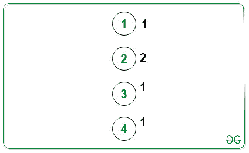
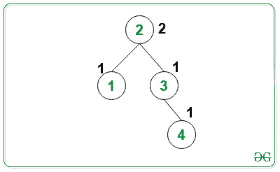
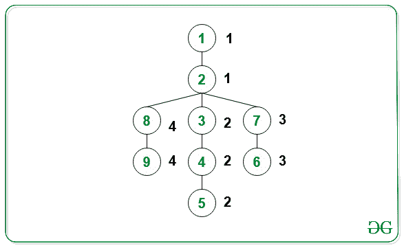
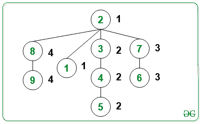

# 找到一个节点，使得从该节点到叶节点的所有路径具有相同的颜色

> 原文:[https://www . geesforgeks . org/find-a-node-so-从该节点到叶节点的所有路径都是相同颜色的/](https://www.geeksforgeeks.org/find-a-node-such-that-all-paths-from-that-node-to-leaf-nodes-are-of-the-same-color/)

给定类型为 **{ X，Y }** 的 [2D 数组](https://www.geeksforgeeks.org/multidimensional-arrays-c-cpp/) **边【】【】【】**表示在树中的节点 **X** 和 **Y** 之间存在边，以及表示 **i <sup>th</sup>** 节点的颜色值的[数组](https://www.geeksforgeeks.org/array-data-structure/) **颜色【】**，任务是找到树的根节点，使得如果存在多个解决方案，则打印其中任何一个。否则，打印 **-1** 。

**示例:**

> **输入:**
> 
> 
> 
> **输出:**2
> T3】说明:T5】
> 
> 
> 
> 从根节点(= 2)到叶节点(= 1)的路径上的所有子节点都具有相同的颜色值(= 1)。
> 从根节点(= 2)到叶节点(= 4)的路径上的所有子节点都具有相同的颜色值(= 1)。
> 因此，要求的输出为 2。
> 
> **输入:**
> 
> 
> 
> **输出:**2
> T3】说明:T5】
> 
> 
> 
> 从根节点(=2)到叶节点(=9)的路径上的所有子节点都具有相同的颜色值(= 4)。
> 从根节点(=2)到叶节点(=1)的路径上的所有子节点都具有相同的颜色值(= 1)。
> 从根节点(=2)到叶节点(=5)的路径上的所有子节点都具有相同的颜色值(= 2)。
> 从根节点(=2)到叶节点(=6)的路径上的所有子节点都具有相同的颜色值(= 3)。

**方法:**思想是迭代树中所有可能的节点。对于每一个**I<sup>th</sup>T5【节点】，使用 [DFS](https://www.geeksforgeeks.org/depth-first-search-or-dfs-for-a-graph/) 检查其是否满足根节点的条件。如果发现为真，则打印该节点。否则，打印 **-1** 。按照以下步骤解决问题:**

*   初始化一个变量，比如**根**，存储满足条件的树的根节点。
*   遍历树中所有可能的节点。将树的每一个 **i <sup>th</sup>** 节点视为根节点，并使用 [DFS](https://www.geeksforgeeks.org/depth-first-search-or-dfs-for-a-graph/) 检查从根节点到叶节点的路径上的所有子节点是否具有相同的颜色。如果发现为真，则打印该节点。
*   否则，打印 **-1** 。

下面是上述方法的实现:

## C++

```
// C++ program to implement
// the above approach

#include <bits/stdc++.h>
using namespace std;

// Function to perform dfs on the tree
bool dfs(int node, int c, vector<int> adj[],
         int color[], int visited[])
{

    // Mark visited node as true
    visited[node] = true;

    // If color does not match with
    // previous node on the same path
    if (color[node] != c) {
        return false;
    }

    // Check if current subtree
    // has all same colored nodes
    int f = 1;

    // Traverse all unvisited neighbors
    // node of the tree
    for (int j = 0; j < adj[node].size(); j++) {

        // Stores neighbors node
        // of the tree
        int neighbor = adj[node][j];

        // If current node is not
        // already visited
        if (!visited[neighbor]) {

            if (dfs(neighbor, c, adj,
                    color, visited)
                == false) {

                // Update f
                f = 0;
                break;
            }
        }
    }
    return f;
}

// Function to find the root node of
// the tree such that all child nodes
// on the same path have the same color
void findNode(int edges[][2],
              int color[], int n)
{

    // Store the adjacency list
    vector<int> adj[n + 1];

    // Traverse all edges and form
    // the adjacency list
    for (int i = 0; i < n - 1; i++) {
        int a = edges[i][0];
        int b = edges[i][1];
        adj[a].push_back(b);
        adj[b].push_back(a);
    }

    // Store the root node such that all
    // child nodes on the same path have
    // the same color
    int ans = -1;

    // Iterate over all possible
    // nodes of the tree
    for (int i = 1; i <= n; i++) {

        // Check if node i satisfies
        // the condition of root node
        int f = 1;

        // Check if a node has been
        // visited or not
        int visited[n + 1] = { false };

        // Mark visited[i] as true
        visited[i] = true;

        // Traverse all the neighbors
        // of node i
        for (int j = 0; j < adj[i].size(); j++) {

            // Stores the current neighbor
            int neighbor = adj[i][j];

            // Perform DFS for current neighbor
            if (dfs(neighbor, color[neighbor],
                    adj, color, visited)
                == false) {

                // Update f
                f = 0;
                break;
            }
        }

        if (f == 1) {
            ans = i;
            break;
        }
    }

    // Print the answer
    cout << ans;
}

// Driver Code
int main()
{

    int n = 9;
    int color[n + 1] = { -1, 1, 1, 2, 2,
                         2, 3, 3, 4, 4 };

    int edges[][2] = { { 1, 2 }, { 2, 3 },
                       { 3, 4 }, { 4, 5 },
                       { 2, 7 }, { 7, 6 },
                       { 2, 8 }, { 8, 9 } };

    findNode(edges, color, n);

    return 0;
}
```

## Java 语言(一种计算机语言，尤用于创建网站)

```
// Java program to implement
// the above approach
import java.util.*;
class GFG
{

// Function to perform dfs on the tree
static boolean dfs(int node, int c, Vector<Integer> adj[],
         int color[], boolean visited[])
{

    // Mark visited node as true
    visited[node] = true;

    // If color does not match with
    // previous node on the same path
    if (color[node] != c)
    {
        return false;
    }

    // Check if current subtree
    // has all same colored nodes
    boolean f = true;

    // Traverse all unvisited neighbors
    // node of the tree
    for (int j = 0; j < adj[node].size(); j++)
    {

        // Stores neighbors node
        // of the tree
        int neighbor = adj[node].get(j);

        // If current node is not
        // already visited
        if (!visited[neighbor])
        {

            if (dfs(neighbor, c, adj,
                    color, visited) == false)
            {

                // Update f
                f = false;
                break;
            }
        }
    }
    return f;
}

// Function to find the root node of
// the tree such that all child nodes
// on the same path have the same color
static void findNode(int edges[][],
              int color[], int n)
{

    // Store the adjacency list
    Vector<Integer> []adj = new Vector[n + 1];
    for(int i = 0; i < n + 1; i++)
        adj[i] = new Vector<Integer>();

    // Traverse all edges and form
    // the adjacency list
    for (int i = 0; i < n - 1; i++)
    {
        int a = edges[i][0];
        int b = edges[i][1];
        adj[a].add(b);
        adj[b].add(a);
    }

    // Store the root node such that all
    // child nodes on the same path have
    // the same color
    int ans = -1;

    // Iterate over all possible
    // nodes of the tree
    for (int i = 1; i <= n; i++)
    {

        // Check if node i satisfies
        // the condition of root node
        int f = 1;

        // Check if a node has been
        // visited or not
        boolean []visited = new boolean[n + 1];

        // Mark visited[i] as true
        visited[i] = true;

        // Traverse all the neighbors
        // of node i
        for (int j = 0; j < adj[i].size(); j++)
        {

            // Stores the current neighbor
            int neighbor = adj[i].get(j);

            // Perform DFS for current neighbor
            if (dfs(neighbor, color[neighbor],
                    adj, color, visited) == false)
            {

                // Update f
                f = 0;
                break;
            }
        }
        if (f == 1)
        {
            ans = i;
            break;
        }
    }

    // Print the answer
    System.out.print(ans);
}

// Driver Code
public static void main(String[] args)
{

    int n = 9;
    int color[] = { -1, 1, 1, 2, 2,
                         2, 3, 3, 4, 4 };
    int edges[][] = { { 1, 2 }, { 2, 3 },
                       { 3, 4 }, { 4, 5 },
                       { 2, 7 }, { 7, 6 },
                       { 2, 8 }, { 8, 9 } };
    findNode(edges, color, n);
}
}

// This code is contributed by 29AjayKumar
```

## 蟒蛇 3

```
# Python program to implement
# the above approach
from typing import List

# Function to perform dfs on the tree
def dfs(node: int, c: int, adj: List[List[int]],
        color: List[int],
        visited: List[int]) -> bool:

    # Mark visited node as true
    visited[node] = True

    # If color does not match with
    # previous node on the same path
    if (color[node] != c):
        return False

    # Check if current subtree
    # has all same colored nodes
    f = 1

    # Traverse all unvisited neighbors
    # node of the tree
    for j in range(len(adj[node])):

        # Stores neighbors node
        # of the tree
        neighbor = adj[node][j]

        # If current node is not
        # already visited
        if (not visited[neighbor]):
            if not dfs(neighbor, c, adj, color, visited):

                # Update f
                f = 0
                break
    return f

# Function to find the root node of
# the tree such that all child nodes
# on the same path have the same color
def findNode(edges: List[List[int]], color: List[int], n: int) -> None:

    # Store the adjacency list
    adj = [[] for _ in range(n + 1)]

    # Traverse all edges and form
    # the adjacency list
    for i in range(n - 1):
        a = edges[i][0]
        b = edges[i][1]
        adj[a].append(b)
        adj[b].append(a)

    # Store the root node such that all
    # child nodes on the same path have
    # the same color
    ans = -1

    # Iterate over all possible
    # nodes of the tree
    for i in range(1, n + 1):

        # Check if node i satisfies
        # the condition of root node
        f = 1

        # Check if a node has been
        # visited or not
        visited = [False for _ in range(n + 1)]

        # Mark visited[i] as true
        visited[i] = True

        # Traverse all the neighbors
        # of node i
        for j in range(len(adj[i])):

            # Stores the current neighbor
            neighbor = adj[i][j]

            # Perform DFS for current neighbor
            if not dfs(neighbor, color[neighbor],
                       adj, color, visited):

                # Update f
                f = 0
                break

        if (f == 1):
            ans = i
            break

    # Print the answer
    print(ans)

# Driver Code
if __name__ == "__main__":

    n = 9
    color = [-1, 1, 1, 2, 2, 2, 3, 3, 4, 4]
    edges = [[1, 2], [2, 3], [3, 4], [4, 5], [2, 7], [7, 6], [2, 8], [8, 9]]
    findNode(edges, color, n)

# This code is contributed by sanjeev2552
```

## C#

```
// C# program to implement
// the above approach
using System;
using System.Collections.Generic;
class GFG
{

// Function to perform dfs on the tree
static bool dfs(int node, int c, List<int> []adj,
         int []color, bool []visited)
{

    // Mark visited node as true
    visited[node] = true;

    // If color does not match with
    // previous node on the same path
    if (color[node] != c)
    {
        return false;
    }

    // Check if current subtree
    // has all same colored nodes
    bool f = true;

    // Traverse all unvisited neighbors
    // node of the tree
    for (int j = 0; j < adj[node].Count; j++)
    {

        // Stores neighbors node
        // of the tree
        int neighbor = adj[node][j];

        // If current node is not
        // already visited
        if (!visited[neighbor])
        {

            if (dfs(neighbor, c, adj,
                    color, visited) == false)
            {

                // Update f
                f = false;
                break;
            }
        }
    }
    return f;
}

// Function to find the root node of
// the tree such that all child nodes
// on the same path have the same color
static void findNode(int [,]edges,
              int []color, int n)
{

    // Store the adjacency list
    List<int> []adj = new List<int>[n + 1];
    for(int i = 0; i < n + 1; i++)
        adj[i] = new List<int>();

    // Traverse all edges and form
    // the adjacency list
    for (int i = 0; i < n - 1; i++)
    {
        int a = edges[i, 0];
        int b = edges[i, 1];
        adj[a].Add(b);
        adj[b].Add(a);
    }

    // Store the root node such that all
    // child nodes on the same path have
    // the same color
    int ans = -1;

    // Iterate over all possible
    // nodes of the tree
    for (int i = 1; i <= n; i++)
    {

        // Check if node i satisfies
        // the condition of root node
        int f = 1;

        // Check if a node has been
        // visited or not
        bool []visited = new bool[n + 1];

        // Mark visited[i] as true
        visited[i] = true;

        // Traverse all the neighbors
        // of node i
        for (int j = 0; j < adj[i].Count; j++)
        {

            // Stores the current neighbor
            int neighbor = adj[i][j];

            // Perform DFS for current neighbor
            if (dfs(neighbor, color[neighbor],
                    adj, color, visited) == false)
            {

                // Update f
                f = 0;
                break;
            }
        }
        if (f == 1)
        {
            ans = i;
            break;
        }
    }

    // Print the answer
    Console.Write(ans);
}

// Driver Code
public static void Main(String[] args)
{
    int n = 9;
    int []color = { -1, 1, 1, 2, 2,
                         2, 3, 3, 4, 4 };
    int [,]edges = { { 1, 2 }, { 2, 3 },
                       { 3, 4 }, { 4, 5 },
                       { 2, 7 }, { 7, 6 },
                       { 2, 8 }, { 8, 9 } };
    findNode(edges, color, n);
}
}

// This code is contributed by 29AjayKumar
```

## java 描述语言

```
<script>

  // JavaScript program for the above approach

  // Function to perform dfs on the tree
  function dfs(node, c, adj, color, visited)
  {

      // Mark visited node as true
      visited[node] = true;

      // If color does not match with
      // previous node on the same path
      if (color[node] != c)
      {
          return false;
      }

      // Check if current subtree
      // has all same colored nodes
      let f = true;

      // Traverse all unvisited neighbors
      // node of the tree
      for (let j = 0; j < adj[node].length; j++)
      {

          // Stores neighbors node
          // of the tree
          let neighbor = adj[node][j];

          // If current node is not
          // already visited
          if (!visited[neighbor])
          {

              if (dfs(neighbor, c, adj, color, visited) == false)
              {

                  // Update f
                  f = false;
                  break;
              }
          }
      }
      return f;
  }

  // Function to find the root node of
  // the tree such that all child nodes
  // on the same path have the same color
  function findNode(edges, color, n)
  {

      // Store the adjacency list
      let adj = new Array(n + 1);
      for(let i = 0; i < n + 1; i++)
      {
          adj[i] = [];
      }

      // Traverse all edges and form
      // the adjacency list
      for (let i = 0; i < n - 1; i++)
      {
          let a = edges[i][0];
          let b = edges[i][1];
          adj[a].push(b);
          adj[b].push(a);
      }

      // Store the root node such that all
      // child nodes on the same path have
      // the same color
      let ans = -1;

      // Iterate over all possible
      // nodes of the tree
      for (let i = 1; i <= n; i++)
      {

          // Check if node i satisfies
          // the condition of root node
          let f = 1;

          // Check if a node has been
          // visited or not
          let visited = new Array(n + 1);
          visited.fill(false);

          // Mark visited[i] as true
          visited[i] = true;

          // Traverse all the neighbors
          // of node i
          for (let j = 0; j < adj[i].length; j++)
          {

              // Stores the current neighbor
              let neighbor = adj[i][j];

              // Perform DFS for current neighbor
              if (dfs(neighbor, color[neighbor],
                      adj, color, visited) == false)
              {

                  // Update f
                  f = 0;
                  break;
              }
          }
          if (f == 1)
          {
              ans = i;
              break;
          }
      }

      // Print the answer
      document.write(ans);
  }

  let n = 9;
  let color = [ -1, 1, 1, 2, 2, 2, 3, 3, 4, 4 ];
  let edges = [ [ 1, 2 ], [ 2, 3 ],
                     [ 3, 4 ], [ 4, 5 ],
                     [ 2, 7 ], [ 7, 6 ],
                     [ 2, 8 ], [ 8, 9 ] ];
  findNode(edges, color, n);

</script>
```

**Output:** 

```
2
```

***时间复杂度:**O(N<sup>2</sup>)*
***辅助空间:** O(N)*