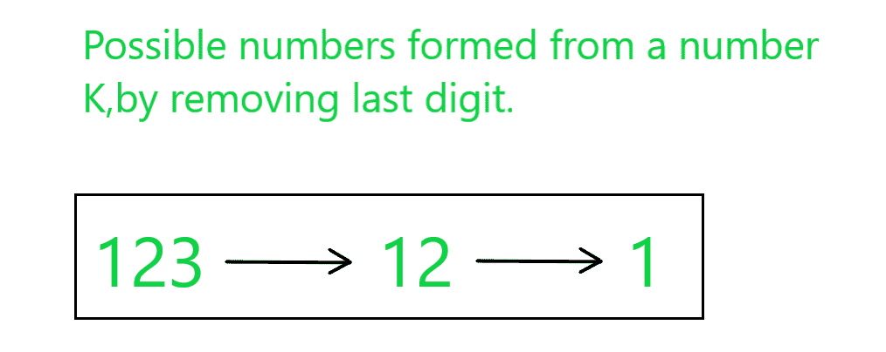

# 求一个数 K，其通过重复去除 K 的最后一个数字得到的数的和为 N

> 原文:[https://www . geeksforgeeks . org/find-a-number-k-having-sum-numbers-of-k-is-n 的最后一位数字通过重复删除获得/](https://www.geeksforgeeks.org/find-a-number-k-having-sum-of-numbers-obtained-by-repeated-removal-of-last-digit-of-k-is-n/)

给定一个整数 **N** ，任务是找到一个整数 **K** ，使得重复去除 **K** 最后一位数字形成的数字之和等于 **N** 。

**示例:**

> **输入:** N = 136
> **输出:** 123
> **说明:**
> 
> 
> 
> 重复删除 123 的最后一位数字形成的数字是{123，12，1}。
> 因此，这些数之和= 123 + 12 + 1 = 136( = N)。
> 
> **输入:** N = 107
> **输出:** 98
> **说明:**
> 重复去除 98 的最后一位数字形成的数字为{98，9}。
> 因此，这些数字之和= 98 + 7 = 107( = N)。

**方法:**该方法基于以下观察:

*   考虑 **K = 123** 。
*   由 123 组成的可能数字是 1、12 和 123。
*   现在，123 可以表示为 100 + 20 + 3。如果所有其他数字都用类似的方式表示，那么思路就是知道每个数字在所有数字组合中的位置和频率，得到总和为 **N** 。

> <figure class="table">T32【1】1T34】1
> 
> | **数字** | **每个数字的频率** | **总和** |
> | **单位** | **十** | **百** |
> | 1【T37 |
> | 3 | 1 |  |  | 3 * 1 = 3 |
> 
> </figure>

*   现在，对于给定的长度数**N****L**。用 **1** s 的 **L** 数除以该数，得到最高位数字。
*   计算余数，这将是我们新形成的 **N** 。
*   再次用 **1** 的**(L–1)**数除新形成的 N，得到第二高的位置数字，并继续直到 **L** 变为 **0** 。

按照以下步骤解决问题:

*   设 **L** 为给定数字 **N** 的位数。
*   将字符串**字符串**初始化为其中的 **1** 的 **L** 号。
*   将变量**和**初始化为零，存储结果数 **K** 。
*   重复直到字符串**字符串**不为空，并遵循以下步骤:
    *   [使用功能](https://www.geeksforgeeks.org/converting-strings-numbers-cc/) [stoi()](https://www.geeksforgeeks.org/stdstol-and-stdstoll-functions-in-c/) 将字符串 **str** 转换为数字，并存储在 **M** 中。
    *   将 **N** 除以 **M** ，并将 **ans** 更新为:

> ans = ans*10 + (N/M)

*   将 **N** 更新为 **N % M** 。
*   从字符串中删除最后一个字符。
*   完成上述步骤后，打印存储在**和**中的值，该值是 **K** 的要求值。

下面是上述方法的实现:

## C++

```
// C++ program for the above approach

#include <bits/stdc++.h>
using namespace std;

// Function to find the value of K
int findK(int N, int l)
{
    // Stores l number of 1s
    string ones = "";

    while (l--) {

        // Storing 1's
        ones = ones + '1';
    }

    // Stores the value of K
    int ans = 0;

    // Iterate until ones is empty
    while (ones != "") {

        // Convert ones to number
        int m = stoi(ones);

        // Update the ans
        ans = (ans * 10) + (N / m);

        // Update N to N%m
        N = N % m;

        // Removing last digit from ones
        ones.pop_back();
    }

    // Return the value of K
    return ans;
}

// Driver Code
int main()
{
    // Given number N
    int N = 136;

    // Number of digits in N
    int L = to_string(N).length();

    // Function Call
    cout << findK(N, L);

    return 0;
}
```

## Java 语言(一种计算机语言，尤用于创建网站)

```
// Java program for
// the above approach
import java.util.*;
class GFG{

// Function to find the
// value of K
static int findK(int N,
                 int l)
{
  // Stores l number of 1s
  String ones = "";

  while (l-- > 0)
  {
    // Storing 1's
    ones += '1';
  }

  // Stores the value of K
  int ans = 0;

  // Iterate until ones is empty
  while (!ones.equals(""))
  {
    // Convert ones to number
    int m = Integer.valueOf(ones);

    // Update the ans
    ans = (ans * 10) + (N / m);

    // Update N to N%m
    N = N % m;

    // Removing last digit from ones
    ones = ones.substring(0,
           ones.length() - 1);
  }

  // Return the value of K
  return ans;
}

// Driver Code
public static void main(String[] args)
{
  // Given number N
  int N = 136;

  // Number of digits in N
  int L = String.valueOf(N).length();

  // Function Call
  System.out.print(findK(N, L));
}
}

// This code is contributed by 29AjayKumar
```

## 蟒蛇 3

```
# Python3 program for
# the above approach

# Function to find
# the value of K
def findK(N, l):

    # Stores l number of 1s
    ones = ""

    while (l):

        #  Storing 1's
        ones = ones + '1'
        l -= 1

    # Stores the value of K
    ans = 0

    # Iterate until ones
    # is empty
    while (ones != ""):

        # Convert ones to number
        m = int(ones)

        # Update the ans
        ans = (ans * 10) + (N // m)

        # Update N to N%m
        N = N % m

        # Removing last digit from ones
        ones = ones.replace(ones[-1], "", 1)

    # Return the value of K
    return ans

# Driver Code
if __name__ == "__main__":

    # Given number N
    N = 136

    # Number of digits in N
    L = len(str(N))

    # Function Call
    print (findK(N, L))

# This code is contributed by Chitranayal
```

## C#

```
// C# program for
// the above approach
using System;
class GFG{

// Function to find the
// value of K
static int findK(int N,
                 int l)
{
  // Stores l number of 1s
  String ones = "";

  while (l-- > 0)
  {
    // Storing 1's
    ones += '1';
  }

  // Stores the value of K
  int ans = 0;

  // Iterate until ones is empty
  while (!ones.Equals(""))
  {
    // Convert ones to number
    int m = Int32.Parse(ones);

    // Update the ans
    ans = (ans * 10) + (N / m);

    // Update N to N%m
    N = N % m;

    // Removing last digit from ones
    ones = ones.Substring(0,
           ones.Length - 1);
  }

  // Return the value of K
  return ans;
}

// Driver Code
public static void Main(String[] args)
{
  // Given number N
  int N = 136;

  // Number of digits in N
  int L = String.Join("", N).Length;

  // Function Call
  Console.Write(findK(N, L));
}
}

// This code is contributed by Princi Singh
```

## java 描述语言

```
<script>

      // JavaScript program for
      // the above approach
      // Function to find the
      // value of K
      function findK(N, l) {
        // Stores l number of 1s
        var ones = "";

        while (l) {
          // Storing 1's
          ones += "1";
          l -= 1;
        }

        // Stores the value of K
        var ans = 0;

        // Iterate until ones is empty
        while (ones !== "") {
          // Convert ones to number
          var m = parseInt(ones);

          // Update the ans
          ans = parseInt(ans * 10 + N / m);

          // Update N to N%m
          N = N % m;

          // Removing last digit from ones
          ones = ones.substring(0, ones.length - 1);
        }

        // Return the value of K
        return ans;
      }

      // Driver Code
      // Given number N
      var N = 136;

      // Number of digits in N
      var L = N.toString().length;

      // Function Call
      document.write(findK(N, L));

</script>
```

**Output:** 

```
123
```

***时间复杂度:**O(log<sub>10</sub>N)*
***辅助空间:** O(1)*