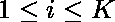

# 求一个数，除以最大数组元素

> 原文:[https://www . geeksforgeeks . org/find-一个除以最大数组元素的数/](https://www.geeksforgeeks.org/find-a-number-that-divides-maximum-array-elements/)

给定一个由 N 个非负整数组成的数组 A[]。找到一个大于 1 的整数，这样最大数组元素可以被它整除。如果答案相同，打印较小的一个。
**例** :

> **输入** : A[] = { 2，4，5，10，8，15，16 }；
> **输出** : 2
> **说明** : 2 除【2，4，10，8，16】无其他元素除大于 5 个数。
> **输入** : A[] = { 2，5，10 }
> **输出** : 2
> **解释** : 2 除【2，10】和 5 除【5，10】，但 2 较小。

**天真方法:**运行一个[循环](https://www.geeksforgeeks.org/loops-in-c/)直到数组的[最大元素。让它成为 **K** 。迭代数组，将数组的每个元素除以所有数字。根据元素**除以元素**得到的最大元素数更新结果。
**有效方法:**我们知道一个数只能被由它们的](https://www.geeksforgeeks.org/c-program-find-largest-element-array/)[素因子](https://www.geeksforgeeks.org/print-all-prime-factors-of-a-given-number/)构成的元素整除。
因此我们找到数组所有元素的素因子，并将它们的频率存储在[散列](https://www.geeksforgeeks.org/hashing-data-structure/)中。最后，我们返回其中最大频率的[元素。
你可以使用](https://www.geeksforgeeks.org/frequent-element-array/)[因子分解-使用-筛选](https://www.geeksforgeeks.org/prime-factorization-using-sieve-olog-n-multiple-queries/)来寻找 Log(n)中的素因子。
以下是上述方法的实施:

## C++

```
// CPP program to find a number that
// divides maximum array elements

#include <bits/stdc++.h>
using namespace std;

#define MAXN 100001

// stores smallest prime factor for every number
int spf[MAXN];

// Calculating SPF (Smallest Prime Factor) for every
// number till MAXN.
// Time Complexity : O(nloglogn)
void sieve()
{
    spf[1] = 1;
    for (int i = 2; i < MAXN; i++)

        // marking smallest prime factor for every
        // number to be itself.
        spf[i] = i;

    // separately marking spf for every even
    // number as 2
    for (int i = 4; i < MAXN; i += 2)
        spf[i] = 2;

    for (int i = 3; i * i < MAXN; i++) {
        // checking if i is prime
        if (spf[i] == i) {
            // marking SPF for all numbers divisible by i
            for (int j = i * i; j < MAXN; j += i)

                // marking spf[j] if it is not
                // previously marked
                if (spf[j] == j)
                    spf[j] = i;
        }
    }
}

// A O(log n) function returning primefactorization
// by dividing by smallest prime factor at every step
vector<int> getFactorization(int x)
{
    vector<int> ret;
    while (x != 1) {
        int temp = spf[x];
        ret.push_back(temp);
        while (x % temp == 0)
            x = x / temp;
    }
    return ret;
}

// Function to find a number that
// divides maximum array elements
int maxElement(int A[], int n)
{
    // precalculating Smallest Prime Factor
    sieve();

    // Hash to store frequency of each divisors
    map<int, int> m;

    // Traverse the array and get spf of each element
    for (int i = 0; i < n; ++i) {

        // calling getFactorization function
        vector<int> p = getFactorization(A[i]);

        for (int i = 0; i < p.size(); i++)
            m[p[i]]++;
    }

    int cnt = 0, ans = 1e+7;

    for (auto i : m) {
        if (i.second >= cnt) {
            cnt = i.second;
            ans > i.first ? ans = i.first : ans = ans;
        }
    }

    return ans;
}

// Driver program
int main()
{
    int A[] = { 2, 5, 10 };
    int n = sizeof(A) / sizeof(A[0]);

    cout << maxElement(A, n);

    return 0;
}
```

## Java 语言(一种计算机语言，尤用于创建网站)

```
// Java program to find a number that
// divides maximum array elements
import java.util.*;
class Solution
{
static final int MAXN=100001;

// stores smallest prime factor for every number
static int spf[]= new int[MAXN];

// Calculating SPF (Smallest Prime Factor) for every
// number till MAXN.
// Time Complexity : O(nloglogn)
static void sieve()
{
    spf[1] = 1;
    for (int i = 2; i < MAXN; i++)

        // marking smallest prime factor for every
        // number to be itself.
        spf[i] = i;

    // separately marking spf for every even
    // number as 2
    for (int i = 4; i < MAXN; i += 2)
        spf[i] = 2;

    for (int i = 3; i * i < MAXN; i++) {
        // checking if i is prime
        if (spf[i] == i) {
            // marking SPF for all numbers divisible by i
            for (int j = i * i; j < MAXN; j += i)

                // marking spf[j] if it is not
                // previously marked
                if (spf[j] == j)
                    spf[j] = i;
        }
    }
}

// A O(log n) function returning primefactorization
// by dividing by smallest prime factor at every step
static Vector<Integer> getFactorization(int x)
{
    Vector<Integer> ret= new Vector<Integer>();
    while (x != 1) {
        int temp = spf[x];
        ret.add(temp);
        while (x % temp == 0)
            x = x / temp;
    }
    return ret;
}

// Function to find a number that
// divides maximum array elements
static int maxElement(int A[], int n)
{
    // precalculating Smallest Prime Factor
    sieve();

    // Hash to store frequency of each divisors
    Map<Integer, Integer> m= new HashMap<Integer, Integer>();

    // Traverse the array and get spf of each element
    for (int j = 0; j < n; ++j) {

        // calling getFactorization function
        Vector<Integer> p = getFactorization(A[j]);

        for (int i = 0; i < p.size(); i++)
            m.put(p.get(i),m.get(p.get(i))==null?0:m.get(p.get(i))+1);
    }

    int cnt = 0, ans = 10000000;
    // Returns Set view     
       Set< Map.Entry< Integer,Integer> > st = m.entrySet();   

       for (Map.Entry< Integer,Integer> me:st)
       {
        if (me.getValue() >= cnt) {
            cnt = me.getValue();
            if(ans > me.getKey())
            ans = me.getKey() ;
            else
            ans = ans;
        }
    }

    return ans;
}

// Driver program
public static void main(String args[])
{
    int A[] = { 2, 5, 10 };
    int n =A.length;

    System.out.print(maxElement(A, n));

}
}
//contributed by Arnab Kundu
```

## 蟒蛇 3

```
# Python3 program to find a number that
# divides maximum array elements
import math as mt

MAXN = 100001

# stores smallest prime factor for
# every number
spf = [0 for i in range(MAXN)]

# Calculating SPF (Smallest Prime Factor)
# for every number till MAXN.
# Time Complexity : O(nloglogn)
def sieve():

    spf[1] = 1
    for i in range(2, MAXN):

        # marking smallest prime factor for
        # every number to be itself.
        spf[i] = i

    # separately marking spf for every
    # even number as 2
    for i in range(4, MAXN, 2):
        spf[i] = 2

    for i in range(3, mt.ceil(mt.sqrt(MAXN + 1))):

        # checking if i is prime
        if (spf[i] == i):

            # marking SPF for all numbers divisible by i
            for j in range(2 * i, MAXN, i):

                # marking spf[j] if it is not
                # previously marked
                if (spf[j] == j):
                    spf[j] = i

# A O(log n) function returning primefactorization
# by dividing by smallest prime factor at every step
def getFactorization (x):

    ret = list()
    while (x != 1):
        temp = spf[x]
        ret.append(temp)
        while (x % temp == 0):
            x = x //temp

    return ret

# Function to find a number that
# divides maximum array elements
def maxElement (A, n):

    # precalculating Smallest Prime Factor
    sieve()

    # Hash to store frequency of each divisors
    m = dict()

    # Traverse the array and get spf of each element
    for i in range(n):

        # calling getFactorization function
        p = getFactorization(A[i])

        for i in range(len(p)):
            if p[i] in m.keys():
                m[p[i]] += 1
            else:
                m[p[i]] = 1

    cnt = 0
    ans = 10**9+7

    for i in m:
        if (m[i] >= cnt):
            cnt = m[i]
            if ans > i:
                ans = i
            else:
                ans = ans

    return ans

# Driver Code
A = [2, 5, 10 ]
n = len(A)

print(maxElement(A, n))

# This code is contributed by Mohit kumar 29
```

## C#

```

// C# program to find a number that
// divides maximum array elements
using System;
using System.Collections.Generic;

class Solution
{

static readonly int MAXN = 100001;

// stores smallest prime factor for every number
static int []spf = new int[MAXN];

// Calculating SPF (Smallest Prime Factor) for every
// number till MAXN.
// Time Complexity : O(nloglogn)
static void sieve()
{
    spf[1] = 1;
    for (int i = 2; i < MAXN; i++)

        // marking smallest prime factor for every
        // number to be itself.
        spf[i] = i;

    // separately marking spf for every even
    // number as 2
    for (int i = 4; i < MAXN; i += 2)
        spf[i] = 2;

    for (int i = 3; i * i < MAXN; i++)
    {
        // checking if i is prime
        if (spf[i] == i)
        {
            // marking SPF for all numbers divisible by i
            for (int j = i * i; j < MAXN; j += i)

                // marking spf[j] if it is not
                // previously marked
                if (spf[j] == j)
                    spf[j] = i;
        }
    }
}

// A O(log n) function returning primefactorization
// by dividing by smallest prime factor at every step
static List<int> getFactorization(int x)
{
    List<int> ret= new List<int>();
    while (x != 1)
    {
        int temp = spf[x];
        ret.Add(temp);
        while (x % temp == 0)
            x = x / temp;
    }
    return ret;
}

// Function to find a number that
// divides maximum array elements
static int maxElement(int []A, int n)
{
    // precalculating Smallest Prime Factor
    sieve();

    // Hash to store frequency of each divisors
    Dictionary<int, int> m= new Dictionary<int, int>();

    // Traverse the array and get spf of each element
    for (int j = 0; j < n; ++j)
    {

        // calling getFactorization function
        List<int> p = getFactorization(A[j]);

        for (int i = 0; i < p.Count; i++)
            if(m.ContainsKey(p[i]))
            m[p[i]] = m[p[i]] + 1;
            else
                m.Add(p[i], 1);
    }

    int cnt = 0, ans = 10000000;

    // Returns Set view    
    foreach(KeyValuePair<int, int> me in m)
    {
        if (me.Value >= cnt)
        {
            cnt = me.Value;
            if(ans > me.Key)
                ans = me.Key ;
            else
                ans = ans;
        }
    }

    return ans;
}

// Driver program
public static void Main(String []args)
{
    int []A = { 2, 5, 10 };
    int n =A.Length;

    Console.Write(maxElement(A, n));
}
}

// This code is contributed by 29AjayKumar
```

## java 描述语言

```
<script>

// JavaScript program to find a number that
// divides maximum array elements

let MAXN=100001;

// stores smallest prime factor for every number
let spf= new Array(MAXN);
for(let i=0;i<MAXN;i++)
{
    spf[i]=0;
}

// Calculating SPF (Smallest Prime Factor) for every
// number till MAXN.
// Time Complexity : O(nloglogn)
function sieve()
{
    spf[1] = 1;
    for (let i = 2; i < MAXN; i++)

        // marking smallest prime factor for every
        // number to be itself.
        spf[i] = i;

    // separately marking spf for every even
    // number as 2
    for (let i = 4; i < MAXN; i += 2)
        spf[i] = 2;

    for (let i = 3; i * i < MAXN; i++) {
        // checking if i is prime
        if (spf[i] == i) {
            // marking SPF for all numbers divisible by i
            for (let j = i * i; j < MAXN; j += i)

                // marking spf[j] if it is not
                // previously marked
                if (spf[j] == j)
                    spf[j] = i;
        }
    }
}

// A O(log n) function returning primefactorization
// by dividing by smallest prime factor at every step
function getFactorization(x)
{
    let ret= [];
    while (x != 1) {
        let temp = spf[x];
        ret.push(temp);
        while (x % temp == 0)
            x = Math.floor(x / temp);
    }
    return ret;
}

// Function to find a number that
// divides maximum array elements
function maxElement(A,n)
{
    // precalculating Smallest Prime Factor
    sieve();

    // Hash to store frequency of each divisors
    let m= new Map();

    // Traverse the array and get spf of each element
    for (let j = 0; j < n; ++j) {

        // calling getFactorization function
        let p = getFactorization(A[j]);

        for (let i = 0; i < p.length; i++)
            m.set(p[i],m.get(p[i])==null?0:m.get(p[i])+1);
    }

    let cnt = 0, ans = 10000000;
    // Returns Set view     

       for (let [key, value] of m.entries())
       {
        if (value >= cnt) {
            cnt = value;
            if(ans > key)
                ans = key ;
            else
                ans = ans;
        }
    }

    return ans;
}

// Driver program
let A=[ 2, 5, 10];
let n =A.length;
document.write(maxElement(A, n));

// This code is contributed by patel2127

</script>
```

**Output:** 

```
2
```

**时间复杂度:** O(N*log(N))