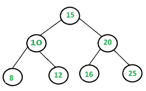

# 在平衡 BST 中找到一对给定和的配对

> 原文:[https://www . geesforgeks . org/find-a-pair-with-given-sum-in-BST/](https://www.geeksforgeeks.org/find-a-pair-with-given-sum-in-bst/)

给定一个平衡二叉查找树和一个目标和，如果有一对和等于目标和，写一个返回真的函数，否则返回假。预期时间复杂度为 O(n)，只能使用 O(Logn)个额外空间。不允许对二叉查找树进行任何修改。请注意，平衡基站的高度始终为 0(对数)。



这个问题主要是[之前的帖子](https://www.geeksforgeeks.org/find-if-there-is-a-triplet-in-bst-that-adds-to-0/)的延伸。这里不允许我们修改 BST。

**强力解决方案**是考虑 BST 中的每一对，并检查总和是否等于 x。该解决方案的时间复杂度将是 O(n^2).

一个**更好的解决方案**是创建一个辅助数组，并将 BST 的有序遍历存储在数组中。数组将被排序，因为对 BST 的有序遍历总是产生已排序的数据。一旦我们有了无序遍历，我们就可以在 O(n)时间内配对(详见[本](https://www.geeksforgeeks.org/write-a-c-program-that-given-a-set-a-of-n-numbers-and-another-number-x-determines-whether-or-not-there-exist-two-elements-in-s-whose-sum-is-exactly-x/))。该解决方案在 O(n)时间内有效，但需要 O(n)辅助空间。

## C++

```
#include<bits/stdc++.h>
using namespace std;

class Node{
    public:
      int data;
      Node* left;
      Node* right;
      Node(int d)
      {
          data=d;
          left=NULL;
          right=NULL;
      }
};

class BinarySearchTree {

    // Root of BST
    public:
    Node *root;

    // Constructor
    BinarySearchTree()
    {
        root = NULL;
    }

    // Utility function for inorder traversal of the tree
    void inorderUtil(Node* node)
    {
        if (node == NULL)
            return;

        inorderUtil(node->left);
        cout << node->data << " ";
        inorderUtil(node->right);
    }

    // Inorder traversal of the tree
    void inorder()
    {
        inorderUtil(this->root);
    }

    /* A recursive function to insert a new key in BST */
    Node* insertRec(Node* root, int data)
    {

        /* If the tree is empty, return a new node */
        if (root == NULL) {
            root = new Node(data);
            return root;
        }

        /* Otherwise, recur down the tree */
        if (data < root->data)
            root->left = insertRec(root->left, data);
        else if (data > root->data)
            root->right = insertRec(root->right, data);

        return root;
    }

    // This method mainly calls insertRec()
    void insert(int key)
    {
        root = insertRec(root, key);
    }

    // Method that adds values of given BST into vector
    // and hence returns the vector
    vector<int> treeToList(Node* node, vector<int>& list)
    {
        // Base Case
        if (node == NULL)
            return list;

        treeToList(node->left, list);
        list.push_back(node->data);
        treeToList(node->right, list);

        return list;
    }

    // method that checks if there is a pair present
    bool isPairPresent(Node* node, int target)
    {
        // This list a1 is passed as an argument
        // in treeToList method
        // which is later on filled by the values of BST
        vector<int> a1;

        // a2 list contains all the values of BST
        // returned by treeToList method
        vector<int> a2 = treeToList(node, a1);

        int start = 0; // Starting index of a2

        int end = (int)a2.size() - 1; // Ending index of a2

        while (start < end) {

            if (a2[start] + a2[end] == target) // Target Found!
            {
                cout << "Pair Found: " << a2[start] << " + " << a2[end] << " = " << target << '\n';
                return true;
            }

            if (a2[start] + a2[end]  > target) // decrements end
            {
                end--;
            }

            if (a2[start] + a2[end]  < target) // increments start
            {
                start++;
            }
        }

        cout << "No such values are found!\n";
        return false;
    }
};

// Driver function
int main()
{
    BinarySearchTree *tree = new BinarySearchTree();
    /*
            15
            /     \
        10     20
        / \     / \
        8 12 16 25 */
    tree->insert(15);
    tree->insert(10);
    tree->insert(20);
    tree->insert(8);
    tree->insert(12);
    tree->insert(16);
    tree->insert(25);

    tree->isPairPresent(tree->root, 33);
}
```

## Java 语言(一种计算机语言，尤用于创建网站)

```
// Java code to find a pair with given sum
// in a Balanced BST
import java.util.ArrayList;

// A binary tree node
class Node {

    int data;
    Node left, right;

    Node(int d)
    {
        data = d;
        left = right = null;
    }
}

class BinarySearchTree {

    // Root of BST
    Node root;

    // Constructor
    BinarySearchTree()
    {
        root = null;
    }

    // Inorder traversal of the tree
    void inorder()
    {
        inorderUtil(this.root);
    }

    // Utility function for inorder traversal of the tree
    void inorderUtil(Node node)
    {
        if (node == null)
            return;

        inorderUtil(node.left);
        System.out.print(node.data + " ");
        inorderUtil(node.right);
    }

    // This method mainly calls insertRec()
    void insert(int key)
    {
        root = insertRec(root, key);
    }

    /* A recursive function to insert a new key in BST */
    Node insertRec(Node root, int data)
    {

        /* If the tree is empty, return a new node */
        if (root == null) {
            root = new Node(data);
            return root;
        }

        /* Otherwise, recur down the tree */
        if (data < root.data)
            root.left = insertRec(root.left, data);
        else if (data > root.data)
            root.right = insertRec(root.right, data);

        return root;
    }

    // Method that adds values of given BST into ArrayList
    // and hence returns the ArrayList
    ArrayList<Integer> treeToList(Node node, ArrayList<Integer>
                                                 list)
    {
        // Base Case
        if (node == null)
            return list;

        treeToList(node.left, list);
        list.add(node.data);
        treeToList(node.right, list);

        return list;
    }

    // method that checks if there is a pair present
    boolean isPairPresent(Node node, int target)
    {
        // This list a1 is passed as an argument
        // in treeToList method
        // which is later on filled by the values of BST
        ArrayList<Integer> a1 = new ArrayList<>();

        // a2 list contains all the values of BST
        // returned by treeToList method
        ArrayList<Integer> a2 = treeToList(node, a1);

        int start = 0; // Starting index of a2

        int end = a2.size() - 1; // Ending index of a2

        while (start < end) {

            if (a2.get(start) + a2.get(end) == target) // Target Found!
            {
                System.out.println("Pair Found: " + a2.get(start) + " + " + a2.get(end) + " "
                                   + "= " + target);
                return true;
            }

            if (a2.get(start) + a2.get(end) > target) // decrements end
            {
                end--;
            }

            if (a2.get(start) + a2.get(end) < target) // increments start
            {
                start++;
            }
        }

        System.out.println("No such values are found!");
        return false;
    }

    // Driver function
    public static void main(String[] args)
    {
        BinarySearchTree tree = new BinarySearchTree();
        /*
                   15
                /     \
              10      20
             / \     /  \
            8  12   16  25    */
        tree.insert(15);
        tree.insert(10);
        tree.insert(20);
        tree.insert(8);
        tree.insert(12);
        tree.insert(16);
        tree.insert(25);

        tree.isPairPresent(tree.root, 33);
    }
}

// This code is contributed by Kamal Rawal
```

## 蟒蛇 3

```
# Python3 code to find a pair with given sum
# in a Balanced BST
class Node:

    # Construct to create a new Node
    def __init__(self, key):

        self.data = key
        self.left = self.right = None

# A utility function to insert a new
# Node with given key in BST
def insert(root: Node, key: int):

    # If the tree is empty, return a new Node
    if root is None:
        return Node(key)

    # Otherwise, recur down the tree
    if root.data > key:
        root.left = insert(root.left, key)

    elif root.data < key:
        root.right = insert(root.right, key)

    # return the (unchanged) Node pointer
    return root

# Function that adds values of given BST into
# ArrayList and hence returns the ArrayList
def tree_to_list(root: Node, arr: list):

    if not root:
        return arr

    tree_to_list(root.left, arr)
    arr.append(root.data)
    tree_to_list(root.right, arr)

    return arr

# Function that checks if there is a pair present
def isPairPresent(root: Node, target: int) -> bool:

    # This list a1 is passed as an argument
    # in treeToList method which is later
    # on filled by the values of BST
    arr1 = []

    # a2 list contains all the values of BST
    # returned by treeToList method
    arr2 = tree_to_list(root, arr1)

    # Starting index of a2
    start = 0

    # Ending index of a2
    end = len(arr2) - 1

    while start < end:

        # If target found
        if arr2[start] + arr2[end] == target:
            print(f"Pair Found: {arr2[start]} + {arr2[end]} = {target}")
            return True

        # Decrements end
        if arr2[start] + arr2[end] > target:
            end -= 1

        # Increments start
        if arr2[start] + arr2[end] < target:
            start += 1

    print("No such values are found!")
    return False

# Driver code
if __name__ == "__main__":

    root = None
    root = insert(root, 15)
    root = insert(root, 10)
    root = insert(root, 20)
    root = insert(root, 8)
    root = insert(root, 12)
    root = insert(root, 16)
    root = insert(root, 25)

    isPairPresent(root, 33)

# This code is contributed by shindesharad71
```

## C#

```
// C# code to find a pair with given sum
// in a Balanced BST
using System;
using System.Collections.Generic;

// A binary tree node
public class Node {

    public int data;
    public Node left, right;

    public Node(int d)
    {
        data = d;
        left = right = null;
    }
}

public class BinarySearchTree {

    // Root of BST
    Node root;

    // Constructor
    BinarySearchTree()
    {
        root = null;
    }

    // Inorder traversal of the tree
    void inorder()
    {
        inorderUtil(this.root);
    }

    // Utility function for inorder traversal of the tree
    void inorderUtil(Node node)
    {
        if (node == null)
            return;

        inorderUtil(node.left);
        Console.Write(node.data + " ");
        inorderUtil(node.right);
    }

    // This method mainly calls insertRec()
    void insert(int key)
    {
        root = insertRec(root, key);
    }

    /* A recursive function to insert a new key in BST */
    Node insertRec(Node root, int data)
    {

        /* If the tree is empty, return a new node */
        if (root == null) {
            root = new Node(data);
            return root;
        }

        /* Otherwise, recur down the tree */
        if (data < root.data)
            root.left = insertRec(root.left, data);
        else if (data > root.data)
            root.right = insertRec(root.right, data);

        return root;
    }

    // Method that adds values of given BST into ArrayList
    // and hence returns the ArrayList
    List<int> treeToList(Node node, List<int> list)
    {
        // Base Case
        if (node == null)
            return list;

        treeToList(node.left, list);
        list.Add(node.data);
        treeToList(node.right, list);

        return list;
    }

    // method that checks if there is a pair present
    bool isPairPresent(Node node, int target)
    {
        // This list a1 is passed as an argument
        // in treeToList method
        // which is later on filled by the values of BST
        List<int> a1 = new List<int>();

        // a2 list contains all the values of BST
        // returned by treeToList method
        List<int> a2 = treeToList(node, a1);

        int start = 0; // Starting index of a2

        int end = a2.Count - 1; // Ending index of a2

        while (start < end) {

            if (a2[start] + a2[end] == target) // Target Found!
            {
                Console.WriteLine("Pair Found: " + a2[start] + " + " + a2[end] + " "
                                  + "= " + target);
                return true;
            }

            if (a2[start] + a2[end] > target) // decrements end
            {
                end--;
            }

            if (a2[start] + a2[end] < target) // increments start
            {
                start++;
            }
        }

        Console.WriteLine("No such values are found!");
        return false;
    }

    // Driver code
    public static void Main(String[] args)
    {
        BinarySearchTree tree = new BinarySearchTree();
        /*
                15
                /     \
            10     20
            / \     / \
            8 12 16 25 */
        tree.insert(15);
        tree.insert(10);
        tree.insert(20);
        tree.insert(8);
        tree.insert(12);
        tree.insert(16);
        tree.insert(25);

        tree.isPairPresent(tree.root, 33);
    }
}

// This code contributed by Rajput-Ji
```

## java 描述语言

```
<script>

      // JavaScript code to find a pair with given sum
      // in a Balanced BST
      // A binary tree node
      class Node {
        constructor(d) {
          this.data = d;
          this.left = null;
          this.right = null;
        }
      }

      class BinarySearchTree {
        // Constructor
        constructor() {
          this.root = null;
        }

        // Inorder traversal of the tree
        inorder() {
          this.inorderUtil(this.root);
        }

        // Utility function for inorder traversal of the tree
        inorderUtil(node) {
          if (node == null) return;

          this.inorderUtil(node.left);
          document.write(node.data + " ");
          this.inorderUtil(node.right);
        }

        // This method mainly calls insertRec()
        insert(key) {
          this.root = this.insertRec(this.root, key);
        }

        /* A recursive function to insert a new key in BST */
        insertRec(root, data) {
          /* If the tree is empty, return a new node */
          if (root == null) {
            root = new Node(data);
            return root;
          }

          /* Otherwise, recur down the tree */
          if (data < root.data)
          root.left = this.insertRec(root.left, data);
          else if (data > root.data)
            root.right = this.insertRec(root.right, data);

          return root;
        }

        // Method that adds values of given BST into ArrayList
        // and hence returns the ArrayList
        treeToList(node, list) {
          // Base Case
          if (node == null) return list;

          this.treeToList(node.left, list);
          list.push(node.data);
          this.treeToList(node.right, list);

          return list;
        }

        // method that checks if there is a pair present
        isPairPresent(node, target) {
          // This list a1 is passed as an argument
          // in treeToList method
          // which is later on filled by the values of BST
          var a1 = [];

          // a2 list contains all the values of BST
          // returned by treeToList method
          var a2 = this.treeToList(node, a1);

          var start = 0; // Starting index of a2

          var end = a2.length - 1; // Ending index of a2

          while (start < end) {
            if (a2[start] + a2[end] == target) {
              // Target Found!
              document.write(
                "Pair Found: " +
                  a2[start] +
                  " + " +
                  a2[end] +
                  " " +
                  "= " +
                  target +
                  "<br>"
              );
              return true;
            }

            if (a2[start] + a2[end] > target) {
              // decrements end
              end--;
            }

            if (a2[start] + a2[end] < target) {
              // increments start
              start++;
            }
          }

          document.write("No such values are found!");
          return false;
        }
      }
      // Driver code
      var tree = new BinarySearchTree();
      /*
                15
                /     \
            10     20
            / \     / \
            8 12 16 25 */
      tree.insert(15);
      tree.insert(10);
      tree.insert(20);
      tree.insert(8);
      tree.insert(12);
      tree.insert(16);
      tree.insert(25);

      tree.isPairPresent(tree.root, 33);

</script>
```

**输出:**

```
Pair Found: 8 + 25 = 33
```

*   **复杂度分析:**
    *   **时间复杂度:** O(n)。
        有序遍历 BST 需要线性时间。
    *   **辅助空间:** O(n)。
        使用数组存储有序遍历。

一个**空间优化解决方案**在[之前的帖子](https://www.geeksforgeeks.org/find-if-there-is-a-triplet-in-bst-that-adds-to-0/)中讨论过。想法是首先就地将 BST 转换为双链表，然后在 O(n)时间内在排序的链表中找到配对。这个解决方案需要 O(n)个时间和 O(Logn)个额外空间，但是它修改了给定的 BST。

下面讨论的**解占用 O(n)时间，O(Logn)空间，不修改 BST** 。这个思路和在排序数组中寻找配对是一样的(详见[本](https://www.geeksforgeeks.org/write-a-c-program-that-given-a-set-a-of-n-numbers-and-another-number-x-determines-whether-or-not-there-exist-two-elements-in-s-whose-sum-is-exactly-x/)方法一)。我们同时以正常顺序和反向顺序遍历 BST。按照相反的顺序，我们从最右边的节点开始，也就是最大值节点。正常情况下，我们从最左边的节点开始，也就是最小值节点。我们在两个遍历中添加当前节点的和，并将这个和与给定的目标和进行比较。如果总和与目标总和相同，我们返回 true。如果和大于目标和，我们在反向有序遍历中移动到下一个节点，否则我们在正常有序遍历中移动到下一个节点。如果任何遍历都没有找到一对，我们返回 false。

下面是这种方法的实现。

## C++

```
/* In a balanced binary search tree
isPairPresent two element which sums to
a given value time O(n) space O(logn) */
#include <bits/stdc++.h>
using namespace std;
#define MAX_SIZE 100

// A BST node
class node {
public:
    int val;
    node *left, *right;
};

// Stack type
class Stack {
public:
    int size;
    int top;
    node** array;
};

// A utility function to create a stack of given size
Stack* createStack(int size)
{
    Stack* stack = new Stack();
    stack->size = size;
    stack->top = -1;
    stack->array = new node*[(stack->size * sizeof(node*))];
    return stack;
}

// BASIC OPERATIONS OF STACK
int isFull(Stack* stack)
{
    return stack->top - 1 == stack->size;
}

int isEmpty(Stack* stack)
{
    return stack->top == -1;
}

void push(Stack* stack, node* node)
{
    if (isFull(stack))
        return;
    stack->array[++stack->top] = node;
}

node* pop(Stack* stack)
{
    if (isEmpty(stack))
        return NULL;
    return stack->array[stack->top--];
}

// Returns true if a pair with target
// sum exists in BST, otherwise false
bool isPairPresent(node* root, int target)
{
    // Create two stacks. s1 is used for
    // normal inorder traversal and s2 is
    // used for reverse inorder traversal
    Stack* s1 = createStack(MAX_SIZE);
    Stack* s2 = createStack(MAX_SIZE);

    // Note the sizes of stacks is MAX_SIZE,
    // we can find the tree size and fix stack size
    // as O(Logn) for balanced trees like AVL and Red Black
    // tree. We have used MAX_SIZE to keep the code simple

    // done1, val1 and curr1 are used for
    // normal inorder traversal using s1
    // done2, val2 and curr2 are used for
    // reverse inorder traversal using s2
    bool done1 = false, done2 = false;
    int val1 = 0, val2 = 0;
    node *curr1 = root, *curr2 = root;

    // The loop will break when we either find a pair or one of the two
    // traversals is complete
    while (1) {
        // Find next node in normal Inorder
        // traversal. See following post
        // https:// www.geeksforgeeks.org/inorder-tree-traversal-without-recursion/
        while (done1 == false) {
            if (curr1 != NULL) {
                push(s1, curr1);
                curr1 = curr1->left;
            }
            else {
                if (isEmpty(s1))
                    done1 = 1;
                else {
                    curr1 = pop(s1);
                    val1 = curr1->val;
                    curr1 = curr1->right;
                    done1 = 1;
                }
            }
        }

        // Find next node in REVERSE Inorder traversal. The only
        // difference between above and below loop is, in below loop
        // right subtree is traversed before left subtree
        while (done2 == false) {
            if (curr2 != NULL) {
                push(s2, curr2);
                curr2 = curr2->right;
            }
            else {
                if (isEmpty(s2))
                    done2 = 1;
                else {
                    curr2 = pop(s2);
                    val2 = curr2->val;
                    curr2 = curr2->left;
                    done2 = 1;
                }
            }
        }

        // If we find a pair, then print the pair and return. The first
        // condition makes sure that two same values are not added
        if ((val1 != val2) && (val1 + val2) == target) {
            cout << "Pair Found: " << val1 << "+ " << val2 << " = " << target << endl;
            return true;
        }

        // If sum of current values is smaller,
        // then move to next node in
        // normal inorder traversal
        else if ((val1 + val2) < target)
            done1 = false;

        // If sum of current values is greater,
        // then move to next node in
        // reverse inorder traversal
        else if ((val1 + val2) > target)
            done2 = false;

        // If any of the inorder traversals is
        // over, then there is no pair
        // so return false
        if (val1 >= val2)
            return false;
    }
}

// A utility function to create BST node
node* NewNode(int val)
{
    node* tmp = new node();
    tmp->val = val;
    tmp->right = tmp->left = NULL;
    return tmp;
}

// Driver program to test above functions
int main()
{
    /*
                15
                / \
            10 20
            / \ / \
            8 12 16 25 */
    node* root = NewNode(15);
    root->left = NewNode(10);
    root->right = NewNode(20);
    root->left->left = NewNode(8);
    root->left->right = NewNode(12);
    root->right->left = NewNode(16);
    root->right->right = NewNode(25);

    int target = 33;
    if (isPairPresent(root, target) == false)
        cout << "\nNo such values are found\n";
    return 0;
}

// This code is contributed by rathbhupendra
```

## C

```
/* In a balanced binary search tree isPairPresent two element which sums to
   a given value time O(n) space O(logn) */
#include <stdio.h>
#include <stdlib.h>
#define MAX_SIZE 100

// A BST node
struct node {
    int val;
    struct node *left, *right;
};

// Stack type
struct Stack {
    int size;
    int top;
    struct node** array;
};

// A utility function to create a stack of given size
struct Stack* createStack(int size)
{
    struct Stack* stack = (struct Stack*)malloc(sizeof(struct Stack));
    stack->size = size;
    stack->top = -1;
    stack->array = (struct node**)malloc(stack->size * sizeof(struct node*));
    return stack;
}

// BASIC OPERATIONS OF STACK
int isFull(struct Stack* stack)
{
    return stack->top - 1 == stack->size;
}

int isEmpty(struct Stack* stack)
{
    return stack->top == -1;
}

void push(struct Stack* stack, struct node* node)
{
    if (isFull(stack))
        return;
    stack->array[++stack->top] = node;
}

struct node* pop(struct Stack* stack)
{
    if (isEmpty(stack))
        return NULL;
    return stack->array[stack->top--];
}

// Returns true if a pair with target sum exists in BST, otherwise false
bool isPairPresent(struct node* root, int target)
{
    // Create two stacks. s1 is used for normal inorder traversal
    // and s2 is used for reverse inorder traversal
    struct Stack* s1 = createStack(MAX_SIZE);
    struct Stack* s2 = createStack(MAX_SIZE);

    // Note the sizes of stacks is MAX_SIZE, we can find the tree size and
    // fix stack size as O(Logn) for balanced trees like AVL and Red Black
    // tree. We have used MAX_SIZE to keep the code simple

    // done1, val1 and curr1 are used for normal inorder traversal using s1
    // done2, val2 and curr2 are used for reverse inorder traversal using s2
    bool done1 = false, done2 = false;
    int val1 = 0, val2 = 0;
    struct node *curr1 = root, *curr2 = root;

    // The loop will break when we either find a pair or one of the two
    // traversals is complete
    while (1) {
        // Find next node in normal Inorder traversal. See following post
        // https:// www.geeksforgeeks.org/inorder-tree-traversal-without-recursion/
        while (done1 == false) {
            if (curr1 != NULL) {
                push(s1, curr1);
                curr1 = curr1->left;
            }
            else {
                if (isEmpty(s1))
                    done1 = 1;
                else {
                    curr1 = pop(s1);
                    val1 = curr1->val;
                    curr1 = curr1->right;
                    done1 = 1;
                }
            }
        }

        // Find next node in REVERSE Inorder traversal. The only
        // difference between above and below loop is, in below loop
        // right subtree is traversed before left subtree
        while (done2 == false) {
            if (curr2 != NULL) {
                push(s2, curr2);
                curr2 = curr2->right;
            }
            else {
                if (isEmpty(s2))
                    done2 = 1;
                else {
                    curr2 = pop(s2);
                    val2 = curr2->val;
                    curr2 = curr2->left;
                    done2 = 1;
                }
            }
        }

        // If we find a pair, then print the pair and return. The first
        // condition makes sure that two same values are not added
        if ((val1 != val2) && (val1 + val2) == target) {
            printf("\n Pair Found: %d + %d = %d\n", val1, val2, target);
            return true;
        }

        // If sum of current values is smaller, then move to next node in
        // normal inorder traversal
        else if ((val1 + val2) < target)
            done1 = false;

        // If sum of current values is greater, then move to next node in
        // reverse inorder traversal
        else if ((val1 + val2) > target)
            done2 = false;

        // If any of the inorder traversals is over, then there is no pair
        // so return false
        if (val1 >= val2)
            return false;
    }
}

// A utility function to create BST node
struct node* NewNode(int val)
{
    struct node* tmp = (struct node*)malloc(sizeof(struct node));
    tmp->val = val;
    tmp->right = tmp->left = NULL;
    return tmp;
}

// Driver program to test above functions
int main()
{
    /*
                   15
                /     \
              10      20
             / \     /  \
            8  12   16  25    */
    struct node* root = NewNode(15);
    root->left = NewNode(10);
    root->right = NewNode(20);
    root->left->left = NewNode(8);
    root->left->right = NewNode(12);
    root->right->left = NewNode(16);
    root->right->right = NewNode(25);

    int target = 33;
    if (isPairPresent(root, target) == false)
        printf("\n No such values are found\n");

    getchar();
    return 0;
}
```

## Java 语言(一种计算机语言，尤用于创建网站)

```
/* In a balanced binary search tree
isPairPresent two element which sums to
a given value time O(n) space O(logn) */
import java.util.*;
class GFG
{
static final int MAX_SIZE= 100;

// A BST node
static class node
{
    int val;
    node left, right;
};

// Stack type
static class Stack
{
    int size;
    int top;
    node []array;
};

// A utility function to create a stack of given size
static Stack createStack(int size)
{
    Stack stack = new Stack();
    stack.size = size;
    stack.top = -1;
    stack.array = new node[stack.size];
    return stack;
}

// BASIC OPERATIONS OF STACK
static int isFull(Stack stack)
{
    return (stack.top - 1 == stack.size)?1:0 ;
}

static int isEmpty(Stack stack)
{
    return stack.top == -1?1:0;
}

static void push(Stack stack, node node)
{
    if (isFull(stack)==1)
        return;
    stack.array[++stack.top] = node;
}

static node pop(Stack stack)
{
    if (isEmpty(stack) == 1)
        return null;
    return stack.array[stack.top--];
}

// Returns true if a pair with target
// sum exists in BST, otherwise false
static boolean isPairPresent(node root, int target)
{
    // Create two stacks. s1 is used for
    // normal inorder traversal and s2 is
    // used for reverse inorder traversal
    Stack s1 = createStack(MAX_SIZE);
    Stack s2 = createStack(MAX_SIZE);

    // Note the sizes of stacks is MAX_SIZE,
    // we can find the tree size and fix stack size
    // as O(Logn) for balanced trees like AVL and Red Black
    // tree. We have used MAX_SIZE to keep the code simple

    // done1, val1 and curr1 are used for
    // normal inorder traversal using s1
    // done2, val2 and curr2 are used for
    // reverse inorder traversal using s2
    boolean done1 = false, done2 = false;
    int val1 = 0, val2 = 0;
    node curr1 = root, curr2 = root;

    // The loop will break when we either
  // find a pair or one of the two
    // traversals is complete
    while (true)
    {

        // Find next node in normal Inorder
        // traversal. See following post
        // https:// www.geeksforgeeks.org/inorder-tree-traversal-without-recursion/
        while (done1 == false)
        {
            if (curr1 != null)
            {
                push(s1, curr1);
                curr1 = curr1.left;
            }
            else
            {
                if (isEmpty(s1) == 1)
                    done1 = true;
                else
                {
                    curr1 = pop(s1);
                    val1 = curr1.val;
                    curr1 = curr1.right;
                    done1 = true;
                }
            }
        }

        // Find next node in REVERSE Inorder traversal. The only
        // difference between above and below loop is, in below loop
        // right subtree is traversed before left subtree
        while (done2 == false)
        {
            if (curr2 != null)
            {
                push(s2, curr2);
                curr2 = curr2.right;
            }
            else {
                if (isEmpty(s2) == 1)
                    done2 = true;
                else {
                    curr2 = pop(s2);
                    val2 = curr2.val;
                    curr2 = curr2.left;
                    done2 = true;
                }
            }
        }

        // If we find a pair, then print the pair and return. The first
        // condition makes sure that two same values are not added
        if ((val1 != val2) && (val1 + val2) == target)
        {
            System.out.print("Pair Found: " +
                             val1+ "+ " +
                             val2+ " = " + 
                             target +"\n");
            return true;
        }

        // If sum of current values is smaller,
        // then move to next node in
        // normal inorder traversal
        else if ((val1 + val2) < target)
            done1 = false;

        // If sum of current values is greater,
        // then move to next node in
        // reverse inorder traversal
        else if ((val1 + val2) > target)
            done2 = false;

        // If any of the inorder traversals is
        // over, then there is no pair
        // so return false
        if (val1 >= val2)
            return false;
    }
}

// A utility function to create BST node
static node NewNode(int val)
{
    node tmp = new node();
    tmp.val = val;
    tmp.right = tmp.left = null;
    return tmp;
}

// Driver program to test above functions
public static void main(String[] args)
{
    /*
                15
                / \
            10 20
            / \ / \
            8 12 16 25 */
    node root = NewNode(15);
    root.left = NewNode(10);
    root.right = NewNode(20);
    root.left.left = NewNode(8);
    root.left.right = NewNode(12);
    root.right.left = NewNode(16);
    root.right.right = NewNode(25);

    int target = 33;
    if (isPairPresent(root, target) == false)
        System.out.print("\nNo such values are found\n");
}
}

// This code is contributed by aashish1995
```

## C#

```
/* In a balanced binary search tree
isPairPresent two element which sums to
a given value time O(n) space O(logn) */
using System;
using System.Collections.Generic;

public class GFG
{
static readonly int MAX_SIZE= 100;

// A BST node
public
 class node
{
    public
 int val;
    public
 node left, right;
};

// Stack type
public
 class Stack
{
    public
 int size;
    public
 int top;
    public
 node []array;
};

// A utility function to create a stack of given size
static Stack createStack(int size)
{
    Stack stack = new Stack();
    stack.size = size;
    stack.top = -1;
    stack.array = new node[stack.size];
    return stack;
}

// BASIC OPERATIONS OF STACK
static int isFull(Stack stack)
{
    return (stack.top - 1 == stack.size) ? 1 : 0 ;
}

static int isEmpty(Stack stack)
{
    return stack.top == -1?1:0;
}

static void push(Stack stack, node node)
{
    if (isFull(stack)==1)
        return;
    stack.array[++stack.top] = node;
}

static node pop(Stack stack)
{
    if (isEmpty(stack) == 1)
        return null;
    return stack.array[stack.top--];
}

// Returns true if a pair with target
// sum exists in BST, otherwise false
static bool isPairPresent(node root, int target)
{
    // Create two stacks. s1 is used for
    // normal inorder traversal and s2 is
    // used for reverse inorder traversal
    Stack s1 = createStack(MAX_SIZE);
    Stack s2 = createStack(MAX_SIZE);

    // Note the sizes of stacks is MAX_SIZE,
    // we can find the tree size and fix stack size
    // as O(Logn) for balanced trees like AVL and Red Black
    // tree. We have used MAX_SIZE to keep the code simple

    // done1, val1 and curr1 are used for
    // normal inorder traversal using s1
    // done2, val2 and curr2 are used for
    // reverse inorder traversal using s2
    bool done1 = false, done2 = false;
    int val1 = 0, val2 = 0;
    node curr1 = root, curr2 = root;

    // The loop will break when we either
  // find a pair or one of the two
    // traversals is complete
    while (true)
    {

        // Find next node in normal Inorder
        // traversal. See following post
        // https:// www.geeksforgeeks.org/inorder-tree-traversal-without-recursion/
        while (done1 == false)
        {
            if (curr1 != null)
            {
                push(s1, curr1);
                curr1 = curr1.left;
            }
            else
            {
                if (isEmpty(s1) == 1)
                    done1 = true;
                else
                {
                    curr1 = pop(s1);
                    val1 = curr1.val;
                    curr1 = curr1.right;
                    done1 = true;
                }
            }
        }

        // Find next node in REVERSE Inorder traversal. The only
        // difference between above and below loop is, in below loop
        // right subtree is traversed before left subtree
        while (done2 == false)
        {
            if (curr2 != null)
            {
                push(s2, curr2);
                curr2 = curr2.right;
            }
            else {
                if (isEmpty(s2) == 1)
                    done2 = true;
                else {
                    curr2 = pop(s2);
                    val2 = curr2.val;
                    curr2 = curr2.left;
                    done2 = true;
                }
            }
        }

        // If we find a pair, then print the pair and return. The first
        // condition makes sure that two same values are not added
        if ((val1 != val2) && (val1 + val2) == target)
        {
            Console.Write("Pair Found: " +
                             val1+ "+ " +
                             val2+ " = " + 
                             target +"\n");
            return true;
        }

        // If sum of current values is smaller,
        // then move to next node in
        // normal inorder traversal
        else if ((val1 + val2) < target)
            done1 = false;

        // If sum of current values is greater,
        // then move to next node in
        // reverse inorder traversal
        else if ((val1 + val2) > target)
            done2 = false;

        // If any of the inorder traversals is
        // over, then there is no pair
        // so return false
        if (val1 >= val2)
            return false;
    }
}

// A utility function to create BST node
static node NewNode(int val)
{
    node tmp = new node();
    tmp.val = val;
    tmp.right = tmp.left = null;
    return tmp;
}

// Driver program to test above functions
public static void Main(String[] args)
{
    /*
                15
                / \
            10 20
            / \ / \
            8 12 16 25 */
    node root = NewNode(15);
    root.left = NewNode(10);
    root.right = NewNode(20);
    root.left.left = NewNode(8);
    root.left.right = NewNode(12);
    root.right.left = NewNode(16);
    root.right.right = NewNode(25);

    int target = 33;
    if (isPairPresent(root, target) == false)
        Console.Write("\nNo such values are found\n");
}
}

// This code is contributed by aashish1995
```

## java 描述语言

```
<script>
/* In a balanced binary search tree
isPairPresent two element which sums to
a given value time O(n) space O(logn) */

let MAX_SIZE= 100;

// A BST node
class Node
{
    constructor(val)
    {
        this.val = val;
        this.left = this.right = null;
    }
}

// Stack type
class Stack
{
    constructor()
    {
        this.size = 0;
        this.top = 0;
        this.array;
    }
}

// A utility function to create a stack of given size
function createStack(size)
{
    let stack = new Stack();
    stack.size = size;
    stack.top = -1;
    stack.array = new Array(stack.size);
    return stack;
}

// BASIC OPERATIONS OF STACK
function isFull(stack)
{
    return (stack.top - 1 == stack.size)?1:0 ;
}

function isEmpty(stack)
{
    return stack.top == -1?1:0;
}

function push(stack,node)
{
    if (isFull(stack)==1)
        return;
    stack.array[++stack.top] = node;
}

function pop(stack)
{
    if (isEmpty(stack) == 1)
        return null;
    return stack.array[stack.top--];
}

// Returns true if a pair with target
// sum exists in BST, otherwise false
function isPairPresent(root,target)
{
    // Create two stacks. s1 is used for
    // normal inorder traversal and s2 is
    // used for reverse inorder traversal
    let s1 = createStack(MAX_SIZE);
    let s2 = createStack(MAX_SIZE);

    // Note the sizes of stacks is MAX_SIZE,
    // we can find the tree size and fix stack size
    // as O(Logn) for balanced trees like AVL and Red Black
    // tree. We have used MAX_SIZE to keep the code simple

    // done1, val1 and curr1 are used for
    // normal inorder traversal using s1
    // done2, val2 and curr2 are used for
    // reverse inorder traversal using s2
    let done1 = false, done2 = false;
    let val1 = 0, val2 = 0;
    let curr1 = root, curr2 = root;

    // The loop will break when we either
  // find a pair or one of the two
    // traversals is complete
    while (true)
    {

        // Find next node in normal Inorder
        // traversal. See following post
        // https:// www.geeksforgeeks.org/inorder-tree-traversal-without-recursion/
        while (done1 == false)
        {
            if (curr1 != null)
            {
                push(s1, curr1);
                curr1 = curr1.left;
            }
            else
            {
                if (isEmpty(s1) == 1)
                    done1 = true;
                else
                {
                    curr1 = pop(s1);
                    val1 = curr1.val;
                    curr1 = curr1.right;
                    done1 = true;
                }
            }
        }

        // Find next node in REVERSE Inorder traversal. The only
        // difference between above and below loop is, in below loop
        // right subtree is traversed before left subtree
        while (done2 == false)
        {
            if (curr2 != null)
            {
                push(s2, curr2);
                curr2 = curr2.right;
            }
            else {
                if (isEmpty(s2) == 1)
                    done2 = true;
                else {
                    curr2 = pop(s2);
                    val2 = curr2.val;
                    curr2 = curr2.left;
                    done2 = true;
                }
            }
        }

        // If we find a pair, then print the pair and return. The first
        // condition makes sure that two same values are not added
        if ((val1 != val2) && (val1 + val2) == target)
        {
            document.write("Pair Found: " +
                             val1+ "+ " +
                             val2+ " = " +
                             target +"<br>");
            return true;
        }

        // If sum of current values is smaller,
        // then move to next node in
        // normal inorder traversal
        else if ((val1 + val2) < target)
            done1 = false;

        // If sum of current values is greater,
        // then move to next node in
        // reverse inorder traversal
        else if ((val1 + val2) > target)
            done2 = false;

        // If any of the inorder traversals is
        // over, then there is no pair
        // so return false
        if (val1 >= val2)
            return false;
    }
}

// Driver program to test above functions
/*
                15
                / \
            10 20
            / \ / \
            8 12 16 25 */
let root = new Node(15);
root.left = new Node(10);
root.right = new Node(20);
root.left.left = new Node(8);
root.left.right = new Node(12);
root.right.left = new Node(16);
root.right.right = new Node(25);

let target = 33;
if (isPairPresent(root, target) == false)
    document.write("<br>No such values are found<br>");

// This code is contributed by avanitrachhadiya2155
</script>
```

**输出:**

```
 Pair Found: 8 + 25 = 33
```

*   **复杂度分析:**
    *   **时间复杂度:** O(n)。
        有序遍历 BST 需要线性时间。
    *   **辅助空间:** O(logn)。
        堆栈一次保存 **log N** 值

https://www.youtube.com/embed/TvAFvAoS6s8?list = plqm7 alhxfyshcxd 7 r1j 0k y9 ZG _ gbb1 dbk

本文由[库马尔](https://www.geeksforgeeks.org/forums/users/gautam5669/)编辑，GeeksforGeeks 团队审核。如果你发现任何不正确的地方，或者你想分享更多关于上面讨论的话题的信息，请写评论。