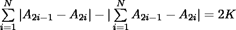

# 找到 2N 个数字的排列，使得给定表达式的结果正好是 2K

> 原文:[https://www . geeksforgeeks . org/find-a-置换 2n 个数字-这样-给定表达式的结果-正好是-2k/](https://www.geeksforgeeks.org/find-a-permutation-of-2n-numbers-such-that-the-result-of-given-expression-is-exactly-2k/)

给定两个整数 **N** 和 **K** ，任务是找到第一个 **2*N** 自然数的排列，从而满足以下等式。

**注:**K 的值将始终小于或等于 **N** 。
**举例:**

```
Input : N = 1,  K = 0
Output : 1 2
The result of the above expression will be:
|1-2|-|1-2| =0

Input : N = 2,  K = 1 
Output : 2 1 3 4
The result of the above expression will be:
(|2-1|+|3-4|)-(|2-1+3-4|) = 2
```

**方法:**
考虑排序排列:

```
1, 2, 3, 4, 5, 6.... 
```

表达式的结果将正好是 0。如果我们交换任意两个指数 **2i-1** 和 **2i** ，结果将正好增加 2。所以我们需要进行这样的互换 **K** 。
以下是上述方法的实现:

## C++

```
// C++ program to find the required permutation
// of first 2*N natural numbers

#include <bits/stdc++.h>
using namespace std;

// Function to find the required permutation
// of first 2*N natural numbers
void printPermutation(int n, int k)
{
    // Iterate in blocks of 2
    for (int i = 1; i <= n; i++) {
        int x = 2 * i - 1;
        int y = 2 * i;

        // We need more increments, so print in reverse order
        if (i <= k)
            cout << y << " " << x << " ";

        // We have enough increments, so print in same order
        else
            cout << x << " " << y << " ";
    }
}

// Driver Code
int main()
{
    int n = 2, k = 1;

    printPermutation(n, k);

    return 0;
}
```

## Java 语言(一种计算机语言，尤用于创建网站)

```
// Java program to find the
// required permutation
// of first 2*N natural numbers
class GFG
{

    // Function to find the required permutation
    // of first 2*N natural numbers
    static void printPermutation(int n, int k)
    {
        // Iterate in blocks of 2
        for (int i = 1; i <= n; i++)
        {
            int x = 2 * i - 1;
            int y = 2 * i;

        // We need more increments,
        // so print in reverse order
        if (i <= k)
            System.out.print(y + " " + x + " ");

        // We have enough increments,
        // so print in same order
        else
            System.out.print(x + " " + y + " ");
        }
    }

    // Driver code
    public static void main(String []args)
    {
        int n = 2, k = 1;
        printPermutation(n, k);
    }
}

// This code is contributed by Ita_c.
```

## 蟒蛇 3

```
# Python3 program to find the required
# permutation of first 2*N natural numbers

# Function to find the required permutation
# of first 2*N natural numbers
def printPermutation(n, k) :

    # Iterate in blocks of 2
    for i in range(1, n + 1) :
        x = 2 * i - 1;
        y = 2 * i;

        # We need more increments,
        # so print in reverse order
        if (i <= k) :
            print(y, x, end = " ");

        # We have enough increments,
        # so print in same order
        else :
            print(x, y, end = " ");

# Driver Code
if __name__ == "__main__" :
    n = 2; k = 1;

    printPermutation(n, k);

# This code is contributed by Ryuga
```

## C#

```
using System;

// C# program to find the
// required permutation
// of first 2*N natural numbers

class GFG
{

    // Function to find the required permutation
    // of first 2*N natural numbers
    static void printPermutation(int n, int k)
    {
        // Iterate in blocks of 2
        for (int i = 1; i <= n; i++)
        {
            int x = 2 * i - 1;
            int y = 2 * i;

        // We need more increments,
        // so print in reverse order
        if (i <= k)
            Console.Write(y + " " + x + " ");

        // We have enough increments,
        // so print in same order
        else
            Console.Write(x + " " + y + " ");
        }
    }

    // Driver code
    public static void Main()
    {
        int n = 2, k = 1;
        printPermutation(n, k);
    }
}

// This code is contributed by
// shashank_sharma
```

## 服务器端编程语言（Professional Hypertext Preprocessor 的缩写）

```
<?php
// PHP program to find the required
// permutation of first 2*N natural numbers

// Function to find the required permutation
// of first 2*N natural numbers
function printPermutation($n, $k)
{
    // Iterate in blocks of 2
    for ($i = 1; $i <= $n; $i++)
    {
        $x = 2 * $i - 1;
        $y = 2 * $i;

        // We need more increments, so print
        // in reverse order
        if ($i <= $k)
            echo $y . " " . $x . " ";

        // We have enough increments,
        // so print in same order
        else
            echo $x . " " . $y . " ";
    }
}

// Driver Code
$n = 2;
$k = 1;

printPermutation($n, $k);

// This code is contributed by chandan_jnu
?>
```

## java 描述语言

```
<script>

// javascript program to find the
// required permutation
// of first 2*N natural numbers

    // Function to find the required permutation
    // of first 2*N natural numbers
    function printPermutation( n,  k)
    {
        // Iterate in blocks of 2
        for (var i = 1; i <= n; i++)
        {
            var x = 2 * i - 1;
            var y = 2 * i;

        // We need more increments,
        // so print in reverse order
        if (i <= k)
            document.write(y + " " + x + " ");

        // We have enough increments,
        // so print in same order
        else
            document.write(x + " " + y + " ");
        }
    }

    // Driver code

        var n = 2, k = 1;
        printPermutation(n, k);

        // This code is contributed by bunnyram19.

</script>
```

**Output:** 

```
2 1 3 4
```

**时间复杂度:**O(N)
T3】辅助空间 : O(1)