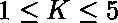

# 找到一个点，使曼哈顿距离之和最小

> 原文:[https://www . geeksforgeeks . org/find-a-point-so-sum-of-Manhattan-distance-is-minimum/](https://www.geeksforgeeks.org/find-a-point-such-that-sum-of-the-manhattan-distances-is-minimized/)

给定 **K** 维度空间中和所在的 **N** 点。任务是确定该点，使得从该点到 **N** 点的曼哈顿距离之和最小。 [](https://www.geeksforgeeks.org/sum-manhattan-distances-pairs-points/) 
[曼哈顿距离](https://www.geeksforgeeks.org/sum-manhattan-distances-pairs-points/)是沿轴线以直角测量的两点之间的距离。在 **p1** 在 **(x1，y1)** 而 **p2** 在 **(x2，y2)** 的平面上，是**| x1–x2 |+| y1–y2 |**。

**示例:**

> **输入:** N = 3，K = 3，点数= {1，1，1}、{2，2，2}、{3，3，3 }
> T3】输出:2 2 2
> T6】输入: N = 4，K = 4，点数= {1，6，9，6}、{5，2，5，7}、{2，0，1，5}、{4，6，3，9}
> **输出:**

**方法:**为了最小化曼哈顿距离，我们所要做的就是对所有 **K** 维度中的点进行排序，并输出每个 **K** 维度的中间元素。

下面是上述方法的实现:

## C++

```
// C++ implementation of above approach
#include <bits/stdc++.h>
using namespace std;

// Function to print the required points which
// minimizes the sum of Manhattan distances
void minDistance(int n, int k, vector<vector<int> >& point)
{

    // Sorting points in all k dimension
    for (int i = 0; i < k; ++i)
        sort(point[i].begin(), point[i].end());

    // Output the required k points
    for (int i = 0; i < k; ++i)
        cout << point[i][(ceil((double)n / 2) - 1)] << " ";
}

// Driver code
int main()
{

    int n = 4, k = 4;
    vector<vector<int> > point = { { 1, 5, 2, 4 },
                                   { 6, 2, 0, 6 },
                                   { 9, 5, 1, 3 },
                                   { 6, 7, 5, 9 } };

    // function call to print required points
    minDistance(n, k, point);

    return 0;
}
```

## Java 语言(一种计算机语言，尤用于创建网站)

```
// Java implementation of above approach
import java.util.Arrays;

class GFG
{

// Function to print the required
// points which minimizes the sum
// of Manhattan distances
static void minDistance(int n, int k,
                        int point[][])
{

    // Sorting points in all k dimension
    for (int i = 0; i < k; i++)
        Arrays.sort(point[i]);

    // Output the required k points
    for (int i = 0; i < k; i++)
        System.out.print(point[i][(int)
               Math.ceil((double)(n / 2) - 1)] + " ");
}

// Driver code
public static void main(String[] args)
{
    int n = 4;
    int k = 4;
    int point[][] = { { 1, 5, 2, 4 },
                      { 6, 2, 0, 6 },
                       { 9, 5, 1, 3 },
                      { 6, 7, 5, 9 } };

    // function call to print required points
    minDistance(n, k, point);
}
}

// This code is contributed by Bilal
```

## 计算机编程语言

```
# Python implementation of above approach

# Function to print the required points which
# minimizes the sum of Manhattan distances
def minDistance(n, k, point):

    # Sorting points in all dimension
    for i in range(k):
        point[i].sort()

    # Output the required k points
    for i in range(k):
        print(point[i][((n + 1) // 2) - 1], end =" ")

# Driver code
n = 4
k = 4
point = [[1, 5, 2, 4],
         [6, 2, 0, 6],
         [9, 5, 1, 3],
         [6, 7, 5, 9]]

# function call to print required points
minDistance(n, k, point)
```

## C#

```
// C# implementation of above approach
using System;

class GFG
{

// Function to print the required
// points which minimizes the sum
// of Manhattan distances
static void minDistance(int n, int k,
                        int[][] point)
{

    // Sorting points in all k dimension
    for (int i = 0; i < k; i++)
        Array.Sort(point[i]);

    // Output the required k points
    for (int i = 0; i < k; i++)
        System.Console.Write(point[i][(int)
            Math.Ceiling((double)(n / 2) - 1)] + " ");
}

// Driver code
public static void Main()
{
    int n = 4;
    int k = 4;
    int[][] point = new int[][]{ new int[]{ 1, 5, 2, 4 },
                    new int[]{ 6, 2, 0, 6 },
                    new int[]{ 9, 5, 1, 3 },
                    new int[]{ 6, 7, 5, 9 } };

    // function call to print required points
    minDistance(n, k, point);
}
}

// This code is contributed by mits
```

## 服务器端编程语言（Professional Hypertext Preprocessor 的缩写）

```
<?php
// PHP implementation of above approach

// Function to print the required
// points which minimizes the sum
// of Manhattan distances
function minDistance($n, $k, &$point)
{

    // Sorting points in all
    // k dimension
    for ($i = 0; $i < $k; ++$i)
        sort($point[$i]);

    // Output the required k points
    for ($i = 0; $i < $k; ++$i)
        echo $point[$i][(ceil(
            (double)$n / 2) - 1)] . " ";
}

// Driver code
$n = 4;
$k = 4;
$point = array(array( 1, 5, 2, 4 ),
               array( 6, 2, 0, 6 ),
               array( 9, 5, 1, 3 ),
               array( 6, 7, 5, 9 ));

// function call to print
// required points
minDistance($n, $k, $point);

// This code is contributed
// by ChitraNayal
?>
```

## java 描述语言

```
<script>
// Javascript implementation of above approach

// Function to print the required
// points which minimizes the sum
// of Manhattan distances
    function minDistance(n,k,points)
    {
        // Sorting points in all k dimension
        for (let i = 0; i < k; i++)
            (point[i]).sort(function(a,b){return a-b;});

        // Output the required k points
        for (let i = 0; i < k; i++)
            document.write(point[i][
               Math.ceil((n / 2) - 1)] + " ");
    }

    // Driver code
    let n = 4;
    let k = 4;
    let point = [[1, 5, 2, 4],
         [6, 2, 0, 6],
         [9, 5, 1, 3],
         [6, 7, 5, 9]];

    // function call to print required points
    minDistance(n, k, point);

// This code is contributed by rag2127
</script>
```

**Output:** 

```
2 2 3 6
```

**时间复杂度:** O(k*nlog(n)